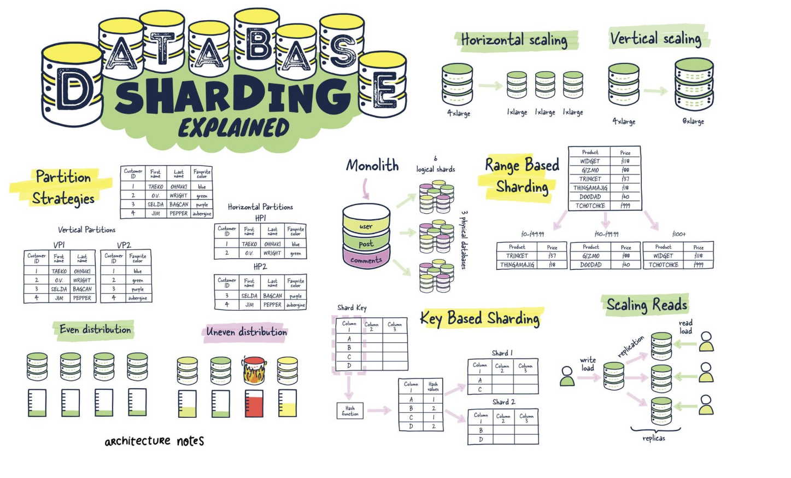

# 뉴비 게임 서버 프로그래머를 위한 학습 자료
         
- [A STUDY PATH FOR GAME PROGRAMMER](https://github.com/miloyip/game-programmer )
    - 각 분야별로 책을 중심으로 공부 방향을 알려줌
- [Awesome Roadmaps Overview](https://www.trackawesomelist.com/liuchong/awesome-roadmaps/readme/ )  
- 더미 클라이언트
    - 서버의 성능과 안정성을 확인하기 위해서는 더미 클라이언트를 사용하여 많은 클라이언트와 서버가 통신하여 동작하는 테스트를 꼭 해야한다.
    - `auto_test` 디렉토리에는 C#으로 만든 더미 클라이언트의 코드가 있다. 이것을 참고해서 자신만의 더미 클라이언트를 만들기 바란다.  
- [Taliscale을 사용하여 로컬PC의 게임 서버 애플리케이션을 외부에 공개하기](./Tailscale.md)   
- [Git 사용하기(인포그래픽)](./infographics/git.md) 
  
---  
  
     
  
## 프로그래밍을 위한 AI 활용 
- GitHub Copilot
    - [비주얼 스튜디오의 GitHub 코파일럿: 2023년 요약](https://docs.google.com/document/d/1KiqQhZe04TbevuRv9PxMSvs0YZLbGkiK47TtQqOkzoU/edit?usp=sharing )
    - [Visual Studio에서 GitHub Copilot Chat을 사용하는 방법](https://docs.google.com/document/d/e/2PACX-1vQ78gely4yQJGj6OSjc1jc7njERaSqs1ayqydOfF1PTvRtI7AjcVMXuqafqhqE_6Xky-OVpS8XjTKhB/pub )
    - [GitHub Copilot의 기능을 최대한 활용하기 위한 팁을 GitHub에서 소개](https://docs.google.com/document/d/e/2PACX-1vTLcwn7lXsdT34E8NcbtRcLBAlttc6j29I7qgbrp0-DU1mYt4fcncPTx6JcJ2nJqtUOrREWj6ubic7_/pub )
    - [IDE에서 GitHub Copilot 사용하기: 팁, 요령 및 모범 사례](https://docs.google.com/document/d/e/2PACX-1vSH6buzOb0BxcpDk0lqfnUgTT-GnlGV3K3BOWKu_u4rrLxWx1Rg6iTYug9T0uqO3xuKCr0Zpd0WDhvH/pub )
    - [깃허브 코파일러 명령어 표](https://docs.google.com/document/d/e/2PACX-1vTmSSv2NBS-inJxrJkfNuAsRVCTnXAZkv8-ZEevtY-53JhJeaHuM2Xw8_ezOjH6inK7jmi5zTwZFcMz/pub )
    - [Visual Studio에서 C++로 코파일럿 채팅을 사용하기 위한 빠른 팁](https://docs.google.com/document/d/e/2PACX-1vQVDXu5tjfh3w4QlB9DSVSKHdTqeLpQZKZKAxuOJ2UQy_6zRK130CPj7ys1NqF1nd-jS1lE1szaMBP0/pub )
- ChatGPT
    - [ChatGPT에서 기억해두면 유용한 Markdown 표기법 5가지](https://docs.google.com/document/d/e/2PACX-1vR3H0dks98hJdcYPxAW2kBV3C1jFpeDBt7rq5t7JThnszD-ONmJDrDX60KDKsrearOuTFpOVhMeG3R6/pub )
    - [인지적 프롬프팅](https://docs.google.com/presentation/d/1kayepoiTVT838Tetk02nxeqVmmS9BDc9O7n-4OzJdL8/mobilepresent?slide=id.p )  
  
---  
    
     
   
## CS 지식  
[인포그래픽](./infographics/cs.md)    
  
- [MMU에 대해서](MMU.md)  
  
### Linux
- [리눅스 얼마나 알아야할까? 이정도는 알고 있자!](https://docs.google.com/document/d/e/2PACX-1vT5lxY2rzJ12dKfNUa4ocx1cU-JMboaP26t4CE7BftRDjMCjMn4f-If1ZeKfeaJ4hz9cP0s3qFFlkRc/pub)
- [(인프런 무료 영상) '이것이 리눅스다' 저자의 Red Hat CentOS7 리눅스 서버&네트워크 강좌 - 커리큘럼 총 57 개 ˙ 22시간 28분의 수업](https://inf.run/yf7K )   
- [(인프런 무료 영상) 생활코딩 - Linux](https://inf.run/9Yxy ) 
- [토크ON세미나 리눅스와 친해지기](https://www.youtube.com/watch?v=pgXYkzl35HM&list=PL9mhQYIlKEhc6Odsnn1igZ9Qd-fWasQI7 )
- [Linux 기본 명령어 모음](./linux_basic_cmd.md )
- [Bash 입문자를 위한 핵심 요약 정리 (Shell Script)](https://blog.gaerae.com/2015/01/bash-hello-world.html )
- [Linux에서로드 밸런서와 캐시 서버를 멀티 코어 스케일 시키기 위한 커널 튜닝](https://docs.google.com/document/d/e/2PACX-1vRogx51-sYEMl5P6b5ZFWQWMycYqOF86rAUJ0Pgb1g28xFK2r4upfLqBglXhsATGLdMbvKmSIGnzuzF/pub )
- [RPS, RFS 설정에 의한 Linux 네트워크 성능 향상](https://docs.google.com/document/d/e/2PACX-1vRACO_vLdA3FY7cxtcRNv5-QyXExYRinGSIWjorsVt3gFh_qTbQ_d4KRfQgC0teZER5efcjDBCucTBl/pub )
  
- [리눅스 사용 글 모음](https://gist.github.com/jacking75/7f45ed006cecaffd44b95049a5f8611c )
   
  
### WSL
- [WSL2 글모음](https://gist.github.com/jacking75/a4f3cb450bdf8ddfae15eaab58343cf5 )  
  
  
### docker
비 Linux에서 docker를 다룰 때는 `Docker for Desktop` 프로그램을 사용한다. **개인적인 용도로 사용할 때만 무료**   
어디에서나 무료로 `Docker for Desktop` 같은 프로그램을 사용하고 싶다면 `Rancher Desktop` 을 추천한다.  
  
- [글 모음](https://gist.github.com/jacking75/9409d7c5b9fab9a7ef66b2050f40423f )
- [Windows에서 Docker 환경을 바꿨다 (Docker Desktop → Rancher Desktop)](https://docs.google.com/document/d/e/2PACX-1vSd9sgy5IWAk5J74YZ0ndqa7djhp3xh6IVSmu-gJOtRBMEIKbRNOIieQhSQHx-6sMguh6ZvydirQipn/pub )
- [Docker 알아보아요! (2019)](https://mysetting.io/slides/docker-basic ) 
- [생활 코딩 - docker](https://opentutorials.org/course/4781/30609 ) 
- [이재홍의 언제나 최신 Docker](http://www.pyrasis.com/jHLsAlwaysUpToDateDocker )
- [Best practices for writing Dockerfiles 요약](https://docs.google.com/document/d/1gSJW9agm--xyeO3MuDzTT3XsFxdo3k250H_GrnRUQ9k/edit?usp=sharing )      
- 실습 자료
    - [2024-01 컴투스 김성연님 실습 자료](/docker/docker-202301_ksy)  
   
   
---  
  
     
     
## 네트워크, 게임 서버 프로그래밍 
[인포그래픽](./infographics/network_server.md)    
    
- [게임 서버 개발자가 알아야할 네트워크 이론](https://www.youtube.com/watch?v=G60c4YuSBhU)  

### C++
- [(YOUTUBE) 게임 서버 개발자가 알아야할 TCP/IP Windows 소켓 프로그래밍](https://www.youtube.com/watch?v=MYZZrLN1dJo&list=PLW_xyUw4fSdZ9E4SaOOydJOiuFGchy5HI )
- [(YOUTUBE) 뇌를 자극하는 TCP/IP 소켓 프로그래밍](https://www.youtube.com/playlist?list=PLVsNizTWUw7GZy4UA9pntGRC9IIXIYiHm )
- [(YOUTUBE) C++ Korea 제6회 세미나 - 채팅 서버 개발로 알아보는 C++의 기능들](https://youtu.be/JxejgUKTViQ )
- [BeeJ's Guide to Network Programming - 인터넷 소켓 활용](https://blogofscience.com/Socket_Programming-KLDP.html )
- [Linux 소켓 프로그래밍의 5가지 함정](https://docs.google.com/document/d/e/2PACX-1vRJNFor6dsmIjrEuyU-Y5J1YFrdL-7b6n3MLChvk_kieqh4WZKdNWot6iicaRfIA0QYLcXuGwMnvXJn/pub )
- [무서운 SIGPIPE 소켓 프로그래밍의 함정](https://docs.google.com/document/d/e/2PACX-1vSR5CZL4bOzIHaSgiqmz1laD8XvHsL7TH3XRt-DZgZ048OzehawXuxwAjYPX_WQi2iQse-u4SenifEG/pub )
- [C++ 서버 프로그래밍 실습](https://github.com/jacking75/edu_cpp_server_programming )
- [(YOUTUBE)채팅 서버 만들기](https://www.youtube.com/watch?v=eiwvQ8NV2h8)
- [단계 별로 IOCP 실습](https://github.com/jacking75/edu_cpp_IOCP )
- [오래된 IOCP API를 사용한 네트워크 라이브러리](https://github.com/jacking75/edu_cpp_server_programming/tree/main/opensource/edu_CQNetLib-master ) 를 최신 C++ 코드로 리팩토링 한다
- C++로 HTTP Client 통신하기: `how_to_use_cpp_http_client` 디렉토리 
- [C++ Boost.Asio로 만드는 온라인 게임 서버](https://github.com/jacking75/programming-books-with-ai/tree/main/Cpp_BoostAsio%EB%A1%9C_%EB%A7%8C%EB%93%9C%EB%8A%94_%EC%98%A8%EB%9D%BC%EC%9D%B8_%EA%B2%8C%EC%9E%84_%EC%84%9C%EB%B2%84 )
- [게임 서버 개발자를 위한 최신 Win32 API 프로그래밍](https://github.com/jacking75/programming-books-with-ai/tree/main/%EA%B2%8C%EC%9E%84_%EC%84%9C%EB%B2%84_%EA%B0%9C%EB%B0%9C%EC%9E%90%EB%A5%BC_%EC%9C%84%ED%95%9C_%EC%B5%9C%EC%8B%A0_Win32_API%20%ED%94%84%EB%A1%9C%EA%B7%B8%EB%9E%98%EB%B0%8D )
  
  
### C#
- [게임 서버 개발를 위한 C# Socket 프로그래밍](https://github.com/jacking75/programming-books-with-ai/tree/main/%EA%B2%8C%EC%9E%84_%EC%84%9C%EB%B2%84_%EA%B0%9C%EB%B0%9C%EC%9D%84_%EC%9C%84%ED%95%9C_CSharp_Socket_%ED%94%84%EB%A1%9C%EA%B7%B8%EB%9E%98%EB%B0%8D )
- [C# 네트워크 프로그래밍 학습](https://github.com/jacking75/edu_CSharpNetworkProgramming )    
- SuperSocket
	- [(YOUTUBE) Echo Server 만들기](https://www.youtube.com/watch?v=ZgzMuHE43hU )
	- [(YOUTUBE) Chat Server 만들기](https://www.youtube.com/watch?v=eiwvQ8NV2h8 )
	- [(YOUTUBE) SuperSocketLite를 이용한 C# 게임 서버 프로그래밍](https://www.youtube.com/watch?v=1e9b-lpmR2Q&list=PLW_xyUw4fSdYYnD-Nnho_-ZERpKxCJchM )
- [NATS MQ를 이용한 서버간 통신](https://github.com/jacking75/edu_NATS_MQ )      
- [FastSocketLite 라이브러리 분석](https://github.com/jacking75/programming-books-with-ai/blob/main/CSharp_%ED%95%99%EC%8A%B5%EC%9D%84_%EC%9C%84%ED%95%9C_CSharp%EB%84%A4%ED%8A%B8%EC%9B%8C%ED%81%AC%EB%9D%BC%EC%9D%B4%EB%B8%8C%EB%9F%AC%EB%A6%AC_%EB%B6%84%EC%84%9D/FastSocketLite.md )
- [LiteNetwork 라이브러리 분석](https://github.com/jacking75/programming-books-with-ai/blob/main/CSharp_%ED%95%99%EC%8A%B5%EC%9D%84_%EC%9C%84%ED%95%9C_CSharp%EB%84%A4%ED%8A%B8%EC%9B%8C%ED%81%AC%EB%9D%BC%EC%9D%B4%EB%B8%8C%EB%9F%AC%EB%A6%AC_%EB%B6%84%EC%84%9D/LiteNetwork.md )
- [laster40Net 라이브러리 분석](https://github.com/jacking75/programming-books-with-ai/blob/main/CSharp_%ED%95%99%EC%8A%B5%EC%9D%84_%EC%9C%84%ED%95%9C_CSharp%EB%84%A4%ED%8A%B8%EC%9B%8C%ED%81%AC%EB%9D%BC%EC%9D%B4%EB%B8%8C%EB%9F%AC%EB%A6%AC_%EB%B6%84%EC%84%9D/laster40Net.md )  
  
- API Server - ASP.NET Core
    - [ASP.Net Core Web API Server 학습](https://github.com/jacking75/edu_Learn_ASPNetCore_APIServer )
	- [(ebook)ASP.NET Core Web API로 만드는 게임 서버](https://github.com/jacking75/programming-books-with-ai/tree/main/ASP_NET_WebAPI%EB%A1%9C_%EB%A7%8C%EB%93%9C%EB%8A%94_%EA%B2%8C%EC%9E%84%EC%84%9C%EB%B2%84 )
	- [DAO, DTO, VO 란? 간단한 개념 정리](https://melonicedlatte.com/2021/07/24/231500.html )
	- [외부에서 비 공개된 내부의 웹서버에 접근하기 ](./How_to_Expose_a_Private_Web_Server_to_External_Access.md)
     
---  
 
   
        
## 프로그래밍 언어  
  
### C++ 
- [OpenSiv3D를 이용한 C++ 프로그래밍 학습](https://github.com/jacking75/programming-books-with-ai/tree/main/Cpp_OpenSiv3D%EB%A5%BC_%EC%9D%B4%EC%9A%A9%ED%95%9C_Cpp_%ED%94%84%EB%A1%9C%EA%B7%B8%EB%9E%98%EB%B0%8D_%ED%95%99%EC%8A%B5 )
- [모던 C++로 시작하는 안전하고 쉬운 C++ 프로그래밍](https://github.com/jacking75/programming-books-with-ai/tree/main/Cpp_%EB%AA%A8%EB%8D%98_Cpp%EB%A1%9C_%EC%8B%9C%EC%9E%91%ED%95%98%EB%8A%94_%EC%95%88%EC%A0%84%ED%95%98%EA%B3%A0_%EC%89%AC%EC%9A%B4_Cpp_%ED%94%84%EB%A1%9C%EA%B7%B8%EB%9E%98%EB%B0%8D )  
- [Modern C++로 안전하고 우아한 프로그래밍](https://github.com/jacking75/programming-books-with-ai/tree/main/Cpp_Modern_Cpp%EB%A1%9C_%EC%95%88%EC%A0%84%ED%95%98%EA%B3%A0_%EC%9A%B0%EC%95%84%ED%95%9C_%ED%94%84%EB%A1%9C%EA%B7%B8%EB%9E%98%EB%B0%8D )    
    
#### 학습
- [가상함수와 클래스 상속 계층도](https://docs.google.com/presentation/d/1m3u7CwXAYwVQ6yCGT4OQ-32VCXgSHcICO-cdPb-c84o/edit?usp=sharing)
- [RAII 해설](https://docs.google.com/presentation/d/1-Pft2eHxylKBNmVTIoExshbLXoTXW7DfuGA1170hwnM/edit?usp=sharing )
- [대단한 const를 재미있게 사용하자](https://docs.google.com/presentation/d/16Z_C-KVn1oPddQwS3UrZgT0ocLX064gAop_nE1UmUHo/edit?usp=sharing )
- [자세히 알아보는 C++의 include](https://docs.google.com/presentation/d/10wi2B41U8XW2HmGCgBvsWsQZYVO-I4fiDkK3tmYsZZM/edit?usp=sharing )
- [전방 선언](https://docs.google.com/presentation/d/1nnjO-JmwtTFDTSI-8hamYbey7mS5OGjHl8aBZ8SzWfI/edit?usp=sharing )
- [지금 C++ 프로그래머에게 인기 있는 리소스 관리술](https://docs.google.com/presentation/d/1SaRlLA1s7jg5KEszeXk9coVNbFCgjCQrXz6MPRre_0g/edit?usp=sharing )
- [C++ 클로져 디자인패턴(C++ lambda)](https://docs.google.com/presentation/d/1gjSxgyt2Jc5sR46sphW7plxfMyKh1XNg7SzMin17pBs/edit?usp=sharing )
- [C++ 구조체 alignment](https://docs.google.com/presentation/d/1lp6zNvUqlgmwyXiiweD_lipNf14_nb7xylXUUySesaw/edit?usp=sharing )
- Thread  
    - [규격서에서 보는 C++11 Thread](https://docs.google.com/presentation/d/1ZYW8cSAuP7mRNtWRrwJuyfuDaBRuU_YhwDyyXn_FQF0/edit?usp=sharing ) 
    - [C++11 threads, affinity and hyperthreading](https://docs.google.com/presentation/d/1UdPCUX91nFjRp-05o6Eb2uFZcuJJyX6A7wqfCgLHNKI/edit?usp=sharing ) 
    - [C++ 멀티 쓰레드 프로그래밍](https://docs.google.com/presentation/d/1FFpxz-eYH76am0MPusTU9vwDhLfi5DE7K65XiyfQkVE/edit?usp=sharing ) 
    - [C++ 멀티스레드 프로그래밍 입문](https://docs.google.com/presentation/d/1TZvqVNRwi3KJYoCC_1tBzf01VUBZXeaEtFjs3Z6iaMI/edit?usp=sharing ) 
- Concurrency Runtime
    - [VC++ 10 Concurrency Runtime (한글)](https://vsts2010.tistory.com/category/VC++%2010%20Concurrency%20Runtime?page=2 ) 
    - [MS Docs: 동시성 런타임](https://docs.microsoft.com/ko-kr/cpp/parallel/concrt/concurrency-runtime?redirectedfrom=MSDN&view=vs-2019 ) 
    - [Parallel Programming with Microsoft Visual C++](https://docs.microsoft.com/en-us/previous-versions/msp-n-p/gg675934(v=pandp.10)?redirectedfrom=MSDN )   
  

#### 라이브러리 
- [Generic Callback Manager](https://docs.google.com/document/d/e/2PACX-1vSnIx0eNLRbTk0f8DGow3x4vzL1rvIWT6EBIf1B4jxtc7tZkpb_5lnywKqWdk2LOLfP02JdzMOZgEK8/pub )     
  
    
### C# 
- [인포그래픽](./infographics/lang-cs.md )  
  
- [메모장으로 코딩하는 C#](https://rkttu.github.io/csharp-book/part1-basics/ ) 
- [(인프런 무료 영상) C# 초보 강좌 예제로 배우는 C# - 11 강 ∙ 8시간 17분](https://inf.run/PVsq ) 
- [(인프런 무료 영상) C# 처음부터 배우기 - 커리큘럼 총 11 개 ˙ 3시간 53분의 수업](https://inf.run/bfkW ) 
- [(인프런 무료 영상) C# 프로그래밍 - 커리큘럼 총 63 개 ˙ 29시간 56분의 수업](https://inf.run/PueZ )  
- [(인프런 무료 영상) 아임코딩의 C# 기초 강의](https://inf.run/8vbY9  )
- [(유튜브) C# 교과서 마스터하기](https://www.youtube.com/watch?v=R4Br77_cHHU&list=PLO56HZSjrPTB4NxAsEP8HRk6YKBDLbp7m )  
- [C# 멀티스레드 프로그래밍 정리](https://github.com/jacking75/csharp_multithread_programming )
- [비동기 프로그래밍 정리](https://docs.google.com/document/d/e/2PACX-1vRHRbQjeoJH9lXalTClFBuB-D41v9TaBTPc_TeUS-yKhPZTJa2dWjpv_Rib863b_disjspqymOjgKwq/pub )
  
  
---    
    
   
    
## DB 
[인포그래픽](./infographics/db.md)    
  
- [(유튜브) 데이터베이스 입문](https://www.youtube.com/playlist?list=PLcXyemr8ZeoREWGhhZi5FZs6cvymjIBVe )    
- [(인프런 무료 영상) SQL 시작도 못한 분들 드루와요](https://inf.run/NhkRi  )
- [(YOUTUBE) 즐겁게 배우는 SQL](https://www.youtube.com/watch?v=AO5Q7zggJAk&list=PLdntWJk2tJPLinuRXcokohNLgc83ejwUt )
- 추천 도서 
    - SQL 첫걸음 
    - 모두의 SQL 누구나 쉽게 배우는 데이터 분석 기초
  
  원 출처: https://twitter.com/bibryam/status/1606316891307483136/photo/1      
- [DB 글 모음](https://gist.github.com/jacking75/a456ff34a8846b9438bc08956d67aaab  )
    

### MySQL
- 설치
    - [windows 설치](https://stormpy.tistory.com/m/45 )
    - [MySQL Community Server 8.0.15 설치](https://parkdream.tistory.com/93  )
    - [Windows 10 환경 MySQL 64bit 수동 설치 (v8.0.19)](https://sysong85.tistory.com/102 )    
- docker  
    - [docker로 mysql을 사용하기](https://docs.google.com/document/d/1Qrvs07r2Cspce1QvKFAHcirzDjW0q5L-BMDk5jdJovg/edit?usp=sharing )
    - [로컬 환경에서 docker mysql에 연결](https://docs.google.com/document/d/e/2PACX-1vTSidi8ywtgkHC0CBbSQ69zpzyOol5sh9rXGk7Ho4Hjm_meP2YzfU3g2Z-gWa1VZZMAeEeGWBlZgV9k/pub )
    - [한방으로 db 환경 구축하기](https://docs.google.com/document/d/e/2PACX-1vQ8hKrDGdI62JzjoXxUpbHOwBhNkg7mBnDYP5QNj26yIE17V-lWza0-UV6GpPATZ1Cv_YTQ4ysynAX5/pub )  
- [MySQL의 다양한 타임아웃 옵션](https://docs.google.com/document/d/1vc0lBdO1yWZu8Yj2tvOiR3VzsQxin4PbmSW7Rbm5HQY/edit?usp=sharing )
- [수신기한이 지난 데이터를 MySQL에서 삭제할 때의 이야기](https://docs.google.com/document/d/e/2PACX-1vRLotins2K_uOZjf5WoYmspWvcvq18ykWHb8ec9gEOpP2JbYk0uqb5zYUu05k7z1TD7iGNLMmp6-Xh6/pub )
- [MySQL에서 문자열의 유니크 제약 조건을 걸 때 조심할 것](https://docs.google.com/document/d/e/2PACX-1vQXcAf7fzqav158jt8gEkhmSoND3IHDH4SSs0p59W2A0nbUMY78NBgWf9M9HBCMRyzttn_kL4bad3xN/pub )
    
  
### Redis 
- [글 모음](https://gist.github.com/jacking75/5d9927851b22a539774301017e0cefd7)
- C++, C#, Golang Redis 라이브러리 사용 방법 정리: `how_to_use_redis_lib` 디렉토리
- [레디스 게이트](http://www.redisgate.com/redis/command/latency.php ) 기능 설명
- [(영상) Redis 야무지게 사용하기](https://forward.nhn.com/2021/sessions/16 ) 
- [Redis 글 모음](https://gist.github.com/jacking75/5d9927851b22a539774301017e0cefd7 ) 
- [(유튜브) C++를 이용한 Redis 프로그래밍](https://www.youtube.com/watch?v=pGo1TnPH43Y&t=16s )  
- [(유튜브) Redis C# 프로그래밍](https://www.youtube.com/watch?v=09ufiNEWynk )
- [Redis를 활용한 다양한 시스템 설계](https://devs0n.tistory.com/92 )
- [Redis의 기본 데이터 유형 및 명령](https://docs.google.com/document/d/10mHFq-kTpGBk1-id5Z-zoseiLnTKr_T8N3byBZP5mEg/edit?usp=sharing )
- [Redis로 방문자수 구현하기](https://docs.google.com/document/d/e/2PACX-1vQFFSlvGJuDIjeEJM7UZdKRAC0Ps-CiBGFJQfZs_dLwko5cuIYMcbYWUZYeyb-K7M3pdMs9WAv7WD8B/pub )
- [Redis를 사용하여 동일 유저의 요청은 순차적으로 처리되도록 하기](https://docs.google.com/document/d/e/2PACX-1vRxEVk0OTmRYzDuDlq7BfrtkFh_9Gd9zcHArYfJS_oEOM3WO3TPpRIkbFybcPiwANufZ8R4BA2KHZDb/pub )
- [Redis를 사용한 분산 잠금 (SETNX, Redlock)](https://docs.google.com/document/d/e/2PACX-1vQjDwRvrzQPxPI0z9AGn2COp_HPed8Ny0yWnQ77ogoFTV21aYKVtIknXTuqtwR6IaBwQqmkBenCcA8t/pub )
- [Redisson 분산락을 이용한 동시성 제어](https://velog.io/@hgs-study/redisson-distributed-lock )
- [Redis 모델링](http://www.joinc.co.kr/modules/moniwiki/wiki.php/man/12/REDIS/DataModeling )
    
  
---  
    
     

## 추천 자료
- [(인프런 무료 영상) 데이터베이스, 운영체제 기본 개념 정리](https://inf.run/Bp1R2  )
- [(YOUTUBE) 컴퓨터 개념 및 실습_서울대학교 공과대학 민상렬 교수](https://www.youtube.com/playlist?list=PLpDJrhQ7qbNHjCGC42CrtGq1FXMskBi3K )
- [(무료 인강) 개발자를 위한 컴퓨터공학 1: 혼자 공부하는 컴퓨터구조 + 운영체제](https://inf.run/b2yR )
- [(YOUTUBE 널널한 개발자) 넓고 얕게 배우는 컴퓨터 구조, 자료구조와 알고리즘, 프로그래밍, 운영체제](https://www.youtube.com/watch?v=ucBfQGpNjPo&list=PLXvgR_grOs1BQCziQ_MpM877BdBxwbMzA )
- [(인프런 무료) 운영체제 공룡책 강의](https://inf.run/EvsF )
- [(인프런 무료 영상) 컴퓨터구조, 네트워크 기본 개념 정리](https://inf.run/x5Wrv )
- [(인프런 무료 영상) 자료구조 기본 개념 정리](https://inf.run/nzt1u )

- [(YOUTUBE) 혼자 공부하는 네트워크](https://www.youtube.com/watch?v=c62qssA4hYI&list=PLVsNizTWUw7HfOCgvlfHIDPPo3TE-2iQM )
- [(YOUTUBE 널널한 개발자) 네트워크 기초 이론](https://www.youtube.com/watch?v=k1gyh9BlOT8&list=PLXvgR_grOs1BFH-TuqFsfHqbh-gpMbFoy )
- [(YOUTUBE 널널한 개발자) 네트워크 응용](https://www.youtube.com/watch?v=7BvzxbG4y3Y&list=PLXvgR_grOs1BkUIxKsLEUdefyMWMA0_U- )
  
- [(YOUTUBE 널널한 개발자) 암호기술에 대한 최소 이론](https://www.youtube.com/watch?v=HtETF-NL81A&list=PLXvgR_grOs1CakfdJgCy_Df14U3DqRuPk )
- [(인프런, 무료) 개발자를 위한 컴퓨터공학 1: 혼자 공부하는 컴퓨터구조 + 운영체제](https://inf.run/qq22 )
- [(인프런 무료 온라인 강의) 뇌를 자극하는 윈도우즈 시스템 프로그래밍](https://inf.run/76wV )
- [(유튜브) 따라하면서 배우는 IT](https://www.youtube.com/channel/UCl9zTDOvOxdCfUt1HqVwwdg )
    
- [무중단 배포와 배포 전략, CI/CD](https://blog.naver.com/sssang97/223418573577 )
- [동시성, 병렬, 비동기, 논블럭킹과 컨셉들](https://black7375.tistory.com/90 )
- [(운영체제: 아주 쉬운 세 가지 이야기(출판된 책으로 무료 버전)](https://github.com/remzi-arpacidusseau/ostep-translations/tree/master/korean )
- [10가지 소프트웨어 아키텍처 패턴 요약](https://mingrammer.com/translation-10-common-software-architectural-patterns-in-a-nutshell/ )    
- [최신 네트워크 로드 밸런싱 및 프록시 소개](https://ziwon.github.io/post/modern-network-load-balancing-and-proxying/ ) 
- [대규모 서비스를 설계하는 기술](https://www.slideshare.net/charsyam2/how-to-build-massive-service-for-advance ) 
- [개발자를 위한 인프라 기초 총정리](https://futurecreator.github.io/2018/11/09/it-infrastructure-basics/ )  
- [HTTPS에 대한 기초 이해](https://cheese10yun.github.io/https/ ) 
- [멀티 플레이게임의 서버 형태와 그 특징에 대해서](http://bit.ly/2YXBjGV )
- [게임 서버의 목차 - 시작부터 출시까지, NDC2019](https://www.slideshare.net/devcatpublications/ndc2019-142915563 )
- [게임 분산 서버 구조](http://www.slideshare.net/hyunjikbae1/ss-35206140 )
- [온라인 게임 서버 구조와 테크닉](http://www.slideshare.net/imaifactory/ss-48388661 )
- [라이브 서비스를 위한 게임 서버 구성](http://www.slideshare.net/hyunjikbae1/ss-60081243 )
- [SKplanet Tacademy](https://www.youtube.com/channel/UCtV98yyffjUORQRGTuLHomw/playlists )
- [국민대 자연공학 강좌 영상](http://ocw.kookmin.ac.kr/%EC%9E%90%EC%97%B0%EA%B3%B5%ED%95%99   )
- [초보자를 위한 BigQuery(SQL) 입문( 무료 강의)](https://inf.run/MXKmF )
- [개발 관련 유투브 모음(한글)](https://mp4.okdevtv.com/ )
- [YOUTUBE 처음부터 시작하는 elastic](https://www.youtube.com/watch?v=Ks0P49B4OsA&list=PLhFRZgJc2afp0gaUnQf68kJHPXLG16YCf )  

- 코딩 시험을 위한 [awesome-algorithms](https://github.com/tayllan/awesome-algorithms )
- [코딩 잘 하기 글 모음](https://gist.github.com/jacking75/4a6f7b63804667638663c9e9641f8a04 )
- [프로그래밍 지식 글 모음](https://gist.github.com/jacking75/c867fe935fa44c58fbb8525a78f8925f )
- [GitHub Copilot 글 모음](https://gist.github.com/jacking75/42a920ab42aadfa2d9d49fc533a233e5 )
  
  
---  
  
      
  
## 추천 도서
- **혼자 공부하는 네트워크**
- **면접을 위한 CS 전공지식 노트**
- **학교에서 알려주지 않는 17가지 실무 개발 기술**
- **컴퓨터 밑바닥의 비밀**
- 그림과 작동 원리로 쉽게 이해하는 서버의 기초
- 그림으로 쉽게 이해하는 웹/HTTP/네트워크
- 동료들 뒷목 잡게 만드는 나쁜 프로그래밍 습관
- 유선배 SQL개발자(SQLD) 과외노트  

