# 프로그램 빌드 및 실행 방법

## Step 1. 시나리오 구성 파일 선택

`/ScenarioConfigFile`에서 실행하고자 하는 시나리오 파일을 선택고른다.

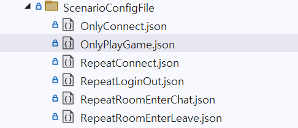

## Step 2. 시나리오 구성 값 설정

각 속성의 `Value` 부분에 원하는 값을 입력한다.

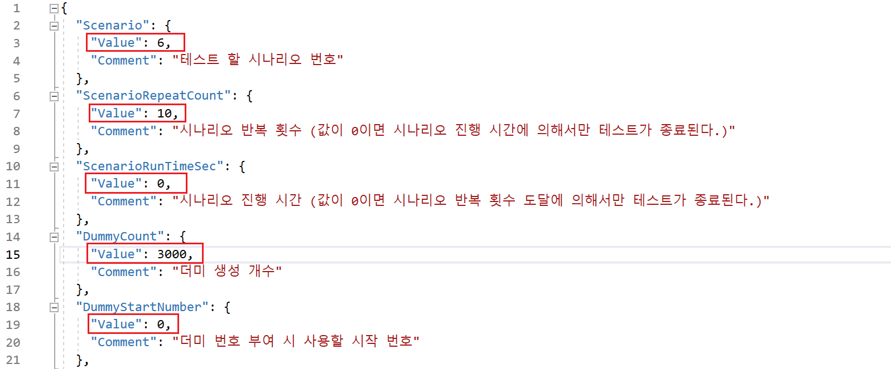

## Step 3. 빌드하기

**Ctrl** + **Shift** + **B**를 눌러 프로그램을 빌드한다.

### 참고
시나리오 구성 파일을 수정했는데 빌드 시 적용이 안된다면, **빌드(B)** -> **솔루션 다시 빌드**를 클릭해서 다시 빌드한다.

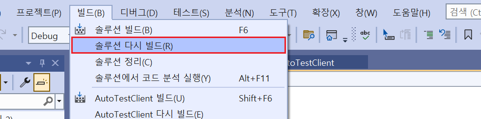

## Step 4. 실행하기

빌드된 실행 파일 (`.exe`)이 존재하는 경로로 이동해서 다음과 같이 실행하고자 하는 시나리오 구성 파일의 이름을 `argument`로 전달한다.

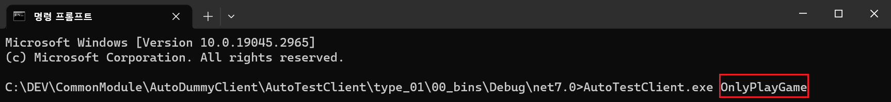

<br>
<br>
<br>

# 구현 기술
- `C#`
- `.NET Core 7.0`
- `MemoryPack` (*직렬화 라이브러리는 서버에 따라 변경된다.*)

---

# 프로젝트 구조
```
Solution
├── CSCommon [Project]
│   ├── ErrorCode.cs : Client & Server 전용 에러 코드
│   ├── FastBinaryRead.cs : 포인터 연산을 사용하여 메모리에 직접 접근하여 값을 읽는 클래스
│   ├── FastBinaryWrite.cs : 포인터 연산을 사용하여 메모리에 직접 접근하여 값을 쓰는 클래스
│   ├── MessageData.cs : 메세지 구조
│   ├── MessageHeader.cs : 메세지 헤더
│   └── MessageID.cs : 메세지 타입 ID
└── AutoTestClient [Project]
    ├── Dummy [Folder] : 더미에서 사용되는 각종 유틸리티 클래스 관리 폴더
    │   ├── DummyBase.cs : 모든 더미 유틸리티 클래스가 상속하는 베이스 클래스
    │   ├── DummyNetwork.cs : 더미의 네트워크 기능을 담당하는 클래스
    │   ├── DummyRoom.cs : 더미의 방 관련 기능을 담당하는 클래스
    │   ├── DummyGame.cs : 더미의 게임 관련 기능을 담당하는 클래스
    │   ├── DummyAction.cs : 더미의 액션 기능을 담당하는 클래스
    |   ├── DummyManager.cs : 더미 관리자
    │   └── DummyObject.cs : 실제 더미 객체
    └── Network [Folder]  : 프로그램의 네트워크 관련 클래스 폴더
    │   ├── S2CPacketHandler [Folder] : 서버 응답 패킷 처리 핸들러 폴더
    │   │   ├── BaseHandler.cs : 모든 S2CPacketHandler 클래스의 베이스 클래스
    │   │   ├── NotifyPutStone.cs : 다른 유저가 돌을 놓았을 때 서버로부터 수신 받는 알림 패킷 핸들러
    │   │   ├── NotifyRoomChat.cs : 룸 채팅 알림 패킷 핸들러
    │   │   ├── NotifyRoomLeaveUser.cs : 동일한 방의 다른 유저가 방 퇴장 시 수신 받는 알림 패킷 핸들러
    │   │   ├── NotifyRoomNewUser.cs : 방에 새로운 유저 입장 시 수신 받는 알림 패킷 핸들러
    │   │   ├── NotifyRoomUserList.cs : 방 입장 시 기존 유저 리스트에 대한 정보에 대한 패킷 핸들러
    │   │   ├── ResponseGameStart.cs : 게임 시작 응답 패킷 핸들러
    │   │   ├── ResponseLogin.cs : 로그인 응답 패킷 핸들러
    │   │   ├── ResponsePutStone.cs : 돌 놓기 응답 패킷 핸들러
    │   │   ├── ResponseRoomEnter.cs : 방 입장 응답 패킷 핸들러
    │   │   └── ResponseRoomLeave.cs : 방 퇴장 응답 패킷 핸들러
    │   ├── CustomSocket.cs : C#의 기본 Socket 기능을 해당 프로그램에 맞게 수정한 클래스
    │   ├── PacketFactory.cs : 요청한 패킷을 생성해주는 클래스
    │   ├── ReceiveBuffer.cs : Socket 수신 버퍼의 데이터를 저장하는 클래스
    │   ├── PacketProcessor.cs : L7 Layer 패킷을 처리하는 클래스
    │   ├── ReceivePacketInfo.cs : L7 Layer의 수신 패킷 클래스
    │   └── Receiver.cs : 일정 시간마다 모든 더미에 수신 데이터를 수신해주는 클래스
    ├── Scenario [Folder] : 더미가 실행하는 시나리오 클래스 폴더 ([] 표시는 반복을 의미한다.)
    │   ├── OnlyConnect.cs : 접속
    │   ├── OnlyPlayGame.cs : 접속 -> 로그인 -> 방입장 -> [게임시작 -> 게임 진행] -> 방퇴장
    │   ├── RepeatConnect.cs : [접속 -> 접속해제]
    │   ├── RepeatLogin.cs : [접속 -> 로그인 -> 접속해제] 
    │   ├── RepeatRoomEnterChat.cs : 접속 -> 로그인 -> 방입장 -> [방채팅]
    │   ├── RepeatRoomEnterLeave.cs : 접속 -> 로그인 -> [방입장 -> 방퇴장]
    │   └── ScenarioBase.cs : 모든 시나리오가 상속 받아야하는 베이스 클래스
    ├── ErrorCode.cs
    ├── OmokBoard.cs
    ├── Program.cs
    ├── RoomNumberAllocator.cs : 방 번호를 할당해주는 클래스 (Thread Safed)
    ├── ScenarioResult.cs : 시나리오 진행 결과 클래스
    ├── ScenarioRunner.cs : 시나리오 실행자.
    ├── ScenarioRunnerConfig.cs : 시나리오 구성 데이터 클래스
    ├── ScenarioType.cs : 시나리오 타입 별 고유 번호
    ├── ActionTimeChecker.cs : 더미 별 액션 진행 시간 초과 여부 확인 클래스
    └── Monitor.cs : 모니터링 클래스
```

---

# 스레드 구조


---

# 프로그램 동작 구조

## 1. 프로그램 초기화 과정

### Step 1. 시나리오 구성 파일 읽기

*위치 : `/Program.cs`*

*호출 함수 : `Program::LoadConfig()`*

- 프로그램 실행 시 입력받은 파일명과 동일한 파일을 `ScenarioConfigFile/` 폴더에서 찾아 `StreamReader`로 읽는다.
- `Program::Verify()` 함수를 통해 시나리오 구성 값이 옳바른지 확인한다.
- 문제없다면 `ScenarioConfig` 클래스로 읽어들인 구성값을 `Deserialize`한다.

### Step 2. ScenarioRunner 초기화

*위치 : `/ScenarioRunner.cs`*

*호출 함수 : `ScenarioRunner::Init()`*

- `ScenarioConfig` 클래스의 인스턴스를 파라미터로 받아, 시나리오 실행에 필요한 각종 클래스를 초기화한다.

### 프로그램 초기화 과정 시퀀스 다이어그램

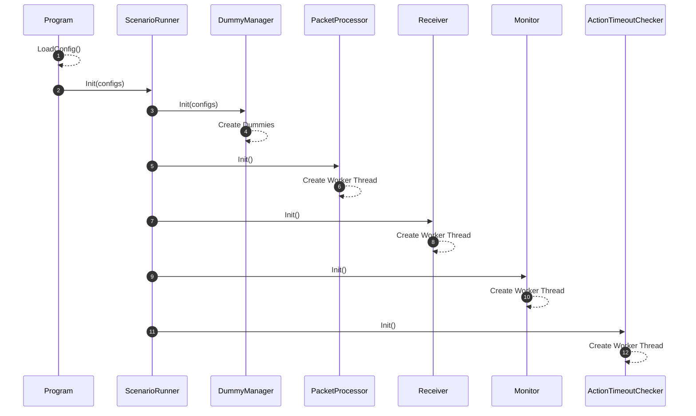

---


## 프로그램 실행 ~ 종료 과정

### Step 1. ScenarioRunner 시작

*위치 : `/ScenarioRunner.cs`*

*호출 함수 : `ScenarioRunner::Run()`*


### Step 2. `ScenarioRunnerUtility 클래스` 및 `네트워크 관련 클래스` 실행

*호출 스택 : `ScenarioRunner::Run() -> ScenarioRunner::Prepare()`*

- `ScenarioRunnerUtility::Monitor::Start()`
- `Network::PacketProcessor::Start()`
- `Network::Receiver::Start()`
- `ScenarioRunnerUtility::ActionTimeChecker::Start()`


### Step 3. 지정된 시나리오 클래스의 `Action()` 함수 실행

*호출 스택 : `ScenarioRunner::Run()`* 

- `ScenarioConfig::ScenarioType.Value`에 따라 `switch` 문으로 실행할 시나리오를 구분한다.

- 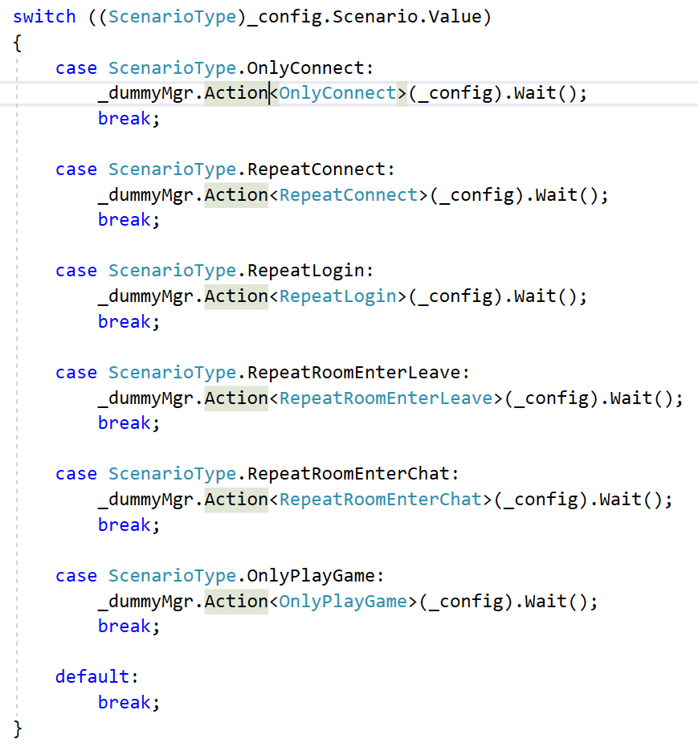

- `DummyManager::Action<T>()` 함수는 `ScenarioBase` 클래스를 상속 받은 각각의 시나리오 클래스의 `Action` 함수를 호출한다.

- 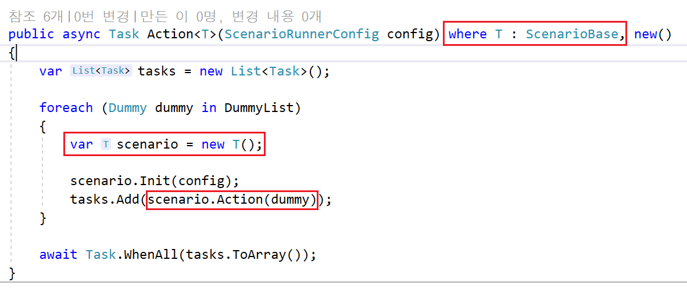


### Step 4. Dummy별 Task 생성 및 실행

*위치 : `/DummyManager.cs`*

*호출 스택 : `ScenarioRunner::Run() -> DummyManager::Action<T>()`*

- `Dummy` 개수 만큼 `Task`를 생성하여 더미별로 시나리오를 실행한다.


### Step 5. 모든 Task가 종료될 때 까지 대기

*위치 : `/DummyManager.cs`*

*호출 스택 : `ScenarioRunner::Run() -> DummyManager::Action<T>()`*

- 생성된 모든 `Task`가 종료될 때까지 해당 스레드는 대기 상태를 유지한다.

- 


### Step 6. 더미 별 시나리오 실행 종료

*위치 : `/DummyManager.cs`*

*호출 스택 : `ScenarioRunner::Run() -> DummyManager::Action<T>()`*

- 모든 `Task`가 종료되면 스레드가 깨어난다.

- 

#### 참고: 더미 별 시나리오 종료 조건.
- 현재 프로그램에서 더미가 시나리오 진행을 완료하는 조건은 총 세 가지다.

1. 지정 횟수만큼 시나리오 진행 (`ScenarioConfig.ScenarioRepeatCount`로 설정할 수 있다.)
2. 지정 시간만큼 시나리오 진행 (`ScenarioConfig.ScenarioRunTimeSec`로 설정할 수 있다.)
3. 시나리오 진행 중 액션 실패 발생 (로직 내부에서 처리한다.)

### Step 7. 스레드 정리

*위치: `/ScenarioRunner.cs`* 

*호출 스택 : `ScenarioRunner::Run()` -> `ScenarioRunner::Done()`*

- `ScenarioRunner::Init()`에서 생성했던 모든 스레드를 종료시킨다.


### Step 8. 시나리오 처리 결과 기록 및 프로그램 종료

*위치: `/ScenarioRunner.cs`* 

*호출 스택 : `ScenarioRunner::Run()` -> `ScenarioRunner::Record()`*

- 시나리오 처리 결과를 출력한다.

### 프로그램 실행 ~ 종료 과정 시퀀스 다이어그램

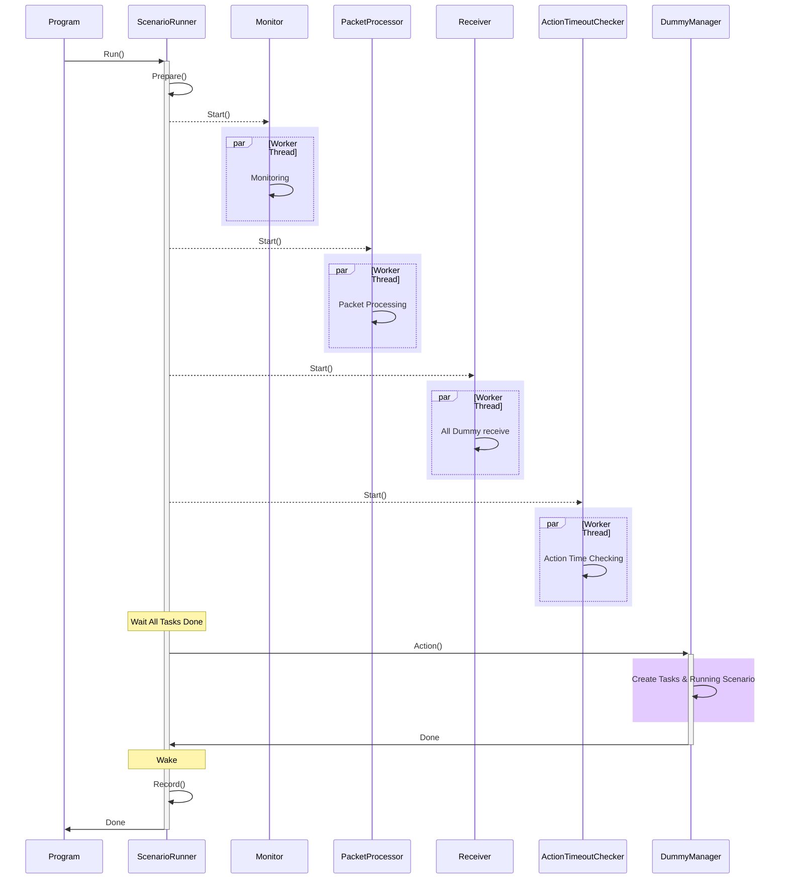

---

## 더미 수신 패킷 처리 과정

- 더미의 수신 데이터를 처리하는 클래스는 `Receiver`와 `PacketProcessor`로서, 각각의 클래스는 내부적으로 별도의 `Thread`를 가지고있다.
- `Receiver` 클래스는 일정 시간마다 모든 더미의 소켓 수신 버퍼를 확인하여, 더미 측 수신 버퍼로 소켓 수신 데이터를 복사 한 후 해당 데이터를 기반으로 `ReceivePacketInfo`를 생성한 뒤 `PacketProcessor`에 전달하는 일을 한다.

- `PacketProcessor` 클래스는 기본적으로 `Blocked` 상태를 유지하며, `PakcetProcessor::Packets`에 데이터가 추가 또는 존재하는 경우 `Running` 상태가 되어, 수신 받은 `PacketID`와 일치하는 `S2CPacketHandler`의 `Handle()`함수를 통해 패킷을 핸들링하는 일을 한다.

### Step 1. 더미 별 수신 동작 함수 호출

*위치 : `/Network/Receiver.cs`*, `/DummyManager.cs`

*호출 스택 : `Receiver::Work()` -> `DummyManager::Receive()`*

- 일정 시간 마다 `DummyManager::Receive()` 함수를 호출한다.

### Step 2. `ReceiverPacketInfo` 생성 후 `PacketProcessor`에 전달

*위치 : `/Dummy.cs`

*호출 스택 : `Receiver::Work()` -> `DummyManager::Receive()` -> `Dummy::ReceiveAndAddPacketToPacketProcessor()`*

- 더미 별 소켓에서 `Poll()` 함수를 사용하여, 소켓 수신 버퍼에 수신 데이터 유무를 확인한다.
- 수신 데이터가 존재한다면 `Receive()` 함수를 사용하여 `Dummy::ReceiveBuffer`로 소켓 수신 데이터를 복사한다.
- `Dummy::ReceiveBuffer`에 존재하는 데이터로 `ReceiverPacketInfo`를 생성한 후 `Dummy::AddPacketToPacketProcessor()` 함수를 호출하여 `PacketProcessor`에 생성한 `ReceiverPacketInfo`를 추가한다.

### Step 3. 수신 패킷 핸들링

*위치 : `/Network/PacketProcessor.cs`*

*호출 함수 : `PacketProcessor::Work()`*

- 새로운 패킷이 추가된 경우 `PacketProcessor`가 `Running`되어 `PacketID`와 맵핑되는 `S2CPacketHandler`를 찾아 `Handle()` 함수를 호출하여 패킷을 핸들링한다.

### 더미 수신 패킷 처리 과정 시퀀스 다이어그램

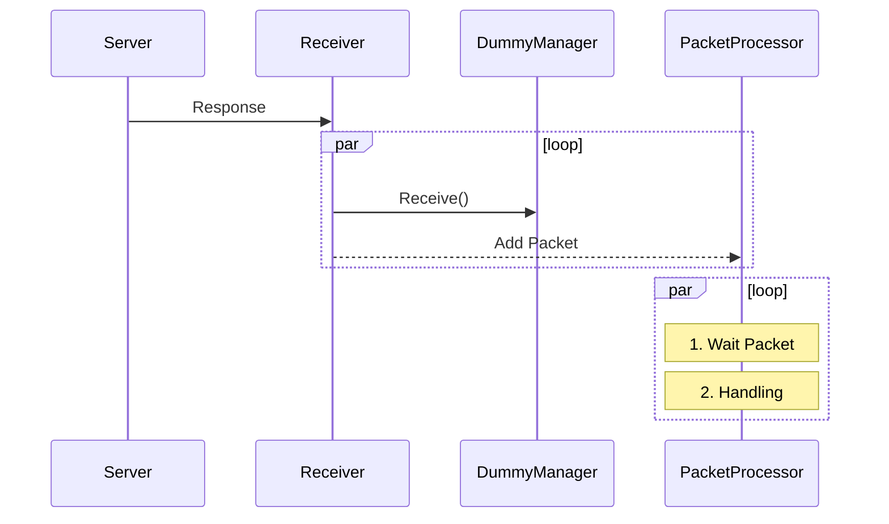

---

## 더미가 서버의 응답 패킷을 대기해야하는 경우 처리 과정

- 더미의 몇몇 액션들은 서버로부터 응답 패킷을 수신 받은 후 다음 액션을 진행해야한다.
- 현재 프로그램에서는 더미의 다음 액션 진행을 잠시 대기하기 위해 다음과 같이 플래그를 사용하여 `Spinlock` 방식으로 코드 진행을 대기하는 기능을 개발했다.

- 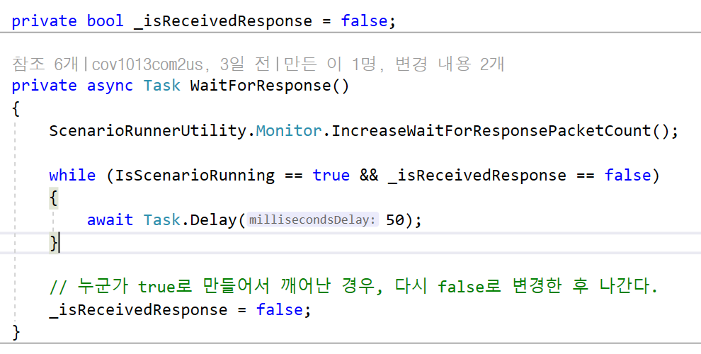

- 더미를 깨우려면(정확하게는 `while`문에서 벗어나기 위해서는) 해당 플래그를 반전시키면 된다.

- 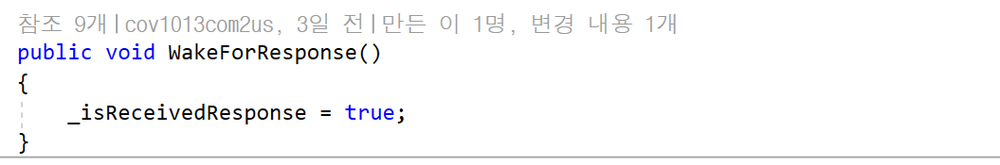

- 해당 기능을 사용하는 예시로 `RepactLogin` 시나리오 진행 과정을 설명한다.

### Step 1. `RepaceLogin` 시나리오 실행 및 로그인 요청

*위치 : `/Scenario/RepactLogin.cs`*

*호출 함수 : `ScenarioBase::ConnectLoginDisconnect()` -> `Dummy::LoginRequestAction()`*

- 다음 함수를 호출하면 `Dummy::RequestLoginAction()` 함수가 호출된다.
- 해당 함수는 서버로 `PKTRequestLogin` 패킷을 송신하고, `PKTResponseLogin` 패킷을 받을 때 까지 대기한다.

### Step 2. 서버 응답 대기

*위치 : `/Scenario/RepactLogin.cs`*

*호출 스택 : `ScenarioBase::ConnectLoginDisconnect()` -> `Dummy::LoginRequestAction()` -> `Dummy::WaitForResponse()`*

- `WaitForResponse()` 함수를 호출한 `Task`는 `Task.Delay()`에 의해 주기적으로 깨어나며, `while`을 빠져나올 수 있는지 확인한다.

- 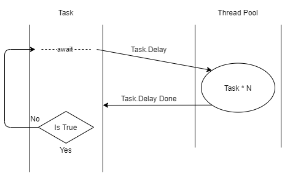

### Step 3. 서버 응답 수신

**해당 과정은 `Receiver` 스레드에서 진행되는 부분이다.**

*위치 : `/Network/Receiver.cs`*

*호출 함수 : `DummyManager::Receiver()`*

- `Receiver`에 의해 모든 더미의 수신 데이터를 `ReceivePacketInfo`로 만들어서 `PacketProcessor::Packets`에 추가한다.

### Step 4. 응답 패킷 핸들링 후 더미 깨우기

**해당 과정은 `PackerProcessor` 스레드에서 진행되는 부분이다.**

*위치 : `/Network/S2CPacketHandler/ResponseLogin.cs`*

*호출 함수 : `ResponseLogin::Handle()`*

- 패킷 프로세서의 의해 `ResponseLogin::Handle()`이 호출되면서 응답 패킷을 핸들링 한 후, `Dummy::WakeForResponse()`를 호출하여 `Task`를 `while`에서 빠져나오게 만든다.

- 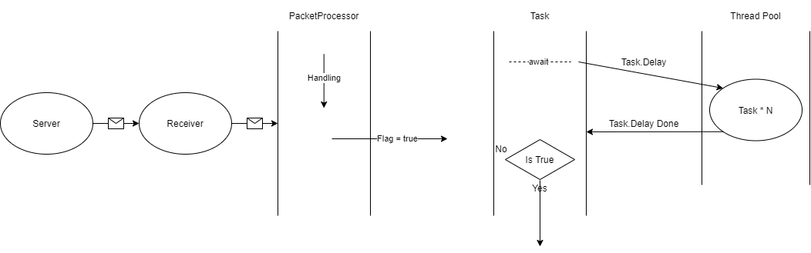

### Step 5. 다음 코드 진행

*위치 : `/Scenario/RepactLogin.cs`*

*호출 스택 : `ScenarioBase::ConnectLoginDisconnect()` -> `Dummy::LoginRequestAction()`*

- `while` 문에서 빠져나온 `Task`는 다음 액션을 진행한다.

### 더미가 서버의 응답 패킷을 대기해야하는 경우 처리 과정 시퀀스 다이어그램 
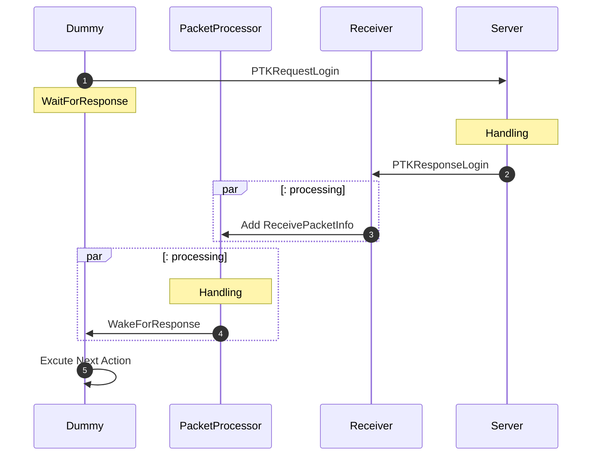

# 새로운 시나리오를 추가하는 방법

- 해당 프로그램에 시나리오를 새로 추가하기 위해서는 다음 절차를 진행해야한다.
- 예제로 `방입장 -> 방퇴장`을 반복하는 시나리오를 생성한다고 가정하겠다.

## Step 1. Config 파일 만들기
- `/ScenarioConfigFile`에 새로운 시나리오에 대한 구성 파일을 생성한다.
- 파일 이름은 `RepeatRoomEnterLeave.json`로 한다.

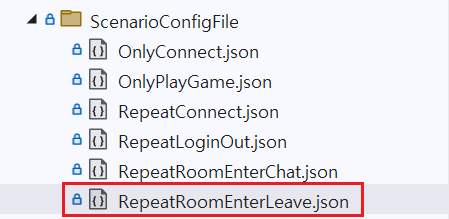

## Step 2. `ScenarioType` 추가
- `/ScenarioType.cs`에 시나리오 타입을 추가한다.

```CSharp
public enum ScenarioType
{
    NONE = 0,
    OnlyConnect = 1,
    RepeatConnect = 2,
    RepeatLogin = 3,
    RepeatRoomEnterLeave = 4,   // 추가된 시나리오 타입
    END,
}
```

## Step 3. `Scenario` 클래스를 생성
- `/Scenario` 폴더에 `/Scenario/ScenarioBase.cs`를 상속 받는 자식 클래스를 생성한다.
- 클래스의 이름은 `RepeatRoomEnterLeave`라고 하겠다.

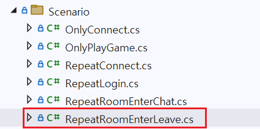

## Step 4. `ScenarioRunner::Run()`에 추가
- `Run()` 함수의 `switch` 문에 `case`에 추가한다.

```CSharp
public void Run()
{
    Prepare();

    switch ((ScenarioType)_config.Scenario.Value)
    {
        case ScenarioType.OnlyConnect:
            _dummyMgr.Action<OnlyConnect>(_config).Wait();
            break;

        case ScenarioType.RepeatConnect:
            _dummyMgr.Action<RepeatConnect>(_config).Wait();
            break;

        case ScenarioType.RepeatLogin:
            _dummyMgr.Action<RepeatLogin>(_config).Wait();
            break;

        case ScenarioType.RepeatRoomEnterLeave: // 추가된 코드
            _dummyMgr.Action<RepeatRoomEnterLeave>(_config).Wait();
            break;

        default:
            break;
    }

    Done();

    Record();
}
```

## Step 5. 더미 액션 추가
- `/DummyUtility/DummyAction`에 해당 시나리오를 실행하기 위한 새로운 액션을 생성한다.

### 방 입장 요청 액션 / 방 입장 완료 액션
```CSharp
public async Task<ErrorCode> RoomEnterRequestAction()
{
    ActionStart("RoomEnterAction");

    // 현재 서버는 방 입장 완료 시 요청한 방 번호를 재송신하지 않으므로
    // 방 입장 요청 전에 더미에 입장할 방 번호를 미리 세팅한 후 방 입장을 요청한다.
    EnteredRoomNumber = AllocRoomNumberFunc();

    var packet = PacketFactory.GetReqRoomEnter(EnteredRoomNumber);

    var errorCode = await SendPacket(packet);
    if (errorCode != ErrorCode.None)
    {
        // 해당 더미가 패킷 송신에 실패했을 경우, 다른 더미가 방 번호를 사용할 수 있게 다시 반환한다.
        ReleaseRoomNumberFunc(EnteredRoomNumber);
        return errorCode;
    }

    // 패킷 프로세서가 서버로부터 수신 받은 방 입장 응답 패킷을 처리할 때 까지 대기한다.
    await WaitForResponse();

    await Task.Delay(_actionIntervalMilliSec);

    return ErrorCode.None;
}

public void RoomEnterSuccessAction()
{
    CurrnetState = DummnyState.Room;

    // 방 입장 완료 시 처리할 것 다 처리하고 스레드를 깨운다.
    WakeForResponse();

    ScenarioRunnerUtility.Monitor.IncreaseRoomDummyCount();
}
```

### 방 퇴장 요청 액션 / 방 퇴장 완료 액션
```CSharp
public async Task<ErrorCode> RoomLeaveRequestAction()
{
    ActionStart("RoomLeaveRequestAction");

    var packet = PacketFactory.GetReqRoomLeave();

    var sendResult = await SendPacket(packet);
    if (sendResult != ErrorCode.None)
    {
        return sendResult;
    }

    await WaitForResponse();

    await Task.Delay(_actionIntervalMilliSec);

    return ErrorCode.None;
}

public void RoomLeaveSuccessAction()
{
    var temp = EnteredRoomNumber;

    OtherUserIDList.Clear();

    EnteredRoomNumber = -1;

    CurrnetState = DummnyState.Login;

    // 방 번호 반환(이제 다른 더미가 해당 방 번호를 사용할 수 있다.)
    ReleaseRoomNumberFunc(temp);

    // 방 입장 완료 시 처리할 것 다 처리하고 스레드를 깨운다.
    WakeForResponse();

    ScenarioRunnerUtility.Monitor.DecreaseRoomDummyCount();
}
```

## Step 6. 서버 응답 패킷 처리 필요 시 핸들러 생성 및 등록

- 방 입장 및 방 퇴장과 관련된 서버의 응답, 알림 패킷을 수신 및 처리해야하는 경우 `/Network/S2CPacketHandler/BaseHandler.cs`를 상속하여 각 패킷 별 `Handler` 클래스를 생성한다.


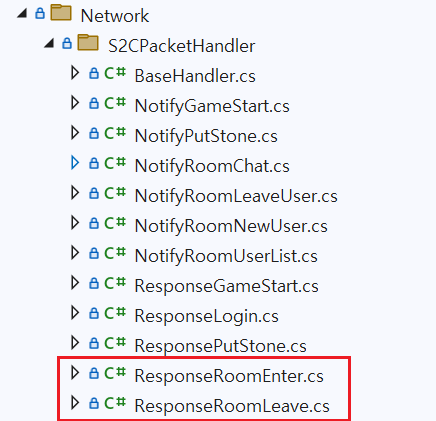


- 이후 `/Network/PacketProcessor::Init()` 함수에서 `_handlers`에 `PacketID`와 생성한 `Handler` 클래스를 등록한다.
```CSharp
public void Init()
{
    _handlers[(ushort)PacketID.ResLogin] = new ResponseLogin();
    _handlers[(ushort)PacketID.ResRoomEnter] = new ResponseRoomEnter(); // 추가된 핸들러
    _handlers[(ushort)PacketID.ResRoomLeave] = new ResponseRoomLeave(); // 추가된 핸들러

    _updater = new Thread(Work);
}
```


## Step 7. `Scenario::Action()` 채워넣기
- `ScenarioBase` 클래스를 상속받은 시나리오 클래스의 기본 틀은 아래와 같다.
```CSharp
public override async Task Action(Dummy dummy)
{
    dummy.ScenarioPrepare(ScenarioType);    // 시나리오 실행 전 준비

    while (IsPossbleNextAction(dummy) == true)
    {
        //TODO: 

        dummy.SuccessScenarioAction();      // 시나리오 한 번 성공 시 처리 횟수 증가
    }

    dummy.ScenarioDone(true, $"Success");   // 시나리오 종료 후 결과 기록
}
```

- 먼저 방 입장을 하기 위해서는 `[접속] -> [로그인]`이 완료된 상태여야한다. 다음과 같이 `while` 입장 전 로그인까지 끝내둔다.
```CSharp
public override async Task Action(Dummy dummy)
{
    dummy.ScenarioPrepare(ScenarioType);

    // 1. 로그인
    var result1 = await ConnectLogin(dummy);
    if (result1 != ErrorCode.None)
    {
        dummy.ScenarioDone(false, $"Failed action(RepeatRoomEnterLeave) with error : {result1}");
        return;
    }

    while (IsPossbleNextAction(dummy) == true)
    {
        //TODO: 더미 액션 실행

        dummy.SuccessScenarioAction();
    }

    dummy.ScenarioDone(true, $"Success");
}
```

- 이후 `[방 입장]`과 `[방 퇴장]`을 반복하는 더미 액션을 `while` 안에 추가한다.
```CSharp
public override async Task Action(Dummy dummy)
{
    dummy.ScenarioPrepare(ScenarioType.RepeatRoomEnterLeave);

    // 1. 로그인
    var result1 = await ConnectLogin(dummy);
    if (result1 != ErrorCode.None)
    {
        dummy.ScenarioDone(false, $"Failed action(RepeatRoomEnterLeave) with error : {result1}");
        return;
    }

    // 2. 방 입장 -> 방 퇴장
    while (IsPossbleNextAction(dummy) == true)
    {
        var result2 = await RoomEnterLeave(dummy);

        if (result2 != ErrorCode.None)
        {
            dummy.ScenarioDone(false, $"Failed action(RepeatRoomEnterLeave) with error : {result2}");
            return;
        }

        dummy.SuccessScenarioAction();

        // 모니터링을 위한 호출
        ScenarioRunnerUtility.Monitor.IncreaseScenarioRepeacCount();
        ScenarioRunnerUtility.Monitor.IncreaseScenarioRepeacCountPerSeconds();
    }

    dummy.ScenarioDone(true, $"Success RepeatRoomEnterLeave");
}
```
