# 게임 서버 개발자가 알아야할 TCP/IP Windows 소켓 프로그래밍

저자: 최흥배, Claude AI  

- C++23
- Windows 11
- Visual Studio 2022 이상
  

-----  
# Chapter.10 소켓 입출력 모델: select 방식의 채팅 서버
- [GitHub](https://github.com/heungbae-com2us/SelectChatServer )  
- [DeepWiki](https://deepwiki.com/heungbae-com2us/SelectChatServer/1-overview )  
- `code/SelectChatServer` 에도 소스가 있다.
- YOUTUBE 
    - [1] (https://www.youtube.com/watch?v=OJZmDPO6FIA&list=PLW_xyUw4fSdYJuxJaMx3k32xTN3Ou8aDy&index=4 )   
    - [2](https://www.youtube.com/watch?v=q9hsy_RK6Ss&list=PLW_xyUw4fSdYJuxJaMx3k32xTN3Ou8aDy&index=8 )
    - [C++ 채팅서버 클라이언트(C#,Winform) 코드 설명](https://www.youtube.com/watch?v=V1Lpned5NvA&list=PLW_xyUw4fSdYJuxJaMx3k32xTN3Ou8aDy )
           

## 1. 전체 아키텍처 개요
이 프로젝트는 **select 기반의 TCP 네트워크**를 사용하는 멀티플레이어 채팅 서버입니다. 게임 서버 개발의 기본 개념들을 학습할 수 있도록 설계되었습니다.

### 1.1 프로젝트 구조

```
SelectChatServer-main/
├── ChatServer2/           # Chat 서버 코드
│   ├── ConsoleHost/       # 서버 실행 진입점
│   ├── LogicLib/          # 게임 로직 라이브러리  
│   └── ServerNetLib/      # 네트워크 라이브러리
├── ChatClient/            # C# 클라이언트
├── Common/                # 공통 헤더 (패킷, 에러코드)
└── Bin/                   # 설정 파일
```

### 1.2 시스템 아키텍처
  
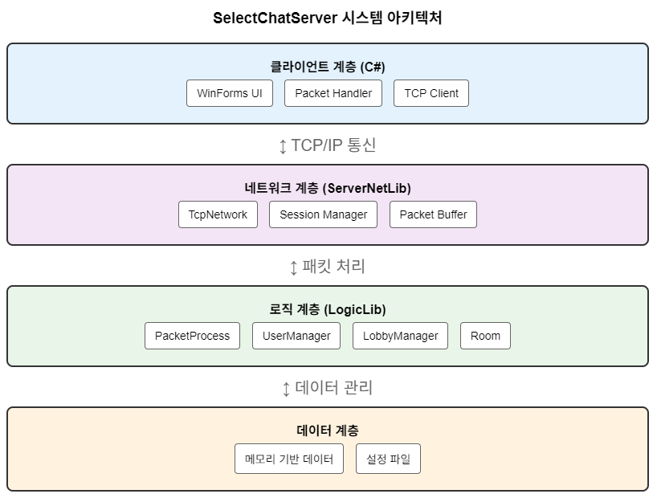  
  
  
## 2. 서버 구조 상세 분석

### 2.1 Main 클래스 - 서버 진입점

```cpp
// ChatServer2/LogicLib/Main.cpp
class Main
{
private:
    std::unique_ptr<NServerNetLib::ITcpNetwork> m_pNetwork;    // 네트워크 계층
    std::unique_ptr<PacketProcess> m_pPacketProc;              // 패킷 처리
    std::unique_ptr<UserManager> m_pUserMgr;                   // 유저 관리
    std::unique_ptr<LobbyManager> m_pLobbyMgr;                 // 로비 관리
};
```

**Main 클래스의 역할:**
- 서버 초기화 및 설정 로드
- 각 매니저 클래스들의 생명주기 관리
- 메인 게임 루프 실행

**초기화 과정:**
1. 설정 파일 로드 (포트, 최대 사용자 수 등)
2. 네트워크 라이브러리 초기화
3. 매니저 클래스들 초기화
4. 패킷 처리기 설정
   

#### 1. Main 클래스 다이어그램
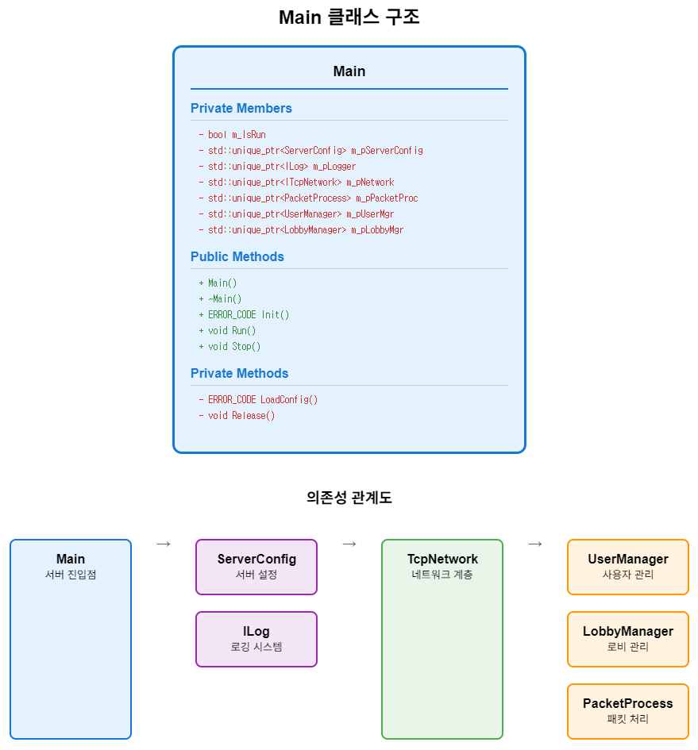  

#### 2. Main 클래스 상세 분석

##### 2.1 멤버 변수 분석

```cpp
class Main
{
private:
    bool m_IsRun = false;  // 서버 실행 상태 플래그
    
    // 핵심 컴포넌트들 (스마트 포인터로 관리)
    std::unique_ptr<NServerNetLib::ServerConfig> m_pServerConfig;   // 서버 설정
    std::unique_ptr<NServerNetLib::ILog> m_pLogger;                 // 로깅 시스템
    std::unique_ptr<NServerNetLib::ITcpNetwork> m_pNetwork;         // 네트워크 계층
    std::unique_ptr<PacketProcess> m_pPacketProc;                   // 패킷 처리기
    std::unique_ptr<UserManager> m_pUserMgr;                        // 사용자 관리자
    std::unique_ptr<LobbyManager> m_pLobbyMgr;                      // 로비 관리자
};
```

**스마트 포인터 사용 이유:**
- **자동 메모리 관리**: 객체의 생명주기 자동 관리
- **예외 안전성**: 예외 발생 시 자동으로 메모리 해제
- **소유권 명확화**: unique_ptr로 소유권을 명확히 표현

##### 2.2 초기화 과정 (Init 메서드)

```cpp
ERROR_CODE Main::Init()
{
    // 1. 로거 초기화
    m_pLogger = std::make_unique<ConsoleLog>();
    
    // 2. 설정 파일 로드
    LoadConfig();
    
    // 3. 네트워크 계층 초기화
    m_pNetwork = std::make_unique<NServerNetLib::TcpNetwork>();
    auto result = m_pNetwork->Init(m_pServerConfig.get(), m_pLogger.get());
    if (result != NET_ERROR_CODE::NONE) {
        return ERROR_CODE::MAIN_INIT_NETWORK_INIT_FAIL;
    }
    
    // 4. 사용자 관리자 초기화
    m_pUserMgr = std::make_unique<UserManager>();
    m_pUserMgr->Init(m_pServerConfig->MaxClientCount);
    
    // 5. 로비 관리자 초기화
    m_pLobbyMgr = std::make_unique<LobbyManager>();
    m_pLobbyMgr->Init({
        m_pServerConfig->MaxLobbyCount,
        m_pServerConfig->MaxLobbyUserCount,
        m_pServerConfig->MaxRoomCountByLobby,
        m_pServerConfig->MaxRoomUserCount
    }, m_pNetwork.get(), m_pLogger.get());
    
    // 6. 패킷 처리기 초기화
    m_pPacketProc = std::make_unique<PacketProcess>();
    m_pPacketProc->Init(m_pNetwork.get(), m_pUserMgr.get(), 
                        m_pLobbyMgr.get(), m_pServerConfig.get(), m_pLogger.get());
    
    m_IsRun = true;
    return ERROR_CODE::NONE;
}
```

**초기화 순서:**  
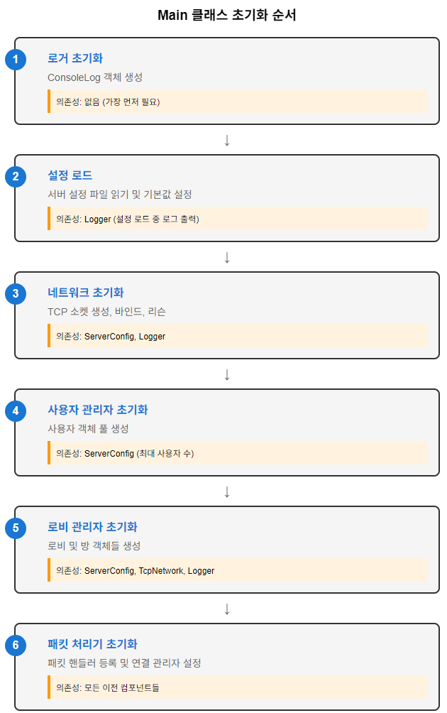  

  
##### 2.3 설정 로드 (LoadConfig 메서드)

```cpp
ERROR_CODE Main::LoadConfig()
{
    m_pServerConfig = std::make_unique<NServerNetLib::ServerConfig>();
    
    // 하드코딩된 설정값들 (실제로는 파일에서 읽어야 함)
    m_pServerConfig->Port = 32452;                              // 서버 포트
    m_pServerConfig->BackLogCount = 128;                        // 백로그 큐 크기
    m_pServerConfig->MaxClientCount = 1000;                     // 최대 클라이언트 수
    
    // 버퍼 크기 설정
    m_pServerConfig->MaxClientSockOptRecvBufferSize = 10240;    // 소켓 수신 버퍼
    m_pServerConfig->MaxClientSockOptSendBufferSize = 10240;    // 소켓 송신 버퍼
    m_pServerConfig->MaxClientRecvBufferSize = 8192;            // 어플리케이션 수신 버퍼
    m_pServerConfig->MaxClientSendBufferSize = 8192;            // 어플리케이션 송신 버퍼
    
    // 로그인 체크 설정
    m_pServerConfig->IsLoginCheck = false;                      // 로그인 타임아웃 체크 여부
    
    // 로비/방 설정
    m_pServerConfig->ExtraClientCount = 64;                     // 여분 클라이언트 수
    m_pServerConfig->MaxLobbyCount = 2;                         // 최대 로비 수
    m_pServerConfig->MaxRoomCountByLobby = 20;                  // 로비당 최대 방 수
    m_pServerConfig->MaxRoomUserCount = 4;                      // 방당 최대 유저 수
    
    return ERROR_CODE::NONE;
}
```

**서버 설정 상세:**   
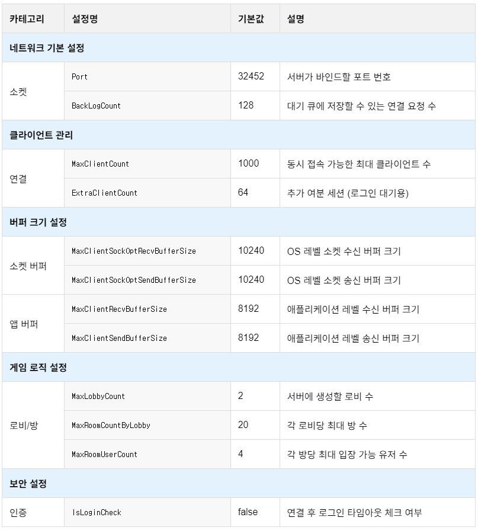    
  
  
##### 2.4 메인 루프 (Run 메서드)

```cpp
void Main::Run()
{
    while (m_IsRun)
    {
        // 1. 네트워크 이벤트 처리 (select 호출)
        m_pNetwork->Run();
        
        // 2. 수신된 패킷들 처리
        while (true)
        {
            auto packetInfo = m_pNetwork->GetPacketInfo();
            
            if (packetInfo.PacketId == 0) {
                break;  // 처리할 패킷이 없음
            }
            else {
                m_pPacketProc->Process(packetInfo);  // 패킷 처리
            }
        }
        
        // 3. 주기적 상태 체크 (로그인 타임아웃 등)
        m_pPacketProc->StateCheck();
    }
}
```

**메인 루프 처리 흐름:**   
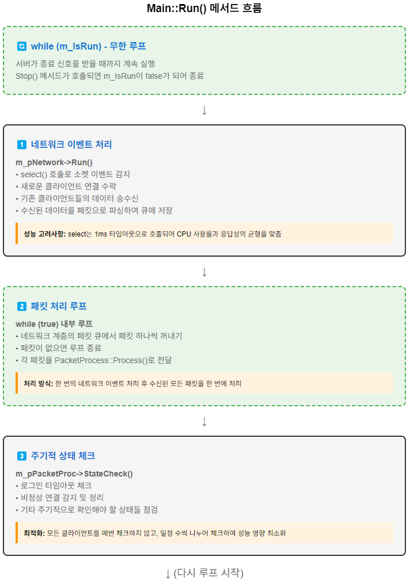    
  
 
##### 2.5 종료 처리

```cpp
void Main::Stop()
{
    m_IsRun = false;  // 메인 루프 종료 신호
}

void Main::Release() 
{
    if (m_pNetwork) {
        m_pNetwork->Release();  // 네트워크 리소스 정리
    }
    // unique_ptr들은 자동으로 소멸됨
}

Main::~Main()
{
    Release();  // 소멸자에서 리소스 정리
}
```
  

#### 3. Main 클래스의 설계 특징

##### 3.1 RAII (Resource Acquisition Is Initialization) 패턴

```cpp
// 스마트 포인터를 사용한 자동 리소스 관리
std::unique_ptr<NServerNetLib::ITcpNetwork> m_pNetwork;
std::unique_ptr<PacketProcess> m_pPacketProc;
// ... 기타 등등
```

**장점:**
- 예외 발생 시에도 자동으로 메모리 해제
- 명시적 delete 호출 불필요
- 메모리 누수 방지

##### 3.2 의존성 주입 (Dependency Injection) 패턴

```cpp
// PacketProcess 초기화 시 필요한 의존성들을 주입
m_pPacketProc->Init(
    m_pNetwork.get(),     // 네트워크 계층 주입
    m_pUserMgr.get(),     // 사용자 관리자 주입
    m_pLobbyMgr.get(),    // 로비 관리자 주입
    m_pServerConfig.get(), // 설정 정보 주입
    m_pLogger.get()       // 로거 주입
);
```

**장점:**
- 결합도 감소
- 테스트 용이성 향상
- 모듈 간 독립성 증대

##### 3.3 단일 책임 원칙 (Single Responsibility Principle)

Main 클래스는 다음과 같은 단일 책임을 가집니다:
- **서버 생명주기 관리**: 초기화, 실행, 종료
- **컴포넌트 조합**: 각 하위 시스템들을 조합하여 완전한 서버 구성

각각의 세부 기능은 전문화된 클래스들에게 위임:
- 네트워크 처리 → TcpNetwork
- 사용자 관리 → UserManager  
- 로비 관리 → LobbyManager
- 패킷 처리 → PacketProcess
  
  
### 2.2 네트워크 계층 (ServerNetLib)

#### TcpNetwork 클래스

```cpp
class TcpNetwork : public ITcpNetwork
{
private:
    SOCKET m_ServerSockfd;                              // 서버 소켓
    fd_set m_Readfds;                                   // select용 읽기 소켓 집합
    std::vector<ClientSession> m_ClientSessionPool;     // 클라이언트 세션 풀
    std::deque<RecvPacketInfo> m_PacketQueue;          // 수신 패킷 큐
};
```

**select 기반 네트워크 처리 흐름:**
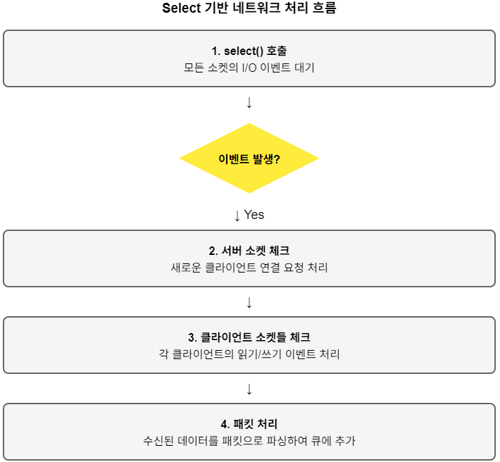  
      
```cpp
void TcpNetwork::Run()
{
    auto read_set = m_Readfds;
    auto write_set = m_Readfds;
    
    // select 호출 - 1ms 타임아웃
    auto selectResult = select(0, &read_set, &write_set, 0, &timeout);
    
    if (selectResult > 0) {
        // 새로운 연결 처리
        if (FD_ISSET(m_ServerSockfd, &read_set)) {
            NewSession();
        }
        
        // 기존 클라이언트들 처리
        RunCheckSelectClients(read_set, write_set);
    }
}
```
  
[TcpNetwork 클래스 다이어그램]
    

  
##### 클래스 초기화 (Init 메서드)

```cpp
NET_ERROR_CODE TcpNetwork::Init(const ServerConfig* pConfig, ILog* pLogger)
{
    // 1. 설정 정보 복사
    std::memcpy(&m_Config, pConfig, sizeof(ServerConfig));
    m_pRefLogger = pLogger;

    // 2. 서버 소켓 초기화
    auto initRet = InitServerSocket();
    if (initRet != NET_ERROR_CODE::NONE) {
        return initRet;
    }
    
    // 3. 바인드 및 리슨
    auto bindListenRet = BindListen(pConfig->Port, pConfig->BackLogCount);
    if (bindListenRet != NET_ERROR_CODE::NONE) {
        return bindListenRet;
    }

    // 4. fd_set 초기화
    FD_ZERO(&m_Readfds);
    FD_SET(m_ServerSockfd, &m_Readfds);
    
    // 5. 클라이언트 세션 풀 생성
    auto sessionPoolSize = CreateSessionPool(pConfig->MaxClientCount + pConfig->ExtraClientCount);
    
    return NET_ERROR_CODE::NONE;
}
```

**초기화 과정 상세:**   
  
  
##### 메인 네트워크 루프 (Run 메서드)

```cpp
void TcpNetwork::Run()
{
    auto read_set = m_Readfds;   // 읽기 이벤트 감지용
    auto write_set = m_Readfds;  // 쓰기 이벤트 감지용
    
    timeval timeout{ 0, 1000 }; // 1ms 타임아웃
    
    // select 호출
#ifdef _WIN32
    auto selectResult = select(0, &read_set, &write_set, 0, &timeout);
#else
    auto selectResult = select(m_MaxSockFD+1, &read_set, &write_set, 0, &timeout);
#endif
    
    // select 결과 확인
    auto isFDSetChanged = RunCheckSelectResult(selectResult);
    if (isFDSetChanged == false) {
        return;  // 이벤트가 없거나 에러 발생
    }

    // 새로운 클라이언트 연결 처리
    if (FD_ISSET(m_ServerSockfd, &read_set)) {
        NewSession();
    }
    
    // 기존 클라이언트들의 I/O 이벤트 처리
    RunCheckSelectClients(read_set, write_set);
}
```

##### 세션 풀 관리

```cpp
// 세션 풀 생성
int TcpNetwork::CreateSessionPool(const int maxClientCount)
{
    for (int i = 0; i < maxClientCount; ++i)
    {
        ClientSession session;
        session.Clear();
        session.Index = i;
        
        // 각 세션마다 독립적인 버퍼 할당
        session.pRecvBuffer = new char[m_Config.MaxClientRecvBufferSize];
        session.pSendBuffer = new char[m_Config.MaxClientSendBufferSize];
        
        m_ClientSessionPool.push_back(session);
        m_ClientSessionPoolIndex.push_back(session.Index);			
    }
    
    return maxClientCount;
}

// 세션 할당
int TcpNetwork::AllocClientSessionIndex()
{
    if (m_ClientSessionPoolIndex.empty()) {
        return -1;  // 사용 가능한 세션이 없음
    }

    int index = m_ClientSessionPoolIndex.front();
    m_ClientSessionPoolIndex.pop_front();
    return index;
}

// 세션 해제
void TcpNetwork::ReleaseSessionIndex(const int index)
{
    m_ClientSessionPoolIndex.push_back(index);
    m_ClientSessionPool[index].Clear();
}
```

**세션 풀 구조:**   
  
  

##### 2.4 패킷 수신 및 처리

```cpp
NET_ERROR_CODE TcpNetwork::RecvSocket(const int sessionIndex)
{
    auto& session = m_ClientSessionPool[sessionIndex];
    auto fd = static_cast<SOCKET>(session.SocketFD);

    if (session.IsConnected() == false) {
        return NET_ERROR_CODE::RECV_PROCESS_NOT_CONNECTED;
    }

    int recvPos = 0;
    
    // 이전에 남은 데이터가 있다면 앞으로 이동
    if (session.RemainingDataSize > 0) {
        memcpy(session.pRecvBuffer, 
               &session.pRecvBuffer[session.PrevReadPosInRecvBuffer], 
               session.RemainingDataSize);
        recvPos += session.RemainingDataSize;
    }

    // 새로운 데이터 수신
    auto recvSize = recv(fd, &session.pRecvBuffer[recvPos], (MAX_PACKET_BODY_SIZE * 2), 0);
    
    if (recvSize == 0) {
        return NET_ERROR_CODE::RECV_REMOTE_CLOSE;  // 상대방이 연결 종료
    }
    
    if (recvSize < 0) {
        auto netError = WSAGetLastError();  // Windows
        if (netError != WSAEWOULDBLOCK) {
            return NET_ERROR_CODE::RECV_API_ERROR;
        }
        return NET_ERROR_CODE::NONE;  // WOULDBLOCK은 정상 (논블로킹)
    }

    session.RemainingDataSize += recvSize;
    return NET_ERROR_CODE::NONE;
}
```

```cpp
NET_ERROR_CODE TcpNetwork::RecvBufferProcess(const int sessionIndex)
{
    auto& session = m_ClientSessionPool[sessionIndex];
    
    auto readPos = 0;
    const auto dataSize = session.RemainingDataSize;
    PacketHeader* pPktHeader;
    
    // 버퍼에서 완성된 패킷들을 찾아서 처리
    while ((dataSize - readPos) >= PACKET_HEADER_SIZE)
    {
        pPktHeader = (PacketHeader*)&session.pRecvBuffer[readPos];
        readPos += PACKET_HEADER_SIZE;
        auto bodySize = (int16_t)(pPktHeader->TotalSize - PACKET_HEADER_SIZE);

        if (bodySize > 0) {
            // 패킷 바디가 완전히 도착했는지 확인
            if (bodySize > (dataSize - readPos)) {
                readPos -= PACKET_HEADER_SIZE;  // 헤더 위치로 되돌리기
                break;  // 불완전한 패킷이므로 다음에 처리
            }

            // 패킷 크기 검증
            if (bodySize > MAX_PACKET_BODY_SIZE) {
                return NET_ERROR_CODE::RECV_CLIENT_MAX_PACKET;
            }
        }

        // 완성된 패킷을 큐에 추가
        AddPacketQueue(sessionIndex, pPktHeader->Id, bodySize, &session.pRecvBuffer[readPos]);
        readPos += bodySize;
    }
    
    // 처리된 데이터 정리
    session.RemainingDataSize -= readPos;
    session.PrevReadPosInRecvBuffer = readPos;
    
    return NET_ERROR_CODE::NONE;
}
```

**패킷 처리 과정:**   
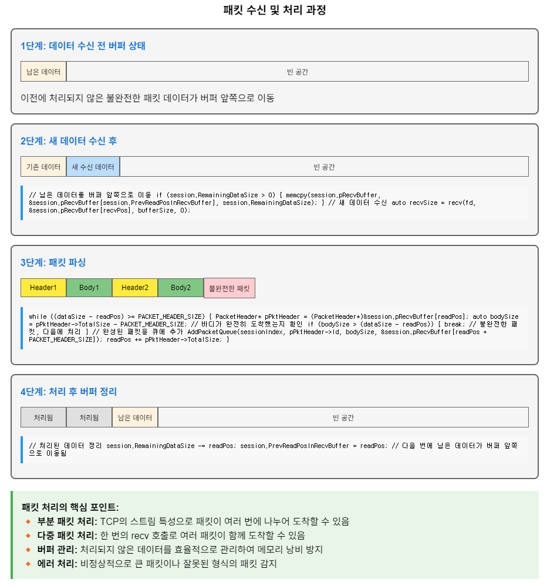  
    
  
##### 패킷 송신

```cpp
NET_ERROR_CODE TcpNetwork::SendData(const int sessionIndex, const short packetId, 
                                   const short bodySize, const char* pMsg)
{
    auto& session = m_ClientSessionPool[sessionIndex];
    
    auto pos = session.SendSize;
    auto totalSize = (int16_t)(bodySize + PACKET_HEADER_SIZE);

    // 송신 버퍼 공간 확인
    if ((pos + totalSize) > m_Config.MaxClientSendBufferSize) {
        return NET_ERROR_CODE::CLIENT_SEND_BUFFER_FULL;
    }
    
    // 패킷 헤더 구성
    PacketHeader pktHeader{ totalSize, packetId, (uint8_t)0 };
    memcpy(&session.pSendBuffer[pos], (char*)&pktHeader, PACKET_HEADER_SIZE);

    // 패킷 바디 복사
    if (bodySize > 0) {
        memcpy(&session.pSendBuffer[pos + PACKET_HEADER_SIZE], pMsg, bodySize);
    }

    session.SendSize += totalSize;
    return NET_ERROR_CODE::NONE;
}
```

```cpp
NetError TcpNetwork::FlushSendBuff(const int sessionIndex)
{
    auto& session = m_ClientSessionPool[sessionIndex];
    auto fd = static_cast<SOCKET>(session.SocketFD);

    if (session.IsConnected() == false) {
        return NetError(NET_ERROR_CODE::CLIENT_FLUSH_SEND_BUFF_REMOTE_CLOSE);
    }

    // 실제 소켓으로 데이터 전송
    auto result = SendSocket(fd, session.pSendBuffer, session.SendSize);
    if (result.Error != NET_ERROR_CODE::NONE) {
        return result;
    }

    auto sendSize = result.Value;
    if (sendSize < session.SendSize) {
        // 부분 전송 - 나머지 데이터를 버퍼 앞쪽으로 이동
        memmove(&session.pSendBuffer[0],
                &session.pSendBuffer[sendSize],
                session.SendSize - sendSize);
        session.SendSize -= sendSize;
    } else {
        // 전체 전송 완료
        session.SendSize = 0;
    }
    
    return result;
}
```

##### TcpNetwork의 설계 특징 및 성능 고려사항

###### 객체 풀 패턴 적용

**장점:**
- 런타임 메모리 할당 없음
- 메모리 단편화 방지
- 예측 가능한 성능

**단점:**
- 초기 메모리 사용량이 큼
- 최대 동접자 수 제한

###### Select 모델의 특성

**플랫폼별 차이점:**
```cpp
#ifdef _WIN32
    // Windows: 첫 번째 인자 무시
    select(0, &read_set, &write_set, 0, &timeout);
#else
    // Linux: 최대 fd + 1 전달
    select(m_MaxSockFD+1, &read_set, &write_set, 0, &timeout);
#endif
```

**성능 특성:**
- O(n) 시간 복잡도 (n = 연결된 소켓 수)
- FD_SETSIZE 제한 (Windows: 64, Linux: 1024)
- 1ms 타임아웃으로 반응성과 CPU 사용률의 균형

###### 에러 처리 및 복구
코드 전반에 걸쳐 다양한 네트워크 에러 상황을 고려한 처리가 구현되어 있으며, 각 상황별로 적절한 에러 코드를 반환하여 상위 계층에서 대응할 수 있도록 설계되었습니다.
이러한 TcpNetwork 클래스는 select 기반 네트워크 프로그래밍의 전형적인 구현 예시이며, 게임 서버 개발의 기초를 학습하는 데 매우 유용한 참고 자료입니다.  

  
#### 세션 관리

```cpp
struct ClientSession
{
    int Index = 0;                    // 세션 인덱스
    SOCKET SocketFD = 0;             // 소켓 파일 디스크립터
    char IP[MAX_IP_LEN] = { 0, };    // 클라이언트 IP
    
    char* pRecvBuffer = nullptr;      // 수신 버퍼
    int RemainingDataSize = 0;        // 남은 데이터 크기
    
    char* pSendBuffer = nullptr;      // 송신 버퍼
    int SendSize = 0;                 // 송신 데이터 크기
};
```

**세션 풀 관리 방식:**
- 미리 고정된 수의 세션 객체를 생성
- 연결 시 풀에서 할당, 연결 해제 시 풀로 반환
- 메모리 할당/해제 오버헤드 최소화
  

### 2.3 로직 계층 (LogicLib)

#### PacketProcess 클래스

```cpp
class PacketProcess
{
private:
    // 패킷 ID별 처리 함수 배열
    typedef ERROR_CODE(PacketProcess::*PacketFunc)(PacketInfo);
    PacketFunc PacketFuncArray[(int)NCommon::PACKET_ID::MAX];
    
    UserManager* m_pRefUserMgr;
    LobbyManager* m_pRefLobbyMgr;
};
```

**패킷 처리 흐름:**  
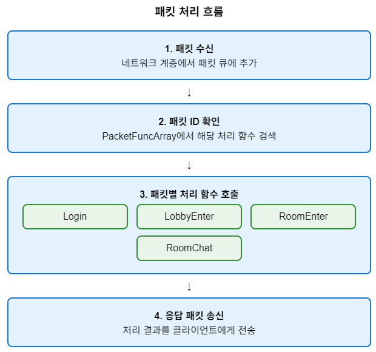   
  
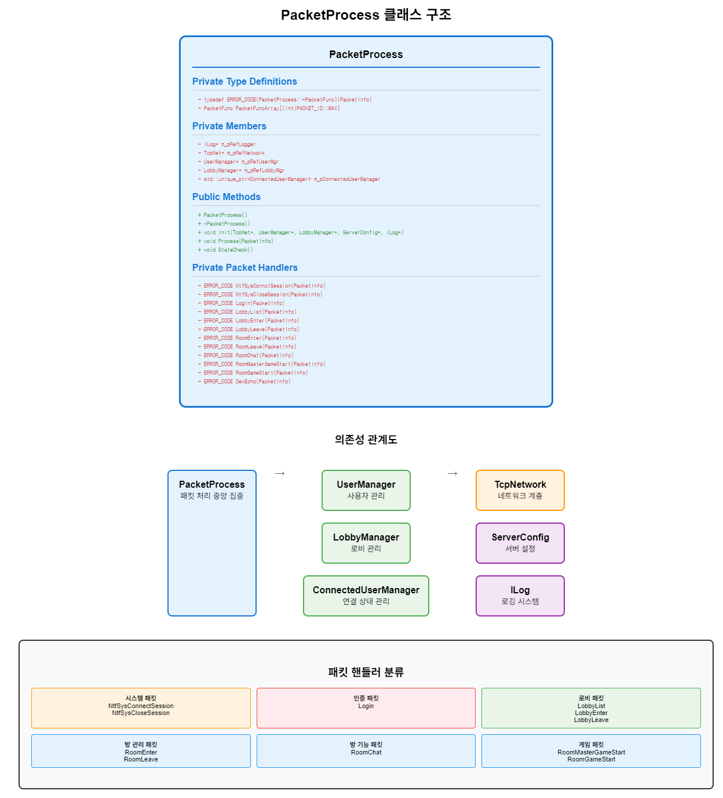    


##### 패킷 함수 포인터 배열

```cpp
class PacketProcess
{
    // 패킷 처리 함수 포인터 타입 정의
    typedef ERROR_CODE(PacketProcess::*PacketFunc)(PacketInfo);
    
    // 패킷 ID별 처리 함수 배열
    PacketFunc PacketFuncArray[(int)NCommon::PACKET_ID::MAX];
    
public:
    void Process(PacketInfo packetInfo)
    {
        auto packetId = packetInfo.PacketId;
        
        // 등록된 처리 함수가 있는지 확인
        if (PacketFuncArray[packetId] == nullptr) {
            return;
        }

        // 해당 패킷 처리 함수 호출
        (this->*PacketFuncArray[packetId])(packetInfo);
    }
};
```
  
##### 초기화 과정 (Init 메서드)

```cpp
void PacketProcess::Init(TcpNet* pNetwork, UserManager* pUserMgr, LobbyManager* pLobbyMgr, 
                        ServerConfig* pConfig, ILog* pLogger)
{
    // 참조 저장
    m_pRefLogger = pLogger;
    m_pRefNetwork = pNetwork;
    m_pRefUserMgr = pUserMgr;
    m_pRefLobbyMgr = pLobbyMgr;

    // 연결 사용자 관리자 초기화
    m_pConnectedUserManager = std::make_unique<ConnectedUserManager>();
    m_pConnectedUserManager->Init(pNetwork->ClientSessionPoolSize(), pNetwork, pConfig, pLogger);

    // 함수 포인터 배열 초기화
    using netLibPacketId = NServerNetLib::PACKET_ID;
    using commonPacketId = NCommon::PACKET_ID;
    
    // 모든 항목을 nullptr로 초기화
    for (int i = 0; i < (int)commonPacketId::MAX; ++i) {
        PacketFuncArray[i] = nullptr;
    }

    // 시스템 패킷 등록
    PacketFuncArray[(int)netLibPacketId::NTF_SYS_CONNECT_SESSION] = &PacketProcess::NtfSysConnctSession;
    PacketFuncArray[(int)netLibPacketId::NTF_SYS_CLOSE_SESSION] = &PacketProcess::NtfSysCloseSession;
    
    // 게임 로직 패킷 등록
    PacketFuncArray[(int)commonPacketId::LOGIN_IN_REQ] = &PacketProcess::Login;
    PacketFuncArray[(int)commonPacketId::LOBBY_LIST_REQ] = &PacketProcess::LobbyList;
    PacketFuncArray[(int)commonPacketId::LOBBY_ENTER_REQ] = &PacketProcess::LobbyEnter;
    PacketFuncArray[(int)commonPacketId::LOBBY_LEAVE_REQ] = &PacketProcess::LobbyLeave;
    PacketFuncArray[(int)commonPacketId::ROOM_ENTER_REQ] = &PacketProcess::RoomEnter;
    PacketFuncArray[(int)commonPacketId::ROOM_LEAVE_REQ] = &PacketProcess::RoomLeave;
    PacketFuncArray[(int)commonPacketId::ROOM_CHAT_REQ] = &PacketProcess::RoomChat;
    PacketFuncArray[(int)commonPacketId::ROOM_MASTER_GAME_START_REQ] = &PacketProcess::RoomMasterGameStart;
    PacketFuncArray[(int)commonPacketId::ROOM_GAME_START_REQ] = &PacketProcess::RoomGameStart;

    // 개발용 패킷 등록
    PacketFuncArray[(int)commonPacketId::DEV_ECHO_REQ] = &PacketProcess::DevEcho;
}
```

**패킷 핸들러 등록 과정:**  
1단계: 배열 초기화    
```
// 모든 패킷 핸들러를 nullptr로 초기화
for (int i = 0; i < (int)commonPacketId::MAX; ++i) {
    PacketFuncArray[i] = nullptr;
}
```  
  
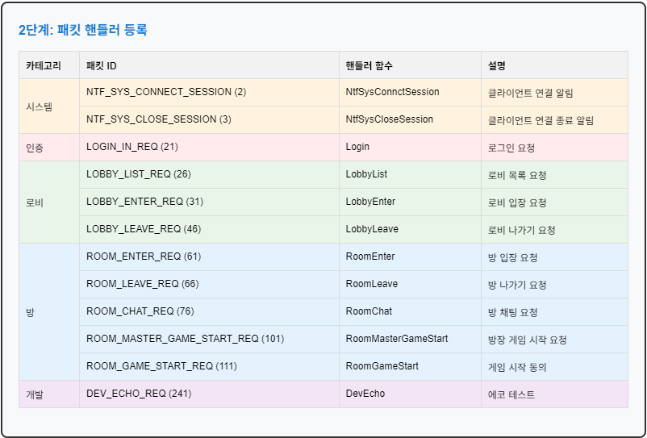      
  
3단계: 등록 코드 예시  
```
// 함수 포인터 등록 방식
PacketFuncArray[(int)PACKET_ID::LOGIN_IN_REQ] = &PacketProcess::Login;

// 실제 호출 시
if (PacketFuncArray[packetId] != nullptr) {
    ERROR_CODE result = (this->*PacketFuncArray[packetId])(packetInfo);
}
```  
  
##### 로그인 처리

```cpp
ERROR_CODE PacketProcess::Login(PacketInfo packetInfo)
{
    // 패킷 데이터 파싱
    auto reqPkt = (NCommon::PktLogInReq*)packetInfo.pRefData;
    NCommon::PktLogInRes resPkt;

    // 사용자 추가 시도
    auto addRet = m_pRefUserMgr->AddUser(packetInfo.SessionIndex, reqPkt->szID);

    if (addRet != ERROR_CODE::NONE) {
        // 실패 시 에러 응답
        resPkt.SetError(addRet);
        m_pRefNetwork->SendData(packetInfo.SessionIndex, (short)PACKET_ID::LOGIN_IN_RES, 
                               sizeof(NCommon::PktLogInRes), (char*)&resPkt);
        return addRet;
    }

    // 로그인 성공 처리
    m_pConnectedUserManager->SetLogin(packetInfo.SessionIndex);

    // 성공 응답 전송
    resPkt.ErrorCode = (short)ERROR_CODE::NONE;
    m_pRefNetwork->SendData(packetInfo.SessionIndex, (short)PACKET_ID::LOGIN_IN_RES, 
                           sizeof(NCommon::PktLogInRes), (char*)&resPkt);

    return ERROR_CODE::NONE;
}
```

##### 방 입장 처리

```cpp
ERROR_CODE PacketProcess::RoomEnter(PacketInfo packetInfo)
{
    auto reqPkt = (NCommon::PktRoomEnterReq*)packetInfo.pRefData;
    NCommon::PktRoomEnterRes resPkt;

    // 1. 사용자 유효성 검증
    auto [errorCode, pUser] = m_pRefUserMgr->GetUser(packetInfo.SessionIndex);
    if (errorCode != ERROR_CODE::NONE) {
        resPkt.SetError(errorCode);
        m_pRefNetwork->SendData(packetInfo.SessionIndex, (short)PACKET_ID::ROOM_ENTER_RES, 
                               sizeof(resPkt), (char*)&resPkt);
        return errorCode;
    }

    // 2. 사용자 상태 검증 (로비에 있어야 함)
    if (pUser->IsCurDomainInLobby() == false) {
        resPkt.SetError(ERROR_CODE::ROOM_ENTER_INVALID_DOMAIN);
        m_pRefNetwork->SendData(packetInfo.SessionIndex, (short)PACKET_ID::ROOM_ENTER_RES, 
                               sizeof(resPkt), (char*)&resPkt);
        return ERROR_CODE::ROOM_ENTER_INVALID_DOMAIN;
    }

    // 3. 로비 참조 획득
    auto lobbyIndex = pUser->GetLobbyIndex();
    auto pLobby = m_pRefLobbyMgr->GetLobby(lobbyIndex);
    if (pLobby == nullptr) {
        resPkt.SetError(ERROR_CODE::ROOM_ENTER_INVALID_LOBBY_INDEX);
        m_pRefNetwork->SendData(packetInfo.SessionIndex, (short)PACKET_ID::ROOM_ENTER_RES, 
                               sizeof(resPkt), (char*)&resPkt);
        return ERROR_CODE::ROOM_ENTER_INVALID_LOBBY_INDEX;
    }

    Room* pRoom = nullptr;
    
    // 4. 방 생성 또는 기존 방 입장
    if (reqPkt->IsCreate) {
        // 새 방 생성
        pRoom = pLobby->CreateRoom();
        if (pRoom == nullptr) {
            resPkt.SetError(ERROR_CODE::ROOM_ENTER_EMPTY_ROOM);
            m_pRefNetwork->SendData(packetInfo.SessionIndex, (short)PACKET_ID::ROOM_ENTER_RES, 
                                   sizeof(resPkt), (char*)&resPkt);
            return ERROR_CODE::ROOM_ENTER_EMPTY_ROOM;
        }

        auto ret = pRoom->CreateRoom(reqPkt->RoomTitle);
        if (ret != ERROR_CODE::NONE) {
            resPkt.SetError(ret);
            m_pRefNetwork->SendData(packetInfo.SessionIndex, (short)PACKET_ID::ROOM_ENTER_RES, 
                                   sizeof(resPkt), (char*)&resPkt);
            return ret;
        }
    } else {
        // 기존 방 입장
        pRoom = pLobby->GetRoom(reqPkt->RoomIndex);
        if (pRoom == nullptr) {
            resPkt.SetError(ERROR_CODE::ROOM_ENTER_INVALID_ROOM_INDEX);
            m_pRefNetwork->SendData(packetInfo.SessionIndex, (short)PACKET_ID::ROOM_ENTER_RES, 
                                   sizeof(resPkt), (char*)&resPkt);
            return ERROR_CODE::ROOM_ENTER_INVALID_ROOM_INDEX;
        }
    }

    // 5. 방에 사용자 추가
    auto enterRet = pRoom->EnterUser(pUser);
    if (enterRet != ERROR_CODE::NONE) {
        resPkt.SetError(enterRet);
        m_pRefNetwork->SendData(packetInfo.SessionIndex, (short)PACKET_ID::ROOM_ENTER_RES, 
                               sizeof(resPkt), (char*)&resPkt);
        return enterRet;
    }

    // 6. 사용자 상태 업데이트
    pUser->EnterRoom(lobbyIndex, pRoom->GetIndex());

    // 7. 다른 사용자들에게 알림
    pRoom->NotifyEnterUserInfo(pUser->GetIndex(), pUser->GetID().c_str());

    // 8. 성공 응답 전송
    m_pRefNetwork->SendData(packetInfo.SessionIndex, (short)PACKET_ID::ROOM_ENTER_RES, 
                           sizeof(resPkt), (char*)&resPkt);
    return ERROR_CODE::NONE;
}
```

**방 입장 처리 흐름:**   
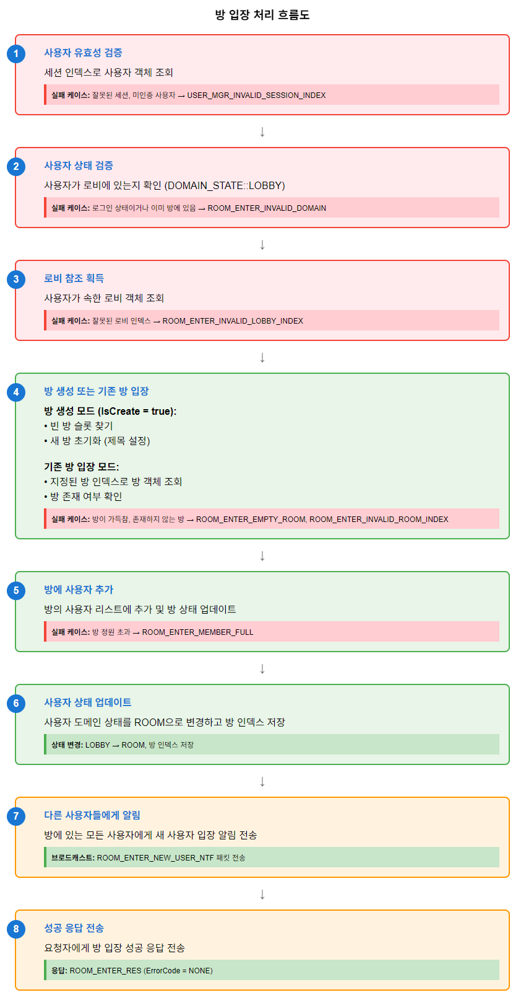  
  
##### 방 채팅 처리

```cpp
ERROR_CODE PacketProcess::RoomChat(PacketInfo packetInfo)
{
    auto reqPkt = (NCommon::PktRoomChatReq*)packetInfo.pRefData;
    NCommon::PktRoomChatRes resPkt;

    // 1. 사용자 유효성 검증
    auto [errorCode, pUser] = m_pRefUserMgr->GetUser(packetInfo.SessionIndex);
    if (errorCode != ERROR_CODE::NONE) {
        resPkt.SetError(errorCode);
        m_pRefNetwork->SendData(packetInfo.SessionIndex, (short)PACKET_ID::ROOM_CHAT_RES, 
                               sizeof(resPkt), (char*)&resPkt);
        return errorCode;
    }

    // 2. 사용자가 방에 있는지 확인
    if (pUser->IsCurDomainInRoom() == false) {
        resPkt.SetError(ERROR_CODE::ROOM_CHAT_INVALID_DOMAIN);
        m_pRefNetwork->SendData(packetInfo.SessionIndex, (short)PACKET_ID::ROOM_CHAT_RES, 
                               sizeof(resPkt), (char*)&resPkt);
        return ERROR_CODE::ROOM_CHAT_INVALID_DOMAIN;
    }

    // 3. 로비 및 방 객체 조회
    auto lobbyIndex = pUser->GetLobbyIndex();
    auto pLobby = m_pRefLobbyMgr->GetLobby(lobbyIndex);
    if (pLobby == nullptr) {
        resPkt.SetError(ERROR_CODE::ROOM_CHAT_INVALID_LOBBY_INDEX);
        m_pRefNetwork->SendData(packetInfo.SessionIndex, (short)PACKET_ID::ROOM_CHAT_RES, 
                               sizeof(resPkt), (char*)&resPkt);
        return ERROR_CODE::ROOM_CHAT_INVALID_LOBBY_INDEX;
    }

    auto pRoom = pLobby->GetRoom(pUser->GetRoomIndex());
    if (pRoom == nullptr) {
        resPkt.SetError(ERROR_CODE::ROOM_ENTER_INVALID_ROOM_INDEX);
        m_pRefNetwork->SendData(packetInfo.SessionIndex, (short)PACKET_ID::ROOM_CHAT_RES, 
                               sizeof(resPkt), (char*)&resPkt);
        return ERROR_CODE::ROOM_ENTER_INVALID_ROOM_INDEX;
    }

    // 4. 방의 모든 사용자에게 채팅 메시지 브로드캐스트
    pRoom->NotifyChat(pUser->GetSessioIndex(), pUser->GetID().c_str(), reqPkt->Msg);

    // 5. 요청자에게 성공 응답
    m_pRefNetwork->SendData(packetInfo.SessionIndex, (short)PACKET_ID::ROOM_CHAT_RES, 
                           sizeof(resPkt), (char*)&resPkt);
    return ERROR_CODE::NONE;
}
```

##### 2.4.1 클라이언트 연결/해제 처리

```cpp
ERROR_CODE PacketProcess::NtfSysConnctSession(PacketInfo packetInfo)
{
    // 새로운 연결에 대한 관리 시작
    m_pConnectedUserManager->SetConnectSession(packetInfo.SessionIndex);
    return ERROR_CODE::NONE;
}

ERROR_CODE PacketProcess::NtfSysCloseSession(PacketInfo packetInfo)
{
    // 연결 종료된 사용자 정리
    auto pUser = std::get<1>(m_pRefUserMgr->GetUser(packetInfo.SessionIndex));

    if (pUser) {
        auto pLobby = m_pRefLobbyMgr->GetLobby(pUser->GetLobbyIndex());
        if (pLobby) {
            auto pRoom = pLobby->GetRoom(pUser->GetRoomIndex());

            // 방에 있었다면 방에서 제거
            if (pRoom) {
                pRoom->LeaveUser(pUser->GetIndex());
                pRoom->NotifyLeaveUserInfo(pUser->GetID().c_str());
                
                m_pRefLogger->Write(LOG_TYPE::L_INFO, "%s | NtfSysCloseSesson. sessionIndex(%d). Room Out", 
                                   __FUNCTION__, packetInfo.SessionIndex);
            }

            // 로비에서 제거
            pLobby->LeaveUser(pUser->GetIndex());
            m_pRefLogger->Write(LOG_TYPE::L_INFO, "%s | NtfSysCloseSesson. sessionIndex(%d). Lobby Out", 
                               __FUNCTION__, packetInfo.SessionIndex);
        }
        
        // 사용자 관리자에서 제거
        m_pRefUserMgr->RemoveUser(packetInfo.SessionIndex);
    }
    
    // 연결 관리자에서 제거
    m_pConnectedUserManager->SetDisConnectSession(packetInfo.SessionIndex);

    m_pRefLogger->Write(LOG_TYPE::L_INFO, "%s | NtfSysCloseSesson. sessionIndex(%d)", 
                       __FUNCTION__, packetInfo.SessionIndex);
    return ERROR_CODE::NONE;
}
```

##### 2.5 상태 체크 (StateCheck 메서드)

```cpp
void PacketProcess::StateCheck()
{
    // 연결 상태 및 로그인 타임아웃 체크
    m_pConnectedUserManager->LoginCheck();
}
```

##### PacketProcess 설계 특징

###### 명령 패턴 (Command Pattern) 적용  
  
```
// 명령 인터페이스 (함수 포인터)
typedef ERROR_CODE(PacketProcess::*PacketFunc)(PacketInfo);

// 명령 등록 (Invoker)
PacketFuncArray[PACKET_ID::LOGIN_REQ] = &PacketProcess::Login;

// 명령 실행
(this->*PacketFuncArray[packetId])(packetInfo);
```  
  

🔥 패턴 적용의 이점:    
✅ 확장성: 새로운 패킷 타입 쉽게 추가  
✅ 유지보수성: 각 패킷 처리 로직이 독립적  
✅ 성능: O(1) 시간에 처리 함수 호출  
✅ 동적 등록: 런타임에 핸들러 변경 가능  
✅ 테스트 용이성: 개별 핸들러 단위 테스트 가능
  
  
  

###### 상태 기반 검증
각 패킷 처리 함수는 사용자의 현재 상태를 확인하여 유효한 요청인지 검증합니다:

- **로그인 상태 검증**: 로비 목록 요청 시 로그인 완료 여부 확인
- **도메인 상태 검증**: 방 입장 시 로비에 있는지 확인
- **권한 검증**: 방장 게임 시작 시 실제 방장인지 확인

###### 에러 처리 일관성
모든 패킷 처리 함수는 동일한 패턴을 따릅니다:

1. **입력 검증**: 패킷 데이터 및 사용자 상태 확인
2. **비즈니스 로직 실행**: 실제 게임 로직 처리
3. **응답 전송**: 성공/실패 결과를 클라이언트에게 전송
4. **에러 코드 반환**: 상위 계층에서 추가 처리할 수 있도록 에러 코드 반환

이러한 구조를 통해 PacketProcess 클래스는 게임 서버의 핵심 로직을 안정적이고 확장 가능하게 처리할 수 있습니다.

  
#### 사용자 관리 시스템

```cpp
class UserManager
{
private:
    std::vector<User> m_UserObjPool;                    // 사용자 객체 풀
    std::deque<int> m_UserObjPoolIndex;                 // 사용 가능한 인덱스 큐
    std::unordered_map<int, User*> m_UserSessionDic;    // 세션 -> 사용자 매핑
    std::unordered_map<const char*, User*> m_UserIDDic; // ID -> 사용자 매핑
};
```

**사용자 상태 관리:**

```cpp
class User
{
    enum class DOMAIN_STATE {
        NONE = 0,    // 미연결
        LOGIN = 1,   // 로그인 완료
        LOBBY = 2,   // 로비 입장
        ROOM = 3,    // 방 입장
    };
};
```

### 2.4 로비 및 방 시스템

#### 로비 시스템 구조
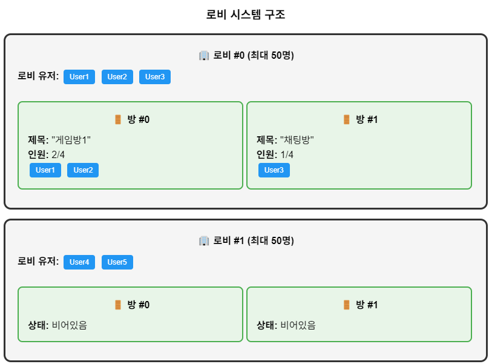  
  
     
  

##### LobbyManager 초기화

```cpp
class LobbyManager
{
private:
    ILog* m_pRefLogger;
    TcpNet* m_pRefNetwork;
    std::vector<Lobby> m_LobbyList;  // 로비들을 값으로 저장 (복사)

public:
    void Init(const LobbyManagerConfig config, TcpNet* pNetwork, ILog* pLogger)
    {
        m_pRefLogger = pLogger;
        m_pRefNetwork = pNetwork;

        // 설정된 수만큼 로비 생성
        for (int i = 0; i < config.MaxLobbyCount; ++i)
        {
            Lobby lobby;
            lobby.Init((short)i,                           // 로비 인덱스
                      (short)config.MaxLobbyUserCount,     // 로비 최대 사용자 수
                      (short)config.MaxRoomCountByLobby,   // 로비당 방 수
                      (short)config.MaxRoomUserCount);     // 방당 최대 사용자 수
                      
            lobby.SetNetwork(m_pRefNetwork, m_pRefLogger); // 네트워크 참조 설정

            m_LobbyList.push_back(lobby);  // 벡터에 로비 추가
        }
    }

    Lobby* GetLobby(short lobbyId)
    {
        if (lobbyId < 0 || lobbyId >= (short)m_LobbyList.size()) {
            return nullptr;
        }
        return &m_LobbyList[lobbyId];  // 벡터 원소의 주소 반환
    }
};
```

**LobbyManagerConfig 구조체:**

```cpp
struct LobbyManagerConfig
{
    int MaxLobbyCount;        // 서버 전체 로비 수 (예: 2개)
    int MaxLobbyUserCount;    // 각 로비 최대 사용자 수 (예: 50명)
    int MaxRoomCountByLobby;  // 로비당 방 수 (예: 20개)
    int MaxRoomUserCount;     // 방당 최대 사용자 수 (예: 4명)
};
```

##### 로비 목록 정보 전송

```cpp
void LobbyManager::SendLobbyListInfo(const int sessionIndex)
{
    NCommon::PktLobbyListRes resPkt;
    resPkt.ErrorCode = (short)ERROR_CODE::NONE;
    resPkt.LobbyCount = static_cast<short>(m_LobbyList.size());

    int index = 0;
    for (auto& lobby : m_LobbyList)
    {
        resPkt.LobbyList[index].LobbyId = lobby.GetIndex();
        resPkt.LobbyList[index].LobbyUserCount = lobby.GetUserCount();
        resPkt.LobbyList[index].LobbyMaxUserCount = lobby.MaxUserCount();
        ++index;
    }

    // 패킷 전송
    m_pRefNetwork->SendData(sessionIndex, (short)PACKET_ID::LOBBY_LIST_RES, 
                           sizeof(resPkt), (char*)&resPkt);
}
```

**로비 목록 응답 패킷 구조:**  
  

  
##### Lobby 초기화 및 구조

```cpp
class Lobby
{
private:
    ILog* m_pRefLogger;
    TcpNet* m_pRefNetwork;

    short m_LobbyIndex = 0;
    short m_MaxUserCount = 0;

    // 사용자 관리를 위한 3가지 자료구조
    std::vector<LobbyUser> m_UserList;                    // 슬롯 기반 사용자 목록
    std::unordered_map<int, User*> m_UserIndexDic;       // 인덱스 기반 빠른 검색
    std::unordered_map<const char*, User*> m_UserIDDic;  // ID 기반 빠른 검색

    std::vector<Room*> m_RoomList;                        // 방 목록 (포인터 저장)
};

void Lobby::Init(const short lobbyIndex, const short maxLobbyUserCount, 
                const short maxRoomCountByLobby, const short maxRoomUserCount)
{
    m_LobbyIndex = lobbyIndex;
    m_MaxUserCount = maxLobbyUserCount;

    // 사용자 슬롯 초기화
    for (int i = 0; i < maxLobbyUserCount; ++i)
    {
        LobbyUser lobbyUser;
        lobbyUser.Index = (short)i;
        lobbyUser.pUser = nullptr;  // 빈 슬롯

        m_UserList.push_back(lobbyUser);
    }

    // 방 객체들 생성
    for (int i = 0; i < maxRoomCountByLobby; ++i)
    {
        m_RoomList.emplace_back(new Room());
        m_RoomList[i]->Init((short)i, maxRoomUserCount);
    }
}
```

**LobbyUser 구조체:**

```cpp
struct LobbyUser
{
    short Index = 0;    // 슬롯 인덱스
    User* pUser = nullptr;  // 실제 사용자 객체 포인터 (null이면 빈 슬롯)
};
```

##### 사용자 입장 처리

```cpp
ERROR_CODE Lobby::EnterUser(User* pUser)
{
    // 1. 로비 정원 확인
    if (m_UserIndexDic.size() >= m_MaxUserCount) {
        return ERROR_CODE::LOBBY_ENTER_MAX_USER_COUNT;
    }

    // 2. 중복 사용자 확인
    if (FindUser(pUser->GetIndex()) != nullptr) {
        return ERROR_CODE::LOBBY_ENTER_USER_DUPLICATION;
    }

    // 3. 빈 슬롯에 사용자 추가
    auto addRet = AddUser(pUser);
    if (addRet != ERROR_CODE::NONE) {
        return addRet;
    }

    // 4. 사용자 상태 변경
    pUser->EnterLobby(m_LobbyIndex);

    // 5. 빠른 검색을 위한 맵에 추가
    m_UserIndexDic.insert({ pUser->GetIndex(), pUser });
    m_UserIDDic.insert({ pUser->GetID().c_str(), pUser });

    return ERROR_CODE::NONE;
}

ERROR_CODE Lobby::AddUser(User* pUser)
{
    // std::find_if를 사용하여 빈 슬롯 찾기
    auto findIter = std::find_if(std::begin(m_UserList), std::end(m_UserList), 
                                [](auto& lobbyUser) { 
                                    return lobbyUser.pUser == nullptr; 
                                });
    
    if (findIter == std::end(m_UserList)) {
        return ERROR_CODE::LOBBY_ENTER_EMPTY_USER_LIST;
    }

    findIter->pUser = pUser;  // 빈 슬롯에 사용자 할당
    return ERROR_CODE::NONE;
}
```

**사용자 입장 과정 시각화:**   
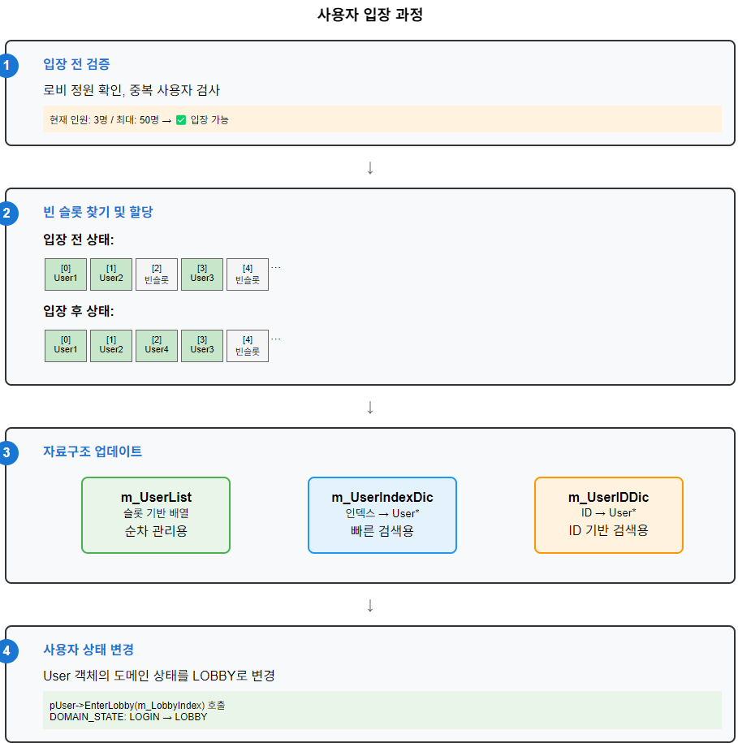  
   
##### 사용자 퇴장 처리

```cpp
ERROR_CODE Lobby::LeaveUser(const int userIndex)
{
    // 1. 슬롯에서 사용자 제거
    RemoveUser(userIndex);

    // 2. 사용자 객체 찾기
    auto pUser = FindUser(userIndex);
    if (pUser == nullptr) {
        return ERROR_CODE::LOBBY_LEAVE_USER_NVALID_UNIQUEINDEX;
    }

    // 3. 사용자 상태 변경
    pUser->LeaveLobby();

    // 4. 검색 맵에서 제거
    m_UserIndexDic.erase(pUser->GetIndex());
    m_UserIDDic.erase(pUser->GetID().c_str());
    
    return ERROR_CODE::NONE;
}

void Lobby::RemoveUser(const int userIndex)
{
    auto findIter = std::find_if(std::begin(m_UserList), std::end(m_UserList), 
                                [userIndex](auto& lobbyUser) { 
                                    return lobbyUser.pUser != nullptr && 
                                           lobbyUser.pUser->GetIndex() == userIndex; 
                                });

    if (findIter == std::end(m_UserList)) {
        return;
    }

    findIter->pUser = nullptr;  // 슬롯을 빈 상태로 만듦
}

User* Lobby::FindUser(const int userIndex)
{
    auto findIter = m_UserIndexDic.find(userIndex);
    if (findIter == m_UserIndexDic.end()) {
        return nullptr;
    }
    return (User*)findIter->second;
}
```

##### 방 관리 시스템

```cpp
Room* Lobby::CreateRoom()
{
    // 사용하지 않는 방 찾기
    for (int i = 0; i < (int)m_RoomList.size(); ++i)
    {
        if (m_RoomList[i]->IsUsed() == false) {
            return m_RoomList[i];  // 빈 방 반환
        }
    }
    return nullptr;  // 사용 가능한 방이 없음
}

Room* Lobby::GetRoom(const short roomIndex)
{
    if (roomIndex < 0 || roomIndex >= m_RoomList.size()) {
        return nullptr;
    }
    return m_RoomList[roomIndex];
}

void Lobby::Release()
{
    // 방 객체들 메모리 해제
    for (int i = 0; i < (int)m_RoomList.size(); ++i)
    {
        delete m_RoomList[i];
    }
    m_RoomList.clear();
}
```

##### 설계 특징 및 성능 고려사항

###### 다층 자료구조 설계
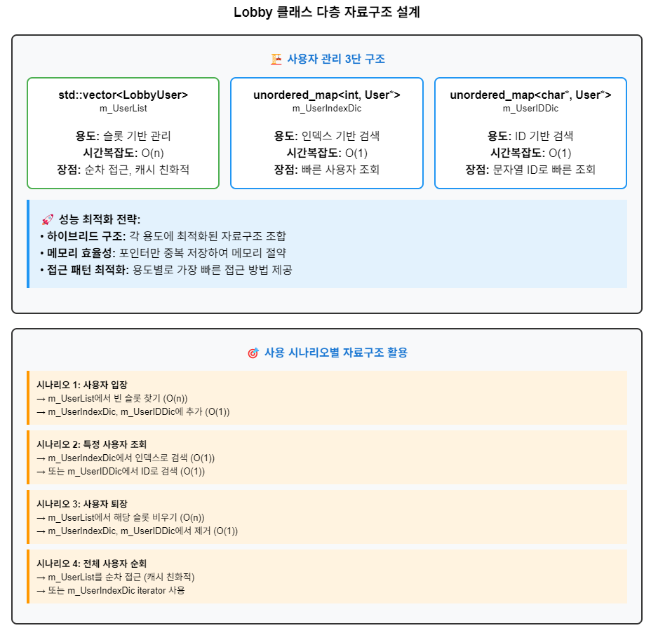    

  
###### 확장성 고려사항  
1. **로비 수 확장**: LobbyManager가 동적으로 로비 추가/제거 가능
2. **방 관리 확장**: 각 로비별로 독립적인 방 관리
3. **사용자 검색 최적화**: 인덱스/ID 기반 O(1) 검색 지원
4. **메모리 효율성**: 포인터 기반 참조로 메모리 사용량 최소화

###### 동시성 고려사항
현재 구현은 단일 스레드를 가정하고 있으나, 멀티스레드 환경으로 확장 시 다음 사항들을 고려해야 합니다:

- **읽기/쓰기 락**: 사용자 목록 수정 시 동기화
- **원자적 연산**: 사용자 상태 변경의 원자성 보장
- **락 프리 자료구조**: 성능 향상을 위한 락 프리 큐 활용

이러한 LobbyManager와 Lobby 클래스의 설계는 대규모 멀티플레이어 게임 서버의 핵심 컴포넌트로서, 효율적인 사용자 관리와 방 시스템을 제공합니다.  

  
#### Room 클래스 구조

```cpp
class Room
{
private:
    short m_Index = -1;                    // 방 인덱스
    bool m_IsUsed = false;                 // 사용 중 여부
    std::wstring m_Title;                  // 방 제목
    std::vector<User*> m_UserList;         // 방 사용자 목록
    Game* m_pGame = nullptr;               // 게임 객체
    
public:
    ERROR_CODE CreateRoom(const wchar_t* pRoomTitle);
    ERROR_CODE EnterUser(User* pUser);
    ERROR_CODE LeaveUser(const short userIndex);
    void NotifyChat(const int sessionIndex, const char* pszUserID, const wchar_t* pszMsg);
};
```
  
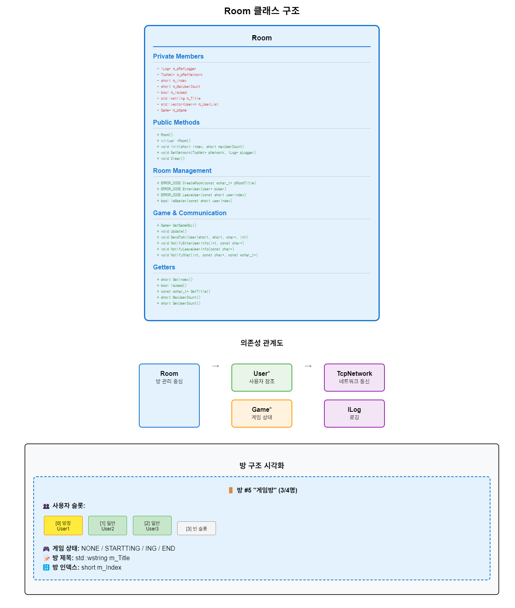   
  

##### 클래스 초기화 및 설정

```cpp
class Room
{
private:
    ILog* m_pRefLogger;                    // 로깅 시스템 참조
    TcpNet* m_pRefNetwork;                 // 네트워크 계층 참조

    short m_Index = -1;                    // 방 인덱스 (로비 내에서 고유)
    short m_MaxUserCount;                  // 최대 수용 인원
    
    bool m_IsUsed = false;                 // 방 사용 중 여부
    std::wstring m_Title;                  // 방 제목 (유니코드 지원)
    std::vector<User*> m_UserList;         // 방에 있는 사용자들 (포인터 저장)

    Game* m_pGame = nullptr;               // 게임 객체 (오목, 가위바위보 등)
};

void Room::Init(const short index, const short maxUserCount)
{
    m_Index = index;
    m_MaxUserCount = maxUserCount;
    
    // 게임 객체 생성
    m_pGame = new Game;
}

void Room::SetNetwork(TcpNet* pNetwork, ILog* pLogger)
{
    m_pRefLogger = pLogger;
    m_pRefNetwork = pNetwork;
}
```

##### 방 생성 및 관리

```cpp
ERROR_CODE Room::CreateRoom(const wchar_t* pRoomTitle)
{
    // 이미 사용 중인 방인지 확인
    if (m_IsUsed) {
        return ERROR_CODE::ROOM_ENTER_CREATE_FAIL;
    }

    // 방 활성화 및 제목 설정
    m_IsUsed = true;
    m_Title = pRoomTitle;

    return ERROR_CODE::NONE;
}

void Room::Clear()
{
    m_IsUsed = false;      // 방 비활성화
    m_Title = L"";         // 제목 초기화
    m_UserList.clear();    // 사용자 목록 초기화 (포인터만 제거, 실제 User 객체는 유지)
}
```

**방 생성 과정:**  
로비에서 빈 방 슬롯 찾기:  LobbyManager가 사용 가능한 Room 객체 탐색  
```
Room* Lobby::CreateRoom() {
    for (auto& room : m_RoomList) {
        if (room->IsUsed() == false) {
            return room;  // 빈 방 반환
        }
    }
    return nullptr;  // 사용 가능한 방이 없음
}
```  
   
    
  
  
##### 사용자 입장/퇴장 관리

```cpp
ERROR_CODE Room::EnterUser(User* pUser)
{
    // 방이 생성되지 않은 상태 확인
    if (m_IsUsed == false) {
        return ERROR_CODE::ROOM_ENTER_NOT_CREATED;
    }

    // 방 정원 확인
    if (m_UserList.size() == m_MaxUserCount) {
        return ERROR_CODE::ROOM_ENTER_MEMBER_FULL;
    }

    // 사용자를 방에 추가
    m_UserList.push_back(pUser);
    return ERROR_CODE::NONE;
}

ERROR_CODE Room::LeaveUser(const short userIndex)
{
    if (m_IsUsed == false) {
        return ERROR_CODE::ROOM_ENTER_NOT_CREATED;
    }

    // 사용자 찾기 및 제거
    auto iter = std::find_if(std::begin(m_UserList), std::end(m_UserList), 
                            [userIndex](auto pUser) { 
                                return pUser->GetIndex() == userIndex; 
                            });
    
    if (iter == std::end(m_UserList)) {
        return ERROR_CODE::ROOM_LEAVE_NOT_MEMBER;
    }
    
    // 사용자 제거
    m_UserList.erase(iter);

    // 방이 비었다면 방 정리
    if (m_UserList.empty()) {
        Clear();
    }

    return ERROR_CODE::NONE;
}

bool Room::IsMaster(const short userIndex)
{
    // 첫 번째 사용자가 방장
    return m_UserList[0]->GetIndex() == userIndex ? true : false;
}
```

**사용자 입장/퇴장 흐름:**  
   
  
  
##### 방 내 통신 시스템

```cpp
// 방의 모든 사용자에게 패킷 전송
void Room::SendToAllUser(const short packetId, const short dataSize, char* pData, const int passUserindex)
{
    for (auto pUser : m_UserList)
    {
        // 특정 사용자 제외 (자신에게는 보내지 않음)
        if (pUser->GetIndex() == passUserindex) {
            continue;
        }

        // 네트워크 계층을 통해 패킷 전송
        m_pRefNetwork->SendData(pUser->GetSessioIndex(), packetId, dataSize, pData);
    }
}

// 새 사용자 입장 알림
void Room::NotifyEnterUserInfo(const int userIndex, const char* pszUserID)
{
    NCommon::PktRoomEnterUserInfoNtf pkt;
    
    // 안전한 문자열 복사 (플랫폼별 처리)
#ifdef _WIN32
    strncpy_s(pkt.UserID, (NCommon::MAX_USER_ID_SIZE+1), pszUserID, NCommon::MAX_USER_ID_SIZE);
#else
    std::strncpy(pkt.UserID, pszUserID, NCommon::MAX_USER_ID_SIZE);
#endif

    // 새로 들어온 사용자를 제외한 모든 사용자에게 알림
    SendToAllUser((short)PACKET_ID::ROOM_ENTER_NEW_USER_NTF, sizeof(pkt), (char*)&pkt, userIndex);
}

// 사용자 퇴장 알림
void Room::NotifyLeaveUserInfo(const char* pszUserID)
{
    if (m_IsUsed == false) {
        return;  // 방이 비활성화된 상태면 알림 불필요
    }

    NCommon::PktRoomLeaveUserInfoNtf pkt;
#ifdef _WIN32
    strncpy_s(pkt.UserID, (NCommon::MAX_USER_ID_SIZE+1), pszUserID, NCommon::MAX_USER_ID_SIZE);
#else
    std::strncpy(pkt.UserID, pszUserID, NCommon::MAX_USER_ID_SIZE);
#endif
    
    // 모든 사용자에게 알림
    SendToAllUser((short)PACKET_ID::ROOM_LEAVE_USER_NTF, sizeof(pkt), (char*)&pkt);
}

// 채팅 메시지 브로드캐스트
void Room::NotifyChat(const int sessionIndex, const char* pszUserID, const wchar_t* pszMsg)
{
    NCommon::PktRoomChatNtf pkt;
    
    // 사용자 ID와 메시지 복사
#ifdef _WIN32
    strncpy_s(pkt.UserID, (NCommon::MAX_USER_ID_SIZE+1), pszUserID, NCommon::MAX_USER_ID_SIZE);
    wcsncpy_s(pkt.Msg, NCommon::MAX_ROOM_CHAT_MSG_SIZE + 1, pszMsg, NCommon::MAX_ROOM_CHAT_MSG_SIZE);
#else
    std::strncpy(pkt.UserID, pszUserID, NCommon::MAX_USER_ID_SIZE);
    std::wcsncpy(pkt.Msg, pszMsg, NCommon::MAX_ROOM_CHAT_MSG_SIZE);
#endif
    
    // 발신자를 제외한 모든 사용자에게 전송
    SendToAllUser((short)PACKET_ID::ROOM_CHAT_NTF, sizeof(pkt), (char*)&pkt, sessionIndex);
}
```

**방 내 통신 시스템 구조:**  
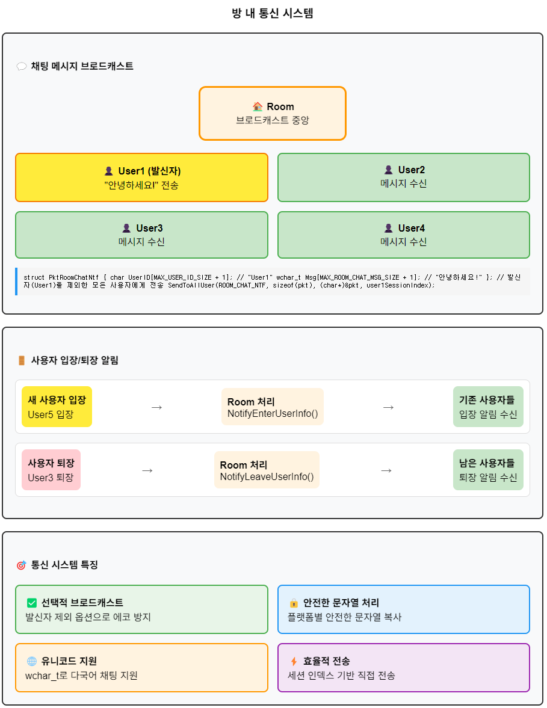  
  

##### 2.5 게임 상태 관리

```cpp
Game* Room::GetGameObj()
{
    return m_pGame;
}

void Room::Update()
{
    // 게임이 진행 중일 때 주기적 업데이트
    if (m_pGame->GetState() == GameState::ING)
    {
        // 게임 시간 제한 체크 (예: 선택 제한 시간)
        if (m_pGame->CheckSelectTime())
        {
            // 시간 초과 시 게임 로직 처리
            // 예: 선택하지 않은 플레이어가 지도록 처리
        }
    }
}
```

##### Room 클래스 설계 특징

###### 책임 분리
Room 클래스는 다음과 같은 명확한 책임을 가집니다:  
    
    

###### 메모리 관리 방식
Room 클래스는 효율적인 메모리 관리를 위해 다음과 같은 전략을 사용합니다:

- **User 포인터 저장**: 실제 User 객체를 복사하지 않고 포인터만 저장
- **Game 객체 소유**: Room이 Game 객체의 생명주기를 직접 관리
- **문자열 최적화**: std::wstring 사용으로 유니코드 지원과 효율성 확보

###### 확장성 고려
현재 구조는 다양한 게임 타입으로 확장할 수 있도록 설계되었습니다:

- **Game 인터페이스**: 다양한 게임 구현체로 교체 가능
- **패킷 시스템**: 새로운 방 기능 추가 시 패킷만 추가하면 됨
- **상태 관리**: GameState enum으로 다양한 게임 진행 상태 지원

이러한 Room 클래스는 멀티플레이어 게임의 핵심 컴포넌트로서, 사용자 간의 상호작용과 게임 진행을 안정적으로 관리하는 역할을 수행합니다.


## 3. 클라이언트 구조 (C#)

### 3.1 메인 폼 구조

```csharp
public partial class mainForm : Form
{
    ClientSimpleTcp Network = new ClientSimpleTcp();                    // TCP 클라이언트
    PacketBufferManager PacketBuffer = new PacketBufferManager();      // 패킷 버퍼 관리
    Queue<PacketData> RecvPacketQueue = new Queue<PacketData>();       // 수신 패킷 큐
    Queue<byte[]> SendPacketQueue = new Queue<byte[]>();               // 송신 패킷 큐
    
    Dictionary<PACKET_ID, Action<byte[]>> PacketFuncDic;               // 패킷 처리 함수 딕셔너리
}
```

### 3.2 네트워크 처리 구조

**멀티 스레드 구조:**  
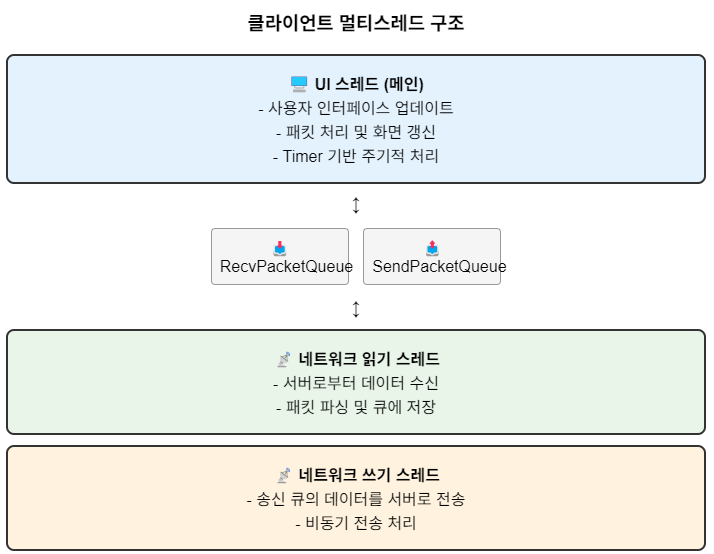    
  
  
### 3.3 패킷 버퍼 관리

```csharp
class PacketBufferManager
{
    int BufferSize = 0;           // 버퍼 크기
    int ReadPos = 0;              // 읽기 위치
    int WritePos = 0;             // 쓰기 위치
    byte[] PacketData;            // 패킷 데이터 버퍼
    
    public bool Write(byte[] data, int pos, int size)
    {
        // 수신된 데이터를 버퍼에 쓰기
        Buffer.BlockCopy(data, pos, PacketData, WritePos, size);
        WritePos += size;
        
        if (NextFree() == false) {
            BufferRelocate();  // 버퍼 정리
        }
        return true;
    }
    
    public ArraySegment<byte> Read()
    {
        // 완성된 패킷이 있는지 확인하고 반환
        var packetDataSize = BitConverter.ToInt16(PacketData, ReadPos);
        if (enableReadSize < packetDataSize) {
            return new ArraySegment<byte>();
        }
        
        var completePacketData = new ArraySegment<byte>(PacketData, ReadPos, packetDataSize);
        ReadPos += packetDataSize;
        return completePacketData;
    }
}
```
  

## 4. 통신 프로토콜 분석

### 4.1 패킷 구조

```cpp
#pragma pack(push, 1)
struct PacketHeader
{
    short TotalSize;    // 전체 패킷 크기 (헤더 + 바디)
    short Id;           // 패킷 ID
    unsigned char Reserve; // 예약 필드
};
#pragma pack(pop)

const int PACKET_HEADER_SIZE = sizeof(PacketHeader); // 5바이트
```

### 4.2 주요 패킷 종류
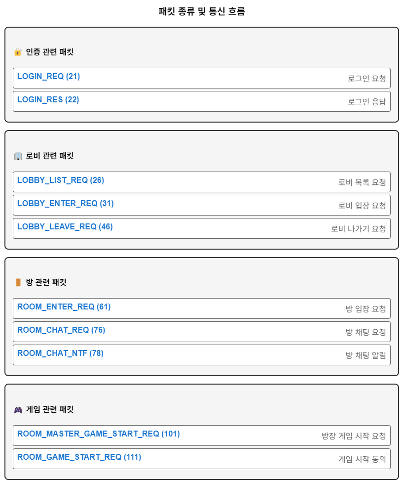    
  
  
### 4.3 통신 시나리오 예제

**로그인 → 로비 입장 → 방 생성 → 채팅 흐름:**  
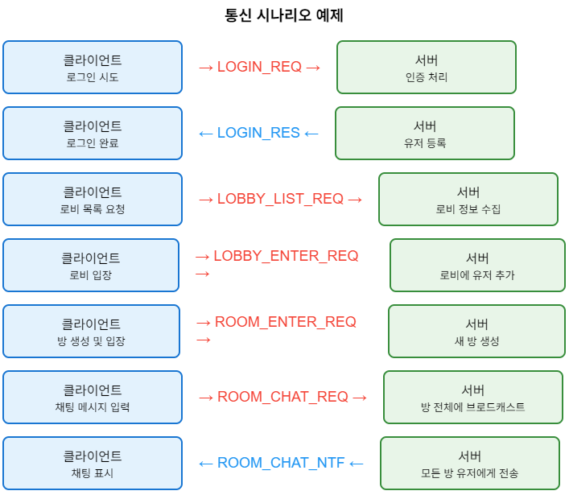    
  
  
## 5. 핵심 기술 개념

### 5.1 Select 모델의 장단점

**장점:**
- 플랫폼 호환성 (Windows/Linux 공통)
- 구현 복잡도가 상대적으로 낮음
- 작은 규모의 서버에 적합

**단점:**
- FD_SETSIZE 제한 (Windows: 64, Linux: 1024)
- O(n) 시간 복잡도
- 대규모 동접자 처리에 한계
  

### 5.2 객체 풀 패턴

```cpp
// 사용자 객체 풀 구현 예제
class UserManager
{
private:
    std::vector<User> m_UserObjPool;        // 미리 할당된 객체들
    std::deque<int> m_UserObjPoolIndex;     // 사용 가능한 인덱스
    
public:
    User* AllocUserObjPoolIndex()
    {
        if (m_UserObjPoolIndex.empty()) return nullptr;
        
        int index = m_UserObjPoolIndex.front();
        m_UserObjPoolIndex.pop_front();
        return &m_UserObjPool[index];
    }
    
    void ReleaseUserObjPoolIndex(const int index)
    {
        m_UserObjPoolIndex.push_back(index);
        m_UserObjPool[index].Clear();
    }
};
```

**객체 풀의 이점:**
- 런타임 메모리 할당/해제 최소화
- 가비지 컬렉션 압박 감소
- 예측 가능한 메모리 사용량

### 5.3 상태 기반 사용자 관리

```cpp
enum class DOMAIN_STATE {
    NONE = 0,    // 연결되지 않음
    LOGIN = 1,   // 로그인 완료
    LOBBY = 2,   // 로비에 있음  
    ROOM = 3,    // 방에 있음
};
```

상태 전이 규칙을 통해 잘못된 요청을 사전에 차단하여 서버 안정성을 높입니다.
  

## 6. 확장 가능성 및 학습 포인트

### 6.1 현재 구조의 한계

1. **동기식 I/O**: select는 동기식이므로 대규모 확장성에 한계
2. **싱글 스레드**: 패킷 처리가 단일 스레드에서 진행
3. **메모리 기반**: 데이터베이스 연동이 없어 영속성 부족

### 6.2 개선 방향

1. **비동기 I/O 모델**: IOCP(Windows), epoll(Linux) 적용
2. **워커 스레드 풀**: 패킷 처리를 멀티스레드로 분산
3. **데이터베이스 연동**: 사용자 정보 영속화
4. **로드 밸런싱**: 다중 서버 구조로 확장

### 6.3 학습 가치

이 프로젝트는 다음과 같은 게임 서버 핵심 개념들을 학습할 수 있습니다:

- **네트워크 프로그래밍**: TCP 소켓, select 모델
- **메모리 관리**: 객체 풀, 버퍼 관리
- **상태 관리**: 사용자 상태, 방 상태
- **패킷 처리**: 직렬화/역직렬화, 프로토콜 설계
- **멀티스레드**: 생산자-소비자 패턴
- **아키텍처 설계**: 계층 분리, 모듈화


