# 게임 서버 개발자가 알아야할 TCP/IP Windows 소켓 프로그래밍

저자: 최흥배, Claude AI  

- C++23
- Windows 11
- Visual Studio 2022 이상
  

-----  
# Chapter 01. 네트워크와 소켓 프로그래밍
  
## 01. TCP/IP 프로토콜 개요
TCP/IP(Transmission Control Protocol/Internet Protocol)는 인터넷에서 데이터를 주고받는 데 사용되는 표준 프로토콜 집합입니다. 이 프로토콜은 네트워크에서 데이터가 어떻게 패킷으로 나뉘고, 주소가 지정되고, 전송되고, 라우팅되며, 수신되는지에 대한 규칙을 정의합니다.

### TCP/IP 계층 구조
1. **네트워크 액세스 계층**: 이더넷, Wi-Fi 등 물리적 연결을 담당
2. **인터넷 계층**: IP 프로토콜이 여기에 속하며 패킷 라우팅과 주소 지정 담당
3. **전송 계층**:
   - **TCP**: 연결 지향적 프로토콜로 데이터 전송의 신뢰성 보장
   - **UDP**: 비연결성 프로토콜로 신뢰성보다 속도가 중요한 경우 사용
4. **응용 계층**: HTTP, FTP, SMTP 등 응용 프로그램에 서비스 제공
  
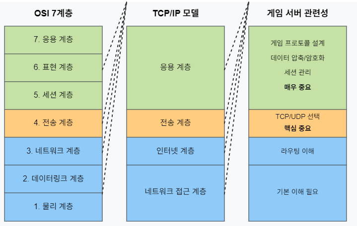  
    
  
### 게임 서버 개발 시 고려사항
온라인 게임 서버에서는 보통 TCP와 UDP를 모두 활용합니다. **로그인, 캐릭터 정보, 게임 상태 동기화 등 신뢰성이 중요한 데이터는 TCP**를, **실시간 위치 업데이트나 음성 채팅 등 지연 시간이 중요한 데이터는 UDP**를 사용합니다.
  

## 02. 소켓의 개념  
소켓은 네트워크 통신의 기본 요소로, 두 프로그램이 네트워크를 통해 데이터를 주고받을 수 있게 해주는 양방향 통신 엔드포인트다. 마치 전화기가 두 사람을 연결해주는 것처럼, 소켓은 두 프로그램을 연결해준다.  
  
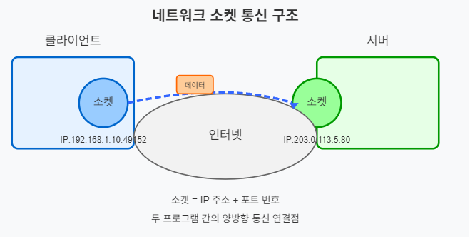    

1. 통신 엔드포인트: 소켓은 네트워크 상의 두 프로그램을 연결하는 끝점이다.
2. 식별자: 각 소켓은 IP 주소와 포트 번호의 조합으로 고유하게 식별된다.
  소켓 = IP 주소 + 포트 번호
3. 소켓 타입:
    - TCP 소켓 (스트림 소켓): 연결 지향적, 신뢰성 있는 데이터 전송
    - UDP 소켓 (데이터그램 소켓): 비연결성, 빠르지만 신뢰성 낮음
4. 클라이언트-서버 모델:
    - 서버 소켓: 특정 포트에서 연결 요청을 대기(listen)
    - 클라이언트 소켓: 서버에 연결 요청을 보냄
  
    
### 소켓의 기본 요소
- **소켓 주소**: IP 주소와 포트 번호의 조합으로 네트워크에서 특정 프로세스를 식별
- **소켓 API**: 운영체제가 제공하는 네트워크 프로그래밍 인터페이스
   

### 소켓의 유형
1. **스트림 소켓(SOCK_STREAM)**: TCP 프로토콜 기반, 연결 지향적, 데이터 신뢰성 보장
2. **데이터그램 소켓(SOCK_DGRAM)**: UDP 프로토콜 기반, 비연결성, 빠른 전송 속도
3. **로우 소켓(SOCK_RAW)**: 하위 수준 프로토콜에 직접 접근 가능
  

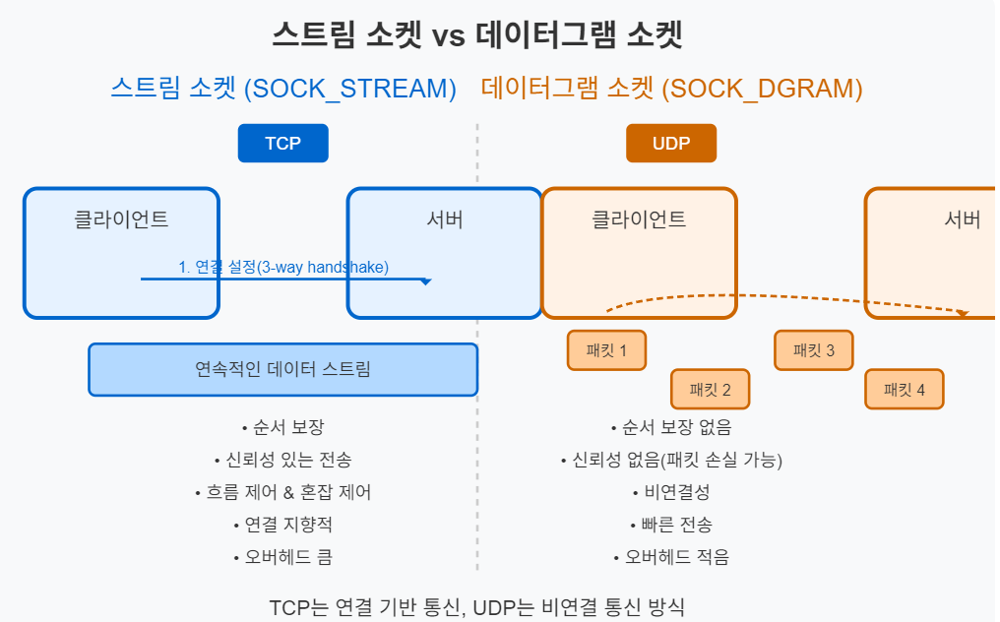     
스트림 소켓과 데이터그램 소켓의 주요 차이점은 다음과 같다:

#### 스트림 소켓 (SOCK_STREAM)
- **프로토콜**: TCP(Transmission Control Protocol) 사용
- **특징**:
  - 연결 지향적 (Connection-oriented)
  - 3-way handshake로 연결 설정
  - 데이터 전송 순서 보장
  - 신뢰성 있는 전송 (패킷 손실 시 재전송)
  - 흐름 제어와 혼잡 제어 제공
  - 바이트 스트림 형태로 데이터 전송

- **적합한 용도**:
  - 파일 전송
  - 웹 브라우징 (HTTP)
  - 이메일 (SMTP)
  - 원격 로그인 (SSH)
  
  
#### 데이터그램 소켓 (SOCK_DGRAM)
- **프로토콜**: UDP(User Datagram Protocol) 사용
- **특징**:
  - 비연결성 (Connectionless)
  - 연결 설정 없이 바로 데이터 전송
  - 데이터 순서 보장 없음
  - 신뢰성 없음 (패킷 손실 가능)
  - 흐름 제어나 혼잡 제어 없음
  - 개별 패킷 단위로 데이터 전송

- **적합한 용도**:
  - 실시간 스트리밍 (비디오, 오디오)
  - 온라인 게임
  - DNS 조회
  - IoT 센서 데이터
  
  
두 소켓 타입의 선택은 응용 프로그램의 요구사항에 따라 달라진다. 데이터 신뢰성이 중요하면 TCP 스트림 소켓을, 속도와 낮은 지연시간이 중요하면 UDP 데이터그램 소켓을 선택한다.  
    
Windows에서는 Winsock(Windows Socket) API를 사용하여 소켓 프로그래밍을 구현합니다.
  

## 03. 소켓의 특징과 구조

### 소켓의 주요 특징
1. **양방향 통신**: 데이터 송수신 모두 가능
2. **프로토콜 독립성**: 다양한 프로토콜에 대해 일관된 인터페이스 제공
3. **다중 연결 처리**: 서버 소켓은 여러 클라이언트 연결 처리 가능
4. **비동기 통신 지원**: 논블로킹 모드와 비동기 I/O 모델 지원
  
### 소켓의 구조
Windows에서 소켓은 `SOCKET` 데이터 타입으로 표현되며, 내부적으로 네트워크 리소스에 대한 핸들입니다. 소켓 주소는 다음과 같은 구조체로 표현됩니다:

```cpp
// IPv4 소켓 주소 구조체
struct sockaddr_in {
    short sin_family;           // 주소 체계 (AF_INET)
    unsigned short sin_port;    // 포트 번호
    struct in_addr sin_addr;    // IP 주소
    char sin_zero[8];           // 패딩
};

// IPv6 소켓 주소 구조체
struct sockaddr_in6 {
    short sin6_family;          // 주소 체계 (AF_INET6)
    unsigned short sin6_port;   // 포트 번호
    unsigned long sin6_flowinfo; // 흐름 정보
    struct in6_addr sin6_addr;  // IPv6 주소
    unsigned long sin6_scope_id; // 범위 ID
};
```
  

### Winsock 초기화
Windows에서 소켓 프로그래밍을 시작하기 전에 WSAStartup 함수를 호출하여 Winsock을 초기화해야 합니다:

```cpp
WSADATA wsaData;
if (WSAStartup(MAKEWORD(2, 2), &wsaData) != 0) {
    // 초기화 실패 처리
}

// 소켓 프로그래밍 코드...

WSACleanup(); // 프로그램 종료 시 정리
```
  

## 04. 소켓 프로그램 맛보기
이제 C++23 표준을 사용한 간단한 TCP 클라이언트-서버 프로그램 예제를 살펴보겠습니다.  

### TCP 서버 예제:
codes/tcp_server_01 디렉토리  
```cpp
#include <iostream>
#include <string>
#include <format>
#include <WinSock2.h>
#include <WS2tcpip.h>

#pragma comment(lib, "ws2_32.lib")

using namespace std;

int main() {
    // Winsock 초기화
    WSADATA wsaData;
    if (WSAStartup(MAKEWORD(2, 2), &wsaData) != 0) {
        cerr << "WSAStartup 실패" << endl;
        return 1;
    }

    // 소켓 생성
    SOCKET serverSocket = socket(AF_INET, SOCK_STREAM, IPPROTO_TCP);
    if (serverSocket == INVALID_SOCKET) {
        cerr << "소켓 생성 실패: " << WSAGetLastError() << endl;
        WSACleanup();
        return 1;
    }

    // 소켓 주소 설정
    sockaddr_in serverAddr;
    serverAddr.sin_family = AF_INET;
    serverAddr.sin_addr.s_addr = htonl(INADDR_ANY); // 모든 IP 주소 수신
    serverAddr.sin_port = htons(12345); // 포트 12345 사용

    // 소켓 바인딩
    if (bind(serverSocket, reinterpret_cast<sockaddr*>(&serverAddr), sizeof(serverAddr)) == SOCKET_ERROR) {
        cerr << "바인딩 실패: " << WSAGetLastError() << endl;
        closesocket(serverSocket);
        WSACleanup();
        return 1;
    }

    // 리스닝 상태로 전환
    if (listen(serverSocket, SOMAXCONN) == SOCKET_ERROR) {
        cerr << "리스닝 실패: " << WSAGetLastError() << endl;
        closesocket(serverSocket);
        WSACleanup();
        return 1;
    }

    cout << "서버가 시작되었습니다. 클라이언트를 기다리는 중..." << endl;

    // 클라이언트 연결 수락
    sockaddr_in clientAddr;
    int clientAddrSize = sizeof(clientAddr);
    SOCKET clientSocket = accept(serverSocket, reinterpret_cast<sockaddr*>(&clientAddr), &clientAddrSize);
    
    if (clientSocket == INVALID_SOCKET) {
        cerr << "클라이언트 연결 수락 실패: " << WSAGetLastError() << endl;
        closesocket(serverSocket);
        WSACleanup();
        return 1;
    }

    // 클라이언트 IP 출력
    char clientIP[INET_ADDRSTRLEN];
    inet_ntop(AF_INET, &clientAddr.sin_addr, clientIP, INET_ADDRSTRLEN);
    cout << format("클라이언트 연결됨: {}:{}\n", clientIP, ntohs(clientAddr.sin_port));

    // 데이터 수신 및 응답
    const int bufferSize = 1024;
    char buffer[bufferSize];
    
    while (true) {
        // 데이터 수신
        int bytesReceived = recv(clientSocket, buffer, bufferSize, 0);
        if (bytesReceived <= 0) {
            if (bytesReceived == 0) {
                cout << "클라이언트 연결 종료" << endl;
            } else {
                cerr << "수신 실패: " << WSAGetLastError() << endl;
            }
            break;
        }

        // 수신된 데이터 처리
        buffer[bytesReceived] = '\0';
        cout << format("클라이언트로부터 수신: {}\n", buffer);

        // 응답 전송
        string response = "메시지 수신 완료: ";
        response += buffer;
        
        if (send(clientSocket, response.c_str(), response.length(), 0) == SOCKET_ERROR) {
            cerr << "전송 실패: " << WSAGetLastError() << endl;
            break;
        }
    }

    // 소켓 닫기
    closesocket(clientSocket);
    closesocket(serverSocket);
    WSACleanup();
    
    return 0;
}
```
  
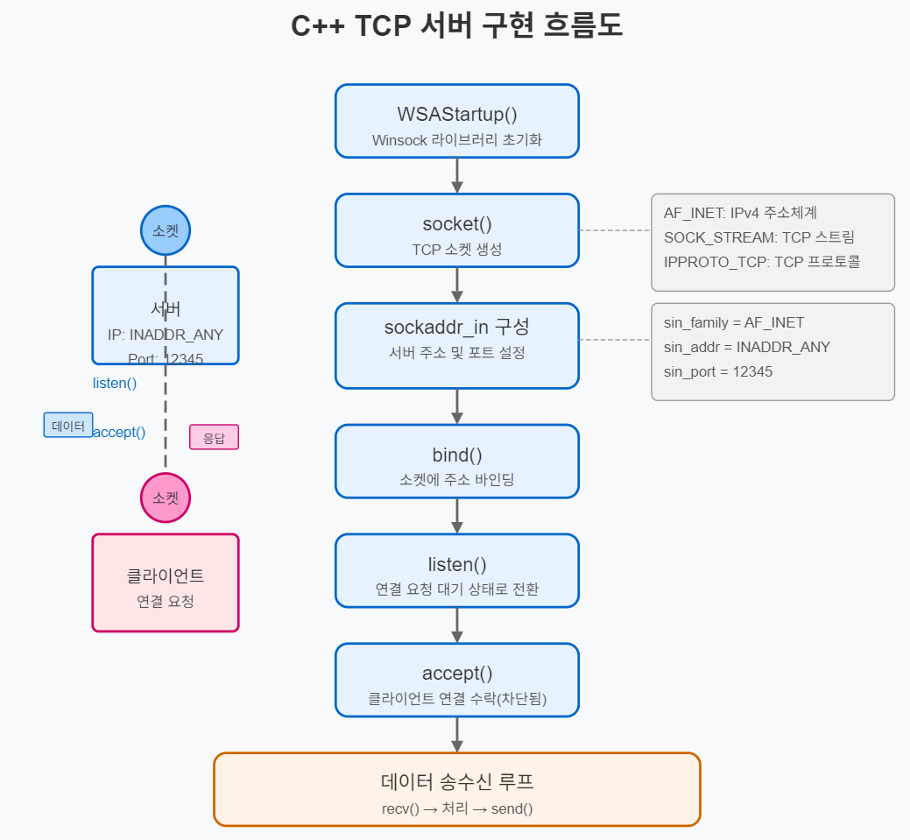  
  

### TCP 클라이언트 예제:  
codes/tcp_client_01 디렉토리  

```cpp
#include <iostream>
#include <string>
#include <format>
#include <WinSock2.h>
#include <WS2tcpip.h>

#pragma comment(lib, "ws2_32.lib")

using namespace std;

int main() {
    // Winsock 초기화
    WSADATA wsaData;
    if (WSAStartup(MAKEWORD(2, 2), &wsaData) != 0) {
        cerr << "WSAStartup 실패" << endl;
        return 1;
    }

    // 소켓 생성
    SOCKET clientSocket = socket(AF_INET, SOCK_STREAM, IPPROTO_TCP);
    if (clientSocket == INVALID_SOCKET) {
        cerr << "소켓 생성 실패: " << WSAGetLastError() << endl;
        WSACleanup();
        return 1;
    }

    // 서버 주소 설정
    sockaddr_in serverAddr;
    serverAddr.sin_family = AF_INET;
    serverAddr.sin_port = htons(12345); // 서버와 동일한 포트 사용
    
    // 서버 IP 주소 설정 (이 예제에서는 로컬호스트)
    if (inet_pton(AF_INET, "127.0.0.1", &serverAddr.sin_addr) <= 0) {
        cerr << "잘못된 서버 주소" << endl;
        closesocket(clientSocket);
        WSACleanup();
        return 1;
    }

    // 서버에 연결
    if (connect(clientSocket, reinterpret_cast<sockaddr*>(&serverAddr), sizeof(serverAddr)) == SOCKET_ERROR) {
        cerr << "서버 연결 실패: " << WSAGetLastError() << endl;
        closesocket(clientSocket);
        WSACleanup();
        return 1;
    }

    cout << "서버에 연결되었습니다." << endl;

    // 메시지 송수신
    const int bufferSize = 1024;
    char buffer[bufferSize];
    string message;

    while (true) {
        // 사용자로부터 메시지 입력 받기
        cout << "서버로 보낼 메시지 (종료하려면 'exit' 입력): ";
        getline(cin, message);

        if (message == "exit") {
            break;
        }

        // 메시지 전송
        if (send(clientSocket, message.c_str(), message.length(), 0) == SOCKET_ERROR) {
            cerr << "전송 실패: " << WSAGetLastError() << endl;
            break;
        }

        // 응답 수신
        int bytesReceived = recv(clientSocket, buffer, bufferSize, 0);
        if (bytesReceived <= 0) {
            if (bytesReceived == 0) {
                cout << "서버 연결 종료" << endl;
            } else {
                cerr << "수신 실패: " << WSAGetLastError() << endl;
            }
            break;
        }

        // 수신된 응답 처리
        buffer[bytesReceived] = '\0';
        cout << format("서버로부터 응답: {}\n", buffer);
    }

    // 소켓 닫기
    closesocket(clientSocket);
    WSACleanup();

    return 0;
}
```
  
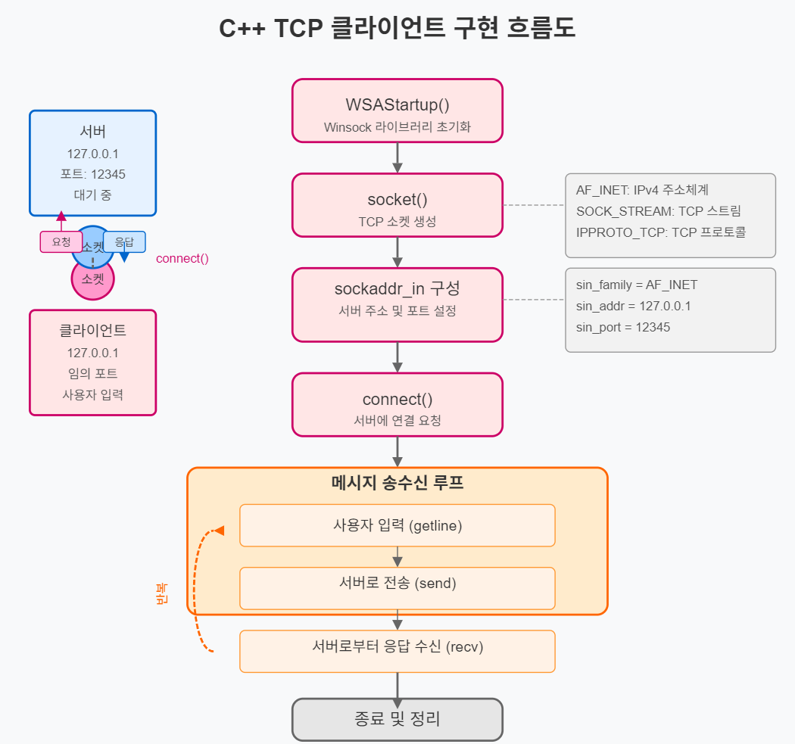  
 

### 소켓 프로그래밍의 핵심 단계
1. **초기화**: Winsock 라이브러리 초기화 (WSAStartup)
2. **소켓 생성**: socket() 함수로 소켓 생성
3. **서버 측**:
   - 바인딩(bind): 소켓을 특정 주소와 포트에 바인딩
   - 리스닝(listen): 연결 요청 대기 상태로 전환
   - 수락(accept): 클라이언트 연결 요청 수락
4. **클라이언트 측**:
   - 연결(connect): 서버에 연결 요청
5. **데이터 송수신**: send(), recv() 함수 사용
6. **정리**: 소켓 닫기(closesocket), Winsock 정리(WSACleanup)
  

### 게임 서버 개발을 위한 추가 고려사항
1. **비동기 소켓 프로그래밍**: 실제 게임 서버에서는 대부분 비동기 방식을 사용합니다. Windows에서는 WSAEventSelect, WSAAsyncSelect, Overlapped I/O, I/O Completion Port(IOCP) 등의 메커니즘을 제공합니다.

2. **멀티스레딩**: 고성능 서버는 다중 스레드를 활용하여 여러 작업을 동시에 처리합니다. C++23의 std::thread, std::mutex 등을 사용하여 구현할 수 있습니다.

3. **오류 처리**: 네트워크 프로그래밍에서는 다양한 예외 상황이 발생할 수 있으므로 적절한 오류 처리가 중요합니다.

4. **패킷 설계**: 효율적인 데이터 직렬화/역직렬화 방법과 패킷 구조 설계가 필요합니다.

5. **보안**: 온라인 게임 서버는 보안에 특히 주의해야 합니다. SSL/TLS를 이용한 암호화, 패킷 인증 등의 기술을 적용해야 할 수 있습니다.

이러한 기본 개념들을 이해하고 실습하면서, 점진적으로 더 복잡한 게임 서버 구조와 최적화 기법들을 학습해 나가시기 바랍니다.   

 <br>      
   

# Chapter 02. 소켓 시작하기

## 01 오류 처리
Windows 소켓 프로그래밍에서 오류 처리는 안정적인 네트워크 애플리케이션 개발에 필수적인 요소입니다. 특히 온라인 게임 서버와 같이 장시간 실행되며 많은 클라이언트를 처리해야 하는 환경에서는 더욱 중요합니다.

### Winsock 오류 코드 시스템
Winsock API는 함수 호출이 실패할 경우 대부분 `SOCKET_ERROR`(-1) 또는 `INVALID_SOCKET`을 반환합니다. 구체적인 오류 정보는 `WSAGetLastError()` 함수를 통해 확인할 수 있습니다.

```cpp
int result = bind(serverSocket, ...);
if (result == SOCKET_ERROR) {
    int errorCode = WSAGetLastError();
    // 오류 처리
}
```

### 주요 Winsock 오류 코드
게임 서버 개발 시 자주 접하게 될 주요 오류 코드들입니다:

| 오류 코드 | 설명 | 대응 방법 |
|-----------|------|-----------|
| WSAEWOULDBLOCK | 비블로킹 소켓 작업이 즉시 완료될 수 없음 | 비동기 작업 상태로 처리 |
| WSAECONNRESET | 원격 호스트가 강제로 연결 종료 | 클라이언트 연결 정리 및 리소스 해제 |
| WSAETIMEDOUT | 연결 시도 시간 초과 | 재시도 또는 사용자에게 알림 |
| WSAEADDRINUSE | 이미 사용 중인 주소 | 다른 포트 사용 또는 SO_REUSEADDR 옵션 설정 |
| WSAHOST_NOT_FOUND | 호스트를 찾을 수 없음 | DNS 설정 확인 |
  

### C++23을 활용한 오류 처리 패턴
C++23에서는 오류 처리를 위한 새로운 기능들이 추가되었습니다. 특히 `std::expected`를 활용하면 더 명확한 오류 처리가 가능합니다:

```cpp
#include <expected>
#include <string>
#include <format>
#include <WinSock2.h>

// 소켓 작업 결과를 나타내는 타입
using SocketResult = std::expected<SOCKET, int>;

// 소켓 생성 함수
SocketResult createSocket(int family, int type, int protocol) {
    SOCKET sock = socket(family, type, protocol);
    if (sock == INVALID_SOCKET) {
        return std::unexpected(WSAGetLastError());
    }
    return sock;
}

// 사용 예시
void useSocket() {
    auto result = createSocket(AF_INET, SOCK_STREAM, IPPROTO_TCP);
    if (result) {
        SOCKET sock = *result;
        // 소켓 사용
        closesocket(sock);
    } else {
        int errorCode = result.error();
        std::string errorMsg = std::format("소켓 생성 실패: 오류 코드 {}", errorCode);
        // 오류 로깅 또는 처리
    }
}
```
  

### 게임 서버에서의 오류 처리 전략
온라인 게임 서버에서는 오류 처리가 특히 중요합니다. 몇 가지 핵심 전략을 소개합니다:

1. **세분화된 로깅**: 오류 발생 시 상세 정보(시간, 소켓 정보, 이벤트 컨텍스트 등)를 로그에 기록

2. **장애 복구 메커니즘**: 중요한 소켓 작업 실패 시 자동 재시도 로직 구현

3. **그레이스풀 디그레이드(Graceful Degradation)**: 일부 기능에 장애가 발생해도 핵심 기능은 계속 작동하도록 설계

4. **클라이언트 통보**: 심각한 문제 발생 시 클라이언트에게 적절히 알림 (연결 재시도 유도, 정보 메시지 등)

```cpp
// 게임 서버에서의 오류 처리 예시
void handleNetworkError(int errorCode, const std::string& operation, SOCKET sock) {
    std::string message;
    bool isFatal = false;
    
    switch (errorCode) {
        case WSAECONNRESET:
            message = "클라이언트가 연결을 강제 종료했습니다.";
            // 클라이언트 정리 로직
            break;
            
        case WSAEWOULDBLOCK:
            // 비블로킹 작업에서는 정상적인 상황일 수 있음
            return;
            
        case WSAENETDOWN:
            message = "네트워크 시스템 장애가 발생했습니다.";
            isFatal = true;
            break;
            
        default:
            message = std::format("알 수 없는 네트워크 오류: {}", errorCode);
            break;
    }
    
    // 로그 기록
    Logger::log(isFatal ? LogLevel::ERROR : LogLevel::WARNING, 
               std::format("소켓 {}: {} 작업 중 오류 발생 - {}", 
                          sock, operation, message));
    
    if (isFatal) {
        // 심각한 오류 발생 시 추가 처리
        notifyAdministrator(message);
        initiateRecoveryProcedure();
    }
}
```
  

## 02 소켓 초기화와 종료
Windows에서 소켓 프로그래밍을 시작하기 전에는 Winsock 라이브러리를 초기화해야 하며, 프로그램 종료 시에는 정리 작업이 필요합니다.
  
### WSAStartup 함수
Winsock 라이브러리 초기화를 위해 `WSAStartup` 함수를 호출합니다:

```cpp
int WSAStartup(WORD wVersionRequested, LPWSADATA lpWSAData);
```

- **wVersionRequested**: 요청할 Winsock 버전 (일반적으로 2.2 버전 사용)
- **lpWSAData**: WSADATA 구조체 포인터
 

### WSADATA 구조체
`WSADATA` 구조체는 Winsock 구현에 대한 정보를 포함합니다:

```cpp
typedef struct WSAData {
    WORD           wVersion;       // 사용 중인 Winsock 버전
    WORD           wHighVersion;   // 지원되는 최상위 버전
    unsigned short iMaxSockets;    // 최대 소켓 수(deprecated)
    unsigned short iMaxUdpDg;      // 최대 UDP 데이터그램 크기(deprecated)
    char FAR       *lpVendorInfo;  // 벤더 정보(deprecated)
    char           szDescription[WSADESCRIPTION_LEN+1]; // 설명
    char           szSystemStatus[WSASYS_STATUS_LEN+1]; // 상태
} WSADATA;
```

실제 사용 시에는 다음과 같이 초기화합니다:

```cpp
WSADATA wsaData;
int result = WSAStartup(MAKEWORD(2, 2), &wsaData);
if (result != 0) {
    std::cerr << std::format("WSAStartup 실패: 오류 코드 {}\n", result);
    return 1;
}

// 요청한 버전 지원 여부 확인
if (LOBYTE(wsaData.wVersion) != 2 || HIBYTE(wsaData.wVersion) != 2) {
    std::cerr << "요청한 Winsock 버전 2.2를 사용할 수 없습니다.\n";
    WSACleanup();
    return 1;
}

std::cout << std::format("Winsock 초기화 성공: {}\n", wsaData.szDescription);
```

### WSACleanup 함수
프로그램 종료 시 Winsock을 정리하기 위해 `WSACleanup` 함수를 호출합니다:  

```cpp
int WSACleanup(void);
```

이 함수는 애플리케이션의 Winsock 사용을 종료하고, 관련 리소스를 해제합니다. 모든 소켓을 닫고 Winsock 작업을 완료한 후에 호출해야 합니다.
  

### RAII를 활용한 안전한 초기화 및 종료
C++에서는 RAII(Resource Acquisition Is Initialization) 패턴을 사용하여 Winsock의 초기화와 종료를 안전하게 관리할 수 있습니다:
  
```cpp
class WinsockInit {
public:
    WinsockInit() {
        result = WSAStartup(MAKEWORD(2, 2), &wsaData);
        if (result != 0) {
            throw std::runtime_error(
                std::format("WSAStartup 실패: 오류 코드 {}", result));
        }
    }
    
    ~WinsockInit() {
        if (result == 0) {
            WSACleanup();
        }
    }
    
    bool isInitialized() const { return result == 0; }
    
    const WSADATA& getData() const { return wsaData; }
    
private:
    WSADATA wsaData;
    int result;
};

// 사용 예시
int main() {
    try {
        WinsockInit winsock;
        // 소켓 프로그래밍 코드
    }
    catch (const std::exception& e) {
        std::cerr << "오류 발생: " << e.what() << std::endl;
        return 1;
    }
    return 0;
}
```

이 패턴을 사용하면 예외가 발생하더라도 Winsock 리소스가 자동으로 정리됩니다.
  

### 게임 서버에서의 초기화 고려사항
대규모 온라인 게임 서버에서는 Winsock 초기화 시 다음 사항을 고려해야 합니다:

1. **버전 호환성**: 서버 배포 환경에 따라 지원되는 Winsock 버전이 다를 수 있으므로 적절한 버전 확인 필요

2. **스레드 안전성**: 멀티스레드 환경에서는 WSAStartup과 WSACleanup의 호출 타이밍 주의

3. **초기화 검증**: 성공적으로 초기화되었는지 확인하고, 실패 시 적절한 오류 처리

4. **정상 종료**: 게임 서버 종료 시 모든 연결을 정상적으로 종료하고 Winsock 정리
  

## 03 소켓 생성과 닫기
소켓은 네트워크 통신의 기본 단위로, 적절히 생성하고 관리해야 합니다. 여기서는 소켓 생성과 닫기에 대한 상세 내용을 다룹니다.
  
### socket 함수
소켓을 생성하기 위해 `socket` 함수를 사용합니다:

```cpp
SOCKET socket(int af, int type, int protocol);
```

매개변수:
- **af**: 주소 체계(Address Family) - AF_INET(IPv4), AF_INET6(IPv6)
- **type**: 소켓 유형 - SOCK_STREAM(TCP), SOCK_DGRAM(UDP)
- **protocol**: 프로토콜 - IPPROTO_TCP, IPPROTO_UDP

반환값:
- 성공: 소켓 핸들
- 실패: INVALID_SOCKET
  

### 주요 소켓 유형 선택
게임 서버에서 주로 사용하는 소켓 유형:
  
1. **TCP 소켓 (SOCK_STREAM)**
   - 연결 지향적, 신뢰성 있는 데이터 전송
   - 사용 사례: 로그인, 게임 상태 변경, 중요 게임 데이터

   ```cpp
   SOCKET tcpSocket = socket(AF_INET, SOCK_STREAM, IPPROTO_TCP);
   ```

2. **UDP 소켓 (SOCK_DGRAM)**
   - 비연결성, 빠른 데이터 전송, 신뢰성 낮음
   - 사용 사례: 캐릭터 위치 업데이트, 음성 채팅

   ```cpp
   SOCKET udpSocket = socket(AF_INET, SOCK_DGRAM, IPPROTO_UDP);
   ```

3. **IPv6 지원 소켓**
   - 최신 네트워크 환경에서는 IPv6 지원이 중요

   ```cpp
   SOCKET ipv6Socket = socket(AF_INET6, SOCK_STREAM, IPPROTO_TCP);
   ```
  

### closesocket 함수
소켓 사용을 마친 후에는 `closesocket` 함수로 소켓을 닫아 리소스를 해제해야 합니다:

```cpp
int closesocket(SOCKET s);
```

성공 시 0을 반환하고, 실패 시 SOCKET_ERROR를 반환합니다.
  

### 소켓 옵션 설정
소켓 생성 후 특정 옵션을 설정하여 동작을 제어할 수 있습니다:

```cpp
int setsockopt(SOCKET s, int level, int optname, const char* optval, int optlen);
```

게임 서버에서 유용한 소켓 옵션들:

1. **SO_REUSEADDR**: 소켓 주소 재사용 허용
   ```cpp
   int reuse = 1;
   setsockopt(serverSocket, SOL_SOCKET, SO_REUSEADDR, 
              reinterpret_cast<const char*>(&reuse), sizeof(reuse));
   ```

2. **TCP_NODELAY**: Nagle 알고리즘 비활성화 (지연 감소)
   ```cpp
   int noDelay = 1;
   setsockopt(gameSocket, IPPROTO_TCP, TCP_NODELAY, 
              reinterpret_cast<const char*>(&noDelay), sizeof(noDelay));
   ```

3. **SO_RCVTIMEO/SO_SNDTIMEO**: 수신/송신 타임아웃 설정
   ```cpp
   DWORD timeout = 5000; // 5초
   setsockopt(socket, SOL_SOCKET, SO_RCVTIMEO, 
              reinterpret_cast<const char*>(&timeout), sizeof(timeout));
   ```

4. **SO_SNDBUF/SO_RCVBUF**: 송신/수신 버퍼 크기 설정
   ```cpp
   int bufSize = 64 * 1024; // 64KB
   setsockopt(socket, SOL_SOCKET, SO_RCVBUF, 
              reinterpret_cast<const char*>(&bufSize), sizeof(bufSize));
   ```
  

### 소켓 모드 제어
Windows 소켓은 기본적으로 블로킹 모드로 작동하지만, 비블로킹 모드로 변경할 수 있습니다:  

```cpp
// 비블로킹 모드로 설정
u_long mode = 1;  // 1: 비블로킹, 0: 블로킹
if (ioctlsocket(socket, FIONBIO, &mode) == SOCKET_ERROR) {
    // 오류 처리
}
```
  

### C++23을 활용한 소켓 래퍼 클래스
C++23 기능을 활용하여 소켓 관리를 더 안전하게 할 수 있는 래퍼 클래스 예시입니다:  

```cpp
#include <WinSock2.h>
#include <stdexcept>
#include <format>
#include <string>
#include <utility>
#include <iostream>
#include <expected>

class Socket {
public:
    // 소켓 생성
    static std::expected<Socket, int> create(int af, int type, int protocol) {
        SOCKET sock = socket(af, type, protocol);
        if (sock == INVALID_SOCKET) {
            return std::unexpected(WSAGetLastError());
        }
        return Socket(sock);
    }
    
    // 이동 생성자/대입 연산자
    Socket(Socket&& other) noexcept : sock_(std::exchange(other.sock_, INVALID_SOCKET)) {}
    Socket& operator=(Socket&& other) noexcept {
        if (this != &other) {
            close();
            sock_ = std::exchange(other.sock_, INVALID_SOCKET);
        }
        return *this;
    }
    
    // 복사 방지
    Socket(const Socket&) = delete;
    Socket& operator=(const Socket&) = delete;
    
    // 소멸자에서 자동으로 소켓 닫기
    ~Socket() {
        close();
    }
    
    // 소켓 핸들 반환
    SOCKET get() const { return sock_; }
    
    // 소켓 옵션 설정
    template<typename T>
    bool setOption(int level, int optname, const T& value) {
        int result = setsockopt(sock_, level, optname, 
                               reinterpret_cast<const char*>(&value), sizeof(T));
        return result != SOCKET_ERROR;
    }
    
    // 비블로킹 모드 설정
    bool setNonBlocking(bool nonBlocking = true) {
        u_long mode = nonBlocking ? 1 : 0;
        return ioctlsocket(sock_, FIONBIO, &mode) != SOCKET_ERROR;
    }
    
    // 소켓 명시적 닫기
    void close() {
        if (sock_ != INVALID_SOCKET) {
            closesocket(sock_);
            sock_ = INVALID_SOCKET;
        }
    }
    
    // 유효한 소켓인지 확인
    bool isValid() const { return sock_ != INVALID_SOCKET; }

private:
    explicit Socket(SOCKET sock) : sock_(sock) {}
    SOCKET sock_;
};

// 사용 예시
void useSocketClass() {
    auto result = Socket::create(AF_INET, SOCK_STREAM, IPPROTO_TCP);
    if (!result) {
        std::cerr << std::format("소켓 생성 실패: 오류 코드 {}\n", result.error());
        return;
    }
    
    Socket socket = std::move(*result);
    
    // TCP_NODELAY 옵션 설정
    if (!socket.setOption(IPPROTO_TCP, TCP_NODELAY, 1)) {
        std::cerr << "TCP_NODELAY 옵션 설정 실패\n";
    }
    
    // 비블로킹 모드로 설정
    if (!socket.setNonBlocking()) {
        std::cerr << "비블로킹 모드 설정 실패\n";
    }
    
    // 소켓 사용 코드...
    
    // 명시적으로 닫을 필요 없음 (소멸자에서 자동으로 처리)
}
```
  

### 듀얼 IP 스택 지원
최신 게임 서버에서는 IPv4와 IPv6를 모두 지원하는 듀얼 스택 구현이 권장됩니다:

```cpp
// IPv4와 IPv6를 모두 지원하는 소켓 생성
SOCKET createDualStackSocket() {
    // IPv6 소켓 생성
    SOCKET sock = socket(AF_INET6, SOCK_STREAM, IPPROTO_TCP);
    if (sock == INVALID_SOCKET) {
        return INVALID_SOCKET;
    }
    
    // IPv4 매핑 활성화 (듀얼 스택 모드)
    int v6Only = 0;
    if (setsockopt(sock, IPPROTO_IPV6, IPV6_V6ONLY, 
                  reinterpret_cast<const char*>(&v6Only), sizeof(v6Only)) == SOCKET_ERROR) {
        closesocket(sock);
        return INVALID_SOCKET;
    }
    
    return sock;
}
```
  

### 게임 서버에서의 소켓 관리 전략
대규모 게임 서버에서는 효율적인 소켓 관리가 매우 중요합니다:

1. **소켓 풀링**: 자주 생성/소멸되는 소켓의 성능 개선을 위한 풀링 메커니즘 구현

2. **소켓 모니터링**: 활성 소켓의 상태 추적 및 문제 감지

3. **그레이스풀 셧다운**: 연결 종료 시 `shutdown` 함수를 사용하여 정상적인 종료 처리
   ```cpp
   // 정상적인 연결 종료 (송신만 중단)
   shutdown(socket, SD_SEND);
   // 남은 데이터 수신 후 closesocket 호출
   ```

4. **리소스 한계 관리**: 시스템 리소스 제한에 따른 최대 동시 연결 수 조절
 
이러한 기법을 적용하여 안정적이고 확장 가능한 게임 서버를 구축할 수 있습니다.
  

<br>      
     
# Chapter 03. 소켓 주소 구조체 다루기

## 01 소켓 주소 구조체
소켓 프로그래밍에서는 네트워크 주소를 표현하기 위해 다양한 주소 구조체를 사용합니다. 이러한 구조체들은 IP 주소, 포트 번호, 주소 체계 등의 정보를 포함하고 있으며, Windows 소켓 API 함수에 매개변수로 전달됩니다.

### 기본 소켓 주소 구조체 (sockaddr)
모든 소켓 주소 구조체의 기본이 되는 구조체입니다:

```cpp
struct sockaddr {
    ADDRESS_FAMILY sa_family;    // 주소 체계 (AF_INET, AF_INET6 등)
    CHAR sa_data[14];           // 프로토콜별 주소 정보
};
```

이 기본 구조체는 모든 유형의 소켓 주소를 처리할 수 있도록 설계되었지만, 실제로는 거의 직접 사용하지 않고 프로토콜별 구조체를 사용한 후 필요할 때 형변환합니다.

### IPv4 소켓 주소 구조체 (sockaddr_in)
IPv4 주소 체계에서 사용하는 구조체입니다:

```cpp
struct sockaddr_in {
    ADDRESS_FAMILY sin_family;    // AF_INET
    USHORT sin_port;             // 포트 번호 (네트워크 바이트 순서)
    IN_ADDR sin_addr;            // IPv4 주소
    CHAR sin_zero[8];            // 패딩 (0으로 채움)
};

struct in_addr {
    union {
        struct {
            UCHAR s_b1, s_b2, s_b3, s_b4;  // IPv4 주소 각 바이트
        } S_un_b;
        struct {
            USHORT s_w1, s_w2;  // IPv4 주소를 두 개의 USHORT로 표현
        } S_un_w;
        ULONG S_addr;  // IPv4 주소 32비트 값 (네트워크 바이트 순서)
    } S_un;
};
```

일반적으로 `in_addr` 구조체의 `S_un.S_addr` 필드를 통해 IPv4 주소를 32비트 정수로 처리합니다.

### IPv6 소켓 주소 구조체 (sockaddr_in6)
IPv6 주소 체계에서 사용하는 구조체입니다:

```cpp
struct sockaddr_in6 {
    ADDRESS_FAMILY sin6_family;   // AF_INET6
    USHORT sin6_port;            // 포트 번호 (네트워크 바이트 순서)
    ULONG sin6_flowinfo;         // 흐름 정보
    IN6_ADDR sin6_addr;          // IPv6 주소
    ULONG sin6_scope_id;         // 범위 ID
};

struct in6_addr {
    union {
        UCHAR Byte[16];          // IPv6 주소 (16바이트)
        USHORT Word[8];          // IPv6 주소 (8개의 USHORT)
    } u;
};
```

### 프로토콜 독립적인 소켓 주소 구조체 (sockaddr_storage)
모든 종류의 소켓 주소를 저장할 수 있는 충분히 큰 구조체로, IPv4와 IPv6 모두 처리 가능합니다:

```cpp
struct sockaddr_storage {
    ADDRESS_FAMILY ss_family;     // 주소 체계 (AF_INET, AF_INET6 등)
    CHAR __ss_pad1[8];           // 정렬을 위한 패딩
    LONGLONG __ss_align;         // 8바이트 정렬을 위한 필드
    CHAR __ss_pad2[112];         // 추가 패딩
};
```

이 구조체는 최신 프로그램에서 권장되며, 특히 IPv6 지원이 필요한 경우에 유용합니다.

### 주소 구조체 사용 예시

```cpp
#include <WinSock2.h>
#include <WS2tcpip.h>
#include <iostream>
#include <format>
#include <span>

// IPv4 주소 구조체 초기화 예시
void initIPv4Address() {
    sockaddr_in serverAddr{};  // C++23의 일관된 초기화 사용
    
    serverAddr.sin_family = AF_INET;  // IPv4 주소 체계
    serverAddr.sin_port = htons(12345);  // 포트 번호 (네트워크 바이트 순서로 변환)
    inet_pton(AF_INET, "192.168.0.1", &serverAddr.sin_addr);  // IP 주소 설정
}

// IPv6 주소 구조체 초기화 예시
void initIPv6Address() {
    sockaddr_in6 serverAddr{};
    
    serverAddr.sin6_family = AF_INET6;  // IPv6 주소 체계
    serverAddr.sin6_port = htons(12345);  // 포트 번호
    serverAddr.sin6_flowinfo = 0;  // 흐름 정보 (일반적으로 0)
    inet_pton(AF_INET6, "2001:db8::1", &serverAddr.sin6_addr);  // IPv6 주소 설정
    serverAddr.sin6_scope_id = 0;  // 범위 ID (일반적으로 0)
}

// 프로토콜 독립적인 프로그래밍 예시
void protocolIndependentExample() {
    sockaddr_storage remoteAddr{};
    int addrLen = sizeof(remoteAddr);
    
    // accept 함수 등에서 사용 예시
    // SOCKET clientSocket = accept(serverSocket, 
    //                      reinterpret_cast<sockaddr*>(&remoteAddr), &addrLen);
    
    // 주소 체계에 따라 처리
    if (remoteAddr.ss_family == AF_INET) {
        // IPv4 주소 처리
        auto* ipv4Addr = reinterpret_cast<sockaddr_in*>(&remoteAddr);
        // ipv4Addr 사용...
    } 
    else if (remoteAddr.ss_family == AF_INET6) {
        // IPv6 주소 처리
        auto* ipv6Addr = reinterpret_cast<sockaddr_in6*>(&remoteAddr);
        // ipv6Addr 사용...
    }
}
```
  

## 02 바이트 정렬 함수
네트워크 프로그래밍에서는 다양한 하드웨어 아키텍처 간의 데이터 교환을 위해 표준화된 바이트 순서를 사용해야 합니다. 여기서 바이트 정렬(Byte Ordering) 함수가 중요한 역할을 합니다.

### 호스트 바이트 순서와 네트워크 바이트 순서
컴퓨터 시스템은 내부적으로 두 가지 방식으로 다중 바이트 값을 저장합니다:

1. **빅 엔디안(Big Endian)**: 가장 중요한(Most Significant) 바이트를 가장 낮은 메모리 주소에 저장
2. **리틀 엔디안(Little Endian)**: 가장 덜 중요한(Least Significant) 바이트를 가장 낮은 메모리 주소에 저장

네트워크 통신에서는 **빅 엔디안** 방식이 표준으로 사용되며, 이를 **네트워크 바이트 순서(Network Byte Order)**라고 합니다. 반면, 호스트 시스템의 내부 표현 방식은 **호스트 바이트 순서(Host Byte Order)**라고 합니다.

### 바이트 정렬 변환 함수
Windows API에서는 다음과 같은 바이트 정렬 함수를 제공합니다:

1. **htons**: Host to Network Short (16비트 값 변환)
2. **ntohs**: Network to Host Short (16비트 값 변환)
3. **htonl**: Host to Network Long (32비트 값 변환)
4. **ntohl**: Network to Host Long (32비트 값 변환)

```cpp
#include <WinSock2.h>
#include <iostream>
#include <format>

void byteOrderExample() {
    // 포트 번호 변환 (16비트)
    u_short hostPort = 12345;
    u_short netPort = htons(hostPort);  // 호스트에서 네트워크 바이트 순서로 변환
    
    std::cout << std::format("호스트 포트: {}, 네트워크 포트: {}\n", 
                            hostPort, netPort);
    
    // IP 주소 변환 (32비트)
    u_long hostAddr = 0x0100007F;  // 127.0.0.1 (호스트 바이트 순서)
    u_long netAddr = htonl(hostAddr);  // 호스트에서 네트워크 바이트 순서로 변환
    
    std::cout << std::format("호스트 주소: 0x{:X}, 네트워크 주소: 0x{:X}\n", 
                            hostAddr, netAddr);
    
    // 네트워크에서 호스트 바이트 순서로 다시 변환
    u_short hostPort2 = ntohs(netPort);
    u_long hostAddr2 = ntohl(netAddr);
    
    std::cout << std::format("변환 후 호스트 포트: {}, 호스트 주소: 0x{:X}\n", 
                            hostPort2, hostAddr2);
}
```

### C++23에서의 바이트 정렬 처리
C++23에서는 `std::byteswap` 함수를 사용하여 바이트 순서를 직접 변환할 수 있습니다:

```cpp
#include <bit>
#include <iostream>
#include <format>

void cppByteswapExample() {
    // 16비트 값 뒤집기 (htons/ntohs 상당)
    std::uint16_t value16 = 0x1234;
    std::uint16_t swapped16 = std::byteswap(value16);
    
    std::cout << std::format("원본 16비트: 0x{:X}, 뒤집힌 16비트: 0x{:X}\n", 
                            value16, swapped16);
    
    // 32비트 값 뒤집기 (htonl/ntohl 상당)
    std::uint32_t value32 = 0x12345678;
    std::uint32_t swapped32 = std::byteswap(value32);
    
    std::cout << std::format("원본 32비트: 0x{:X}, 뒤집힌 32비트: 0x{:X}\n", 
                            value32, swapped32);
}

// 플랫폼 감지를 통한 바이트 정렬 함수 구현
template <typename T>
T toNetworkByteOrder(T value) {
    if constexpr (std::endian::native == std::endian::little) {
        return std::byteswap(value);
    } else {
        return value;
    }
}

template <typename T>
T toHostByteOrder(T value) {
    if constexpr (std::endian::native == std::endian::little) {
        return std::byteswap(value);
    } else {
        return value;
    }
}
```

### 게임 서버에서의 바이트 정렬 활용
게임 서버에서는 패킷 구조체를 정의하고 전송할 때 바이트 정렬에 주의해야 합니다:

```cpp
#include <WinSock2.h>
#include <iostream>
#include <array>
#include <bit>
#include <span>

// 게임 패킷 구조체 예시
struct GamePacket {
    uint16_t packetId;   // 패킷 식별자
    uint16_t packetSize; // 패킷 크기
    uint32_t playerID;   // 플레이어 ID
    float positionX;     // X 좌표
    float positionY;     // Y 좌표
    float positionZ;     // Z 좌표
};

// 패킷을 네트워크 바이트 순서로 직렬화
void serializePacket(const GamePacket& packet, std::span<std::byte> buffer) {
    if (buffer.size() < sizeof(GamePacket)) {
        throw std::runtime_error("버퍼 크기가 충분하지 않습니다.");
    }
    
    auto* dest = reinterpret_cast<GamePacket*>(buffer.data());
    
    // 각 멤버를 네트워크 바이트 순서로 변환
    dest->packetId = htons(packet.packetId);
    dest->packetSize = htons(packet.packetSize);
    dest->playerID = htonl(packet.playerID);
    
    // float 값은 바이트 복사 후 필요시 바이트 순서 변환
    // (주: IEEE 754 float 형식에서 바이트 순서 변환은 복잡할 수 있음)
    std::uint32_t x, y, z;
    std::memcpy(&x, &packet.positionX, sizeof(float));
    std::memcpy(&y, &packet.positionY, sizeof(float));
    std::memcpy(&z, &packet.positionZ, sizeof(float));
    
    x = htonl(x);
    y = htonl(y);
    z = htonl(z);
    
    std::memcpy(&dest->positionX, &x, sizeof(float));
    std::memcpy(&dest->positionY, &y, sizeof(float));
    std::memcpy(&dest->positionZ, &z, sizeof(float));
}

// 네트워크에서 받은 패킷을 호스트 바이트 순서로 역직렬화
GamePacket deserializePacket(std::span<const std::byte> buffer) {
    if (buffer.size() < sizeof(GamePacket)) {
        throw std::runtime_error("버퍼 크기가 충분하지 않습니다.");
    }
    
    const auto* src = reinterpret_cast<const GamePacket*>(buffer.data());
    GamePacket packet;
    
    // 각 멤버를 호스트 바이트 순서로 변환
    packet.packetId = ntohs(src->packetId);
    packet.packetSize = ntohs(src->packetSize);
    packet.playerID = ntohl(src->playerID);
    
    // float 값 변환
    std::uint32_t x, y, z;
    std::memcpy(&x, &src->positionX, sizeof(float));
    std::memcpy(&y, &src->positionY, sizeof(float));
    std::memcpy(&z, &src->positionZ, sizeof(float));
    
    x = ntohl(x);
    y = ntohl(y);
    z = ntohl(z);
    
    std::memcpy(&packet.positionX, &x, sizeof(float));
    std::memcpy(&packet.positionY, &y, sizeof(float));
    std::memcpy(&packet.positionZ, &z, sizeof(float));
    
    return packet;
}
```
  

## 03 IP 주소 변환 함수
네트워크 프로그래밍에서는 IP 주소를 다양한 형식으로 표현하고 변환해야 합니다. Win32 API에서는 문자열 형태의 IP 주소와 바이너리 형태의 IP 주소 간 변환을 위한 여러 함수를 제공합니다.

### 구형 함수 vs. 최신 함수
Windows 네트워크 프로그래밍에서는 IP 주소 변환을 위한 다양한 함수가 있습니다:

1. **구형 함수 (레거시)**: `inet_addr`, `inet_ntoa` 등
2. **최신 함수 (권장)**: `inet_pton`, `inet_ntop` 등

최신 함수들은 IPv6를 지원하고 스레드 안전성이 개선되어 있으므로 새로운 프로그램에서는 이들을 사용하는 것이 좋습니다.

### inet_pton 함수 (문자열 -> 숫자)
문자열 형태의 IP 주소를 네트워크 바이트 순서의 바이너리 형태로 변환합니다:

```cpp
int inet_pton(
    INT Family,           // 주소 체계 (AF_INET, AF_INET6)
    PCSTR pszAddrString,  // 변환할 IP 주소 문자열
    PVOID pAddrBuf        // 변환된 주소를 저장할 버퍼
);
```

### inet_ntop 함수 (숫자 -> 문자열)
바이너리 형태의 IP 주소를 문자열 형태로 변환합니다:

```cpp
PCSTR WSAAPI inet_ntop(
    INT Family,           // 주소 체계 (AF_INET, AF_INET6)
    const VOID *pAddr,    // 변환할 바이너리 주소
    PSTR pStringBuf,      // 변환된 문자열을 저장할 버퍼
    size_t StringBufSize  // 버퍼 크기
);
```

### IP 주소 변환 예제

```cpp
#include <WinSock2.h>
#include <WS2tcpip.h>
#include <iostream>
#include <format>
#include <string>
#include <array>

void ipAddressConversionExample() {
    // IPv4 문자열 주소 -> 바이너리
    in_addr binaryIPv4{};
    const char* ipv4String = "192.168.0.1";
    
    if (inet_pton(AF_INET, ipv4String, &binaryIPv4) != 1) {
        std::cerr << "IPv4 주소 변환 실패\n";
        return;
    }
    
    // 변환된 IPv4 주소 출력 (네트워크 바이트 순서)
    std::cout << std::format("IPv4 바이너리: 0x{:X}\n", binaryIPv4.S_un.S_addr);
    
    // IPv4 바이너리 -> 문자열
    std::array<char, INET_ADDRSTRLEN> ipv4StringBuf{};
    if (inet_ntop(AF_INET, &binaryIPv4, ipv4StringBuf.data(), ipv4StringBuf.size()) == nullptr) {
        std::cerr << "IPv4 주소 문자열 변환 실패\n";
        return;
    }
    
    std::cout << std::format("변환된 IPv4 문자열: {}\n", ipv4StringBuf.data());
    
    // IPv6 문자열 주소 -> 바이너리
    in6_addr binaryIPv6{};
    const char* ipv6String = "2001:db8::1428:57ab";
    
    if (inet_pton(AF_INET6, ipv6String, &binaryIPv6) != 1) {
        std::cerr << "IPv6 주소 변환 실패\n";
        return;
    }
    
    // IPv6 바이너리 -> 문자열
    std::array<char, INET6_ADDRSTRLEN> ipv6StringBuf{};
    if (inet_ntop(AF_INET6, &binaryIPv6, ipv6StringBuf.data(), ipv6StringBuf.size()) == nullptr) {
        std::cerr << "IPv6 주소 문자열 변환 실패\n";
        return;
    }
    
    std::cout << std::format("변환된 IPv6 문자열: {}\n", ipv6StringBuf.data());
}
```

### C++23에서의 IP 주소 처리
C++23에서는 보다 현대적인 방식으로 IP 주소를 다룰 수 있습니다:

```cpp
#include <WinSock2.h>
#include <WS2tcpip.h>
#include <iostream>
#include <format>
#include <string>
#include <string_view>
#include <span>
#include <expected>

// 오류 코드를 포함한 반환 값
using IPConversionResult = std::expected<void, int>;

// IPv4 주소 변환 함수 (문자열 -> 바이너리)
IPConversionResult convertStringToIPv4(std::string_view ipString, in_addr& result) {
    if (inet_pton(AF_INET, ipString.data(), &result) != 1) {
        return std::unexpected(WSAGetLastError());
    }
    return {};
}

// IPv4 주소 변환 함수 (바이너리 -> 문자열)
std::expected<std::string, int> convertIPv4ToString(const in_addr& addr) {
    std::array<char, INET_ADDRSTRLEN> buffer{};
    
    if (inet_ntop(AF_INET, &addr, buffer.data(), buffer.size()) == nullptr) {
        return std::unexpected(WSAGetLastError());
    }
    
    return std::string(buffer.data());
}

// IPv6 주소 변환 함수 (문자열 -> 바이너리)
IPConversionResult convertStringToIPv6(std::string_view ipString, in6_addr& result) {
    if (inet_pton(AF_INET6, ipString.data(), &result) != 1) {
        return std::unexpected(WSAGetLastError());
    }
    return {};
}

// IPv6 주소 변환 함수 (바이너리 -> 문자열)
std::expected<std::string, int> convertIPv6ToString(const in6_addr& addr) {
    std::array<char, INET6_ADDRSTRLEN> buffer{};
    
    if (inet_ntop(AF_INET6, &addr, buffer.data(), buffer.size()) == nullptr) {
        return std::unexpected(WSAGetLastError());
    }
    
    return std::string(buffer.data());
}

// 사용 예시
void modernIPConversionExample() {
    // IPv4 변환
    in_addr ipv4Addr{};
    auto result1 = convertStringToIPv4("192.168.0.1", ipv4Addr);
    
    if (!result1) {
        std::cerr << std::format("IPv4 문자열 변환 실패: 오류 코드 {}\n", result1.error());
        return;
    }
    
    auto result2 = convertIPv4ToString(ipv4Addr);
    if (!result2) {
        std::cerr << std::format("IPv4 바이너리 변환 실패: 오류 코드 {}\n", result2.error());
        return;
    }
    
    std::cout << std::format("변환된 IPv4: {}\n", *result2);
    
    // IPv6 변환
    in6_addr ipv6Addr{};
    auto result3 = convertStringToIPv6("2001:db8::1", ipv6Addr);
    
    if (!result3) {
        std::cerr << std::format("IPv6 문자열 변환 실패: 오류 코드 {}\n", result3.error());
        return;
    }
    
    auto result4 = convertIPv6ToString(ipv6Addr);
    if (!result4) {
        std::cerr << std::format("IPv6 바이너리 변환 실패: 오류 코드 {}\n", result4.error());
        return;
    }
    
    std::cout << std::format("변환된 IPv6: {}\n", *result4);
}
```

### 게임 서버에서의 IP 주소 처리
게임 서버 개발에서는 클라이언트 연결 관리, 서버 간 통신, 보안 필터링 등을 위해 IP 주소 처리가 중요합니다:

```cpp
#include <WinSock2.h>
#include <WS2tcpip.h>
#include <iostream>
#include <format>
#include <string>
#include <unordered_map>
#include <chrono>

// 클라이언트 연결 정보 구조체
struct ClientConnection {
    SOCKET socket;
    std::string ipAddress;
    uint16_t port;
    std::chrono::steady_clock::time_point lastActivity;
    // 기타 게임 관련 데이터...
};

// 클라이언트 연결 관리 예시
class ConnectionManager {
public:
    void addClient(SOCKET clientSocket, const sockaddr_storage& addr) {
        ClientConnection client;
        client.socket = clientSocket;
        client.lastActivity = std::chrono::steady_clock::now();
        
        // IP 주소와 포트 추출
        if (addr.ss_family == AF_INET) {
            // IPv4
            auto* ipv4 = reinterpret_cast<const sockaddr_in*>(&addr);
            std::array<char, INET_ADDRSTRLEN> ipStr{};
            
            inet_ntop(AF_INET, &ipv4->sin_addr, ipStr.data(), ipStr.size());
            client.ipAddress = ipStr.data();
            client.port = ntohs(ipv4->sin_port);
        } 
        else if (addr.ss_family == AF_INET6) {
            // IPv6
            auto* ipv6 = reinterpret_cast<const sockaddr_in6*>(&addr);
            std::array<char, INET6_ADDRSTRLEN> ipStr{};
            
            inet_ntop(AF_INET6, &ipv6->sin6_addr, ipStr.data(), ipStr.size());
            client.ipAddress = ipStr.data();
            client.port = ntohs(ipv6->sin6_port);
        }
        
        // 연결 정보 저장
        m_clients[clientSocket] = client;
        
        std::cout << std::format("클라이언트 연결: {}:{}\n", 
                                client.ipAddress, client.port);
        
        // IP 기반 속도 제한 검사
        checkRateLimit(client.ipAddress);
    }
    
    void removeClient(SOCKET clientSocket) {
        auto it = m_clients.find(clientSocket);
        if (it != m_clients.end()) {
            std::cout << std::format("클라이언트 연결 종료: {}:{}\n", 
                                    it->second.ipAddress, it->second.port);
            m_clients.erase(it);
        }
    }
    
private:
    // IP 주소별 연결 속도 제한 검사
    void checkRateLimit(const std::string& ipAddress) {
        auto now = std::chrono::steady_clock::now();
        
        // 현재 시간에서 10초 전 시점
        auto tenSecondsAgo = now - std::chrono::seconds(10);
        
        // 해당 IP의 최근 연결 시도 기록
        auto& attempts = m_connectionAttempts[ipAddress];
        
        // 오래된 기록 제거
        while (!attempts.empty() && attempts.front() < tenSecondsAgo) {
            attempts.pop_front();
        }
        
        // 새 연결 시도 기록 추가
        attempts.push_back(now);
        
        // 10초 내 연결 시도가 5회 이상이면 경고
        if (attempts.size() > 5) {
            std::cout << std::format("경고: IP {}에서 빈번한 연결 시도 감지\n", ipAddress);
            // 필요시 차단 로직 추가
        }
    }
    
    std::unordered_map<SOCKET, ClientConnection> m_clients;
    std::unordered_map<std::string, std::deque<std::chrono::steady_clock::time_point>> 
        m_connectionAttempts;
};
```  
  

## 04 DNS와 이름 변환 함수
온라인 게임에서는 도메인 이름과 IP 주소 간의 변환이 자주 필요합니다. 예를 들어, 게임 서버는 마스터 서버에 접속하거나, 플레이어는 게임 서버에 접속할 때 도메인 이름을 사용할 수 있습니다.

### getaddrinfo 함수
호스트 이름을 IP 주소로 변환하는 현대적인 방법입니다. IPv4와 IPv6를 모두 지원합니다:

```cpp
int getaddrinfo(
    PCSTR pNodeName,               // 호스트 이름 또는 IP 주소 문자열
    PCSTR pServiceName,            // 서비스 이름 또는 포트 번호 문자열
    const ADDRINFOA *pHints,       // 반환 값 제어를 위한 힌트
    PADDRINFOA *ppResult           // 결과 주소 정보 구조체
);
```

### getnameinfo 함수
IP 주소를 호스트 이름으로 변환하는 함수입니다:

```cpp
int getnameinfo(
    const SOCKADDR *pSockaddr,     // 소켓 주소 구조체
    socklen_t SockaddrLength,      // 소켓 주소 구조체 길이
    PCHAR pNodeBuffer,             // 호스트 이름을 저장할 버퍼
    DWORD NodeBufferSize,          // 호스트 이름 버퍼 크기
    PCHAR pServiceBuffer,          // 서비스 이름을 저장할 버퍼
    DWORD ServiceBufferSize,       // 서비스 이름 버퍼 크기
    INT Flags                      // 동작 방식 제어 플래그
);
```

### DNS 조회 예제

```cpp
#include <WinSock2.h>
#include <WS2tcpip.h>
#include <iostream>
#include <format>
#include <string>
#include <vector>
#include <memory>

// getaddrinfo 사용 예제 (호스트 이름 -> IP 주소)
void dnsLookupExample() {
    const char* hostname = "www.example.com";
    const char* port = "80";
    
    addrinfo hints{};
    hints.ai_family = AF_UNSPEC;     // IPv4와 IPv6 모두 허용
    hints.ai_socktype = SOCK_STREAM; // TCP 소켓
    
    addrinfo* result = nullptr;
    int error = getaddrinfo(hostname, port, &hints, &result);
    
    if (error != 0) {
        std::cerr << std::format("getaddrinfo 실패: {}\n", gai_strerror(error));
        return;
    }
    
    // 스마트 포인터로 리소스 관리
    auto freeResult = std::unique_ptr<addrinfo, decltype(&freeaddrinfo)>(
        result, &freeaddrinfo);
    
    std::cout << std::format("'{}' 호스트에 대한 DNS 조회 결과:\n", hostname);
    
    // 모든 결과 순회
    for (auto* addr = result; addr != nullptr; addr = addr->ai_next) {
        // 주소 정보 출력
        char ipstr[INET6_ADDRSTRLEN];
        void* addrPtr = nullptr;
        
        if (addr->ai_family == AF_INET) {
            // IPv4
            auto* ipv4 = reinterpret_cast<sockaddr_in*>(addr->ai_addr);
            addrPtr = &ipv4->sin_addr;
        } else if (addr->ai_family == AF_INET6) {
            // IPv6
            auto* ipv6 = reinterpret_cast<sockaddr_in6*>(addr->ai_addr);
            addrPtr = &ipv6->sin6_addr;
        } else {
            continue;  // 지원되지 않는 주소 체계
        }
        
        // IP 주소를 문자열로 변환
        inet_ntop(addr->ai_family, addrPtr, ipstr, sizeof(ipstr));
        
        std::cout << std::format("  {} 주소: {}\n", 
                                 addr->ai_family == AF_INET ? "IPv4" : "IPv6", 
                                 ipstr);
    }
}

// getnameinfo 사용 예제 (IP 주소 -> 호스트 이름)
void reverseDnsLookupExample() {
    // 테스트할 IP 주소 (구글 DNS 서버 8.8.8.8)
    sockaddr_in sa{};
    sa.sin_family = AF_INET;
    inet_pton(AF_INET, "8.8.8.8", &sa.sin_addr);
    
    char hostname[NI_MAXHOST];
    char servname[NI_MAXSERV];
    
    int error = getnameinfo(
        reinterpret_cast<sockaddr*>(&sa), sizeof(sa),
        hostname, NI_MAXHOST,
        servname, NI_MAXSERV,
        0);
    
    if (error != 0) {
        std::cerr << std::format("getnameinfo 실패: {}\n", gai_strerror(error));
        return;
    }
    
    std::cout << std::format("IP 주소 8.8.8.8의 호스트 이름: {}\n", hostname);
}
```

### C++23을 활용한 DNS 조회 래퍼
현대적인 C++ 스타일로 DNS 조회 기능을 래핑하는 클래스입니다:

```cpp
#include <WinSock2.h>
#include <WS2tcpip.h>
#include <iostream>
#include <format>
#include <string>
#include <vector>
#include <memory>
#include <expected>
#include <string_view>
#include <span>

// DNS 조회 결과 클래스
class DnsResult {
public:
    DnsResult(addrinfo* result) : m_result(result, &freeaddrinfo) {}
    
    // 결과에서 첫 번째 유효한 주소 반환
    std::expected<sockaddr_storage, int> getFirstAddress() const {
        for (auto* addr = m_result.get(); addr != nullptr; addr = addr->ai_next) {
            if (addr->ai_family == AF_INET || addr->ai_family == AF_INET6) {
                sockaddr_storage storage{};
                std::memcpy(&storage, addr->ai_addr, addr->ai_addrlen);
                return storage;
            }
        }
        return std::unexpected(WSANO_DATA);
    }
    
    // 모든 IP 주소를 문자열로 변환하여 반환
    std::vector<std::string> getAllIpAddresses() const {
        std::vector<std::string> addresses;
        
        for (auto* addr = m_result.get(); addr != nullptr; addr = addr->ai_next) {
            if (addr->ai_family != AF_INET && addr->ai_family != AF_INET6) {
                continue;
            }
            
            char ipstr[INET6_ADDRSTRLEN];
            void* addrPtr = nullptr;
            
            if (addr->ai_family == AF_INET) {
                auto* ipv4 = reinterpret_cast<sockaddr_in*>(addr->ai_addr);
                addrPtr = &ipv4->sin_addr;
            } else {
                auto* ipv6 = reinterpret_cast<sockaddr_in6*>(addr->ai_addr);
                addrPtr = &ipv6->sin6_addr;
            }
            
            inet_ntop(addr->ai_family, addrPtr, ipstr, sizeof(ipstr));
            addresses.emplace_back(ipstr);
        }
        
        return addresses;
    }
    
    // 첫 번째 주소로 소켓 생성
    std::expected<SOCKET, int> createSocket() const {
        for (auto* addr = m_result.get(); addr != nullptr; addr = addr->ai_next) {
            SOCKET sock = socket(addr->ai_family, addr->ai_socktype, addr->ai_protocol);
            if (sock != INVALID_SOCKET) {
                return sock;
            }
        }
        return std::unexpected(WSAGetLastError());
    }
    
private:
    std::unique_ptr<addrinfo, decltype(&freeaddrinfo)> m_result;
};

// DNS 조회 클래스
class DnsResolver {
public:
    // 호스트 이름으로 IP 주소 조회
    static std::expected<DnsResult, int> resolve(
            std::string_view hostname, 
            std::string_view service = "",
            int family = AF_UNSPEC,
            int socktype = SOCK_STREAM) {
        
        addrinfo hints{};
        hints.ai_family = family;     // 주소 체계 (AF_INET, AF_INET6, AF_UNSPEC 등)
        hints.ai_socktype = socktype; // 소켓 유형 (SOCK_STREAM, SOCK_DGRAM 등)
        
        addrinfo* result = nullptr;
        int error = getaddrinfo(
            hostname.empty() ? nullptr : hostname.data(),
            service.empty() ? nullptr : service.data(),
            &hints, &result);
        
        if (error != 0) {
            return std::unexpected(error);
        }
        
        return DnsResult(result);
    }
    
    // IP 주소로 호스트 이름 조회
    static std::expected<std::string, int> resolveAddress(
            const sockaddr_storage& addr) {
        
        char hostname[NI_MAXHOST];
        
        int error = getnameinfo(
            reinterpret_cast<const sockaddr*>(&addr),
            (addr.ss_family == AF_INET) ? sizeof(sockaddr_in) : sizeof(sockaddr_in6),
            hostname, NI_MAXHOST,
            nullptr, 0,
            0);
        
        if (error != 0) {
            return std::unexpected(error);
        }
        
        return std::string(hostname);
    }
};

// 사용 예시
void modernDnsExample() {
    // 호스트 이름으로 IP 주소 조회
    auto result = DnsResolver::resolve("www.example.com", "http");
    
    if (!result) {
        std::cerr << std::format("DNS 조회 실패: {}\n", gai_strerror(result.error()));
        return;
    }
    
    // 모든 IP 주소 출력
    auto addresses = result->getAllIpAddresses();
    std::cout << "www.example.com의 IP 주소:\n";
    for (const auto& addr : addresses) {
        std::cout << std::format("  {}\n", addr);
    }
    
    // 첫 번째 주소로 소켓 생성
    auto socketResult = result->createSocket();
    if (socketResult) {
        SOCKET sock = *socketResult;
        std::cout << "소켓 생성 성공\n";
        closesocket(sock);
    }
    
    // 역방향 DNS 조회 (IP -> 호스트 이름)
    sockaddr_in sa{};
    sa.sin_family = AF_INET;
    inet_pton(AF_INET, "8.8.8.8", &sa.sin_addr);
    
    sockaddr_storage storage{};
    std::memcpy(&storage, &sa, sizeof(sa));
    
    auto hostnameResult = DnsResolver::resolveAddress(storage);
    
    if (hostnameResult) {
        std::cout << std::format("8.8.8.8의 호스트 이름: {}\n", *hostnameResult);
    } else {
        std::cerr << std::format("역방향 DNS 조회 실패: {}\n", 
                                gai_strerror(hostnameResult.error()));
    }
}
```
  
### 게임 서버에서의 DNS 활용
게임 서버 개발에서는 다음과 같은 상황에서 DNS 기능을 활용할 수 있습니다:  
게임 서버 간에 Socket으로 연결할 때 IP 주소로 연결을 할 수 있지만 DNS 주소를 사용하여 연결하는 것이 좋습니다.  DNS를 사용하면 IP가 변경 되어도 DNS와 IP 맵핑만 바꾸면 되므로 코드에서 주소를 변경할 필요가 없습니다.   

1. **마스터 서버 찾기**: 게임 서버가 중앙 마스터 서버에 연결할 때
2. **부하 분산**: DNS 라운드 로빈을 통한 서버 부하 분산
3. **서버 간 통신**: 분산 서버 환경에서 다른 서버와 통신할 때
4. **클라이언트 위치 확인**: IP 기반 지역 분류

```cpp
#include <WinSock2.h>
#include <WS2tcpip.h>
#include <iostream>
#include <format>
#include <string>
#include <chrono>
#include <thread>
#include <mutex>
#include <map>

// 게임 서버에서의 DNS 캐시 관리자 예시
class DnsCacheManager {
public:
    // 호스트 이름으로 IP 주소 조회 (캐시 사용)
    std::expected<std::string, int> resolveHostname(const std::string& hostname) {
        {
            std::lock_guard<std::mutex> lock(m_cacheMutex);
            
            // 캐시에서 찾기
            auto it = m_dnsCache.find(hostname);
            if (it != m_dnsCache.end()) {
                // 만료 시간 확인
                if (std::chrono::steady_clock::now() < it->second.expiryTime) {
                    return it->second.ipAddress;
                }
                // 만료된 항목 제거
                m_dnsCache.erase(it);
            }
        }
        
        // 캐시에 없으면 실제 DNS 조회 수행
        auto result = DnsResolver::resolve(hostname);
        if (!result) {
            return std::unexpected(result.error());
        }
        
        auto addresses = result->getAllIpAddresses();
        if (addresses.empty()) {
            return std::unexpected(WSANO_DATA);
        }
        
        // 첫 번째 주소 사용
        std::string ipAddress = addresses[0];
        
        // 캐시에 저장 (1시간 유효)
        CacheEntry entry{
            ipAddress,
            std::chrono::steady_clock::now() + std::chrono::hours(1)
        };
        
        {
            std::lock_guard<std::mutex> lock(m_cacheMutex);
            m_dnsCache[hostname] = entry;
        }
        
        return ipAddress;
    }
    
    // 캐시 정리 (만료된 항목 제거)
    void cleanupCache() {
        std::lock_guard<std::mutex> lock(m_cacheMutex);
        auto now = std::chrono::steady_clock::now();
        
        for (auto it = m_dnsCache.begin(); it != m_dnsCache.end(); ) {
            if (now >= it->second.expiryTime) {
                it = m_dnsCache.erase(it);
            } else {
                ++it;
            }
        }
    }
    
private:
    struct CacheEntry {
        std::string ipAddress;
        std::chrono::steady_clock::time_point expiryTime;
    };
    
    std::mutex m_cacheMutex;
    std::map<std::string, CacheEntry> m_dnsCache;
};

// 마스터 서버 연결 관리자 예시
class MasterServerConnector {
public:
    MasterServerConnector(std::string masterServerDomain)
        : m_masterServerDomain(std::move(masterServerDomain)) {
    }
    
    // 마스터 서버에 연결
    std::expected<SOCKET, int> connectToMasterServer() {
        // 마스터 서버 도메인 이름 해석
        auto ipResult = m_dnsCache.resolveHostname(m_masterServerDomain);
        if (!ipResult) {
            std::cerr << std::format("마스터 서버 DNS 조회 실패: {}\n", 
                                    gai_strerror(ipResult.error()));
            return std::unexpected(ipResult.error());
        }
        
        std::cout << std::format("마스터 서버 IP: {}\n", *ipResult);
        
        // 소켓 생성
        SOCKET sock = socket(AF_INET, SOCK_STREAM, IPPROTO_TCP);
        if (sock == INVALID_SOCKET) {
            return std::unexpected(WSAGetLastError());
        }
        
        // 서버 주소 설정
        sockaddr_in serverAddr{};
        serverAddr.sin_family = AF_INET;
        serverAddr.sin_port = htons(12345);  // 마스터 서버 포트
        inet_pton(AF_INET, ipResult->c_str(), &serverAddr.sin_addr);
        
        // 연결
        if (connect(sock, reinterpret_cast<sockaddr*>(&serverAddr), sizeof(serverAddr)) == SOCKET_ERROR) {
            int error = WSAGetLastError();
            closesocket(sock);
            return std::unexpected(error);
        }
        
        return sock;
    }
    
private:
    std::string m_masterServerDomain;
    DnsCacheManager m_dnsCache;
};

// 사용 예시
void gameMasterServerExample() {
    MasterServerConnector connector("master.mygame.com");
    
    auto socketResult = connector.connectToMasterServer();
    if (socketResult) {
        SOCKET masterSocket = *socketResult;
        std::cout << "마스터 서버 연결 성공\n";
        
        // 마스터 서버와 통신...
        
        closesocket(masterSocket);
    } else {
        std::cerr << std::format("마스터 서버 연결 실패: 오류 코드 {}\n", 
                                socketResult.error());
    }
}
```
  
이러한 DNS 기능들을 활용하면 보다 유연하고 확장 가능한 게임 서버 인프라를 구축할 수 있습니다. 동적인 서버 탐색, 로드 밸런싱, 리전 기반 서버 할당 등 다양한 고급 기능을 구현할 수 있게 됩니다.       
  
      
<br>      
      
# Chapter 04. TCP 서버-클라이언트 
  
## 01 TCP 서버-클라이언트 구조
TCP(Transmission Control Protocol)는 신뢰성 있는 데이터 전송을 보장하는 연결 지향적 프로토콜입니다. 온라인 게임에서는 데이터의 정확한 전달이 중요하기 때문에 TCP가 널리 사용됩니다. 

### TCP의 주요 특징
- **연결 지향적**: 통신 전 연결 설정이 필요합니다
- **신뢰성**: 패킷 손실 시 자동으로 재전송됩니다
- **순서 보장**: 데이터가 보낸 순서대로 도착합니다
- **흐름/혼잡 제어**: 네트워크 상황에 따라 데이터 전송 속도를 조절합니다

### TCP 서버-클라이언트 기본 구조
**서버 측 동작**:
1. 소켓 생성 (socket)
2. 소켓에 주소 바인딩 (bind)
3. 연결 대기 상태로 전환 (listen)
4. 클라이언트 연결 수락 (accept)
5. 데이터 송수신 (send/recv)
6. 연결 종료 (close)

**클라이언트 측 동작**:
1. 소켓 생성 (socket)
2. 서버에 연결 요청 (connect)
3. 데이터 송수신 (send/recv)
4. 연결 종료 (close)

### Windows 네트워크 프로그래밍 기초
Windows에서 네트워크 프로그래밍을 하기 위해 Winsock API를 사용합니다. 기본적인 순서는 다음과 같습니다:

1. WSAStartup 함수로 Winsock 초기화
2. 소켓 생성, 바인딩, 연결 등의 작업 수행
3. 데이터 송수신
4. WSACleanup 함수로 Winsock 종료
  

## 02 TCP 서버-클라이언트 분석

### TCP 서버 구현
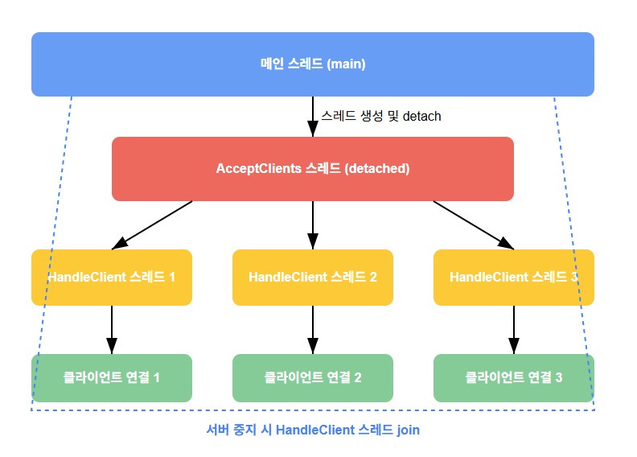   
  
다음은 C++23과 최신 Win32 API를 사용한 TCP 서버 구현 예시입니다:  
`codes/tcp_server_02`  

```cpp
#include <iostream>
#include <string>
#include <format>
#include <thread>
#include <vector>
#include <WinSock2.h>
#include <WS2tcpip.h>

#pragma comment(lib, "ws2_32.lib")

class TCPServer {
private:
    SOCKET listenSocket;
    std::vector<std::thread> clientThreads;
    bool running;
    
    static constexpr int BUFFER_SIZE = 1024;
    static constexpr int DEFAULT_PORT = 27015;

public:
    TCPServer() : listenSocket(INVALID_SOCKET), running(false) {}
    
    ~TCPServer() {
        Stop();
    }
    
    bool Start(int port = DEFAULT_PORT) {
        WSADATA wsaData;
        int result = WSAStartup(MAKEWORD(2, 2), &wsaData);
        if (result != 0) {
            std::cerr << std::format("WSAStartup 실패: {}\n", result);
            return false;
        }
        
        // 소켓 생성
        listenSocket = socket(AF_INET, SOCK_STREAM, IPPROTO_TCP);
        if (listenSocket == INVALID_SOCKET) {
            std::cerr << std::format("소켓 생성 실패: {}\n", WSAGetLastError());
            WSACleanup();
            return false;
        }
        
        // 서버 주소 설정
        sockaddr_in serverAddr;
        serverAddr.sin_family = AF_INET;
        serverAddr.sin_port = htons(port);
        serverAddr.sin_addr.s_addr = INADDR_ANY;  // 모든 인터페이스에서 접속 허용
        
        // 소켓 바인딩
        result = bind(listenSocket, reinterpret_cast<sockaddr*>(&serverAddr), sizeof(serverAddr));
        if (result == SOCKET_ERROR) {
            std::cerr << std::format("바인딩 실패: {}\n", WSAGetLastError());
            closesocket(listenSocket);
            WSACleanup();
            return false;
        }
        
        // 연결 대기 시작
        result = listen(listenSocket, SOMAXCONN);
        if (result == SOCKET_ERROR) {
            std::cerr << std::format("리슨 실패: {}\n", WSAGetLastError());
            closesocket(listenSocket);
            WSACleanup();
            return false;
        }
        
        running = true;
        std::cout << std::format("TCP 서버가 포트 {}에서 시작되었습니다.\n", port);
        
        // 클라이언트 연결 수락 스레드 시작
        std::thread acceptThread(&TCPServer::AcceptClients, this);
        acceptThread.detach();
        
        return true;
    }
    
    void Stop() {
        running = false;
        
        if (listenSocket != INVALID_SOCKET) {
            closesocket(listenSocket);
            listenSocket = INVALID_SOCKET;
        }
        
        for (auto& thread : clientThreads) {
            if (thread.joinable()) {
                thread.join();
            }
        }
        
        clientThreads.clear();
        WSACleanup();
        std::cout << "TCP 서버가 중지되었습니다.\n";
    }
    
private:
    void AcceptClients() {
        while (running) {
            // 클라이언트 연결 수락
            sockaddr_in clientAddr;
            int clientAddrLen = sizeof(clientAddr);
            
            SOCKET clientSocket = accept(listenSocket, reinterpret_cast<sockaddr*>(&clientAddr), &clientAddrLen);
            if (clientSocket == INVALID_SOCKET) {
                if (running) {
                    std::cerr << std::format("클라이언트 연결 수락 실패: {}\n", WSAGetLastError());
                }
                continue;
            }
            
            // 클라이언트 IP 주소 얻기
            char clientIP[INET_ADDRSTRLEN];
            inet_ntop(AF_INET, &clientAddr.sin_addr, clientIP, INET_ADDRSTRLEN);
            std::cout << std::format("새 클라이언트 연결: {}:{}\n", clientIP, ntohs(clientAddr.sin_port));
            
            // 클라이언트 처리 스레드 시작
            clientThreads.emplace_back(&TCPServer::HandleClient, this, clientSocket, std::string(clientIP));
        }
    }
    
    void HandleClient(SOCKET clientSocket, std::string clientIP) {
        char buffer[BUFFER_SIZE];
        
        while (running) {
            // 데이터 수신
            int bytesReceived = recv(clientSocket, buffer, BUFFER_SIZE - 1, 0);
            if (bytesReceived <= 0) {
                if (bytesReceived == 0) {
                    std::cout << std::format("클라이언트 {}가 연결을 종료했습니다.\n", clientIP);
                } else {
                    std::cerr << std::format("recv 실패: {}\n", WSAGetLastError());
                }
                break;
            }
            
            // 수신된 데이터 처리
            buffer[bytesReceived] = '\0';
            std::cout << std::format("{}로부터 수신: {}\n", clientIP, buffer);
            
            // 클라이언트에게 에코 응답
            std::string response = std::format("서버 에코: {}", buffer);
            int bytesSent = send(clientSocket, response.c_str(), static_cast<int>(response.length()), 0);
            if (bytesSent == SOCKET_ERROR) {
                std::cerr << std::format("send 실패: {}\n", WSAGetLastError());
                break;
            }
        }
        
        // 클라이언트 소켓 닫기
        closesocket(clientSocket);
    }
};

int main() {
    // 한글 출력을 위한 설정
    SetConsoleOutputCP(CP_UTF8);
    
    TCPServer server;
    if (server.Start()) {
        std::cout << "서버를 종료하려면 아무 키나 누르세요...\n";
        std::cin.get();
        server.Stop();
    }
    
    return 0;
}
```

### TCP 클라이언트 구현  
`codes/tcp_client_02`  

```cpp
#include <iostream>
#include <string>
#include <format>
#include <thread>
#include <WinSock2.h>
#include <WS2tcpip.h>

#pragma comment(lib, "ws2_32.lib")

class TCPClient {
private:
    SOCKET clientSocket;
    bool connected;
    std::thread receiveThread;
    
    static constexpr int BUFFER_SIZE = 1024;
    static constexpr int DEFAULT_PORT = 27015;

public:
    TCPClient() : clientSocket(INVALID_SOCKET), connected(false) {}
    
    ~TCPClient() {
        Disconnect();
    }
    
    bool Connect(const std::string& serverIP, int port = DEFAULT_PORT) {
        // Winsock 초기화
        WSADATA wsaData;
        int result = WSAStartup(MAKEWORD(2, 2), &wsaData);
        if (result != 0) {
            std::cerr << std::format("WSAStartup 실패: {}\n", result);
            return false;
        }
        
        // 소켓 생성
        clientSocket = socket(AF_INET, SOCK_STREAM, IPPROTO_TCP);
        if (clientSocket == INVALID_SOCKET) {
            std::cerr << std::format("소켓 생성 실패: {}\n", WSAGetLastError());
            WSACleanup();
            return false;
        }
        
        // 서버 주소 설정
        sockaddr_in serverAddr;
        serverAddr.sin_family = AF_INET;
        serverAddr.sin_port = htons(port);
        inet_pton(AF_INET, serverIP.c_str(), &serverAddr.sin_addr);
        
        // 서버에 연결
        result = connect(clientSocket, reinterpret_cast<sockaddr*>(&serverAddr), sizeof(serverAddr));
        if (result == SOCKET_ERROR) {
            std::cerr << std::format("서버 연결 실패: {}\n", WSAGetLastError());
            closesocket(clientSocket);
            WSACleanup();
            return false;
        }
        
        connected = true;
        std::cout << std::format("{}:{}에 연결되었습니다.\n", serverIP, port);
        
        // 수신 스레드 시작
        receiveThread = std::thread(&TCPClient::ReceiveMessages, this);
        
        return true;
    }
    
    void Disconnect() {
        connected = false;
        
        if (clientSocket != INVALID_SOCKET) {
            closesocket(clientSocket);
            clientSocket = INVALID_SOCKET;
        }
        
        if (receiveThread.joinable()) {
            receiveThread.join();
        }
        
        WSACleanup();
        std::cout << "서버와의 연결이 종료되었습니다.\n";
    }
    
    bool SendMessage(const std::string& message) {
        if (!connected || clientSocket == INVALID_SOCKET) {
            std::cerr << "연결되지 않았습니다.\n";
            return false;
        }
        
        int bytesSent = send(clientSocket, message.c_str(), static_cast<int>(message.length()), 0);
        if (bytesSent == SOCKET_ERROR) {
            std::cerr << std::format("메시지 전송 실패: {}\n", WSAGetLastError());
            return false;
        }
        
        return true;
    }
    
private:
    void ReceiveMessages() {
        char buffer[BUFFER_SIZE];
        
        while (connected) {
            // 데이터 수신
            int bytesReceived = recv(clientSocket, buffer, BUFFER_SIZE - 1, 0);
            if (bytesReceived <= 0) {
                if (bytesReceived == 0) {
                    std::cout << "서버가 연결을 종료했습니다.\n";
                } else {
                    std::cerr << std::format("recv 실패: {}\n", WSAGetLastError());
                }
                connected = false;
                break;
            }
            
            // 수신된 데이터 처리
            buffer[bytesReceived] = '\0';
            std::cout << "서버로부터 수신: " << buffer << std::endl;
        }
    }
};

int main() {
    // 한글 출력을 위한 설정
    SetConsoleOutputCP(CP_UTF8);
    
    TCPClient client;
    std::string serverIP;
    
    std::cout << "서버 IP를 입력하세요 (localhost는 127.0.0.1): ";
    std::getline(std::cin, serverIP);
    
    if (client.Connect(serverIP)) {
        std::string message;
        while (true) {
            std::cout << "전송할 메시지 (종료: exit): ";
            std::getline(std::cin, message);
            
            if (message == "exit") {
                break;
            }
            
            client.SendMessage(message);
        }
        
        client.Disconnect();
    }
    
    return 0;
}
```

### 서버-클라이언트 구현 분석

1. **서버 동작 방식**:
   - `Start()` 메서드에서 소켓을 생성하고 바인딩한 후 연결 대기
   - `AcceptClients()` 메서드는 별도 스레드에서 실행되며 클라이언트 연결을 수락
   - 각 클라이언트 연결마다 `HandleClient()` 메서드를 실행하는 새 스레드 생성
   - 에코 서버 방식으로 수신한 메시지를 그대로 클라이언트에게 반환

2. **클라이언트 동작 방식**:
   - `Connect()` 메서드에서 서버에 연결
   - 수신 메시지를 처리하기 위한 별도 스레드 생성 (`ReceiveMessages()`)
   - 메인 스레드는 사용자 입력을 받아 서버로 메시지 전송

3. **멀티스레딩 구현**:
   - C++11부터 도입된 `std::thread`를 사용하여 멀티스레딩 구현
   - 각 클라이언트 연결을 별도 스레드로 처리하여 동시 다중 접속 지원
   - 비동기 메시지 수신을 위해 수신 전용 스레드 사용

4. **에러 처리**:
   - 각 단계마다 상세한 에러 메시지 출력
   - 연결 종료 시 적절한 리소스 정리
  

## 03 TCP 서버-클라이언트(IPv6)
IPv6는 주소 고갈 문제를 해결하기 위해 도입된 차세대 인터넷 프로토콜입니다. 최신 게임 서버는 IPv6 지원이 필수적입니다.

### IPv6 TCP 서버 구현 
`codes/tcp_server_03`   
`codes/tcp_server_02`는 한번에 1개의 클라이언트 접속할 수 있지만 `codes/tcp_server_03`은 thread를 사용하여 동시에 복수의 클라이언트가 접속할 수 있다.          
  
```cpp
#include <iostream>
#include <string>
#include <format>
#include <thread>
#include <vector>
#include <WinSock2.h>
#include <WS2tcpip.h>

#pragma comment(lib, "ws2_32.lib")

class TCPServerIPv6 {
private:
    SOCKET listenSocket;
    std::vector<std::thread> clientThreads;
    bool running;
    
    static constexpr int BUFFER_SIZE = 1024;
    static constexpr int DEFAULT_PORT = 27015;

public:
    TCPServerIPv6() : listenSocket(INVALID_SOCKET), running(false) {}
    
    ~TCPServerIPv6() {
        Stop();
    }
    
    bool Start(int port = DEFAULT_PORT) {
        WSADATA wsaData;
        int result = WSAStartup(MAKEWORD(2, 2), &wsaData);
        if (result != 0) {
            std::cerr << std::format("WSAStartup 실패: {}\n", result);
            return false;
        }
        
        // IPv6 소켓 생성
        listenSocket = socket(AF_INET6, SOCK_STREAM, IPPROTO_TCP);
        if (listenSocket == INVALID_SOCKET) {
            std::cerr << std::format("소켓 생성 실패: {}\n", WSAGetLastError());
            WSACleanup();
            return false;
        }
        
        // IPv4 매핑된 IPv6 주소 허용 (듀얼 스택)
        int ipv6Only = 0; // 0: 듀얼 스택(IPv4+IPv6), 1: IPv6만
        result = setsockopt(listenSocket, IPPROTO_IPV6, IPV6_V6ONLY, 
                          reinterpret_cast<char*>(&ipv6Only), sizeof(ipv6Only));
        if (result == SOCKET_ERROR) {
            std::cerr << std::format("IPv6 옵션 설정 실패: {}\n", WSAGetLastError());
            closesocket(listenSocket);
            WSACleanup();
            return false;
        }
        
        // 서버 주소 설정 (IPv6)
        sockaddr_in6 serverAddr;
        ZeroMemory(&serverAddr, sizeof(serverAddr));
        serverAddr.sin6_family = AF_INET6;
        serverAddr.sin6_port = htons(port);
        serverAddr.sin6_addr = in6addr_any; // 모든 IPv6 인터페이스에서 접속 허용
        
        // 소켓 바인딩
        result = bind(listenSocket, reinterpret_cast<sockaddr*>(&serverAddr), sizeof(serverAddr));
        if (result == SOCKET_ERROR) {
            std::cerr << std::format("바인딩 실패: {}\n", WSAGetLastError());
            closesocket(listenSocket);
            WSACleanup();
            return false;
        }
        
        // 연결 대기 시작
        result = listen(listenSocket, SOMAXCONN);
        if (result == SOCKET_ERROR) {
            std::cerr << std::format("리슨 실패: {}\n", WSAGetLastError());
            closesocket(listenSocket);
            WSACleanup();
            return false;
        }
        
        running = true;
        std::cout << std::format("TCP IPv6 서버가 포트 {}에서 시작되었습니다.\n", port);
        
        // 클라이언트 연결 수락 스레드 시작
        std::thread acceptThread(&TCPServerIPv6::AcceptClients, this);
        acceptThread.detach();
        
        return true;
    }
    
    void Stop() {
        running = false;
        
        if (listenSocket != INVALID_SOCKET) {
            closesocket(listenSocket);
            listenSocket = INVALID_SOCKET;
        }
        
        for (auto& thread : clientThreads) {
            if (thread.joinable()) {
                thread.join();
            }
        }
        
        clientThreads.clear();
        WSACleanup();
        std::cout << "TCP IPv6 서버가 중지되었습니다.\n";
    }
    
private:
    void AcceptClients() {
        while (running) {
            // 클라이언트 연결 수락
            sockaddr_in6 clientAddr;
            int clientAddrLen = sizeof(clientAddr);
            
            SOCKET clientSocket = accept(listenSocket, reinterpret_cast<sockaddr*>(&clientAddr), &clientAddrLen);
            if (clientSocket == INVALID_SOCKET) {
                if (running) {
                    std::cerr << std::format("클라이언트 연결 수락 실패: {}\n", WSAGetLastError());
                }
                continue;
            }
            
            // 클라이언트 IP 주소 얻기
            char clientIP[INET6_ADDRSTRLEN];
            inet_ntop(AF_INET6, &clientAddr.sin6_addr, clientIP, INET6_ADDRSTRLEN);
            std::cout << std::format("새 클라이언트 연결: [{}]:{}\n", clientIP, ntohs(clientAddr.sin6_port));
            
            // 클라이언트 처리 스레드 시작
            clientThreads.emplace_back(&TCPServerIPv6::HandleClient, this, clientSocket, std::string(clientIP));
        }
    }
    
    void HandleClient(SOCKET clientSocket, std::string clientIP) {
        char buffer[BUFFER_SIZE];
        
        while (running) {
            // 데이터 수신
            int bytesReceived = recv(clientSocket, buffer, BUFFER_SIZE - 1, 0);
            if (bytesReceived <= 0) {
                if (bytesReceived == 0) {
                    std::cout << std::format("클라이언트 {}가 연결을 종료했습니다.\n", clientIP);
                } else {
                    std::cerr << std::format("recv 실패: {}\n", WSAGetLastError());
                }
                break;
            }
            
            // 수신된 데이터 처리
            buffer[bytesReceived] = '\0';
            std::cout << std::format("{}로부터 수신: {}\n", clientIP, buffer);
            
            // 클라이언트에게 에코 응답
            std::string response = std::format("IPv6 서버 에코: {}", buffer);
            int bytesSent = send(clientSocket, response.c_str(), static_cast<int>(response.length()), 0);
            if (bytesSent == SOCKET_ERROR) {
                std::cerr << std::format("send 실패: {}\n", WSAGetLastError());
                break;
            }
        }
        
        // 클라이언트 소켓 닫기
        closesocket(clientSocket);
    }
};

int main() {
    // 한글 출력을 위한 설정
    SetConsoleOutputCP(CP_UTF8);
    
    TCPServerIPv6 server;
    if (server.Start()) {
        std::cout << "서버를 종료하려면 아무 키나 누르세요...\n";
        std::cin.get();
        server.Stop();
    }
    
    return 0;
}
```

### IPv6 TCP 클라이언트 구현
`codes/tcp_client_03`    

```cpp
#include <iostream>
#include <string>
#include <format>
#include <thread>
#include <WinSock2.h>
#include <WS2tcpip.h>

#pragma comment(lib, "ws2_32.lib")

class TCPClientIPv6 {
private:
    SOCKET clientSocket;
    bool connected;
    std::thread receiveThread;
    
    static constexpr int BUFFER_SIZE = 1024;
    static constexpr int DEFAULT_PORT = 27015;

public:
    TCPClientIPv6() : clientSocket(INVALID_SOCKET), connected(false) {}
    
    ~TCPClientIPv6() {
        Disconnect();
    }
    
    bool Connect(const std::string& serverIP, int port = DEFAULT_PORT) {
        // Winsock 초기화
        WSADATA wsaData;
        int result = WSAStartup(MAKEWORD(2, 2), &wsaData);
        if (result != 0) {
            std::cerr << std::format("WSAStartup 실패: {}\n", result);
            return false;
        }
        
        // IPv6 소켓 생성
        clientSocket = socket(AF_INET6, SOCK_STREAM, IPPROTO_TCP);
        if (clientSocket == INVALID_SOCKET) {
            std::cerr << std::format("소켓 생성 실패: {}\n", WSAGetLastError());
            WSACleanup();
            return false;
        }
        
        // 서버 주소 설정 (IPv6)
        sockaddr_in6 serverAddr;
        ZeroMemory(&serverAddr, sizeof(serverAddr));
        serverAddr.sin6_family = AF_INET6;
        serverAddr.sin6_port = htons(port);
        
        // IPv6 주소 변환
        if (inet_pton(AF_INET6, serverIP.c_str(), &serverAddr.sin6_addr) != 1) {
            std::cerr << "잘못된 IPv6 주소 형식입니다.\n";
            closesocket(clientSocket);
            WSACleanup();
            return false;
        }
        
        // 서버에 연결
        result = connect(clientSocket, reinterpret_cast<sockaddr*>(&serverAddr), sizeof(serverAddr));
        if (result == SOCKET_ERROR) {
            std::cerr << std::format("서버 연결 실패: {}\n", WSAGetLastError());
            closesocket(clientSocket);
            WSACleanup();
            return false;
        }
        
        connected = true;
        std::cout << std::format("[{}]:{}에 연결되었습니다.\n", serverIP, port);
        
        // 수신 스레드 시작
        receiveThread = std::thread(&TCPClientIPv6::ReceiveMessages, this);
        
        return true;
    }
    
    void Disconnect() {
        connected = false;
        
        if (clientSocket != INVALID_SOCKET) {
            closesocket(clientSocket);
            clientSocket = INVALID_SOCKET;
        }
        
        if (receiveThread.joinable()) {
            receiveThread.join();
        }
        
        WSACleanup();
        std::cout << "서버와의 연결이 종료되었습니다.\n";
    }
    
    bool SendMessage(const std::string& message) {
        if (!connected || clientSocket == INVALID_SOCKET) {
            std::cerr << "연결되지 않았습니다.\n";
            return false;
        }
        
        int bytesSent = send(clientSocket, message.c_str(), static_cast<int>(message.length()), 0);
        if (bytesSent == SOCKET_ERROR) {
            std::cerr << std::format("메시지 전송 실패: {}\n", WSAGetLastError());
            return false;
        }
        
        return true;
    }
    
private:
    void ReceiveMessages() {
        char buffer[BUFFER_SIZE];
        
        while (connected) {
            // 데이터 수신
            int bytesReceived = recv(clientSocket, buffer, BUFFER_SIZE - 1, 0);
            if (bytesReceived <= 0) {
                if (bytesReceived == 0) {
                    std::cout << "서버가 연결을 종료했습니다.\n";
                } else {
                    std::cerr << std::format("recv 실패: {}\n", WSAGetLastError());
                }
                connected = false;
                break;
            }
            
            // 수신된 데이터 처리
            buffer[bytesReceived] = '\0';
            std::cout << "서버로부터 수신: " << buffer << std::endl;
        }
    }
};

int main() {
    // 한글 출력을 위한 설정
    SetConsoleOutputCP(CP_UTF8);
    
    TCPClientIPv6 client;
    std::string serverIP;
    
    std::cout << "서버 IPv6 주소를 입력하세요 (localhost는 ::1): ";
    std::getline(std::cin, serverIP);
    
    if (client.Connect(serverIP)) {
        std::string message;
        while (true) {
            std::cout << "전송할 메시지 (종료: exit): ";
            std::getline(std::cin, message);
            
            if (message == "exit") {
                break;
            }
            
            client.SendMessage(message);
        }
        
        client.Disconnect();
    }
    
    return 0;
}
```

### IPv4와 IPv6의 주요 차이점
1. **주소 체계**:
   - IPv4: 32비트 주소 (예: 192.168.0.1)
   - IPv6: 128비트 주소 (예: 2001:0db8:85a3:0000:8a2e:0370:7334)

2. **구현 차이**:
   - 소켓 생성 시 주소 패밀리를 `AF_INET6`로 설정
   - IPv6 주소를 저장하기 위해 `sockaddr_in6` 구조체 사용
   - 듀얼 스택 지원을 위한 `IPV6_V6ONLY` 소켓 옵션 설정

3. **듀얼 스택**:
   - Windows에서는 IPv6 소켓이 IPv4 연결도 수락하도록 설정 가능
   - `IPV6_V6ONLY` 옵션을 0으로 설정하여 구현
   - 하나의 서버로 IPv4와 IPv6 클라이언트 모두 지원 가능

### 게임 서버 개발자를 위한 추가 고려 사항
1. **비동기 I/O 및 성능 최적화**:
   - 실제 게임 서버에서는 비동기 I/O(IOCP, Overlapped I/O)를 활용하여 성능 향상
   - I/O 멀티플렉싱(select, WSAPoll 등) 고려

2. **패킷 설계**:
   - 게임 서버에서는 바이너리 프로토콜을 사용하여 효율적인 데이터 전송
   - 헤더-페이로드 구조의 패킷 설계
   - 직렬화/역직렬화 라이브러리 활용(Protocol Buffers, FlatBuffers 등)

3. **세션 관리**:
   - 클라이언트 연결을 객체 지향적으로 관리하는 세션 시스템 구현
   - 연결/연결 해제 이벤트 처리
   - 타임아웃, 핑-퐁 메커니즘으로 연결 상태 확인

4. **스레드 관리**:
   - 스레드 풀을 사용하여 리소스 효율적 사용
   - 스레드 간 공유 자원 동기화
   - 락 최소화를 통한 성능 향상

5. **보안 고려사항**:
   - 패킷 검증으로 조작 방지
   - TLS/SSL 적용으로 암호화 통신
   - DDoS 방어 전략 수립

이 예제들은 기본적인 TCP 서버-클라이언트 구현을 보여주는 것으로, 실제 게임 서버 개발에는 더 복잡한 아키텍처와 최적화가 필요합니다. 그러나 기본 개념을 이해하는 데 좋은 출발점이 될 것입니다.  

  
<br>      
   
# Chapter.05 데이터 전송하기

## 01 응용 프로그램 프로토콜과 데이터 전송
온라인 게임에서 서버와 클라이언트 간의 데이터 전송은 게임의 핵심입니다. 이 데이터 교환을 위해서는 양측이 이해할 수 있는 규약, 즉 **응용 프로그램 프로토콜**이 필요합니다.

### 응용 프로그램 프로토콜이란?
응용 프로그램 프로토콜은 **두 프로그램이 서로 통신할 때 사용하는 데이터 형식과 규칙을 정의**한 것입니다.   
게임에서는 이 프로토콜을 통해 캐릭터 움직임, 공격, 채팅 등 다양한 정보를 주고받습니다.  

### 바이트 순서(Endianness) 
네트워크 통신에서 가장 기본적인 문제 중 하나는 바이트 순서입니다.

```cpp
// 네트워크 바이트 순서(빅 엔디안)로 변환
uint16_t hostToNetwork16(uint16_t value) {
    return htons(value); // host to network short
}

uint32_t hostToNetwork32(uint32_t value) {
    return htonl(value); // host to network long
}

// 호스트 바이트 순서로 변환
uint16_t networkToHost16(uint16_t value) {
    return ntohs(value); // network to host short
}

uint32_t networkToHost32(uint32_t value) {
    return ntohl(value); // network to host long
}
```
  
C++로 만든 서버와 클라이언트 푸로그램이 x86_64 CPU 아키텍처에서 실행된다면 바이트 순서 문제는 대체로 고려하지 않아도 됩니다. x86_64 CPU 아키텍처는 `리틀 엔디안` 입니다. 또 C#을 사용하는 경우 CPU 아키텍처와 상관 없이 .NET 플랫폼은 `리틀 엔디안` 입니다.
  
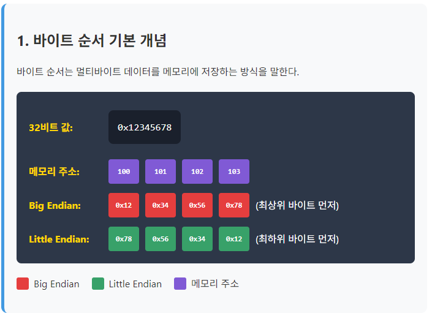   
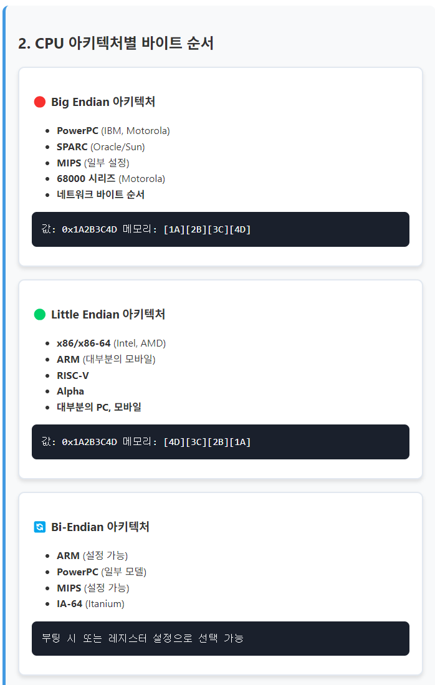   


프로그래밍 언어별 바이트 순서 처리  
  
C/C++ - 플랫폼 의존적  
```
#include <arpa/inet.h>  // Linux/Unix
#include <winsock2.h>   // Windows

// 엔디안 확인
bool is_little_endian() {
    uint32_t test = 1;
    return *(uint8_t*)&test == 1;
}

// 네트워크 바이트 순서 변환
uint32_t host_to_network(uint32_t host_value) {
    return htonl(host_value);  // Host TO Network Long
}

uint32_t network_to_host(uint32_t network_value) {
    return ntohl(network_value);  // Network TO Host Long
}

// 수동 바이트 순서 변환
uint32_t swap_bytes(uint32_t value) {
    return ((value & 0xFF000000) >> 24) |
           ((value & 0x00FF0000) >> 8)  |
           ((value & 0x0000FF00) << 8)  |
           ((value & 0x000000FF) << 24);
}
```  
  
Rust - 명시적 엔디안 제어  
```
// 바이트 순서 변환
let value: u32 = 0x12345678;

// 네트워크 바이트 순서 (Big Endian)
let big_endian = value.to_be();
let from_big = u32::from_be(big_endian);

// 호스트 바이트 순서 (Little Endian)
let little_endian = value.to_le();
let from_little = u32::from_le(little_endian);

// 바이트 배열로 직렬화
let bytes_be = value.to_be_bytes();  // [0x12, 0x34, 0x56, 0x78]
let bytes_le = value.to_le_bytes();  // [0x78, 0x56, 0x34, 0x12]

// 바이트 배열에서 복원
let restored_be = u32::from_be_bytes([0x12, 0x34, 0x56, 0x78]);
let restored_le = u32::from_le_bytes([0x78, 0x56, 0x34, 0x12]);
Go - 내장 바이너리 패키지
import (
    "encoding/binary"
    "bytes"
)

func endianExample() {
    value := uint32(0x12345678)
    buf := new(bytes.Buffer)
    
    // Big Endian 쓰기
    binary.Write(buf, binary.BigEndian, value)
    // 결과: [0x12, 0x34, 0x56, 0x78]
    
    // Little Endian 쓰기
    buf.Reset()
    binary.Write(buf, binary.LittleEndian, value)
    // 결과: [0x78, 0x56, 0x34, 0x12]
    
    // 읽기
    var result uint32
    binary.Read(buf, binary.LittleEndian, &result)
}
```  
  
Java - DataInputStream/DataOutputStream  
```
import java.io.*;
import java.nio.ByteBuffer;
import java.nio.ByteOrder;

// Java는 기본적으로 Big Endian
public class EndianExample {
    public static void main(String[] args) throws IOException {
        int value = 0x12345678;
        
        // Big Endian (Java 기본값)
        ByteBuffer bigBuffer = ByteBuffer.allocate(4);
        bigBuffer.putInt(value);
        byte[] bigBytes = bigBuffer.array();
        // 결과: [0x12, 0x34, 0x56, 0x78]
        
        // Little Endian
        ByteBuffer littleBuffer = ByteBuffer.allocate(4);
        littleBuffer.order(ByteOrder.LITTLE_ENDIAN);
        littleBuffer.putInt(value);
        byte[] littleBytes = littleBuffer.array();
        // 결과: [0x78, 0x56, 0x34, 0x12]
    }
}
```  
  
Python - struct 모듈
```  
import struct
import socket

value = 0x12345678

# Big Endian 패킹
big_endian = struct.pack('>I', value)     # '>' = Big Endian
print(f"Big Endian: {big_endian}")
# 결과: b'\x12\x34\x56\x78'

# Little Endian 패킹  
little_endian = struct.pack('<I', value)  # '<' = Little Endian
print(f"Little Endian: {little_endian}")
# 결과: b'xV4\x12'

# 언패킹 예제
unpacked_big = struct.unpack('>I', big_endian)[0]
unpacked_little = struct.unpack('<I', little_endian)[0]

print(f"Original value: 0x{value:08x}")
print(f"Unpacked from big endian: 0x{unpacked_big:08x}")
print(f"Unpacked from little endian: 0x{unpacked_little:08x}")

# 네트워크 바이트 순서 (항상 big endian)
network_order = socket.htonl(value)  # host to network long
print(f"Network order: 0x{network_order:08x}")
```  
  
    
### 바이트 정렬
  
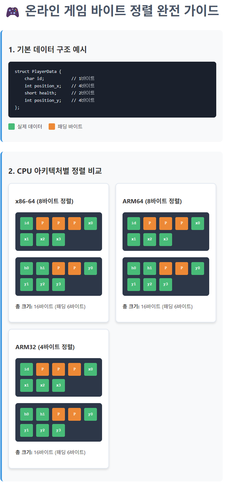   
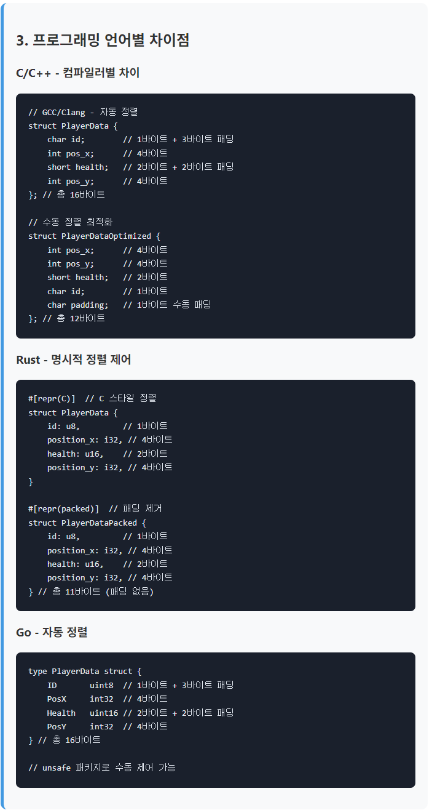   
 
C++ 구조체에 패딩이 필요한 이유는 **메모리 정렬(memory alignment)** 때문이다.

#### 메모리 정렬이 필요한 이유
CPU는 데이터를 특정 경계에서 읽을 때 가장 효율적으로 동작한다. 예를 들어 4바이트 정수는 4의 배수 주소에서, 8바이트 double은 8의 배수 주소에서 읽는 것이 빠르다.

##### 패딩 없이 구조체를 배치하면?

```cpp
struct Example {
    char a;     // 1바이트
    int b;      // 4바이트  
    char c;     // 1바이트
    double d;   // 8바이트
};
```

**패딩 없는 메모리 배치:**
```
주소:  0  1  2  3  4  5  6  7  8  9  10 11 12 13 14 15
데이터: a  b  b  b  b  c  d  d  d  d  d  d  d  d
```

이 경우 문제점들:
- `int b`가 주소 1에서 시작 → 4바이트 경계에 정렬되지 않음
- `double d`가 주소 6에서 시작 → 8바이트 경계에 정렬되지 않음

#### 패딩을 추가한 실제 메모리 배치:

```
주소:  0  1  2  3  4  5  6  7  8  9  10 11 12 13 14 15
데이터: a  P  P  P  b  b  b  b  c  P  P  P  P  P  P  P  d  d  d  d  d  d  d  d
```

여기서 `P`는 패딩(빈 공간)이다.

**실제 구조체 크기와 오프셋:**
```cpp
struct Example {
    char a;     // 오프셋 0, 크기 1
    // 3바이트 패딩
    int b;      // 오프셋 4, 크기 4  
    char c;     // 오프셋 8, 크기 1
    // 7바이트 패딩
    double d;   // 오프셋 16, 크기 8
};
// 전체 크기: 24바이트
```

#### 시각적 비교

**패딩 없음 (비효율적):**
```
┌─┬─────┬─┬───────┐
│a│ b b │c│ d d d │  ← 정렬되지 않음
└─┴─────┴─┴───────┘
```

**패딩 있음 (효율적):**
```
┌─┬───┬─────┬─┬───────┬───────────┐
│a│PAD│ b b │c│  PAD  │  d d d d  │  ← 모든 데이터가 올바르게 정렬됨
└─┴───┴─────┴─┴───────┴───────────┘
```

#### 패딩의 장점
1. **성능 향상**: CPU가 한 번의 메모리 접근으로 데이터를 읽을 수 있다
2. **안정성**: 일부 CPU는 정렬되지 않은 접근 시 오류를 발생시킨다
3. **캐시 효율성**: 메모리 캐시 라인과 잘 맞아떨어진다

따라서 컴파일러는 자동으로 패딩을 추가해서 모든 멤버가 적절한 경계에 정렬되도록 한다.    


### 직렬화와 역직렬화
직렬화(Serialization)는 메모리 내의 데이터 구조를 바이트 스트림으로 변환하는 과정이고, 역직렬화(Deserialization)는 그 반대 과정입니다.
  
C++에서는 `std::memcpy` 또는 구조체 패킹을 통해 간단한 직렬화를 구현할 수 있지만, 복잡한 데이터 구조에는 한계가 있습니다.  


#### 구조체 패킹
- `#pragma pack(1)`으로 메모리 정렬 제어
- 구조체를 통째로 바이너리 파일에 저장/로드
- 배열 데이터 처리와 메모리 직렬화 예제 포함
- 고정 크기 데이터에 최적화
  
```    
#include <iostream>
#include <fstream>
#include <cstring>

// 구조체 패킹을 사용한 직렬화
#pragma pack(push, 1)  // 1바이트 정렬로 패딩 제거
struct PackedData {
    int id;
    float value;
    char name[16];
    bool active;
    double score;
};
#pragma pack(pop)

// 복합 데이터 구조체
#pragma pack(push, 1)
struct GamePlayer {
    int playerId;
    char playerName[32];
    float health;
    float mana;
    int level;
    bool isOnline;
};
#pragma pack(pop)

int main() {
    std::cout << "=== 구조체 패킹 직렬화 예제 ===" << std::endl;
    
    // 단일 구조체 직렬화
    PackedData data1 = {123, 45.67f, "TestData", true, 98.5};
    
    std::cout << "원본 데이터:" << std::endl;
    std::cout << "ID: " << data1.id << std::endl;
    std::cout << "Value: " << data1.value << std::endl;
    std::cout << "Name: " << data1.name << std::endl;
    std::cout << "Active: " << data1.active << std::endl;
    std::cout << "Score: " << data1.score << std::endl;
    
        
    // 메모리 직렬화 (바이트 배열로)
    std::cout << "\n=== 메모리 직렬화 ===" << std::endl;
    
    char buffer[sizeof(PackedData)];
    std::memcpy(buffer, &data1, sizeof(PackedData));
    
    PackedData data3;
    std::memcpy(&data3, buffer, sizeof(PackedData));
    
    std::cout << "메모리에서 복사된 데이터: " << data3.name << std::endl;
    
    // 구조체 크기 정보
    std::cout << "\n=== 구조체 크기 정보 ===" << std::endl;
    std::cout << "PackedData 크기: " << sizeof(PackedData) << " bytes" << std::endl;
    
    return 0;
}
```  


#### std::memcpy: 직렬화/역직렬화 클래스
- 유연한 직렬화/역직렬화 클래스 구현
- 가변 길이 문자열과 배열 처리 가능
- 복합 데이터 구조체를 위한 직렬화 메서드 제공
- 메모리 간 직접 복사도 지원
  
```
#include <iostream>
#include <cstring>
#include <vector>
#include <string>

// memcpy를 사용한 직렬화 클래스
class BinarySerializer {
private:
    std::vector<char> buffer;
    size_t writeOffset;

public:
    BinarySerializer() : writeOffset(0) {}
    
    // 기본 데이터 타입 쓰기
    template<typename T>
    void write(const T& data) {
        size_t size = sizeof(T);
        buffer.resize(buffer.size() + size);
        std::memcpy(buffer.data() + writeOffset, &data, size);
        writeOffset += size;
    }
    
    // 문자열 쓰기 (길이 + 데이터)
    void writeString(const std::string& str) {
        size_t len = str.length();
        write(len);  // 먼저 길이 저장
        buffer.resize(buffer.size() + len);
        std::memcpy(buffer.data() + writeOffset, str.c_str(), len);
        writeOffset += len;
    }
    
    // 배열 쓰기
    template<typename T>
    void writeArray(const T* arr, size_t count) {
        write(count);  // 배열 크기 저장
        size_t totalSize = sizeof(T) * count;
        buffer.resize(buffer.size() + totalSize);
        std::memcpy(buffer.data() + writeOffset, arr, totalSize);
        writeOffset += totalSize;
    }
    
    // 버퍼 반환
    const std::vector<char>& getBuffer() const { return buffer; }
    size_t getSize() const { return buffer.size(); }
    
    // 버퍼 초기화
    void clear() {
        buffer.clear();
        writeOffset = 0;
    }
};

// 역직렬화 클래스
class BinaryDeserializer {
private:
    std::vector<char> buffer;
    size_t readOffset;

public:
    BinaryDeserializer() : readOffset(0) {}
    
    // 버퍼에서 직접 로드
    void loadFromBuffer(const std::vector<char>& data) {
        buffer = data;
        readOffset = 0;
    }
    
    // 기본 데이터 타입 읽기
    template<typename T>
    T read() {
        T data;
        std::memcpy(&data, buffer.data() + readOffset, sizeof(T));
        readOffset += sizeof(T);
        return data;
    }
    
    // 문자열 읽기
    std::string readString() {
        size_t len = read<size_t>();
        std::string str(buffer.data() + readOffset, len);
        readOffset += len;
        return str;
    }
    
    // 배열 읽기
    template<typename T>
    std::vector<T> readArray() {
        size_t count = read<size_t>();
        std::vector<T> arr(count);
        size_t totalSize = sizeof(T) * count;
        std::memcpy(arr.data(), buffer.data() + readOffset, totalSize);
        readOffset += totalSize;
        return arr;
    }
    
    // 읽기 위치 초기화
    void reset() { readOffset = 0; }
    bool hasMore() const { return readOffset < buffer.size(); }
    size_t remaining() const { return buffer.size() - readOffset; }
};

// 복합 데이터 구조체
struct PlayerData {
    int id;
    std::string name;
    float health;
    std::vector<int> inventory;
    bool isActive;
    
    // 직렬화 메서드
    void serialize(BinarySerializer& serializer) const {
        serializer.write(id);
        serializer.writeString(name);
        serializer.write(health);
        serializer.writeArray(inventory.data(), inventory.size());
        serializer.write(isActive);
    }
    
    // 역직렬화 메서드
    void deserialize(BinaryDeserializer& deserializer) {
        id = deserializer.read<int>();
        name = deserializer.readString();
        health = deserializer.read<float>();
        inventory = deserializer.readArray<int>();
        isActive = deserializer.read<bool>();
    }
};

int main() 
{
    std::cout << "=== memcpy 기반 직렬화 예제 ===" << std::endl;
    
    // 기본 데이터 직렬화
    BinarySerializer serializer;
    
    int number = 42;
    float pi = 3.14159f;
    std::string message = "Hello, Serialization!";
    bool flag = true;
    double precision = 123.456789;
    
    serializer.write(number);
    serializer.write(pi);
    serializer.writeString(message);
    serializer.write(flag);
    serializer.write(precision);
    
    std::cout << "직렬화 완료, 버퍼 크기: " << serializer.getSize() << " bytes" << std::endl;
    
    // 메모리에서 역직렬화
    BinaryDeserializer deserializer;
    deserializer.loadFromBuffer(serializer.getBuffer());
    
    int readNumber = deserializer.read<int>();
    float readPi = deserializer.read<float>();
    std::string readMessage = deserializer.readString();
    bool readFlag = deserializer.read<bool>();
    double readPrecision = deserializer.read<double>();
    
    std::cout << "\n역직렬화 결과:" << std::endl;
    std::cout << "Number: " << readNumber << std::endl;
    std::cout << "Pi: " << readPi << std::endl;
    std::cout << "Message: " << readMessage << std::endl;
    std::cout << "Flag: " << (readFlag ? "true" : "false") << std::endl;
    std::cout << "Precision: " << readPrecision << std::endl;
    
    std::cout << "\n=== 복합 데이터 직렬화 ===" << std::endl;
    
    // 플레이어 데이터 생성
    PlayerData player1;
    player1.id = 1001;
    player1.name = "SuperPlayer";
    player1.health = 85.5f;
    player1.inventory = {1, 5, 3, 12, 8};  // 아이템 ID들
    player1.isActive = true;
    
    // 복합 데이터 직렬화
    BinarySerializer playerSerializer;
    player1.serialize(playerSerializer);
    
    std::cout << "플레이어 데이터 직렬화 완료" << std::endl;
    std::cout << "원본 플레이어: " << player1.name 
              << " (ID: " << player1.id 
              << ", HP: " << player1.health 
              << ", Items: " << player1.inventory.size() << "개)" << std::endl;
    
    // 복합 데이터 역직렬화
    PlayerData player2;
    BinaryDeserializer playerDeserializer;
    playerDeserializer.loadFromBuffer(playerSerializer.getBuffer());
    player2.deserialize(playerDeserializer);
    
    std::cout << "\n로드된 플레이어: " << player2.name 
              << " (ID: " << player2.id 
              << ", HP: " << player2.health 
              << ", Active: " << (player2.isActive ? "Yes" : "No") << ")" << std::endl;
    
    std::cout << "인벤토리: ";
    for (size_t i = 0; i < player2.inventory.size(); i++) {
        std::cout << player2.inventory[i];
        if (i < player2.inventory.size() - 1) std::cout << ", ";
    }
    std::cout << std::endl;
    
    std::cout << "\n=== 메모리 간 직렬화 ===" << std::endl;
    
    // 메모리에서 메모리로 직접 복사
    BinaryDeserializer memoryDeserializer;
    memoryDeserializer.loadFromBuffer(playerSerializer.getBuffer());
    
    PlayerData player3;
    player3.deserialize(memoryDeserializer);
    
    std::cout << "메모리 복사된 플레이어: " << player3.name 
              << " (ID: " << player3.id << ")" << std::endl;
    
    return 0;
}
```    
  
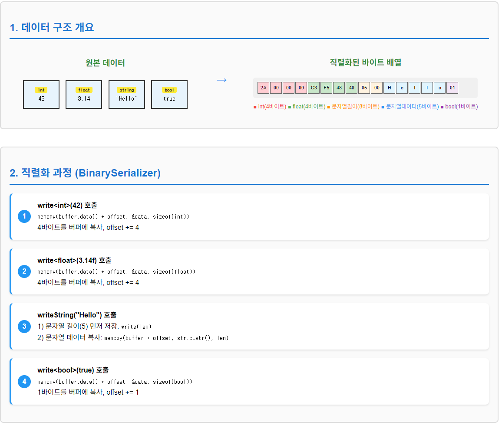  
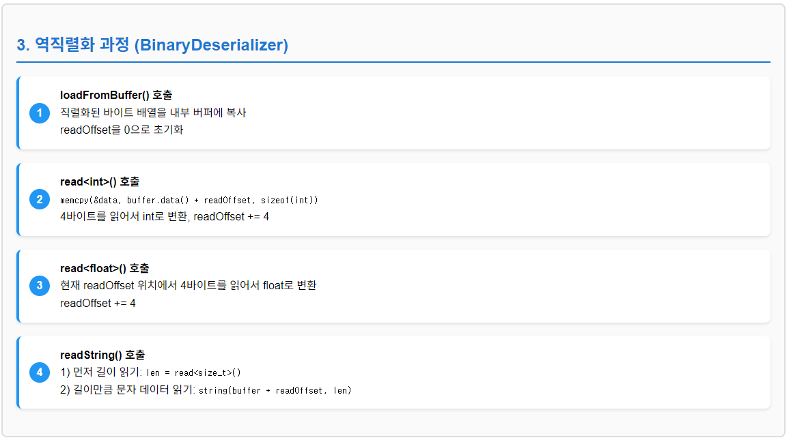   
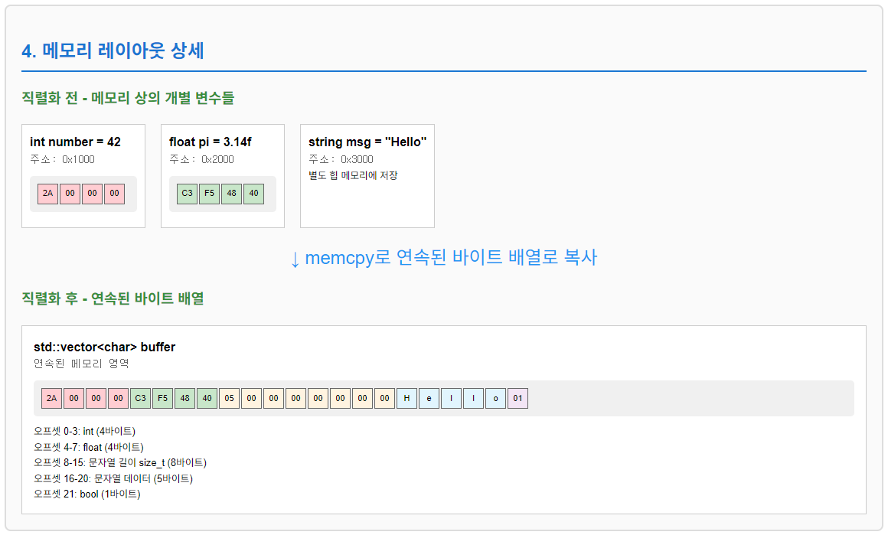   
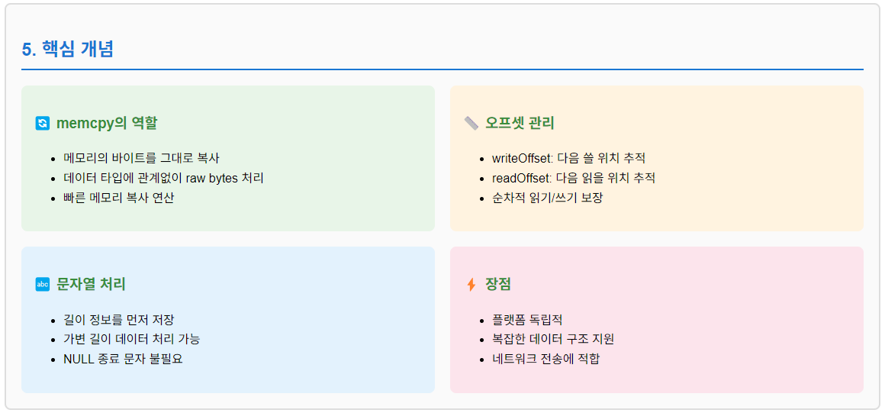     

      
#### 오픈 소스 라이브러리
[Google Protocol Buffer (Protobuf)](https://velog.io/@scarleter99/C%EA%B2%8C%EC%9E%84%EC%84%9C%EB%B2%84-5-3.-%ED%8C%A8%ED%82%B7-%EC%A7%81%EB%A0%AC%ED%99%94-Google-Protocol-Buffer-Protobuf )    
[Protocol Buffers Documentation](https://protobuf.dev/ )  
  


## 02 다양한 데이터 전송 방식

### 1. 송수신 모드
**블로킹 I/O vs 논블로킹 I/O**
- 블로킹 I/O: 작업이 완료될 때까지 스레드가 대기
- 논블로킹 I/O: 즉시 반환되며, 작업 완료 여부를 반환값으로 확인
  
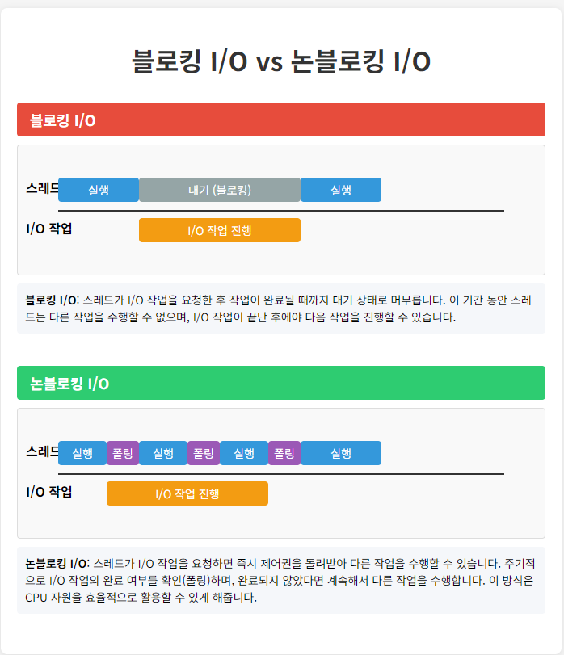 
  

**동기 I/O vs 비동기 I/O**
- 동기 I/O: 작업 완료 시점에 결과를 받음
- 비동기 I/O: 작업을 요청만 하고 완료 시 콜백 또는 이벤트로 통지받음  
  
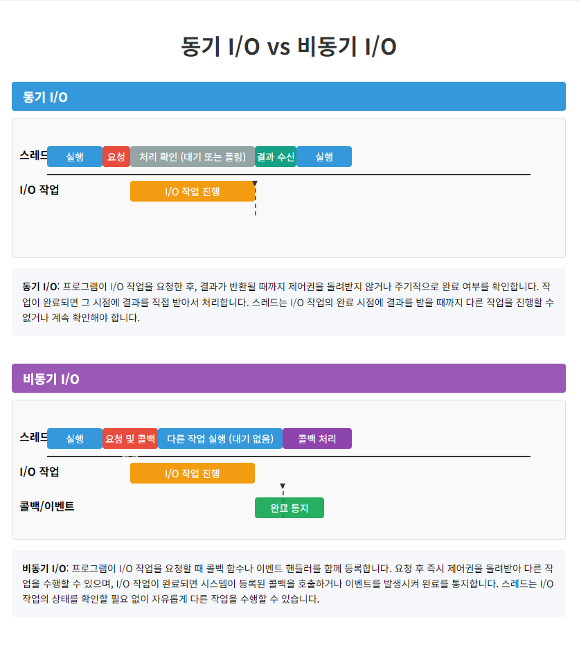   
  
  
### 2. 데이터 패킷 구조
게임 서버에서 일반적으로 사용되는 패킷 구조:  

1. **고정 길이 패킷**: 항상 같은 크기의 데이터
  
2. **가변 길이 패킷**: 데이터 크기가 가변적
  
3. **헤더-페이로드 구조**: 고정 길이 헤더 + 가변 길이 페이로드  
    ```cpp
    // 패킷 헤더 예시
    #pragma pack(push, 1)  // 구조체 패딩 제거
    struct PacketHeader {
        uint16_t size;      // 전체 패킷 크기
        uint16_t type;      // 패킷 유형
    };
    #pragma pack(pop)
    ```   
  
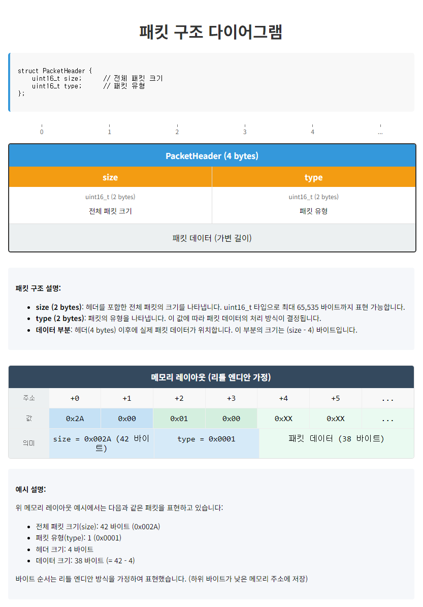   


### 3. 데이터 경계 처리
TCP는 스트림 지향 프로토콜이므로 메시지 경계를 보존하지 않습니다.    
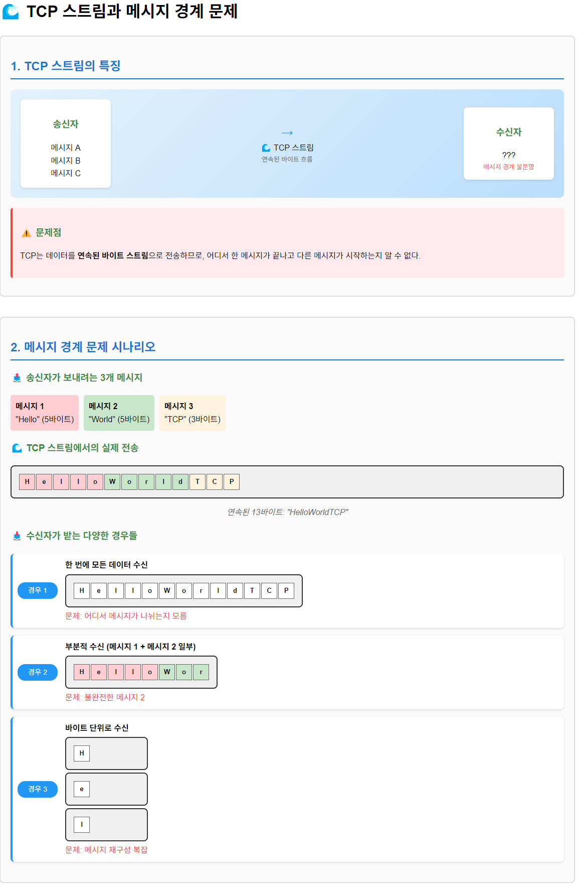 
  
경계 처리 방법으로는:
1. **고정 길이 패킷**: 항상 같은 크기로 송수신
2. **길이 필드 추가**: 데이터 앞에 길이 정보 추가
3. **구분자 사용**: 특별한 시퀀스로 메시지 끝 표시
4. **헤더-페이로드 구조**: 헤더에 페이로드 크기 정보 포함
  
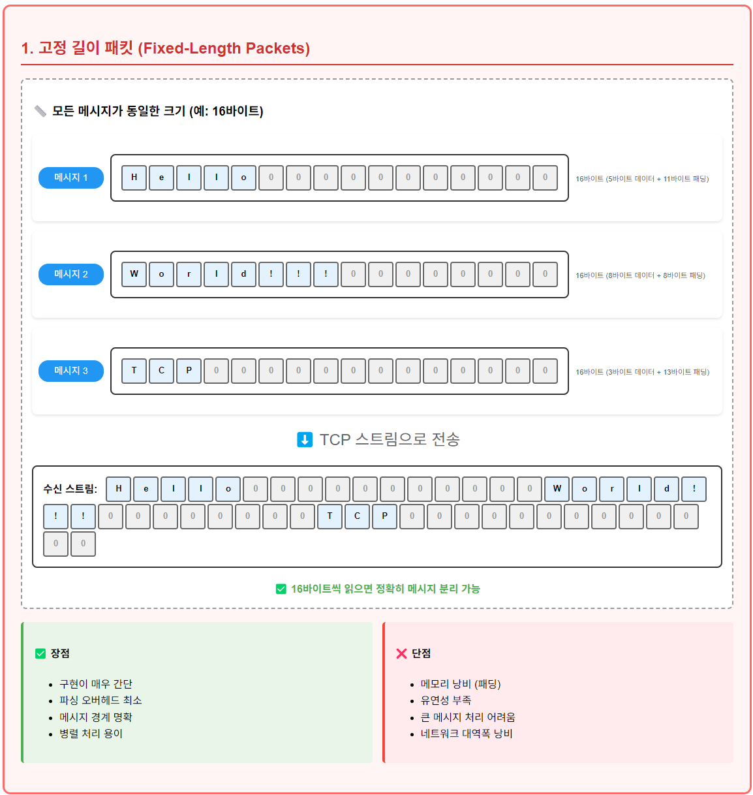  
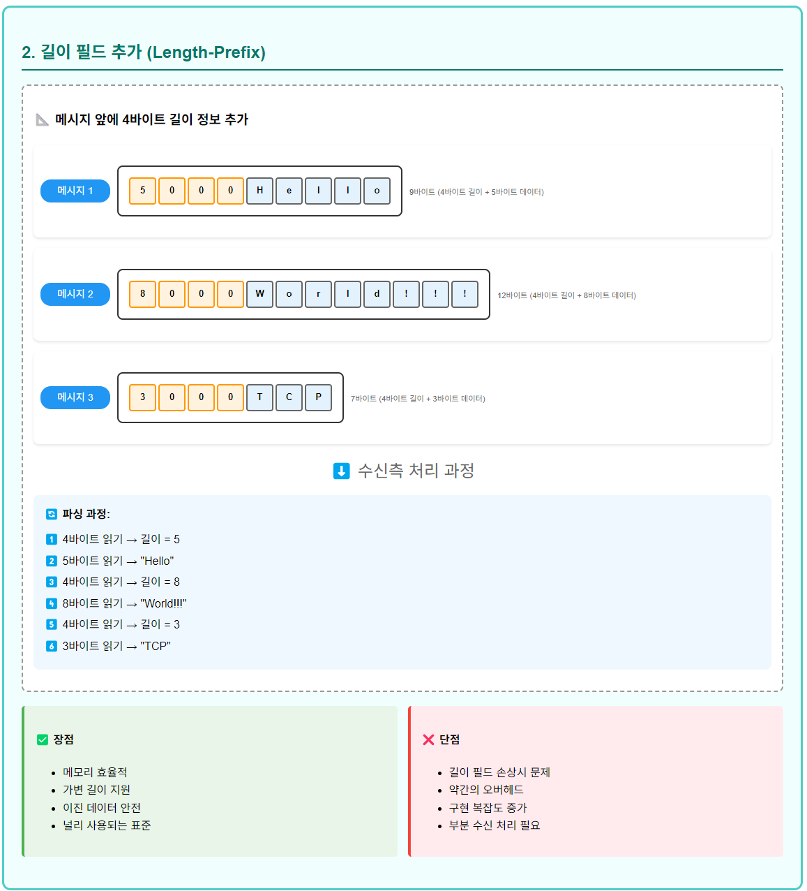   
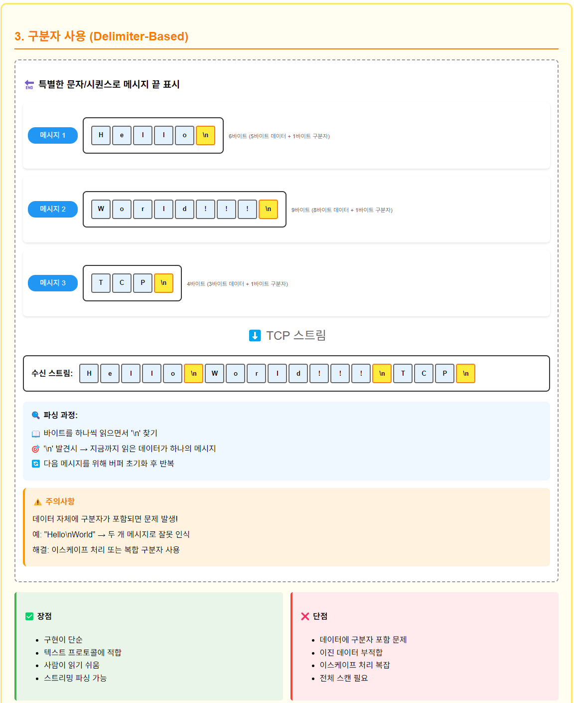   
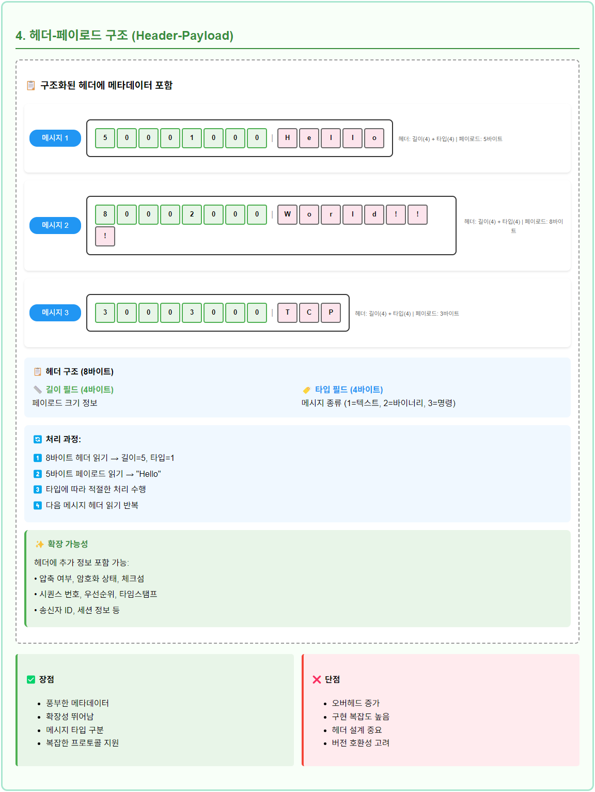      


## 실습: 고정 길이 데이터 전송 연습
고정 길이 데이터는 구현이 간단하지만 유연성이 떨어집니다. 다음은 플레이어 위치 정보를 고정 길이로 전송하는 예제입니다.    
  
<details>  
<summary>FixedLengthServer Code</summary>     
  
```cpp
#include <iostream>
#include <WinSock2.h>
#include <WS2tcpip.h>
#include <format>
#include <vector>
#include <thread>

#pragma comment(lib, "ws2_32.lib")

// 고정 길이 데이터 구조
#pragma pack(push, 1)
struct PlayerPosition {
    uint32_t playerId;
    float x;
    float y;
    float z;
    float rotation;
};
#pragma pack(pop)

// 서버 클래스
class FixedLengthServer {
private:
    SOCKET listenSocket;
    std::vector<std::thread> clientThreads;
    bool running;

public:
    FixedLengthServer() : listenSocket(INVALID_SOCKET), running(false) {}
    
    ~FixedLengthServer() {
        Stop();
    }
    
    bool Start(int port = 27015) {
        WSADATA wsaData;
        if (WSAStartup(MAKEWORD(2, 2), &wsaData) != 0) {
            std::cerr << "WSAStartup 실패\n";
            return false;
        }
        
        listenSocket = socket(AF_INET, SOCK_STREAM, IPPROTO_TCP);
        if (listenSocket == INVALID_SOCKET) {
            std::cerr << std::format("소켓 생성 실패: {}\n", WSAGetLastError());
            WSACleanup();
            return false;
        }
        
        sockaddr_in serverAddr;
        serverAddr.sin_family = AF_INET;
        serverAddr.sin_port = htons(port);
        serverAddr.sin_addr.s_addr = INADDR_ANY;
        
        if (bind(listenSocket, reinterpret_cast<sockaddr*>(&serverAddr), sizeof(serverAddr)) == SOCKET_ERROR) {
            std::cerr << std::format("바인딩 실패: {}\n", WSAGetLastError());
            closesocket(listenSocket);
            WSACleanup();
            return false;
        }
        
        if (listen(listenSocket, SOMAXCONN) == SOCKET_ERROR) {
            std::cerr << std::format("리슨 실패: {}\n", WSAGetLastError());
            closesocket(listenSocket);
            WSACleanup();
            return false;
        }
        
        running = true;
        std::cout << std::format("고정 길이 데이터 서버가 포트 {}에서 시작됨\n", port);
        
        // 클라이언트 연결 수락 스레드 시작
        std::thread acceptThread(&FixedLengthServer::AcceptClients, this);
        acceptThread.detach();
        
        return true;
    }
    
    void Stop() {
        running = false;
        
        if (listenSocket != INVALID_SOCKET) {
            closesocket(listenSocket);
            listenSocket = INVALID_SOCKET;
        }
        
        for (auto& thread : clientThreads) {
            if (thread.joinable()) {
                thread.join();
            }
        }
        
        clientThreads.clear();
        WSACleanup();
        std::cout << "서버가 중지됨\n";
    }
    
private:
    void AcceptClients() {
        while (running) {
            sockaddr_in clientAddr;
            int clientAddrLen = sizeof(clientAddr);
            
            SOCKET clientSocket = accept(listenSocket, reinterpret_cast<sockaddr*>(&clientAddr), &clientAddrLen);
            if (clientSocket == INVALID_SOCKET) {
                if (running) {
                    std::cerr << std::format("클라이언트 연결 수락 실패: {}\n", WSAGetLastError());
                }
                continue;
            }
            
            char clientIP[INET_ADDRSTRLEN];
            inet_ntop(AF_INET, &clientAddr.sin_addr, clientIP, INET_ADDRSTRLEN);
            std::cout << std::format("새 클라이언트 연결: {}:{}\n", clientIP, ntohs(clientAddr.sin_port));
            
            clientThreads.emplace_back(&FixedLengthServer::HandleClient, this, clientSocket);
        }
    }
    
    void HandleClient(SOCKET clientSocket) {
        PlayerPosition position;
        
        while (running) {
            // 고정 길이 데이터 수신 (한 번에 모두 받지 못할 수도 있음)
            int totalBytesReceived = 0;
            int bytesToReceive = sizeof(PlayerPosition);
            char* buffer = reinterpret_cast<char*>(&position);
            
            // 데이터를 완전히 수신할 때까지 반복
            while (totalBytesReceived < bytesToReceive) {
                int bytesReceived = recv(clientSocket, 
                                         buffer + totalBytesReceived, 
                                         bytesToReceive - totalBytesReceived, 
                                         0);
                
                if (bytesReceived <= 0) {
                    if (bytesReceived == 0) {
                        std::cout << "클라이언트 연결 종료\n";
                    } else {
                        std::cerr << std::format("recv 실패: {}\n", WSAGetLastError());
                    }
                    closesocket(clientSocket);
                    return;
                }
                
                totalBytesReceived += bytesReceived;
            }
            
            // 수신된 위치 정보 출력
            std::cout << std::format("플레이어 ID: {}, 위치: ({:.2f}, {:.2f}, {:.2f}), 회전: {:.2f}\n",
                                    position.playerId, position.x, position.y, position.z, position.rotation);
            
            // 응답으로 같은 데이터 전송
            int totalBytesSent = 0;
            int bytesToSend = sizeof(PlayerPosition);
            const char* sendBuffer = reinterpret_cast<const char*>(&position);
            
            while (totalBytesSent < bytesToSend) {
                int bytesSent = send(clientSocket, 
                                    sendBuffer + totalBytesSent, 
                                    bytesToSend - totalBytesSent, 
                                    0);
                
                if (bytesSent == SOCKET_ERROR) {
                    std::cerr << std::format("send 실패: {}\n", WSAGetLastError());
                    closesocket(clientSocket);
                    return;
                }
                
                totalBytesSent += bytesSent;
            }
        }
        
        closesocket(clientSocket);
    }
};

// 클라이언트 클래스
class FixedLengthClient {
private:
    SOCKET clientSocket;
    bool connected;
    
public:
    FixedLengthClient() : clientSocket(INVALID_SOCKET), connected(false) {}
    
    ~FixedLengthClient() {
        Disconnect();
    }
    
    bool Connect(const std::string& serverIP, int port = 27015) {
        WSADATA wsaData;
        if (WSAStartup(MAKEWORD(2, 2), &wsaData) != 0) {
            std::cerr << "WSAStartup 실패\n";
            return false;
        }
        
        clientSocket = socket(AF_INET, SOCK_STREAM, IPPROTO_TCP);
        if (clientSocket == INVALID_SOCKET) {
            std::cerr << std::format("소켓 생성 실패: {}\n", WSAGetLastError());
            WSACleanup();
            return false;
        }
        
        sockaddr_in serverAddr;
        serverAddr.sin_family = AF_INET;
        serverAddr.sin_port = htons(port);
        inet_pton(AF_INET, serverIP.c_str(), &serverAddr.sin_addr);
        
        if (connect(clientSocket, reinterpret_cast<sockaddr*>(&serverAddr), sizeof(serverAddr)) == SOCKET_ERROR) {
            std::cerr << std::format("서버 연결 실패: {}\n", WSAGetLastError());
            closesocket(clientSocket);
            WSACleanup();
            return false;
        }
        
        connected = true;
        std::cout << std::format("서버 {}:{}에 연결됨\n", serverIP, port);
        return true;
    }
    
    void Disconnect() {
        if (connected && clientSocket != INVALID_SOCKET) {
            closesocket(clientSocket);
            clientSocket = INVALID_SOCKET;
            connected = false;
            WSACleanup();
            std::cout << "서버와 연결 종료\n";
        }
    }
    
    bool SendPlayerPosition(uint32_t playerId, float x, float y, float z, float rotation) {
        if (!connected || clientSocket == INVALID_SOCKET) {
            std::cerr << "서버에 연결되지 않음\n";
            return false;
        }
        
        PlayerPosition position;
        position.playerId = playerId;
        position.x = x;
        position.y = y;
        position.z = z;
        position.rotation = rotation;
        
        // 고정 길이 데이터 전송
        int totalBytesSent = 0;
        int bytesToSend = sizeof(PlayerPosition);
        const char* buffer = reinterpret_cast<const char*>(&position);
        
        while (totalBytesSent < bytesToSend) {
            int bytesSent = send(clientSocket, 
                                buffer + totalBytesSent, 
                                bytesToSend - totalBytesSent, 
                                0);
            
            if (bytesSent == SOCKET_ERROR) {
                std::cerr << std::format("send 실패: {}\n", WSAGetLastError());
                return false;
            }
            
            totalBytesSent += bytesSent;
        }
        
        // 서버로부터 응답 수신
        PlayerPosition response;
        int totalBytesReceived = 0;
        int bytesToReceive = sizeof(PlayerPosition);
        char* recvBuffer = reinterpret_cast<char*>(&response);
        
        while (totalBytesReceived < bytesToReceive) {
            int bytesReceived = recv(clientSocket, 
                                    recvBuffer + totalBytesReceived, 
                                    bytesToReceive - totalBytesReceived, 
                                    0);
            
            if (bytesReceived <= 0) {
                if (bytesReceived == 0) {
                    std::cout << "서버 연결 종료\n";
                } else {
                    std::cerr << std::format("recv 실패: {}\n", WSAGetLastError());
                }
                return false;
            }
            
            totalBytesReceived += bytesReceived;
        }
        
        std::cout << "서버로부터 응답 수신: ";
        std::cout << std::format("플레이어 ID: {}, 위치: ({:.2f}, {:.2f}, {:.2f}), 회전: {:.2f}\n",
                                response.playerId, response.x, response.y, response.z, response.rotation);
        
        return true;
    }
};

// 테스트용 메인 함수 (서버)
int main() {
    // 한글 출력을 위한 설정
    SetConsoleOutputCP(CP_UTF8);
    
    std::cout << "1: 서버 모드, 2: 클라이언트 모드 - 선택: ";
    int mode;
    std::cin >> mode;
    
    if (mode == 1) {
        FixedLengthServer server;
        if (server.Start()) {
            std::cout << "서버가 시작되었습니다. 종료하려면 아무 키나 누르세요.\n";
            std::cin.ignore();
            std::cin.get();
            server.Stop();
        }
    } else if (mode == 2) {
        FixedLengthClient client;
        std::string serverIP;
        
        std::cout << "서버 IP를 입력하세요: ";
        std::cin.ignore();
        std::getline(std::cin, serverIP);
        
        if (client.Connect(serverIP)) {
            for (int i = 0; i < 5; i++) {
                // 랜덤 위치 데이터 생성 및 전송
                float x = static_cast<float>(rand() % 100);
                float y = static_cast<float>(rand() % 100);
                float z = static_cast<float>(rand() % 100);
                float rotation = static_cast<float>(rand() % 360);
                
                std::cout << std::format("위치 데이터 전송: ({:.2f}, {:.2f}, {:.2f}), 회전: {:.2f}\n", 
                                        x, y, z, rotation);
                
                client.SendPlayerPosition(1, x, y, z, rotation);
                std::this_thread::sleep_for(std::chrono::seconds(1));
            }
            
            client.Disconnect();
        }
    }
    
    return 0;
}
```  
</details>   
  

### C++ 소켓 통신 프로그램 분석
이 코드는 Windows 환경에서 동작하는 고정 길이 데이터 구조를 사용한 TCP 소켓 통신 프로그램입니다. 서버와 클라이언트 간에 플레이어의 위치 정보를 주고받는 기능을 구현하고 있습니다.

#### 주요 구성 요소
1. **PlayerPosition 구조체**: 플레이어 위치 데이터를 담는 고정 길이 구조체
2. **FixedLengthServer 클래스**: TCP 서버 기능 담당
3. **FixedLengthClient 클래스**: TCP 클라이언트 기능 담당
4. **메인 함수**: 서버/클라이언트 모드 선택 실행
  

#### 동작 원리 시각화  
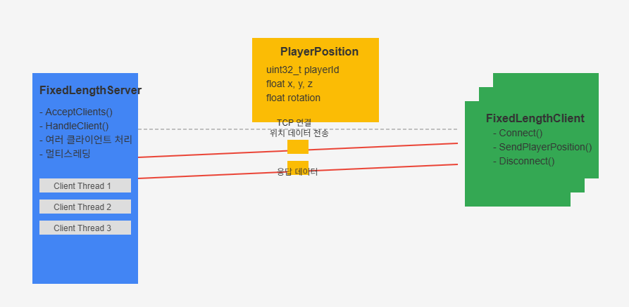  
  
  
#### 주요 특징 설명

##### 1. 고정 길이 데이터 구조
```cpp
#pragma pack(push, 1)
struct PlayerPosition {
    uint32_t playerId;
    float x;
    float y;
    float z;
    float rotation;
};
#pragma pack(pop)
```
- `#pragma pack(1)`을 사용하여 메모리 정렬 없이 1바이트 단위로 패킹
- 네트워크를 통해 바이너리 형태로 직접 전송 가능한 고정 길이 구조체
- 총 20바이트: playerId(4) + x(4) + y(4) + z(4) + rotation(4)
  
##### 2. 완전한 데이터 송수신 보장
```cpp
// 데이터를 완전히 수신할 때까지 반복
while (totalBytesReceived < bytesToReceive) {
    int bytesReceived = recv(clientSocket, 
                            buffer + totalBytesReceived, 
                            bytesToReceive - totalBytesReceived, 
                            0);
    // 오류 처리...
    totalBytesReceived += bytesReceived;
}
```
- TCP는 스트림 기반 프로토콜로 한 번에 모든 데이터가 오지 않을 수 있음
- 위 코드는 모든 데이터를 완전히 수신할 때까지 반복하여 데이터 무결성 보장

##### 3. 멀티스레딩 처리
- 서버는 클라이언트 연결 수락을 위한 별도 스레드 사용
- 각 클라이언트 연결마다 별도 스레드를 생성하여 동시에 여러 클라이언트 처리
- `clientThreads` 벡터로 모든 클라이언트 스레드 관리

##### 4. 서버-클라이언트 데이터 흐름
1. 클라이언트가 서버에 연결
2. 클라이언트가 PlayerPosition 데이터 생성 및 전송
3. 서버는 데이터 수신 후 내용 출력
4. 서버는 동일한 데이터를 클라이언트에게 응답으로 전송
5. 클라이언트는 응답 수신 후 내용 출력

#### 결론
이 코드는 게임 서버와 같은 환경에서 플레이어 위치 정보를 효율적으로 교환하기 위한 기본 구조를 제공합니다. 고정 길이 데이터 구조와 완전한 데이터 송수신 보장, 멀티스레딩을 통한 다중 클라이언트 처리가 주요 특징입니다.
  

## 실습: 가변 길이 데이터 전송 연습
가변 길이 데이터 전송은 길이 정보를 함께 전송하거나 특별한 종료 마커를 사용해야 합니다. 다음은 채팅 메시지를 가변 길이로 전송하는 예제입니다.  
패킷을 두 부분으로 나누어서 보냅니다. 
**고정 길이인 메시지의 Header를 먼저 보내고, 가변 길이가 되는 Body 데이터를 보냅니다**.
  
<details>
<summary>VariableLengthServer 코드</summary> 
  
```cpp
#include <iostream>
#include <WinSock2.h>
#include <WS2tcpip.h>
#include <format>
#include <vector>
#include <thread>
#include <string>

#pragma comment(lib, "ws2_32.lib")

// 채팅 메시지 헤더
#pragma pack(push, 1)
struct ChatMessageHeader {
    uint32_t messageLength;  // 메시지 내용 길이 (헤더 제외)
    uint32_t userId;         // 발신자 ID
};
#pragma pack(pop)

// 서버 클래스
class VariableLengthServer {
private:
    SOCKET listenSocket;
    std::vector<std::thread> clientThreads;
    bool running;

public:
    VariableLengthServer() : listenSocket(INVALID_SOCKET), running(false) {}
    
    ~VariableLengthServer() {
        Stop();
    }
    
    bool Start(int port = 27015) {
        WSADATA wsaData;
        if (WSAStartup(MAKEWORD(2, 2), &wsaData) != 0) {
            std::cerr << "WSAStartup 실패\n";
            return false;
        }
        
        listenSocket = socket(AF_INET, SOCK_STREAM, IPPROTO_TCP);
        if (listenSocket == INVALID_SOCKET) {
            std::cerr << std::format("소켓 생성 실패: {}\n", WSAGetLastError());
            WSACleanup();
            return false;
        }
        
        sockaddr_in serverAddr;
        serverAddr.sin_family = AF_INET;
        serverAddr.sin_port = htons(port);
        serverAddr.sin_addr.s_addr = INADDR_ANY;
        
        if (bind(listenSocket, reinterpret_cast<sockaddr*>(&serverAddr), sizeof(serverAddr)) == SOCKET_ERROR) {
            std::cerr << std::format("바인딩 실패: {}\n", WSAGetLastError());
            closesocket(listenSocket);
            WSACleanup();
            return false;
        }
        
        if (listen(listenSocket, SOMAXCONN) == SOCKET_ERROR) {
            std::cerr << std::format("리슨 실패: {}\n", WSAGetLastError());
            closesocket(listenSocket);
            WSACleanup();
            return false;
        }
        
        running = true;
        std::cout << std::format("가변 길이 데이터 서버가 포트 {}에서 시작됨\n", port);
        
        // 클라이언트 연결 수락 스레드 시작
        std::thread acceptThread(&VariableLengthServer::AcceptClients, this);
        acceptThread.detach();
        
        return true;
    }
    
    void Stop() {
        running = false;
        
        if (listenSocket != INVALID_SOCKET) {
            closesocket(listenSocket);
            listenSocket = INVALID_SOCKET;
        }
        
        for (auto& thread : clientThreads) {
            if (thread.joinable()) {
                thread.join();
            }
        }
        
        clientThreads.clear();
        WSACleanup();
        std::cout << "서버가 중지됨\n";
    }
    
private:
    void AcceptClients() {
        while (running) {
            sockaddr_in clientAddr;
            int clientAddrLen = sizeof(clientAddr);
            
            SOCKET clientSocket = accept(listenSocket, reinterpret_cast<sockaddr*>(&clientAddr), &clientAddrLen);
            if (clientSocket == INVALID_SOCKET) {
                if (running) {
                    std::cerr << std::format("클라이언트 연결 수락 실패: {}\n", WSAGetLastError());
                }
                continue;
            }
            
            char clientIP[INET_ADDRSTRLEN];
            inet_ntop(AF_INET, &clientAddr.sin_addr, clientIP, INET_ADDRSTRLEN);
            std::cout << std::format("새 클라이언트 연결: {}:{}\n", clientIP, ntohs(clientAddr.sin_port));
            
            clientThreads.emplace_back(&VariableLengthServer::HandleClient, this, clientSocket);
        }
    }
    
    void HandleClient(SOCKET clientSocket) {
        // 헤더 버퍼
        ChatMessageHeader header;
        
        while (running) {
            // 1. 헤더 수신 (고정 길이)
            int totalBytesReceived = 0;
            int bytesToReceive = sizeof(ChatMessageHeader);
            char* headerBuffer = reinterpret_cast<char*>(&header);
            
            // 헤더를 완전히 수신할 때까지 반복
            while (totalBytesReceived < bytesToReceive) {
                int bytesReceived = recv(clientSocket, 
                                        headerBuffer + totalBytesReceived, 
                                        bytesToReceive - totalBytesReceived, 
                                        0);
                
                if (bytesReceived <= 0) {
                    if (bytesReceived == 0) {
                        std::cout << "클라이언트 연결 종료\n";
                    } else {
                        std::cerr << std::format("헤더 수신 실패: {}\n", WSAGetLastError());
                    }
                    closesocket(clientSocket);
                    return;
                }
                
                totalBytesReceived += bytesReceived;
            }
            
            // 메시지 길이 및 사용자 ID 확인
            uint32_t messageLength = header.messageLength;
            uint32_t userId = header.userId;
            
            // 길이 검증 (최대 크기 제한)
            const uint32_t MAX_MESSAGE_LENGTH = 8192;
            if (messageLength == 0 || messageLength > MAX_MESSAGE_LENGTH) {
                std::cerr << std::format("잘못된 메시지 길이: {}\n", messageLength);
                closesocket(clientSocket);
                return;
            }
            
            // 2. 메시지 내용 수신 (가변 길이)
            std::vector<char> messageBuffer(messageLength + 1); // +1 for null terminator
            totalBytesReceived = 0;
            
            // 메시지를 완전히 수신할 때까지 반복
            while (totalBytesReceived < messageLength) {
                int bytesReceived = recv(clientSocket, 
                                        messageBuffer.data() + totalBytesReceived, 
                                        messageLength - totalBytesReceived, 
                                        0);
                
                if (bytesReceived <= 0) {
                    if (bytesReceived == 0) {
                        std::cout << "클라이언트 연결 종료\n";
                    } else {
                        std::cerr << std::format("메시지 내용 수신 실패: {}\n", WSAGetLastError());
                    }
                    closesocket(clientSocket);
                    return;
                }
                
                totalBytesReceived += bytesReceived;
            }
            
            // 문자열 종료 널 문자 추가
            messageBuffer[messageLength] = '\0';
            
            // 수신된 메시지 출력
            std::cout << std::format("사용자 ID {}: {}\n", userId, messageBuffer.data());
            
            // 3. 응답 메시지 생성 (에코)
            std::string responseMessage = std::format("서버 응답: {}", messageBuffer.data());
            
            // 4. 응답 헤더 준비
            ChatMessageHeader responseHeader;
            responseHeader.messageLength = static_cast<uint32_t>(responseMessage.length());
            responseHeader.userId = 0; // 서버 ID는 0
            
            // 5. 응답 헤더 전송
            int totalBytesSent = 0;
            int bytesToSend = sizeof(ChatMessageHeader);
            const char* sendHeaderBuffer = reinterpret_cast<const char*>(&responseHeader);
            
            while (totalBytesSent < bytesToSend) {
                int bytesSent = send(clientSocket, 
                                    sendHeaderBuffer + totalBytesSent, 
                                    bytesToSend - totalBytesSent, 
                                    0);
                
                if (bytesSent == SOCKET_ERROR) {
                    std::cerr << std::format("응답 헤더 전송 실패: {}\n", WSAGetLastError());
                    closesocket(clientSocket);
                    return;
                }
                
                totalBytesSent += bytesSent;
            }
            
            // 6. 응답 메시지 내용 전송
            totalBytesSent = 0;
            bytesToSend = static_cast<int>(responseMessage.length());
            
            while (totalBytesSent < bytesToSend) {
                int bytesSent = send(clientSocket, 
                                    responseMessage.c_str() + totalBytesSent, 
                                    bytesToSend - totalBytesSent, 
                                    0);
                
                if (bytesSent == SOCKET_ERROR) {
                    std::cerr << std::format("응답 메시지 전송 실패: {}\n", WSAGetLastError());
                    closesocket(clientSocket);
                    return;
                }
                
                totalBytesSent += bytesSent;
            }
        }
        
        closesocket(clientSocket);
    }
};

// 클라이언트 클래스
class VariableLengthClient {
private:
    SOCKET clientSocket;
    bool connected;
    
public:
    VariableLengthClient() : clientSocket(INVALID_SOCKET), connected(false) {}
    
    ~VariableLengthClient() {
        Disconnect();
    }
    
    bool Connect(const std::string& serverIP, int port = 27015) {
        WSADATA wsaData;
        if (WSAStartup(MAKEWORD(2, 2), &wsaData) != 0) {
            std::cerr << "WSAStartup 실패\n";
            return false;
        }
        
        clientSocket = socket(AF_INET, SOCK_STREAM, IPPROTO_TCP);
        if (clientSocket == INVALID_SOCKET) {
            std::cerr << std::format("소켓 생성 실패: {}\n", WSAGetLastError());
            WSACleanup();
            return false;
        }
        
        sockaddr_in serverAddr;
        serverAddr.sin_family = AF_INET;
        serverAddr.sin_port = htons(port);
        inet_pton(AF_INET, serverIP.c_str(), &serverAddr.sin_addr);
        
        if (connect(clientSocket, reinterpret_cast<sockaddr*>(&serverAddr), sizeof(serverAddr)) == SOCKET_ERROR) {
            std::cerr << std::format("서버 연결 실패: {}\n", WSAGetLastError());
            closesocket(clientSocket);
            WSACleanup();
            return false;
        }
        
        connected = true;
        std::cout << std::format("서버 {}:{}에 연결됨\n", serverIP, port);
        return true;
    }
    
    void Disconnect() {
        if (connected && clientSocket != INVALID_SOCKET) {
            closesocket(clientSocket);
            clientSocket = INVALID_SOCKET;
            connected = false;
            WSACleanup();
            std::cout << "서버와 연결 종료\n";
        }
    }
    
    bool SendChatMessage(uint32_t userId, const std::string& message) {
        if (!connected || clientSocket == INVALID_SOCKET) {
            std::cerr << "서버에 연결되지 않음\n";
            return false;
        }
        
        // 1. 헤더 준비
        ChatMessageHeader header;
        header.messageLength = static_cast<uint32_t>(message.length());
        header.userId = userId;
        
        // 2. 헤더 전송
        int totalBytesSent = 0;
        int bytesToSend = sizeof(ChatMessageHeader);
        const char* headerBuffer = reinterpret_cast<const char*>(&header);
        
        while (totalBytesSent < bytesToSend) {
            int bytesSent = send(clientSocket, 
                                headerBuffer + totalBytesSent, 
                                bytesToSend - totalBytesSent, 
                                0);
            
            if (bytesSent == SOCKET_ERROR) {
                std::cerr << std::format("헤더 전송 실패: {}\n", WSAGetLastError());
                return false;
            }
            
            totalBytesSent += bytesSent;
        }
        
        // 3. 메시지 내용 전송
        totalBytesSent = 0;
        bytesToSend = static_cast<int>(message.length());
        
        while (totalBytesSent < bytesToSend) {
            int bytesSent = send(clientSocket, 
                                message.c_str() + totalBytesSent, 
                                bytesToSend - totalBytesSent, 
                                0);
            
            if (bytesSent == SOCKET_ERROR) {
                std::cerr << std::format("메시지 내용 전송 실패: {}\n", WSAGetLastError());
                return false;
            }
            
            totalBytesSent += bytesSent;
        }
        
        // 4. 응답 헤더 수신
        ChatMessageHeader responseHeader;
        int totalBytesReceived = 0;
        int bytesToReceive = sizeof(ChatMessageHeader);
        char* responseHeaderBuffer = reinterpret_cast<char*>(&responseHeader);
        
        while (totalBytesReceived < bytesToReceive) {
            int bytesReceived = recv(clientSocket, 
                                    responseHeaderBuffer + totalBytesReceived, 
                                    bytesToReceive - totalBytesReceived, 
                                    0);
            
            if (bytesReceived <= 0) {
                if (bytesReceived == 0) {
                    std::cout << "서버 연결 종료\n";
                } else {
                    std::cerr << std::format("응답 헤더 수신 실패: {}\n", WSAGetLastError());
                }
                return false;
            }
            
            totalBytesReceived += bytesReceived;
        }
        
        // 5. 응답 메시지 내용 수신
        uint32_t responseMessageLength = responseHeader.messageLength;
        
        // 길이 검증
        const uint32_t MAX_MESSAGE_LENGTH = 8192;
        if (responseMessageLength == 0 || responseMessageLength > MAX_MESSAGE_LENGTH) {
            std::cerr << std::format("잘못된 응답 메시지 길이: {}\n", responseMessageLength);
            return false;
        }
        
        std::vector<char> responseBuffer(responseMessageLength + 1); // +1 for null terminator
        totalBytesReceived = 0;
        
        while (totalBytesReceived < responseMessageLength) {
            int bytesReceived = recv(clientSocket, 
                                    responseBuffer.data() + totalBytesReceived, 
                                    responseMessageLength - totalBytesReceived, 
                                    0);
            
            if (bytesReceived <= 0) {
                if (bytesReceived == 0) {
                    std::cout << "서버 연결 종료\n";
                } else {
                    std::cerr << std::format("응답 메시지 수신 실패: {}\n", WSAGetLastError());
                }
                return false;
            }
            
            totalBytesReceived += bytesReceived;
        }
        
        // 문자열 종료 널 문자 추가
        responseBuffer[responseMessageLength] = '\0';
        
        // 응답 메시지 출력
        std::cout << "서버로부터 응답: " << responseBuffer.data() << std::endl;
        
        return true;
    }
};

// 테스트용 메인 함수
int main() {
    // 한글 출력을 위한 설정
    SetConsoleOutputCP(CP_UTF8);
    
    std::cout << "1: 서버 모드, 2: 클라이언트 모드 - 선택: ";
    int mode;
    std::cin >> mode;
    
    if (mode == 1) {
        VariableLengthServer server;
        if (server.Start()) {
            std::cout << "서버가 시작되었습니다. 종료하려면 아무 키나 누르세요.\n";
            std::cin.ignore();
            std::cin.get();
            server.Stop();
        }
    } else if (mode == 2) {
        VariableLengthClient client;
        std::string serverIP;
        
        std::cout << "서버 IP를 입력하세요: ";
        std::cin.ignore();
        std::getline(std::cin, serverIP);
        
        if (client.Connect(serverIP)) {
            uint32_t userId = 1001;
            
            while (true) {
                std::string message;
                std::cout << "전송할 메시지 (종료: exit): ";
                std::getline(std::cin, message);
                
                if (message == "exit") {
                    break;
                }
                
                client.SendChatMessage(userId, message);
            }
            
            client.Disconnect();
        }
    }
    
    return 0;
}
```   
</details>  
    
이 코드는 **가변 길이 데이터를 처리하는 TCP 클라이언트-서버 시스템**이다. 채팅 메시지 형태로 헤더 + 데이터 구조를 사용하여 안전하게 가변 길이 데이터를 주고받는다.

### 핵심 구조

#### 1. 메시지 프로토콜 구조

```
[헤더 8바이트] + [메시지 내용 (가변길이)]
```    
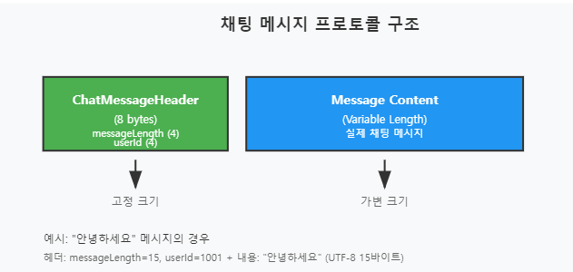    
  

#### 2. 핵심 클래스들
**VariableLengthServer**: 다중 클라이언트를 처리하는 서버
- 각 클라이언트마다 별도 스레드로 처리
- 가변 길이 메시지를 안전하게 수신/송신

**VariableLengthClient**: 서버와 통신하는 클라이언트
- 메시지 전송 후 응답 대기
- 에코 서버 형태로 서버 응답을 출력

### 주요 동작 과정
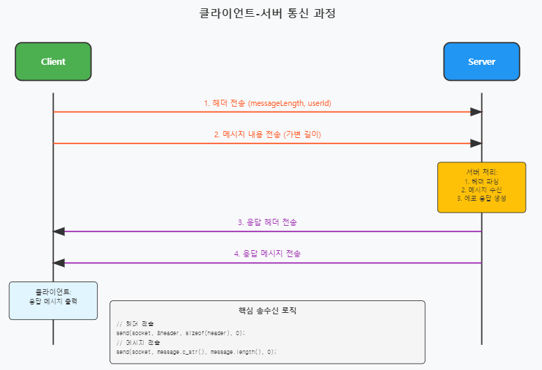    

### 중요한 기술적 특징들

#### 1. **완전한 데이터 수신/송신 보장**
```cpp
// 헤더를 완전히 수신할 때까지 반복
while (totalBytesReceived < bytesToReceive) {
    int bytesReceived = recv(clientSocket, 
                            headerBuffer + totalBytesReceived, 
                            bytesToReceive - totalBytesReceived, 
                            0);
    // ...
    totalBytesReceived += bytesReceived;
}
```

TCP는 스트림 방식이므로 한 번의 recv/send로 모든 데이터가 전송되지 않을 수 있다. 따라서 루프를 통해 완전한 전송을 보장한다.  

#### 2. **메모리 정렬과 헤더 구조**
```cpp
#pragma pack(push, 1)
struct ChatMessageHeader {
    uint32_t messageLength;  // 4바이트
    uint32_t userId;         // 4바이트
};
#pragma pack(pop)
```

`#pragma pack(1)`으로 구조체 패딩을 제거하여 정확히 8바이트 크기를 보장한다.

#### 3. **에러 처리 및 검증**
```cpp
const uint32_t MAX_MESSAGE_LENGTH = 8192;
if (messageLength == 0 || messageLength > MAX_MESSAGE_LENGTH) {
    std::cerr << std::format("잘못된 메시지 길이: {}\n", messageLength);
    closesocket(clientSocket);
    return;
}
```

메시지 길이 검증을 통해 비정상적인 데이터나 공격을 방지한다.

#### 4. **멀티스레딩 처리**
```cpp
std::thread acceptThread(&VariableLengthServer::AcceptClients, this);
acceptThread.detach();

// 클라이언트별 스레드 생성
clientThreads.emplace_back(&VariableLengthServer::HandleClient, this, clientSocket);
```

서버는 여러 클라이언트를 동시에 처리할 수 있도록 각 클라이언트마다 별도 스레드를 생성한다.

### 전체 동작 플로우
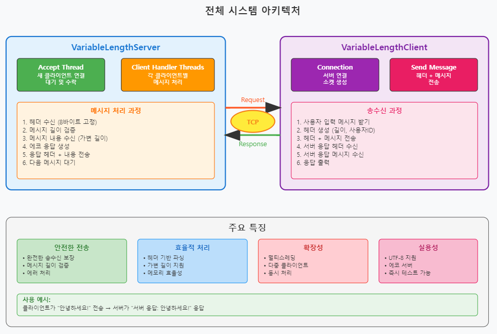 
  
### 실행 방법
1. **서버 실행**: 프로그램 실행 후 `1` 선택
2. **클라이언트 실행**: 다른 터미널에서 프로그램 실행 후 `2` 선택
3. **통신**: 클라이언트에서 메시지 입력하면 서버가 에코 응답

이 코드는 네트워크 프로그래밍에서 **가변 길이 데이터를 안전하게 처리하는 표준적인 방법**을 잘 보여준다. 특히 TCP의 스트림 특성을 고려한 완전한 송수신 보장과 헤더 기반 프로토콜 설계가 핵심이다.    
  
  

## 실습: 고정 길이 + 가변 길이 데이터 전송 연습
온라인 게임에서는 고정 길이 헤더와 가변 길이 페이로드 구조가 일반적입니다. 아이템 거래 시스템을 예로 구현해 보겠습니다.  
아래의 코드는 Server와 Client 코드 같이 있어서 실행할 때 어느쪽으로 실행할지 선택할 수 있다.  

코드를 보기 편하고, 동작을 쉽게 하기 위해서 두 개의 코드로 나누었고 아래 디렉토리에 있다.   
`codes/tcp_MixedLengthServer` , `codes/tcp_MixedLengthClient`      


<details>
<summary>MixedLength Server-Client 코드</summary>  
  
```cpp
#include <iostream>
#include <WinSock2.h>
#include <WS2tcpip.h>
#include <format>
#include <vector>
#include <thread>
#include <string>
#include <map>

#pragma comment(lib, "ws2_32.lib")

// 패킷 유형 정의
enum PacketType {
    PT_TRADE_REQUEST = 1,
    PT_TRADE_RESPONSE,
    PT_CHAT_MESSAGE,
    PT_PLAYER_MOVE
};

// 패킷 헤더 (고정 길이)
#pragma pack(push, 1)
struct PacketHeader {
    uint16_t totalSize;     // 헤더 포함 전체 패킷 크기
    uint16_t packetType;    // 패킷 유형 (PacketType enum)
};

// 아이템 구조체 (고정 길이)
struct Item {
    uint32_t itemId;        // 아이템 고유 ID
    uint16_t quantity;      // 수량
    uint16_t category;      // 카테고리 (무기, 방어구 등)
};

// 거래 요청 패킷 (고정 길이 + 가변 길이)
struct TradeRequestPacket {
    uint32_t requesterId;   // 요청자 ID
    uint32_t targetId;      // 대상자 ID
    uint16_t itemCount;     // 아이템 수
    // 이후에 Item 배열과 추가 메시지(문자열)이 가변 길이로 옴
};
#pragma pack(pop)

// 서버 클래스
class MixedLengthServer {
private:
    SOCKET listenSocket;
    std::vector<std::thread> clientThreads;
    bool running;
    
    // 클라이언트 ID와 소켓 매핑
    std::map<uint32_t, SOCKET> clientSockets;

public:
    MixedLengthServer() : listenSocket(INVALID_SOCKET), running(false) {}
    
    ~MixedLengthServer() {
        Stop();
    }
    
    bool Start(int port = 27015) {
        WSADATA wsaData;
        if (WSAStartup(MAKEWORD(2, 2), &wsaData) != 0) {
            std::cerr << "WSAStartup 실패\n";
            return false;
        }
        
        listenSocket = socket(AF_INET, SOCK_STREAM, IPPROTO_TCP);
        if (listenSocket == INVALID_SOCKET) {
            std::cerr << std::format("소켓 생성 실패: {}\n", WSAGetLastError());
            WSACleanup();
            return false;
        }
        
        sockaddr_in serverAddr;
        serverAddr.sin_family = AF_INET;
        serverAddr.sin_port = htons(port);
        serverAddr.sin_addr.s_addr = INADDR_ANY;
        
        if (bind(listenSocket, reinterpret_cast<sockaddr*>(&serverAddr), sizeof(serverAddr)) == SOCKET_ERROR) {
            std::cerr << std::format("바인딩 실패: {}\n", WSAGetLastError());
            closesocket(listenSocket);
            WSACleanup();
            return false;
        }
        
        if (listen(listenSocket, SOMAXCONN) == SOCKET_ERROR) {
            std::cerr << std::format("리슨 실패: {}\n", WSAGetLastError());
            closesocket(listenSocket);
            WSACleanup();
            return false;
        }
        
        running = true;
        std::cout << std::format("혼합 길이 데이터 서버가 포트 {}에서 시작됨\n", port);
        
        // 클라이언트 연결 수락 스레드 시작
        std::thread acceptThread(&MixedLengthServer::AcceptClients, this);
        acceptThread.detach();
        
        return true;
    }
    
    void Stop() {
        running = false;
        
        if (listenSocket != INVALID_SOCKET) {
            closesocket(listenSocket);
            listenSocket = INVALID_SOCKET;
        }
        
        // 모든 클라이언트 소켓 닫기
        for (const auto& [userId, socket] : clientSockets) {
            closesocket(socket);
        }
        clientSockets.clear();
        
        for (auto& thread : clientThreads) {
            if (thread.joinable()) {
                thread.join();
            }
        }
        
        clientThreads.clear();
        WSACleanup();
        std::cout << "서버가 중지됨\n";
    }
    
private:
    void AcceptClients() {
        while (running) {
            sockaddr_in clientAddr;
            int clientAddrLen = sizeof(clientAddr);
            
            SOCKET clientSocket = accept(listenSocket, reinterpret_cast<sockaddr*>(&clientAddr), &clientAddrLen);
            if (clientSocket == INVALID_SOCKET) {
                if (running) {
                    std::cerr << std::format("클라이언트 연결 수락 실패: {}\n", WSAGetLastError());
                }
                continue;
            }
            
            char clientIP[INET_ADDRSTRLEN];
            inet_ntop(AF_INET, &clientAddr.sin_addr, clientIP, INET_ADDRSTRLEN);
            std::cout << std::format("새 클라이언트 연결: {}:{}\n", clientIP, ntohs(clientAddr.sin_port));
            
            // 임시 사용자 ID 생성 (실제 게임에서는 로그인 과정에서 처리)
            static uint32_t nextUserId = 1000;
            uint32_t userId = nextUserId++;
            
            // 클라이언트 소켓 저장
            clientSockets[userId] = clientSocket;
            
            // 클라이언트 처리 스레드 시작
            clientThreads.emplace_back(&MixedLengthServer::HandleClient, this, clientSocket, userId);
        }
    }
    
    void HandleClient(SOCKET clientSocket, uint32_t userId) {
        std::cout << std::format("클라이언트 ID {}가 연결됨\n", userId);
        
        // 패킷 처리 루프
        while (running) {
            // 1. 패킷 헤더 수신
            PacketHeader header;
            int bytesReceived = recv(clientSocket, reinterpret_cast<char*>(&header), sizeof(header), 0);
            
            if (bytesReceived <= 0) {
                if (bytesReceived == 0) {
                    std::cout << std::format("클라이언트 ID {}가 연결 종료\n", userId);
                } else {
                    std::cerr << std::format("헤더 수신 실패: {}\n", WSAGetLastError());
                }
                break;
            }
            
            if (bytesReceived != sizeof(header)) {
                std::cerr << "불완전한 헤더 수신됨\n";
                break;
            }
            
            // 2. 패킷 크기 검증
            uint16_t totalSize = header.totalSize;
            uint16_t dataSize = totalSize - sizeof(header);
            
            if (totalSize < sizeof(header) || dataSize > 8192) {
                std::cerr << std::format("잘못된 패킷 크기: {}\n", totalSize);
                break;
            }
            
            // 3. 패킷 데이터 수신
            std::vector<char> packetData(dataSize);
            int totalBytesReceived = 0;
            
            while (totalBytesReceived < dataSize) {
                bytesReceived = recv(clientSocket, 
                                    packetData.data() + totalBytesReceived, 
                                    dataSize - totalBytesReceived, 
                                    0);
                
                if (bytesReceived <= 0) {
                    if (bytesReceived == 0) {
                        std::cout << "클라이언트 연결 종료\n";
                    } else {
                        std::cerr << std::format("데이터 수신 실패: {}\n", WSAGetLastError());
                    }
                    closesocket(clientSocket);
                    clientSockets.erase(userId);
                    return;
                }
                
                totalBytesReceived += bytesReceived;
            }
            
            // 4. 패킷 유형에 따른 처리
            switch (header.packetType) {
                case PT_TRADE_REQUEST:
                    HandleTradeRequest(clientSocket, userId, packetData.data(), dataSize);
                    break;
                    
                case PT_CHAT_MESSAGE:
                    // 채팅 메시지 처리 (구현 생략)
                    std::cout << "채팅 메시지 패킷 수신됨\n";
                    break;
                    
                case PT_PLAYER_MOVE:
                    // 플레이어 이동 처리 (구현 생략)
                    std::cout << "플레이어 이동 패킷 수신됨\n";
                    break;
                    
                default:
                    std::cerr << std::format("알 수 없는 패킷 유형: {}\n", header.packetType);
                    break;
            }
        }
        
        // 연결 종료 처리
        closesocket(clientSocket);
        clientSockets.erase(userId);
    }
    
    void HandleTradeRequest(SOCKET clientSocket, uint32_t senderId, const char* data, uint16_t dataSize) {
        // 거래 요청 패킷 파싱
        if (dataSize < sizeof(TradeRequestPacket)) {
            std::cerr << "거래 요청 패킷이 너무 작음\n";
            return;
        }
        
        const TradeRequestPacket* tradeRequest = reinterpret_cast<const TradeRequestPacket*>(data);
        
        // 아이템 목록의 시작 위치
        const char* itemsData = data + sizeof(TradeRequestPacket);
        uint16_t itemsDataSize = sizeof(Item) * tradeRequest->itemCount;
        
        // 아이템 데이터 크기 검증
        if (sizeof(TradeRequestPacket) + itemsDataSize > dataSize) {
            std::cerr << "아이템 데이터가 패킷보다 큼\n";
            return;
        }
        
        // 아이템 목록 파싱
        std::vector<Item> items;
        for (uint16_t i = 0; i < tradeRequest->itemCount; i++) {
            const Item* item = reinterpret_cast<const Item*>(itemsData + i * sizeof(Item));
            items.push_back(*item);
        }
        
        // 추가 메시지 파싱 (있는 경우)
        std::string message;
        if (sizeof(TradeRequestPacket) + itemsDataSize < dataSize) {
            const char* messageData = itemsData + itemsDataSize;
            uint16_t messageSize = dataSize - sizeof(TradeRequestPacket) - itemsDataSize;
            message = std::string(messageData, messageSize);
        }
        
        // 거래 요청 정보 출력
        std::cout << std::format("거래 요청 수신: 요청자={}, 대상자={}, 아이템 수={}\n", 
                             tradeRequest->requesterId, tradeRequest->targetId, tradeRequest->itemCount);
        
        for (const auto& item : items) {
            std::cout << std::format("  아이템 ID: {}, 수량: {}, 카테고리: {}\n", 
                                 item.itemId, item.quantity, item.category);
        }
        
        if (!message.empty()) {
            std::cout << std::format("  메시지: {}\n", message);
        }
        
        // 대상 클라이언트에게 거래 요청 전달 (실제 구현 생략)
        uint32_t targetId = tradeRequest->targetId;
        if (clientSockets.find(targetId) != clientSockets.end()) {
            std::cout << std::format("대상 클라이언트 ID {}에게 거래 요청 전달\n", targetId);
            
            // 여기서 대상 클라이언트에게 패킷 전달 로직 구현 필요
        } else {
            std::cout << std::format("대상 클라이언트 ID {}가 연결되어 있지 않음\n", targetId);
            
            // 요청자에게 실패 응답 보내기
            SendTradeResponse(clientSocket, senderId, tradeRequest->requesterId, false, "대상 플레이어가 접속 중이 아닙니다.");
        }
    }
    
    void SendTradeResponse(SOCKET clientSocket, uint32_t senderId, uint32_t targetId, bool accepted, const std::string& message) {
        // 1. 응답 패킷 헤더 준비
        PacketHeader header;
        header.packetType = PT_TRADE_RESPONSE;
        
        // 2. 응답 데이터 준비
        struct TradeResponseData {
            uint32_t senderId;
            uint32_t targetId;
            uint8_t accepted;
        };
        
        TradeResponseData responseData;
        responseData.senderId = senderId;
        responseData.targetId = targetId;
        responseData.accepted = accepted ? 1 : 0;
        
        // 3. 전체 패킷 크기 계산
        uint16_t totalSize = sizeof(header) + sizeof(responseData) + static_cast<uint16_t>(message.length());
        header.totalSize = totalSize;
        
        // 4. 패킷 버퍼 생성 및 데이터 복사
        std::vector<char> packetBuffer(totalSize);
        char* bufferPtr = packetBuffer.data();
        
        // 헤더 복사
        memcpy(bufferPtr, &header, sizeof(header));
        bufferPtr += sizeof(header);
        
        // 응답 데이터 복사
        memcpy(bufferPtr, &responseData, sizeof(responseData));
        bufferPtr += sizeof(responseData);
        
        // 메시지 복사
        memcpy(bufferPtr, message.c_str(), message.length());
        
        // 5. 패킷 전송
        int totalBytesSent = 0;
        while (totalBytesSent < totalSize) {
            int bytesSent = send(clientSocket, 
                                packetBuffer.data() + totalBytesSent, 
                                totalSize - totalBytesSent, 
                                0);
            
            if (bytesSent == SOCKET_ERROR) {
                std::cerr << std::format("거래 응답 전송 실패: {}\n", WSAGetLastError());
                return;
            }
            
            totalBytesSent += bytesSent;
        }
        
        std::cout << std::format("클라이언트 ID {}에게 거래 응답 전송됨. 수락: {}\n", targetId, accepted ? "예" : "아니오");
    }
};

// 클라이언트 클래스
class MixedLengthClient {
private:
    SOCKET clientSocket;
    bool connected;
    uint32_t userId;
    
public:
    MixedLengthClient() : clientSocket(INVALID_SOCKET), connected(false), userId(0) {}
    
    ~MixedLengthClient() {
        Disconnect();
    }
    
    bool Connect(const std::string& serverIP, int port = 27015, uint32_t userIdParam = 0) {
        WSADATA wsaData;
        if (WSAStartup(MAKEWORD(2, 2), &wsaData) != 0) {
            std::cerr << "WSAStartup 실패\n";
            return false;
        }
        
        clientSocket = socket(AF_INET, SOCK_STREAM, IPPROTO_TCP);
        if (clientSocket == INVALID_SOCKET) {
            std::cerr << std::format("소켓 생성 실패: {}\n", WSAGetLastError());
            WSACleanup();
            return false;
        }
        
        sockaddr_in serverAddr;
        serverAddr.sin_family = AF_INET;
        serverAddr.sin_port = htons(port);
        inet_pton(AF_INET, serverIP.c_str(), &serverAddr.sin_addr);
        
        if (connect(clientSocket, reinterpret_cast<sockaddr*>(&serverAddr), sizeof(serverAddr)) == SOCKET_ERROR) {
            std::cerr << std::format("서버 연결 실패: {}\n", WSAGetLastError());
            closesocket(clientSocket);
            WSACleanup();
            return false;
        }
        
        connected = true;
        userId = userIdParam;
        std::cout << std::format("서버 {}:{}에 연결됨\n", serverIP, port);
        return true;
    }
    
    void Disconnect() {
        if (connected && clientSocket != INVALID_SOCKET) {
            closesocket(clientSocket);
            clientSocket = INVALID_SOCKET;
            connected = false;
            WSACleanup();
            std::cout << "서버와 연결 종료\n";
        }
    }
    
    bool SendTradeRequest(uint32_t targetId, const std::vector<Item>& items, const std::string& message) {
        if (!connected || clientSocket == INVALID_SOCKET) {
            std::cerr << "서버에 연결되지 않음\n";
            return false;
        }
        
        // 1. 패킷 크기 계산
        uint16_t headerSize = sizeof(PacketHeader);
        uint16_t tradeRequestSize = sizeof(TradeRequestPacket);
        uint16_t itemsSize = static_cast<uint16_t>(items.size() * sizeof(Item));
        uint16_t messageSize = static_cast<uint16_t>(message.length());
        uint16_t totalSize = headerSize + tradeRequestSize + itemsSize + messageSize;
        
        // 2. 패킷 버퍼 생성
        std::vector<char> packetBuffer(totalSize);
        char* bufferPtr = packetBuffer.data();
        
        // 3. 헤더 설정
        PacketHeader header;
        header.totalSize = totalSize;
        header.packetType = PT_TRADE_REQUEST;
        memcpy(bufferPtr, &header, headerSize);
        bufferPtr += headerSize;
        
        // 4. 거래 요청 정보 설정
        TradeRequestPacket tradeRequest;
        tradeRequest.requesterId = userId;
        tradeRequest.targetId = targetId;
        tradeRequest.itemCount = static_cast<uint16_t>(items.size());
        memcpy(bufferPtr, &tradeRequest, tradeRequestSize);
        bufferPtr += tradeRequestSize;
        
        // 5. 아이템 정보 설정
        for (const auto& item : items) {
            memcpy(bufferPtr, &item, sizeof(Item));
            bufferPtr += sizeof(Item);
        }
        
        // 6. 메시지 추가 (있는 경우)
        if (!message.empty()) {
            memcpy(bufferPtr, message.c_str(), messageSize);
        }
        
        // 7. 패킷 전송
        int totalBytesSent = 0;
        while (totalBytesSent < totalSize) {
            int bytesSent = send(clientSocket, 
                               packetBuffer.data() + totalBytesSent, 
                               totalSize - totalBytesSent, 
                               0);
            
            if (bytesSent == SOCKET_ERROR) {
                std::cerr << std::format("거래 요청 전송 실패: {}\n", WSAGetLastError());
                return false;
            }
            
            totalBytesSent += bytesSent;
        }
        
        std::cout << std::format("플레이어 ID {}에게 거래 요청 전송됨. 아이템 {}개, 메시지: {}\n", 
                             targetId, items.size(), message);
        
        // 8. 응답 수신 (별도 스레드나 콜백으로 처리할 수 있음)
        // 여기서는 간단하게 동기적으로 응답 기다림
        PacketHeader responseHeader;
        int bytesReceived = recv(clientSocket, reinterpret_cast<char*>(&responseHeader), sizeof(responseHeader), 0);
        
        if (bytesReceived != sizeof(responseHeader)) {
            std::cerr << "응답 헤더 수신 실패\n";
            return false;
        }
        
        if (responseHeader.packetType != PT_TRADE_RESPONSE) {
            std::cerr << std::format("예상치 못한 응답 유형: {}\n", responseHeader.packetType);
            return false;
        }
        
        uint16_t responseDataSize = responseHeader.totalSize - sizeof(responseHeader);
        std::vector<char> responseBuffer(responseDataSize);
        
        bytesReceived = recv(clientSocket, responseBuffer.data(), responseDataSize, 0);
        if (bytesReceived != responseDataSize) {
            std::cerr << "응답 데이터 수신 실패\n";
            return false;
        }
        
        // 응답 데이터 파싱 (예시)
        if (responseDataSize >= 9) {  // 최소 응답 크기 (senderId(4) + targetId(4) + accepted(1))
            uint32_t responderId = *reinterpret_cast<uint32_t*>(responseBuffer.data());
            uint32_t respTargetId = *reinterpret_cast<uint32_t*>(responseBuffer.data() + 4);
            uint8_t accepted = responseBuffer[8];
            
            std::string responseMessage;
            if (responseDataSize > 9) {
                responseMessage = std::string(responseBuffer.data() + 9, responseDataSize - 9);
            }
            
            std::cout << std::format("거래 응답 수신: 발신자={}, 수신자={}, 수락={}, 메시지={}\n", 
                                 responderId, respTargetId, accepted ? "예" : "아니오", responseMessage);
        }
        
        return true;
    }
};

// 테스트용 메인 함수
int main() {
    // 한글 출력을 위한 설정
    SetConsoleOutputCP(CP_UTF8);
    
    std::cout << "1: 서버 모드, 2: 클라이언트 모드 - 선택: ";
    int mode;
    std::cin >> mode;
    
    if (mode == 1) {
        MixedLengthServer server;
        if (server.Start()) {
            std::cout << "서버가 시작되었습니다. 종료하려면 아무 키나 누르세요.\n";
            std::cin.ignore();
            std::cin.get();
            server.Stop();
        }
    } else if (mode == 2) {
        MixedLengthClient client;
        std::string serverIP;
        uint32_t userId, targetId;
        
        std::cout << "서버 IP를 입력하세요: ";
        std::cin.ignore();
        std::getline(std::cin, serverIP);
        
        std::cout << "당신의 사용자 ID를 입력하세요: ";
        std::cin >> userId;
        
        if (client.Connect(serverIP, 27015, userId)) {
            while (true) {
                std::cout << "\n1: 거래 요청 보내기, 2: 종료 - 선택: ";
                int choice;
                std::cin >> choice;
                
                if (choice == 2) {
                    break;
                } else if (choice == 1) {
                    std::cout << "거래할 대상 ID를 입력하세요: ";
                    std::cin >> targetId;
                    
                    // 아이템 목록 생성
                    std::vector<Item> items;
                    int itemCount;
                    std::cout << "보낼 아이템 수를 입력하세요: ";
                    std::cin >> itemCount;
                    
                    for (int i = 0; i < itemCount; i++) {
                        Item item;
                        std::cout << std::format("아이템 #{}:\n", i+1);
                        std::cout << "아이템 ID: ";
                        std::cin >> item.itemId;
                        std::cout << "수량: ";
                        std::cin >> item.quantity;
                        std::cout << "카테고리(0-무기, 1-방어구, 2-소모품): ";
                        std::cin >> item.category;
                        
                        items.push_back(item);
                    }
                    
                    std::string message;
                    std::cout << "거래 메시지를 입력하세요: ";
                    std::cin.ignore();
                    std::getline(std::cin, message);
                    
                    client.SendTradeRequest(targetId, items, message);
                }
            }
            
            client.Disconnect();
        }
    }
    
    return 0;
}
```  
</details>  
    
이 코드는 **게임에서 사용하는 복합 패킷 시스템**으로, 고정 길이와 가변 길이 데이터를 조합한 거래 요청 시스템을 구현한다. 온라인 게임의 아이템 거래 기능을 예시로 한 네트워크 프로그래밍이다.

### 패킷 구조 및 설계
    
#### 1. 기본 패킷 구조
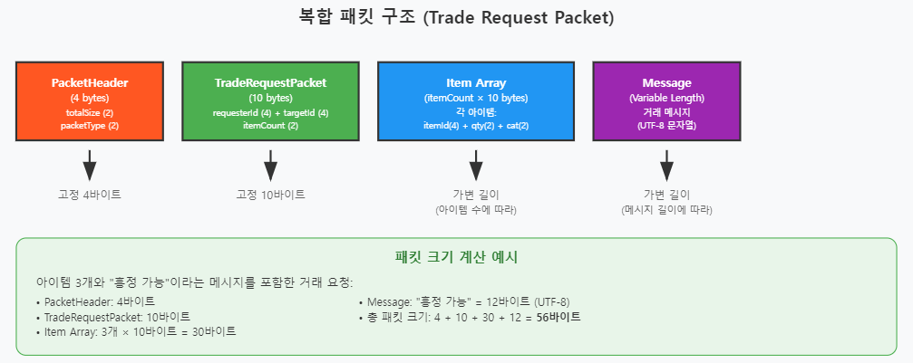    
  
#### 2. 패킷 타입과 구조체

```cpp
enum PacketType {
    PT_TRADE_REQUEST = 1,   // 거래 요청
    PT_TRADE_RESPONSE,      // 거래 응답
    PT_CHAT_MESSAGE,        // 채팅 메시지
    PT_PLAYER_MOVE          // 플레이어 이동
};
```

각 패킷 타입별로 다른 데이터 구조를 가지며, 헤더의 `packetType` 필드로 구분한다.
  

### 핵심 클래스 구조  
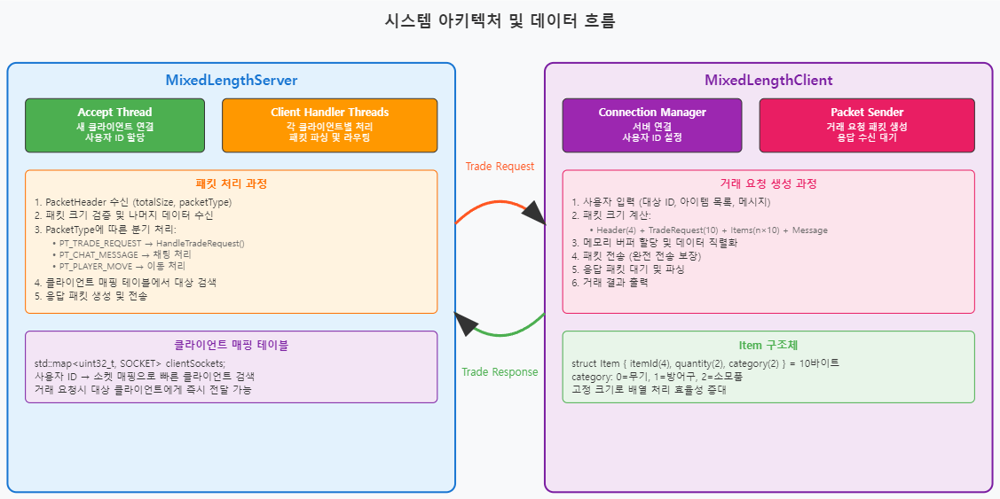   

### 핵심 기술적 특징

#### 1. **혼합형 데이터 구조**
```cpp
// 고정 길이 + 가변 길이 조합
struct TradeRequestPacket {
    uint32_t requesterId;   // 고정 4바이트
    uint32_t targetId;      // 고정 4바이트  
    uint16_t itemCount;     // 고정 2바이트
    // 이후 가변 길이: Item 배열 + 메시지 문자열
};
```

고정 길이 헤더로 기본 정보를 제공하고, 가변 길이 부분은 동적으로 처리한다.

#### 2. **패킷 크기 사전 계산**
```cpp
// 클라이언트에서 패킷 전송 전 크기 계산
uint16_t headerSize = sizeof(PacketHeader);
uint16_t tradeRequestSize = sizeof(TradeRequestPacket);
uint16_t itemsSize = static_cast<uint16_t>(items.size() * sizeof(Item));
uint16_t messageSize = static_cast<uint16_t>(message.length());
uint16_t totalSize = headerSize + tradeRequestSize + itemsSize + messageSize;
```

전체 패킷 크기를 미리 계산하여 헤더에 포함시킨다. 수신측에서 정확한 크기만큼만 읽을 수 있다.

#### 3. **메모리 직렬화 기법**
```cpp
// 패킷 데이터를 연속된 메모리에 직렬화
std::vector<char> packetBuffer(totalSize);
char* bufferPtr = packetBuffer.data();

memcpy(bufferPtr, &header, headerSize);
bufferPtr += headerSize;

memcpy(bufferPtr, &tradeRequest, tradeRequestSize);  
bufferPtr += tradeRequestSize;

// 아이템 배열 복사
for (const auto& item : items) {
    memcpy(bufferPtr, &item, sizeof(Item));
    bufferPtr += sizeof(Item);
}
```

구조체와 배열을 연속된 메모리에 순차적으로 복사하여 네트워크 전송용 버퍼를 만든다.

#### 4. **패킷 파싱 과정**
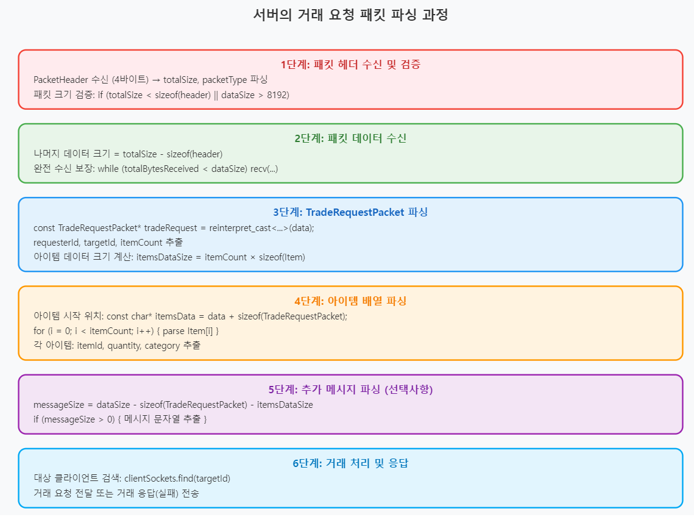    

#### 5. **클라이언트 매핑 테이블**
```cpp
std::map<uint32_t, SOCKET> clientSockets;
```

서버는 사용자 ID를 키로 하는 매핑 테이블을 유지한다. 거래 요청시 대상 클라이언트를 빠르게 찾을 수 있다.

#### 6. **에러 처리 및 검증**
```cpp
// 패킷 크기 검증
if (totalSize < sizeof(header) || dataSize > 8192) {
    std::cerr << std::format("잘못된 패킷 크기: {}\n", totalSize);
    break;
}

// 아이템 데이터 크기 검증  
if (sizeof(TradeRequestPacket) + itemsDataSize > dataSize) {
    std::cerr << "아이템 데이터가 패킷보다 큼\n";
    return;
}
```

패킷 크기와 내부 데이터 구조를 다중으로 검증하여 비정상 패킷을 방지한다.
  

### 실행 시나리오 예시  
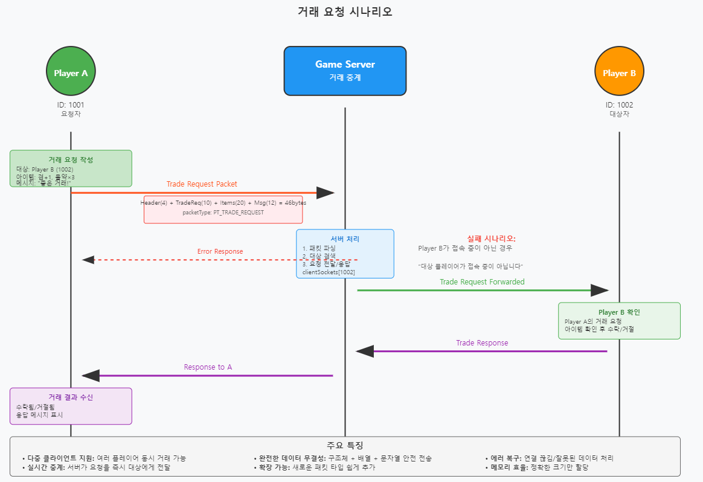 
   
### 주요 개선점과 장점

#### 1. **타입 안전성**
```cpp
enum PacketType {
    PT_TRADE_REQUEST = 1,
    PT_TRADE_RESPONSE,
    PT_CHAT_MESSAGE,
    PT_PLAYER_MOVE
};
```
열거형을 사용하여 패킷 타입을 명확히 정의하고, switch문으로 안전하게 분기 처리한다.

#### 2. **메모리 정렬 보장**
```cpp
#pragma pack(push, 1)
struct PacketHeader {
    uint16_t totalSize;
    uint16_t packetType;
};
#pragma pack(pop)
```
구조체 패딩을 제거하여 플랫폼 간 호환성을 보장한다.

#### 3. **효율적인 클라이언트 관리**
```cpp
std::map<uint32_t, SOCKET> clientSockets;
```
해시 맵을 사용하여 O(log n) 시간에 클라이언트 검색이 가능하다.

#### 4. **확장 가능한 설계**
새로운 패킷 타입을 추가할 때 enum에 타입 추가 후 switch문에 처리 로직만 추가하면 된다.

### 실제 사용법
**서버 실행:**
1. 프로그램 실행 후 `1` 선택
2. 다중 클라이언트 연결 대기

**클라이언트 실행:**
1. 프로그램 실행 후 `2` 선택  
2. 서버 IP와 사용자 ID 입력
3. 거래할 대상 ID, 아이템 정보, 메시지 입력
4. 자동으로 거래 요청 패킷 생성 및 전송

이 시스템은 **온라인 게임의 실시간 거래 시스템**을 구현한 것으로, 복잡한 데이터 구조를 안전하게 네트워크로 전송하는 좋은 예시다. 고정 길이와 가변 길이를 적절히 조합하여 메모리 효율성과 확장성을 동시에 확보했다.  
  
  
## 실습: 데이터 전송 후 종료 연습
네트워크 연결을 안전하게 종료하는 방법을 배우는 것은 중요합니다. 이 예제에서는 `shutdown`을 사용한 안전한 연결 종료 방법을 알아봅니다.   
아래 코드의 핵심적인 부분은 `GracefulDisconnect()` 함수이다.  

<details>
<summary>GracefulShutdownServer 코드</summary>  
  
```cpp
#include <iostream>
#include <WinSock2.h>
#include <WS2tcpip.h>
#include <format>
#include <string>
#include <thread>
#include <vector>
#include <chrono>

#pragma comment(lib, "ws2_32.lib")

// 파일 전송 패킷 헤더
#pragma pack(push, 1)
struct FileHeader {
    uint32_t fileSize;      // 파일 전체 크기
    uint16_t nameLength;    // 파일 이름 길이
    // 이후에 파일 이름과 파일 데이터가 옴
};
#pragma pack(pop)

// 안전한 종료를 구현한 서버 클래스
class GracefulShutdownServer {
private:
    SOCKET listenSocket;
    std::vector<std::thread> clientThreads;
    bool running;

public:
    GracefulShutdownServer() : listenSocket(INVALID_SOCKET), running(false) {}
    
    ~GracefulShutdownServer() {
        Stop();
    }
    
    bool Start(int port = 27015) {
        WSADATA wsaData;
        if (WSAStartup(MAKEWORD(2, 2), &wsaData) != 0) {
            std::cerr << "WSAStartup 실패\n";
            return false;
        }
        
        listenSocket = socket(AF_INET, SOCK_STREAM, IPPROTO_TCP);
        if (listenSocket == INVALID_SOCKET) {
            std::cerr << std::format("소켓 생성 실패: {}\n", WSAGetLastError());
            WSACleanup();
            return false;
        }
        
        sockaddr_in serverAddr;
        serverAddr.sin_family = AF_INET;
        serverAddr.sin_port = htons(port);
        serverAddr.sin_addr.s_addr = INADDR_ANY;
        
        if (bind(listenSocket, reinterpret_cast<sockaddr*>(&serverAddr), sizeof(serverAddr)) == SOCKET_ERROR) {
            std::cerr << std::format("바인딩 실패: {}\n", WSAGetLastError());
            closesocket(listenSocket);
            WSACleanup();
            return false;
        }
        
        if (listen(listenSocket, SOMAXCONN) == SOCKET_ERROR) {
            std::cerr << std::format("리슨 실패: {}\n", WSAGetLastError());
            closesocket(listenSocket);
            WSACleanup();
            return false;
        }
        
        running = true;
        std::cout << std::format("안전한 종료 서버가 포트 {}에서 시작됨\n", port);
        
        // 클라이언트 연결 수락 스레드 시작
        std::thread acceptThread(&GracefulShutdownServer::AcceptClients, this);
        acceptThread.detach();
        
        return true;
    }
    
    void Stop() {
        running = false;
        
        if (listenSocket != INVALID_SOCKET) {
            closesocket(listenSocket);
            listenSocket = INVALID_SOCKET;
        }
        
        for (auto& thread : clientThreads) {
            if (thread.joinable()) {
                thread.join();
            }
        }
        
        clientThreads.clear();
        WSACleanup();
        std::cout << "서버가 중지됨\n";
    }
    
private:
    void AcceptClients() {
        while (running) {
            sockaddr_in clientAddr;
            int clientAddrLen = sizeof(clientAddr);
            
            SOCKET clientSocket = accept(listenSocket, reinterpret_cast<sockaddr*>(&clientAddr), &clientAddrLen);
            if (clientSocket == INVALID_SOCKET) {
                if (running) {
                    std::cerr << std::format("클라이언트 연결 수락 실패: {}\n", WSAGetLastError());
                }
                continue;
            }
            
            char clientIP[INET_ADDRSTRLEN];
            inet_ntop(AF_INET, &clientAddr.sin_addr, clientIP, INET_ADDRSTRLEN);
            std::cout << std::format("새 클라이언트 연결: {}:{}\n", clientIP, ntohs(clientAddr.sin_port));
            
            clientThreads.emplace_back(&GracefulShutdownServer::HandleClient, this, clientSocket, std::string(clientIP));
        }
    }
    
    void HandleClient(SOCKET clientSocket, std::string clientIP) {
        // 파일 헤더 수신
        FileHeader header;
        int bytesReceived = recv(clientSocket, reinterpret_cast<char*>(&header), sizeof(header), 0);
        
        if (bytesReceived != sizeof(header)) {
            std::cerr << "파일 헤더 수신 실패\n";
            closesocket(clientSocket);
            return;
        }
        
        // 파일 이름 수신
        std::vector<char> fileNameBuffer(header.nameLength + 1, 0);
        bytesReceived = recv(clientSocket, fileNameBuffer.data(), header.nameLength, 0);
        
        if (bytesReceived != header.nameLength) {
            std::cerr << "파일 이름 수신 실패\n";
            closesocket(clientSocket);
            return;
        }
        
        std::string fileName(fileNameBuffer.data());
        std::cout << std::format("파일 수신 시작: {}, 크기: {} 바이트\n", fileName, header.fileSize);
        
        // 파일 데이터 수신
        std::vector<char> fileBuffer(header.fileSize);
        int totalBytesReceived = 0;
        
        // 진행 상황 업데이트 시간 추적
        auto lastUpdateTime = std::chrono::steady_clock::now();
        
        while (totalBytesReceived < header.fileSize) {
            bytesReceived = recv(clientSocket, 
                              fileBuffer.data() + totalBytesReceived,
                              header.fileSize - totalBytesReceived, 
                              0);
            
            if (bytesReceived <= 0) {
                if (bytesReceived == 0) {
                    std::cout << "클라이언트가 연결을 정상적으로 종료했습니다.\n";
                } else {
                    std::cerr << std::format("파일 데이터 수신 실패: {}\n", WSAGetLastError());
                }
                break;
            }
            
            totalBytesReceived += bytesReceived;
            
            // 1초마다 진행 상황 업데이트
            auto currentTime = std::chrono::steady_clock::now();
            if (std::chrono::duration_cast<std::chrono::seconds>(currentTime - lastUpdateTime).count() >= 1) {
                float progress = static_cast<float>(totalBytesReceived) / header.fileSize * 100.0f;
                std::cout << std::format("파일 수신 중: {:.1f}% 완료\n", progress);
                lastUpdateTime = currentTime;
            }
        }
        
        // 파일 수신 완료
        if (totalBytesReceived == header.fileSize) {
            std::cout << std::format("파일 '{}' 수신 완료 ({} 바이트)\n", fileName, totalBytesReceived);
            
            // 여기서 파일을 저장하거나 처리할 수 있음
            
            // 수신 완료 응답 보내기
            std::string response = "파일 수신 완료";
            send(clientSocket, response.c_str(), static_cast<int>(response.length()), 0);
            
            // 안전하게 연결 종료 (서버 측에서 먼저 종료)
            std::cout << "연결 종료 시작 (서버 측)...\n";
            
            // 송신 방향 종료 (더 이상 데이터를 보내지 않을 것임을 알림)
            shutdown(clientSocket, SD_SEND);
            
            // 클라이언트가 보낸 데이터가 있다면 모두 수신
            char buffer[1024];
            while ((bytesReceived = recv(clientSocket, buffer, sizeof(buffer), 0)) > 0) {
                std::cout << std::format("연결 종료 중 추가 데이터 {} 바이트 수신됨\n", bytesReceived);
            }
            
            std::cout << "연결 안전하게 종료됨\n";
        } else {
            std::cerr << std::format("파일 수신 불완전: 예상 {}, 실제 {} 바이트\n", header.fileSize, totalBytesReceived);
        }
        
        // 소켓 닫기
        closesocket(clientSocket);
    }
};

// 안전한 종료를 구현한 클라이언트 클래스
class GracefulShutdownClient {
private:
    SOCKET clientSocket;
    bool connected;
    
public:
    GracefulShutdownClient() : clientSocket(INVALID_SOCKET), connected(false) {}
    
    ~GracefulShutdownClient() {
        Disconnect();
    }
    
    bool Connect(const std::string& serverIP, int port = 27015) {
        WSADATA wsaData;
        if (WSAStartup(MAKEWORD(2, 2), &wsaData) != 0) {
            std::cerr << "WSAStartup 실패\n";
            return false;
        }
        
        clientSocket = socket(AF_INET, SOCK_STREAM, IPPROTO_TCP);
        if (clientSocket == INVALID_SOCKET) {
            std::cerr << std::format("소켓 생성 실패: {}\n", WSAGetLastError());
            WSACleanup();
            return false;
        }
        
        sockaddr_in serverAddr;
        serverAddr.sin_family = AF_INET;
        serverAddr.sin_port = htons(port);
        inet_pton(AF_INET, serverIP.c_str(), &serverAddr.sin_addr);
        
        if (connect(clientSocket, reinterpret_cast<sockaddr*>(&serverAddr), sizeof(serverAddr)) == SOCKET_ERROR) {
            std::cerr << std::format("서버 연결 실패: {}\n", WSAGetLastError());
            closesocket(clientSocket);
            WSACleanup();
            return false;
        }
        
        connected = true;
        std::cout << std::format("서버 {}:{}에 연결됨\n", serverIP, port);
        return true;
    }
    
    void Disconnect() {
        if (connected && clientSocket != INVALID_SOCKET) {
            // 안전한 연결 종료 시도
            GracefulDisconnect();
            
            // 소켓 닫기
            closesocket(clientSocket);
            clientSocket = INVALID_SOCKET;
            connected = false;
            WSACleanup();
        }
    }
    
    bool SendFile(const std::string& fileName, const std::vector<char>& fileData) {
        if (!connected || clientSocket == INVALID_SOCKET) {
            std::cerr << "서버에 연결되지 않음\n";
            return false;
        }
        
        // 1. 파일 헤더 준비
        FileHeader header;
        header.fileSize = static_cast<uint32_t>(fileData.size());
        header.nameLength = static_cast<uint16_t>(fileName.length());
        
        // 2. 헤더 전송
        int bytesSent = send(clientSocket, reinterpret_cast<char*>(&header), sizeof(header), 0);
        if (bytesSent != sizeof(header)) {
            std::cerr << "파일 헤더 전송 실패\n";
            return false;
        }
        
        // 3. 파일 이름 전송
        bytesSent = send(clientSocket, fileName.c_str(), header.nameLength, 0);
        if (bytesSent != header.nameLength) {
            std::cerr << "파일 이름 전송 실패\n";
            return false;
        }
        
        // 4. 파일 데이터 전송
        int totalBytesSent = 0;
        const int CHUNK_SIZE = 4096;  // 한 번에 4KB씩 전송
        
        // 진행 상황 업데이트 시간 추적
        auto lastUpdateTime = std::chrono::steady_clock::now();
        
        while (totalBytesSent < header.fileSize) {
            int bytesToSend = std::min(CHUNK_SIZE, static_cast<int>(header.fileSize - totalBytesSent));
            
            bytesSent = send(clientSocket, 
                           fileData.data() + totalBytesSent, 
                           bytesToSend, 
                           0);
            
            if (bytesSent == SOCKET_ERROR) {
                std::cerr << std::format("파일 데이터 전송 실패: {}\n", WSAGetLastError());
                return false;
            }
            
            totalBytesSent += bytesSent;
            
            // 진행 상황 업데이트 (1초마다)
            auto currentTime = std::chrono::steady_clock::now();
            if (std::chrono::duration_cast<std::chrono::seconds>(currentTime - lastUpdateTime).count() >= 1) {
                float progress = static_cast<float>(totalBytesSent) / header.fileSize * 100.0f;
                std::cout << std::format("파일 전송 중: {:.1f}% 완료\n", progress);
                lastUpdateTime = currentTime;
            }
            
            // 전송 속도 제어 (필요한 경우)
            // std::this_thread::sleep_for(std::chrono::milliseconds(10));
        }
        
        std::cout << std::format("파일 '{}' 전송 완료 ({} 바이트)\n", fileName, totalBytesSent);
        
        // 5. 서버 응답 수신
        char responseBuffer[1024] = {0};
        int bytesReceived = recv(clientSocket, responseBuffer, sizeof(responseBuffer) - 1, 0);
        
        if (bytesReceived > 0) {
            std::cout << "서버 응답: " << responseBuffer << std::endl;
        } else {
            std::cerr << "서버 응답 수신 실패\n";
            return false;
        }
        
        // 6. 안전한 연결 종료
        return GracefulDisconnect();
    }
    
private:
    bool GracefulDisconnect() {
        if (!connected || clientSocket == INVALID_SOCKET) {
            return false;
        }
        
        std::cout << "안전한 연결 종료 시작...\n";
        
        // 1. 송신 방향 종료 (더 이상 데이터를 보내지 않음)
        if (shutdown(clientSocket, SD_SEND) == SOCKET_ERROR) {
            std::cerr << std::format("shutdown 실패: {}\n", WSAGetLastError());
            return false;
        }
        
        // 2. 서버가 보낸 모든 데이터 수신
        char buffer[1024];
        int bytesReceived;
        
        while ((bytesReceived = recv(clientSocket, buffer, sizeof(buffer), 0)) > 0) {
            buffer[bytesReceived] = '\0';
            std::cout << std::format("연결 종료 중 추가 데이터 수신: {}\n", buffer);
        }
        
        if (bytesReceived == SOCKET_ERROR) {
            std::cerr << std::format("recv 실패: {}\n", WSAGetLastError());
            return false;
        }
        
        std::cout << "안전한 연결 종료 완료\n";
        return true;
    }
};

// 테스트용 메인 함수
int main() {
    // 한글 출력을 위한 설정
    SetConsoleOutputCP(CP_UTF8);
    
    std::cout << "1: 서버 모드, 2: 클라이언트 모드 - 선택: ";
    int mode;
    std::cin >> mode;
    
    if (mode == 1) {
        GracefulShutdownServer server;
        if (server.Start()) {
            std::cout << "서버가 시작되었습니다. 종료하려면 아무 키나 누르세요.\n";
            std::cin.ignore();
            std::cin.get();
            server.Stop();
        }
    } else if (mode == 2) {
        GracefulShutdownClient client;
        std::string serverIP;
        
        std::cout << "서버 IP를 입력하세요: ";
        std::cin.ignore();
        std::getline(std::cin, serverIP);
        
        if (client.Connect(serverIP)) {
            // 가상의 파일 데이터 생성 (실제로는 파일에서 읽어올 수 있음)
            std::string fileName = "test_data.bin";
            size_t fileSize;
            
            std::cout << "전송할 파일 크기(바이트)를 입력하세요: ";
            std::cin >> fileSize;
            
            std::vector<char> fileData(fileSize);
            
            // 파일 데이터 생성 (간단한 패턴으로 채움)
            for (size_t i = 0; i < fileSize; i++) {
                fileData[i] = static_cast<char>(i % 256);
            }
            
            // 파일 전송 및 안전한 종료
            client.SendFile(fileName, fileData);
            
            // 명시적으로 연결 종료
            client.Disconnect();
        }
    }
    
    return 0;
}
```  
</details>  
  
   
## 정리: 데이터 전송의 주요 고려사항

1. **응용 프로그램 프로토콜 설계**
   - 패킷 구조(헤더, 페이로드)
   - 바이트 정렬 처리
   - 데이터 경계 설정 방법

2. **데이터 송수신 전략**
   - 고정 길이: 구현 간단, 공간 낭비 가능성
   - 가변 길이: 효율적 공간 사용, 경계 처리 필요
   - 혼합 구조: 헤더는 고정, 페이로드는 가변 길이

3. **신뢰성 확보**
   - 패킷 크기 검증
   - 데이터 무결성 검사
   - 완전 수신 보장 (부분 수신 대응)

4. **연결 종료**
   - `shutdown` 함수로 안전한 종료
   - 송신과 수신을 독립적으로 제어
   - 모든 데이터 교환 완료 확인

온라인 게임 서버 개발에서는 이러한 기본적인 데이터 전송 방식을 바탕으로, 게임의 특성에 맞는 최적화된 프로토콜을 설계하고 구현하는 것이 중요합니다. 실시간성이 중요한 게임에서는 데이터 압축, 패킷 최적화, 우선순위 처리 등의 고급 기법도 함께 적용해 볼 수 있습니다.  

  
<br>        
     
# Chapter.06 멀티스레드 프로그래밍
  
## 01 스레드 기초
스레드(Thread)는 프로세스 내에서 실행되는 독립적인 실행 흐름으로, 온라인 게임 서버에서 매우 중요한 개념입니다. 대규모 온라인 게임은 수많은 클라이언트를 동시에 처리해야 하므로 효율적인 멀티스레딩이 필수적입니다.

### 스레드의 개념
프로세스는 운영체제로부터 할당받은 자원의 단위이며, 각 프로세스는 독립된 메모리 공간을 가집니다. 반면, 스레드는 하나의 프로세스 내에서 여러 개 생성될 수 있으며, 같은 프로세스 내의 스레드들은 메모리 공간을 공유합니다.
  

### 프로세스와 스레드의 차이점

| 구분 | 프로세스 | 스레드 |
|------|---------|--------|
| 정의 | 실행 중인 프로그램 | 프로세스 내 실행 흐름 |
| 자원 소유 | O | X (프로세스의 자원 공유) |
| 메모리 공간 | 독립적 | 공유 (스택 제외) |
| 통신 비용 | 높음 (IPC 필요) | 낮음 (직접 메모리 접근) |
| 문맥 전환 비용 | 높음 | 낮음 |
| 안정성 | 한 프로세스 중단 시 다른 프로세스는 영향 없음 | 한 스레드 중단 시 전체 프로세스 영향 |
  

### 스레드 사용의 장점
1. **병렬 처리**: 다중 코어 CPU에서 여러 작업을 동시에 실행하여 성능 향상
2. **응답성 향상**: UI 스레드와 작업 스레드를 분리하여 사용자 반응성 유지
3. **자원 공유**: 같은 메모리 공간을 공유하여 통신 비용 감소
4. **효율성**: 프로세스 생성보다 스레드 생성이 더 빠르고 경제적
  

### 스레드 사용의 단점
1. **동기화 문제**: 공유 자원 접근 시 레이스 컨디션(Race Condition) 발생 가능
2. **디버깅 어려움**: 동시성 관련 버그는 발견과 수정이 어려움
3. **교착 상태(Deadlock)**: 잘못된 락 획득 순서로 인한 상호 대기 상태
4. **기아 상태(Starvation)**: 특정 스레드가 필요한 자원을 계속 얻지 못하는 상태
  

### 게임 서버에서의 스레드 활용
온라인 게임 서버에서 멀티스레딩은 다음과 같은 용도로 활용됩니다:

1. **클라이언트 연결 관리**: 연결 수락 및 각 클라이언트 통신 처리
2. **게임 로직 처리**: 게임 상태 업데이트, AI, 물리 계산 등
3. **데이터베이스 작업**: 비동기 데이터 저장 및 로드
4. **주기적 작업**: 타이머 이벤트, 세션 관리, 자원 정리 등
  
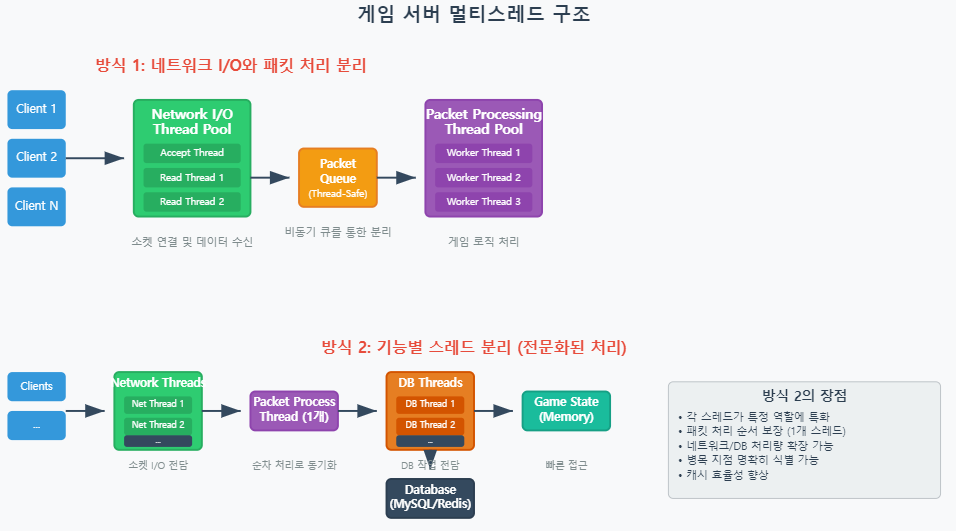    
   
**방식 1 (I/O와 처리 분리)이 적합한 경우:**
- 처리량이 중요한 게임 
- 게임 콘텐츠 중 공유 객체에 lock을 걸어야 한다.
- 패킷 순서가 크게 중요하지 않은 상황
```
// 방식 1: 네트워크 I/O와 패킷 처리 분리
#include <thread>
#include <queue>
#include <mutex>
#include <condition_variable>

// Thread-Safe 패킷 큐
class PacketQueue {
private:
    std::queue<Packet> packets;
    std::mutex mtx;
    std::condition_variable cv;

public:
    void push(const Packet& packet) {
        std::lock_guard<std::mutex> lock(mtx);
        packets.push(packet);
        cv.notify_one();
    }
    
    Packet pop() {
        std::unique_lock<std::mutex> lock(mtx);
        cv.wait(lock, [this]{ return !packets.empty(); });
        Packet packet = packets.front();
        packets.pop();
        return packet;
    }
};

class GameServer_Method1 {
private:
    PacketQueue packetQueue;
    std::vector<std::thread> ioThreads;
    std::vector<std::thread> processingThreads;
    
public:
    void start() {
        // 네트워크 I/O 스레드들 시작
        for (int i = 0; i < 4; ++i) {
            ioThreads.emplace_back([this]() {
                networkIOLoop();
            });
        }
        
        // 패킷 처리 스레드들 시작
        for (int i = 0; i < 8; ++i) {
            processingThreads.emplace_back([this]() {
                packetProcessingLoop();
            });
        }
    }
    
private:
    void networkIOLoop() {
        while (running) {
            // 소켓에서 데이터 수신
            Packet packet = receiveFromSocket();
            if (packet.isValid()) {
                // 큐에 패킷 추가 (스레드 안전)
                packetQueue.push(packet);
            }
        }
    }
    
    void packetProcessingLoop() {
        while (running) {
            // 큐에서 패킷 가져와서 처리
            Packet packet = packetQueue.pop();
            processPacket(packet);
        }
    }
};
```    


**방식 2 (기능별 분리)가 적합한 경우:**
- 패킷 처리 순서 보장 (단일 스레드)
- 게임 콘텐츠 중 공유 객체에 lock을 걸지 않아도 된다
- DB 작업이 많고 복잡한 게임
- 성능 튜닝과 모니터링이 중요한 상용 서비스     
```
// 방식 2: 기능별 스레드 분리 (전문화)
class GameServer_Method2 {
private:
    // 네트워크 스레드들 (2개 이상)
    std::vector<std::thread> networkThreads;
    
    // 패킷 처리 스레드 (1개 - 순서 보장)
    std::thread packetProcessThread;
    
    // DB 스레드들 (2개 이상)
    std::vector<std::thread> dbThreads;
    
    // 스레드 간 통신을 위한 큐들
    ThreadSafeQueue<Packet> networkToPacketQueue;
    ThreadSafeQueue<DBRequest> packetToDBQueue;
    ThreadSafeQueue<DBResponse> dbToPacketQueue;
    
public:
    void start() {
        // 네트워크 스레드들 시작 (최소 2개)
        for (int i = 0; i < 3; ++i) {
            networkThreads.emplace_back([this, i]() {
                networkThreadLoop(i);
            });
        }
        
        // 패킷 처리 스레드 시작 (1개만)
        packetProcessThread = std::thread([this]() {
            packetProcessingLoop();
        });
        
        // DB 스레드들 시작 (최소 2개)
        for (int i = 0; i < 4; ++i) {
            dbThreads.emplace_back([this, i]() {
                dbThreadLoop(i);
            });
        }
    }
    
private:
    // 네트워크 전담 스레드
    void networkThreadLoop(int threadId) {
        while (running) {
            // 각 스레드가 일부 클라이언트 담당
            auto clients = getAssignedClients(threadId);
            
            for (auto& client : clients) {
                Packet packet = receiveFromClient(client);
                if (packet.isValid()) {
                    // 패킷 처리 스레드로 전달
                    networkToPacketQueue.push(packet);
                }
            }
        }
    }
    
    // 패킷 처리 전담 스레드 (1개로 순서 보장)
    void packetProcessingLoop() {
        while (running) {
            // 네트워크에서 받은 패킷 처리
            if (!networkToPacketQueue.empty()) {
                Packet packet = networkToPacketQueue.pop();
                
                // 게임 로직 처리
                GameEvent event = processGameLogic(packet);
                
                // DB 작업이 필요하면 DB 스레드에 요청
                if (event.needsDB()) {
                    DBRequest dbReq = createDBRequest(event);
                    packetToDBQueue.push(dbReq);
                }
            }
            
            // DB에서 완료된 작업 처리
            if (!dbToPacketQueue.empty()) {
                DBResponse response = dbToPacketQueue.pop();
                handleDBResponse(response);
            }
        }
    }
    
    // DB 전담 스레드들
    void dbThreadLoop(int threadId) {
        // 각 스레드가 다른 DB 연결 사용
        DatabaseConnection db = createDBConnection(threadId);
        
        while (running) {
            if (!packetToDBQueue.empty()) {
                DBRequest request = packetToDBQueue.pop();
                
                // DB 작업 수행 (시간이 오래 걸릴 수 있음)
                DBResponse response = executeDBQuery(db, request);
                
                // 결과를 패킷 처리 스레드로 전달
                dbToPacketQueue.push(response);
            }
        }
    }
};
```


## 02 스레드 API
C++11부터 표준 라이브러리에서 스레드 지원이 추가되어 플랫폼 독립적인 멀티스레딩이 가능해졌습니다. 본 내용에서는 Win32 API 대신 C++의 표준 스레드 API를 중심으로 설명하겠습니다.

### C++ 스레드 라이브러리 vs Win32 스레드 API

| C++ 스레드 라이브러리 | Win32 스레드 API |
|---------------------|-----------------|
| std::thread | CreateThread |
| std::mutex | CRITICAL_SECTION |
| std::condition_variable | CONDITION_VARIABLE |
| std::async | - |
| std::future/promise | - |
  

### 스레드 생성과 관리

```cpp
#include <iostream>
#include <thread>
#include <format>

// 스레드 함수
void threadFunction() {
    std::cout << std::format("스레드 ID: {}\n", std::this_thread::get_id());
    for (int i = 0; i < 5; ++i) {
        std::cout << std::format("스레드에서 카운트: {}\n", i);
        std::this_thread::sleep_for(std::chrono::milliseconds(500));
    }
}

int main() {
    // 한글 출력을 위한 설정
    SetConsoleOutputCP(CP_UTF8);
    
    std::cout << std::format("메인 스레드 ID: {}\n", std::this_thread::get_id());
    
    // 스레드 생성
    std::thread t(threadFunction);
    
    // 메인 스레드 작업
    for (int i = 0; i < 3; ++i) {
        std::cout << std::format("메인에서 카운트: {}\n", i);
        std::this_thread::sleep_for(std::chrono::milliseconds(1000));
    }
    
    // 스레드 종료 대기
    t.join();
    
    std::cout << "모든 스레드 종료\n";
    
    return 0;
}
```

### 스레드에 인수 전달

```cpp
#include <iostream>
#include <thread>
#include <string>
#include <format>

// 값에 의한 전달
void threadFunction(int id, std::string name) {
    std::cout << std::format("스레드 {}({}): 실행 시작\n", id, name);
    std::this_thread::sleep_for(std::chrono::seconds(2));
    std::cout << std::format("스레드 {}({}): 실행 완료\n", id, name);
}

// 참조에 의한 전달
void threadFunctionRef(int id, const std::string& name, int& result) {
    std::cout << std::format("스레드 {}({}): 계산 시작\n", id, name);
    std::this_thread::sleep_for(std::chrono::seconds(2));
    
    // 결과값 계산 및 참조로 반환
    result = id * 10;
    
    std::cout << std::format("스레드 {}({}): 계산 완료 (결과: {})\n", id, name, result);
}

int main() {
    // 한글 출력을 위한 설정
    SetConsoleOutputCP(CP_UTF8);
    
    // 1. 값에 의한 전달
    std::thread t1(threadFunction, 1, "작업 스레드");
    
    // 2. 참조로 결과 반환
    int result = 0;
    std::thread t2(threadFunctionRef, 2, "계산 스레드", std::ref(result));
    
    // 3. 람다 함수로 스레드 생성
    std::thread t3([](int id) {
        std::cout << std::format("람다 스레드 {}: 실행\n", id);
        std::this_thread::sleep_for(std::chrono::seconds(1));
        std::cout << std::format("람다 스레드 {}: 완료\n", id);
    }, 3);
    
    // 모든 스레드 종료 대기
    t1.join();
    t2.join();
    t3.join();
    
    std::cout << std::format("계산 결과: {}\n", result);
    std::cout << "모든 스레드 종료\n";
    
    return 0;
}
```

### std::async와 std::future
`std::async`는 비동기 작업을 쉽게 생성하고 `std::future`를 통해 결과를 받을 수 있는 편리한 방법입니다.

```cpp
#include <iostream>
#include <future>
#include <chrono>
#include <format>

// 결과를 반환하는 함수
int calculateResult(int value) {
    std::cout << std::format("계산 시작 (입력: {})\n", value);
    std::this_thread::sleep_for(std::chrono::seconds(2)); // 무거운 작업 시뮬레이션
    return value * value;
}

int main() {
    // 한글 출력을 위한 설정
    SetConsoleOutputCP(CP_UTF8);
    
    std::cout << "비동기 작업 시작\n";
    
    // std::async로 비동기 작업 시작
    std::future<int> result1 = std::async(std::launch::async, calculateResult, 10);
    std::future<int> result2 = std::async(std::launch::async, calculateResult, 20);
    
    std::cout << "메인 스레드에서 다른 작업 수행 중...\n";
    
    // 결과가 준비될 때까지 블로킹
    int value1 = result1.get();
    int value2 = result2.get();
    
    std::cout << std::format("결과 1: {}\n", value1);
    std::cout << std::format("결과 2: {}\n", value2);
    std::cout << std::format("합계: {}\n", value1 + value2);
    
    return 0;
}
```
  

## 03 멀티스레드 TCP 서버
멀티스레드 TCP 서버는 다수의 클라이언트 연결을 효율적으로 처리하기 위한 구조입니다. 일반적으로 다음과 같은 모델을 사용합니다:

1. **Accept 스레드**: 새로운 클라이언트 연결을 수락하는 전용 스레드
2. **Worker 스레드 풀**: 클라이언트 요청을 처리하는 스레드 집합
3. **연결 관리**: 각 클라이언트 연결을 스레드에 할당하는 방식

### 스레드 풀 기반 TCP 서버 구현
다음은 스레드 풀을 사용한 간단한 멀티스레드 에코 서버 예제입니다.

<details>
<summary>ThreadPool Echo Server 코드</summary>  

```cpp
#include <iostream>
#include <thread>
#include <vector>
#include <queue>
#include <mutex>
#include <condition_variable>
#include <functional>
#include <WinSock2.h>
#include <WS2tcpip.h>
#include <format>
#include <atomic>

#pragma comment(lib, "ws2_32.lib")

class ThreadPool {
private:
    std::vector<std::thread> workers;
    std::queue<std::function<void()>> tasks;
    
    std::mutex queueMutex;
    std::condition_variable condition;
    std::atomic<bool> stop;

public:
    ThreadPool(size_t numThreads) : stop(false) {
        for (size_t i = 0; i < numThreads; ++i) {
            workers.emplace_back([this, i] {
                std::cout << std::format("워커 스레드 {} 시작\n", i);
                
                while (true) {
                    std::function<void()> task;
                    
                    {
                        std::unique_lock<std::mutex> lock(this->queueMutex);
                        
                        // 작업이 있거나 중단 신호가 올 때까지 대기
                        this->condition.wait(lock, [this] { 
                            return this->stop || !this->tasks.empty(); 
                        });
                        
                        // 중단 신호가 왔고 작업이 없으면 종료
                        if (this->stop && this->tasks.empty()) {
                            std::cout << std::format("워커 스레드 {} 종료\n", i);
                            return;
                        }
                        
                        // 작업 가져오기
                        task = std::move(this->tasks.front());
                        this->tasks.pop();
                    }
                    
                    // 작업 실행
                    task();
                }
            });
        }
    }
    
    ~ThreadPool() {
        {
            std::unique_lock<std::mutex> lock(queueMutex);
            stop = true;
        }
        
        condition.notify_all();
        
        for (std::thread &worker : workers) {
            if (worker.joinable()) {
                worker.join();
            }
        }
    }
    
    // 작업 추가
    template<class F>
    void enqueue(F&& f) {
        {
            std::unique_lock<std::mutex> lock(queueMutex);
            if (stop) {
                throw std::runtime_error("스레드 풀 중단 후 작업 추가 시도");
            }
            tasks.emplace(std::forward<F>(f));
        }
        condition.notify_one();
    }
};

class TCPServer {
private:
    SOCKET listenSocket;
    ThreadPool threadPool;
    std::atomic<bool> running;
    std::mutex consoleMutex; // 콘솔 출력용 뮤텍스

public:
    TCPServer(size_t numThreads) : threadPool(numThreads), running(false), listenSocket(INVALID_SOCKET) {}
    
    ~TCPServer() {
        Stop();
    }
    
    bool Start(int port = 27015) {
        WSADATA wsaData;
        if (WSAStartup(MAKEWORD(2, 2), &wsaData) != 0) {
            std::cerr << "WSAStartup 실패\n";
            return false;
        }
        
        listenSocket = socket(AF_INET, SOCK_STREAM, IPPROTO_TCP);
        if (listenSocket == INVALID_SOCKET) {
            std::cerr << std::format("소켓 생성 실패: {}\n", WSAGetLastError());
            WSACleanup();
            return false;
        }
        
        sockaddr_in serverAddr;
        serverAddr.sin_family = AF_INET;
        serverAddr.sin_port = htons(port);
        serverAddr.sin_addr.s_addr = INADDR_ANY;
        
        if (bind(listenSocket, reinterpret_cast<sockaddr*>(&serverAddr), sizeof(serverAddr)) == SOCKET_ERROR) {
            std::cerr << std::format("바인딩 실패: {}\n", WSAGetLastError());
            closesocket(listenSocket);
            WSACleanup();
            return false;
        }
        
        if (listen(listenSocket, SOMAXCONN) == SOCKET_ERROR) {
            std::cerr << std::format("리슨 실패: {}\n", WSAGetLastError());
            closesocket(listenSocket);
            WSACleanup();
            return false;
        }
        
        running = true;
        
        {
            std::lock_guard<std::mutex> lock(consoleMutex);
            std::cout << std::format("TCP 서버가 포트 {}에서 시작됨\n", port);
        }
        
        // Accept 스레드 시작
        std::thread acceptThread(&TCPServer::AcceptConnections, this);
        acceptThread.detach();
        
        return true;
    }
    
    void Stop() {
        running = false;
        
        if (listenSocket != INVALID_SOCKET) {
            closesocket(listenSocket);
            listenSocket = INVALID_SOCKET;
        }
        
        WSACleanup();
        
        {
            std::lock_guard<std::mutex> lock(consoleMutex);
            std::cout << "서버가 중지됨\n";
        }
    }
    
private:
    void AcceptConnections() {
        while (running) {
            sockaddr_in clientAddr;
            int clientAddrLen = sizeof(clientAddr);
            
            SOCKET clientSocket = accept(listenSocket, reinterpret_cast<sockaddr*>(&clientAddr), &clientAddrLen);
            if (clientSocket == INVALID_SOCKET) {
                if (running) {
                    std::cerr << std::format("클라이언트 연결 수락 실패: {}\n", WSAGetLastError());
                }
                continue;
            }
            
            char clientIP[INET_ADDRSTRLEN];
            inet_ntop(AF_INET, &clientAddr.sin_addr, clientIP, INET_ADDRSTRLEN);
            
            {
                std::lock_guard<std::mutex> lock(consoleMutex);
                std::cout << std::format("새 클라이언트 연결: {}:{}\n", clientIP, ntohs(clientAddr.sin_port));
            }
            
            // 클라이언트 처리 작업을 스레드 풀에 추가
            threadPool.enqueue([this, clientSocket, clientIP]() {
                this->HandleClient(clientSocket, std::string(clientIP));
            });
        }
    }
    
    void HandleClient(SOCKET clientSocket, const std::string& clientIP) {
        const int BUFFER_SIZE = 1024;
        char buffer[BUFFER_SIZE];
        
        while (running) {
            int bytesReceived = recv(clientSocket, buffer, BUFFER_SIZE - 1, 0);
            if (bytesReceived <= 0) {
                if (bytesReceived == 0) {
                    std::lock_guard<std::mutex> lock(consoleMutex);
                    std::cout << std::format("클라이언트 {}가 연결을 종료함\n", clientIP);
                } else {
                    std::lock_guard<std::mutex> lock(consoleMutex);
                    std::cerr << std::format("recv 실패: {}\n", WSAGetLastError());
                }
                break;
            }
            
            buffer[bytesReceived] = '\0';
            
            {
                std::lock_guard<std::mutex> lock(consoleMutex);
                std::cout << std::format("{}로부터 수신: {}\n", clientIP, buffer);
            }
            
            // 에코 응답
            int bytesSent = send(clientSocket, buffer, bytesReceived, 0);
            if (bytesSent == SOCKET_ERROR) {
                std::lock_guard<std::mutex> lock(consoleMutex);
                std::cerr << std::format("send 실패: {}\n", WSAGetLastError());
                break;
            }
        }
        
        closesocket(clientSocket);
    }
};

int main() {
    // 한글 출력을 위한 설정
    SetConsoleOutputCP(CP_UTF8);
    
    // 하드웨어 스레드 수에 기반한 스레드 풀 크기 계산
    size_t numThreads = std::thread::hardware_concurrency();
    if (numThreads == 0) numThreads = 4; // 감지 실패 시 기본값
    
    std::cout << std::format("스레드 풀 크기: {}\n", numThreads);
    
    TCPServer server(numThreads);
    if (server.Start()) {
        std::cout << "서버가 시작되었습니다. 종료하려면 아무 키나 누르세요.\n";
        std::cin.get();
        server.Stop();
    }
    
    return 0;
}
```  
</details>  
  
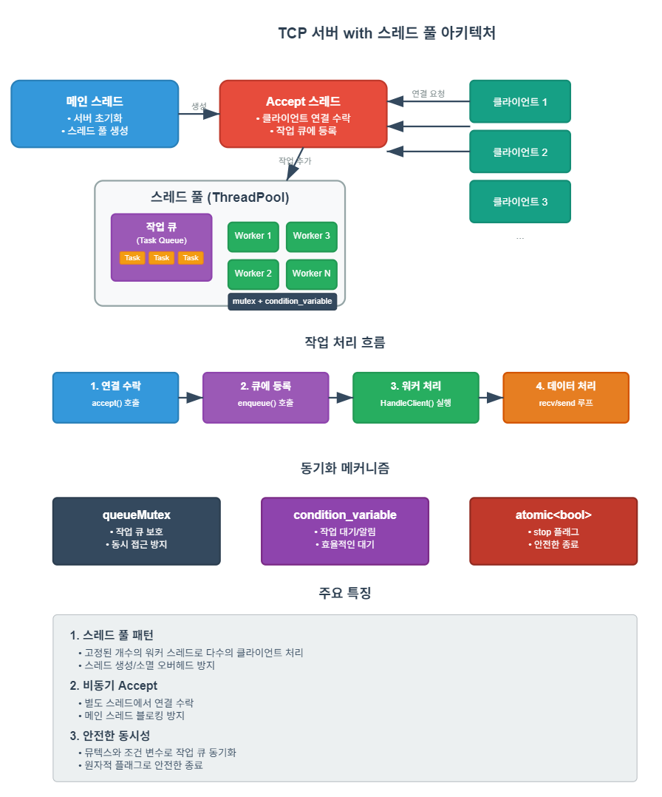     
  
**주요 구성 요소:**
1. **메인 스레드**: 서버를 초기화하고 스레드 풀을 생성한다
2. **Accept 스레드**: 클라이언트 연결을 지속적으로 수락하고, 각 클라이언트 처리 작업을 스레드 풀의 큐에 추가한다
3. **스레드 풀**: 고정된 개수의 워커 스레드들이 작업 큐에서 클라이언트 처리 작업을 가져와 실행한다
  
**동작 흐름:**
1. 클라이언트가 연결을 요청하면 Accept 스레드가 수락
2. Accept 스레드가 `HandleClient` 작업을 큐에 등록 
3. 대기 중인 워커 스레드가 작업을 가져와 클라이언트와 통신
4. recv/send 루프를 통해 에코 서버 역할 수행
  
**동기화 메커니즘:**
- `queueMutex`: 작업 큐의 동시 접근을 방지
- `condition_variable`: 워커 스레드가 효율적으로 작업을 대기
- `atomic<bool> stop`: 안전한 서버 종료를 위한 플래그
- `consoleMutex`: 콘솔 출력의 동기화

이 설계의 장점은 스레드 생성/소멸 오버헤드 없이 다수의 클라이언트를 동시에 처리할 수 있다는 것이다. 워커 스레드 개수는 하드웨어 스레드 수에 맞춰 자동 조정된다.  
  

### 스레드 풀 설계의 장점
1. **자원 효율성**: 미리 생성된 스레드를 재사용하여 스레드 생성/소멸 비용 절감
2. **부하 분산**: 여러 스레드에 작업을 고르게 분산 가능
3. **시스템 안정성**: 동시 실행 스레드 수를 제한하여 시스템 과부하 방지
4. **확장성**: 필요에 따라 스레드 수를 조정 가능
  
  
## 04 스레드 동기화
멀티스레드 프로그래밍에서 가장 중요한 문제 중 하나는 공유 자원에 대한 접근을 동기화하는 것입니다. 잘못된 동기화는 데이터 경쟁(Data Race), 교착 상태(Deadlock), 기아 상태(Starvation) 등의 문제를 일으킬 수 있습니다.  
    
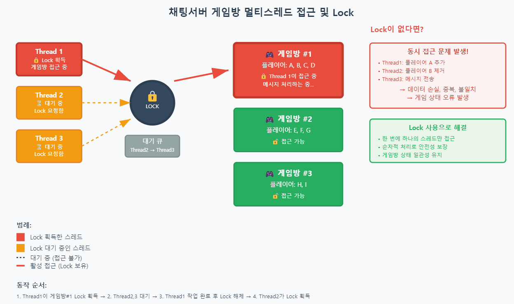       
  
### 뮤텍스(Mutex)
뮤텍스는 상호 배제(Mutual Exclusion)를 구현하는 동기화 기법으로, 공유 자원에 대한 접근을 한 번에 하나의 스레드로 제한합니다.

```cpp
#include <iostream>
#include <thread>
#include <mutex>
#include <vector>
#include <format>

class Counter {
private:
    int value = 0;
    std::mutex mutex;

public:
    void increment() {
        std::lock_guard<std::mutex> lock(mutex);
        ++value;
    }
    
    int getValue() {
        std::lock_guard<std::mutex> lock(mutex);
        return value;
    }
};

int main() {
    // 한글 출력을 위한 설정
    SetConsoleOutputCP(CP_UTF8);
    
    Counter counter;
    std::vector<std::thread> threads;
    
    const int NUM_THREADS = 10;
    const int NUM_INCREMENTS = 100000;
    
    // 여러 스레드에서 동시에 카운터 증가
    for (int i = 0; i < NUM_THREADS; ++i) {
        threads.emplace_back([&counter, i, NUM_INCREMENTS]{
            for (int j = 0; j < NUM_INCREMENTS; ++j) {
                counter.increment();
            }
            std::cout << std::format("스레드 {} 완료\n", i);
        });
    }
    
    // 모든 스레드 종료 대기
    for (auto& t : threads) {
        t.join();
    }
    
    // 최종 결과 출력
    std::cout << std::format("예상 값: {}\n", NUM_THREADS * NUM_INCREMENTS);
    std::cout << std::format("실제 값: {}\n", counter.getValue());
    
    return 0;
}
```

### 락 가드와 유니크 락
C++에서는 RAII(Resource Acquisition Is Initialization) 원칙에 따라 뮤텍스를 자동으로 잠그고 해제하는 여러 유틸리티를 제공합니다.

1. **std::lock_guard**: 생성 시 락을 획득하고 소멸 시 자동으로 해제
2. **std::unique_lock**: lock_guard보다 유연하며, 수동으로 잠금/해제 가능
3. **std::shared_lock**: 공유 뮤텍스와 함께 사용하여 읽기 공유 락 구현
  
  
### 데드락(Deadlock) 방지
데드락은 두 개 이상의 스레드가 서로 상대방이 점유한 자원을 기다리며 무한히 대기하는 상황입니다.  
  
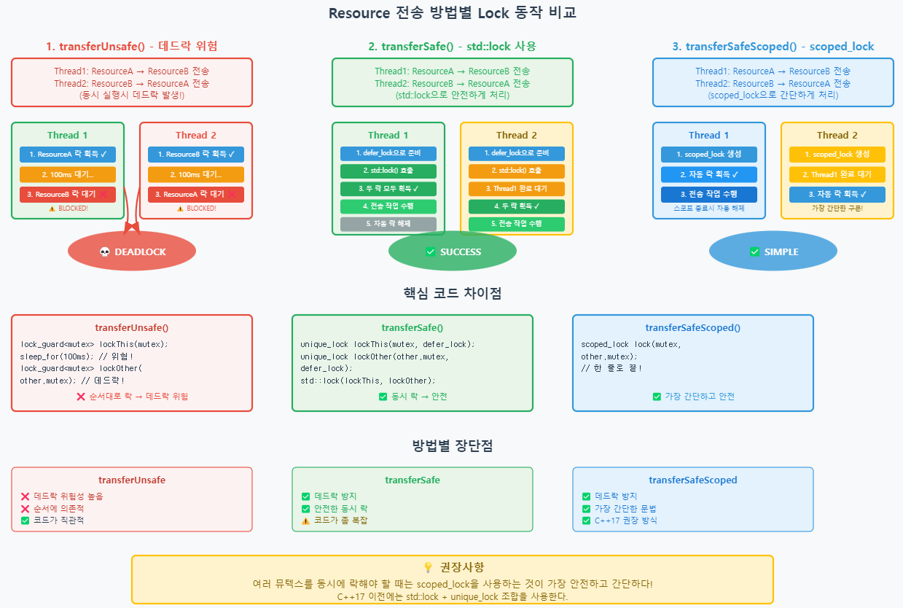   

```cpp
#include <iostream>
#include <thread>
#include <mutex>
#include <format>

class Resource {
private:
    std::mutex mutex;
    int value = 0;
    
public:
    Resource(int initialValue) : value(initialValue) {}
    
    // 안전하지 않은 전송 방법 (데드락 가능성)
    void transferUnsafe(Resource& other, int amount) {
        // 내 리소스 락 획득
        std::lock_guard<std::mutex> lockThis(mutex);
        
        // 작업 지연 시뮬레이션
        std::this_thread::sleep_for(std::chrono::milliseconds(100));
        
        // 상대 리소스 락 획득 (이미 다른 스레드가 잠갔다면 데드락!)
        std::lock_guard<std::mutex> lockOther(other.mutex);
        
        if (value >= amount) {
            value -= amount;
            other.value += amount;
            std::cout << std::format("전송 성공: {} 단위\n", amount);
        } else {
            std::cout << "전송 실패: 잔액 부족\n";
        }
    }
    
    // 안전한 전송 방법 (std::lock 사용)
    void transferSafe(Resource& other, int amount) {
        // 두 뮤텍스를 한 번에 안전하게 락
        std::unique_lock<std::mutex> lockThis(mutex, std::defer_lock);
        std::unique_lock<std::mutex> lockOther(other.mutex, std::defer_lock);
        
        // 데드락 없이 두 뮤텍스 모두 획득
        std::lock(lockThis, lockOther);
        
        if (value >= amount) {
            value -= amount;
            other.value += amount;
            std::cout << std::format("전송 성공: {} 단위\n", amount);
        } else {
            std::cout << "전송 실패: 잔액 부족\n";
        }
    }
    
    // C++17의 scoped_lock을 사용한 더 간단한 방법
    void transferSafeScoped(Resource& other, int amount) {
        // 한 줄로 여러 뮤텍스를 안전하게 락
        std::scoped_lock lock(mutex, other.mutex);
        
        if (value >= amount) {
            value -= amount;
            other.value += amount;
            std::cout << std::format("전송 성공: {} 단위\n", amount);
        } else {
            std::cout << "전송 실패: 잔액 부족\n";
        }
    }
    
    int getValue() const {
        std::lock_guard<std::mutex> lock(mutex);
        return value;
    }
};

int main() {
    // 한글 출력을 위한 설정
    SetConsoleOutputCP(CP_UTF8);
    
    Resource resource1(1000);
    Resource resource2(1000);
    
    // 안전하지 않은 방법 - 데드락 가능성 있음
    /*
    std::thread t1([&resource1, &resource2]() {
        for (int i = 0; i < 5; ++i) {
            resource1.transferUnsafe(resource2, 100);
        }
    });
    
    std::thread t2([&resource1, &resource2]() {
        for (int i = 0; i < 5; ++i) {
            resource2.transferUnsafe(resource1, 50);
        }
    });
    */
    
    // 안전한 방법 - 데드락 방지
    std::thread t1([&resource1, &resource2]() {
        for (int i = 0; i < 5; ++i) {
            resource1.transferSafeScoped(resource2, 100);
            std::this_thread::sleep_for(std::chrono::milliseconds(10));
        }
    });
    
    std::thread t2([&resource1, &resource2]() {
        for (int i = 0; i < 5; ++i) {
            resource2.transferSafeScoped(resource1, 50);
            std::this_thread::sleep_for(std::chrono::milliseconds(10));
        }
    });
    
    t1.join();
    t2.join();
    
    std::cout << std::format("최종 상태 - 리소스 1: {}, 리소스 2: {}\n", 
                        resource1.getValue(), resource2.getValue());
    
    return 0;
}
```

### 조건 변수(Condition Variable)
조건 변수는 스레드 간 신호를 주고받기 위한 동기화 기법으로, 특정 조건이 만족될 때까지 스레드를 대기시키는 데 사용됩니다.  
  
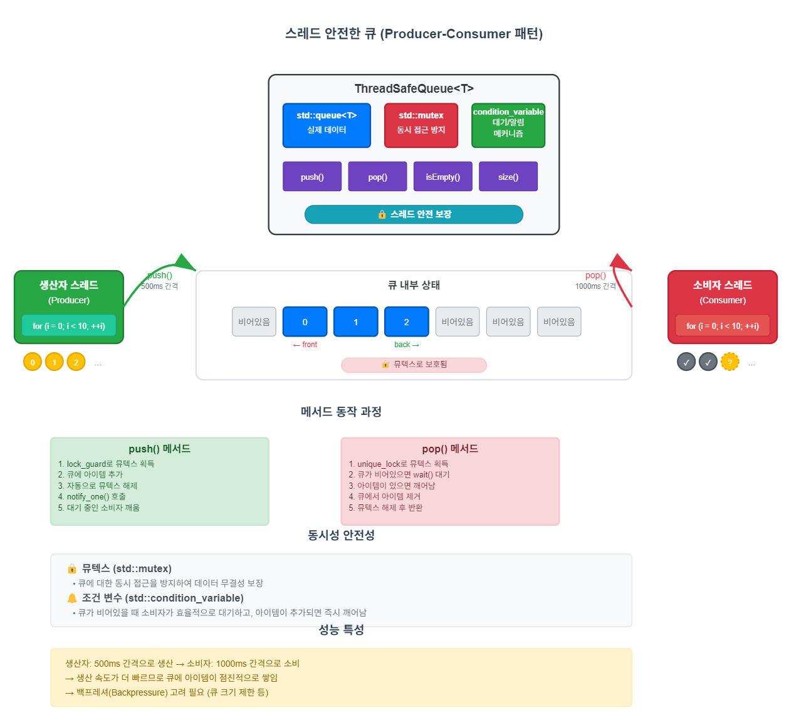     

```cpp
#include <iostream>
#include <thread>
#include <mutex>
#include <condition_variable>
#include <queue>
#include <format>

// 스레드 안전한 큐 구현
template<typename T>
class ThreadSafeQueue {
private:
    std::queue<T> queue;
    mutable std::mutex mutex;
    std::condition_variable condVar;
    
public:
    // 아이템 추가
    void push(T item) {
        {
            std::lock_guard<std::mutex> lock(mutex);
            queue.push(std::move(item));
        }
        condVar.notify_one();  // 대기 중인 스레드에 신호
    }
    
    // 아이템 가져오기 (비어있으면 대기)
    T pop() {
        std::unique_lock<std::mutex> lock(mutex);
        
        // 큐가 비어있지 않을 때까지 대기
        condVar.wait(lock, [this]{ return !queue.empty(); });
        
        T item = std::move(queue.front());
        queue.pop();
        return item;
    }
    
    // 비어있는지 확인
    bool isEmpty() const {
        std::lock_guard<std::mutex> lock(mutex);
        return queue.empty();
    }
    
    // 크기 확인
    size_t size() const {
        std::lock_guard<std::mutex> lock(mutex);
        return queue.size();
    }
};

int main() {
    // 한글 출력을 위한 설정
    SetConsoleOutputCP(CP_UTF8);
    
    ThreadSafeQueue<int> queue;
    
    // 생산자 스레드
    std::thread producer([&queue]() {
        for (int i = 0; i < 10; ++i) {
            std::this_thread::sleep_for(std::chrono::milliseconds(500));
            std::cout << std::format("생산: {}\n", i);
            queue.push(i);
        }
    });
    
    // 소비자 스레드
    std::thread consumer([&queue]() {
        for (int i = 0; i < 10; ++i) {
            int value = queue.pop();  // 아이템이 없으면 대기
            std::cout << std::format("소비: {}\n", value);
            std::this_thread::sleep_for(std::chrono::milliseconds(1000));
        }
    });
    
    producer.join();
    consumer.join();
    
    std::cout << "모든 작업 완료\n";
    
    return 0;
}
```
  

### 원자적 연산(Atomic Operations)
락 대신 원자적 연산을 사용하면 성능을 향상시킬 수 있습니다. C++에서는 `std::atomic` 타입을 제공합니다.

```cpp
#include <iostream>
#include <thread>
#include <atomic>
#include <vector>
#include <format>

class AtomicCounter {
private:
    std::atomic<int> value{0};

public:
    void increment() {
        ++value;  // 원자적 증가 연산
    }
    
    int getValue() const {
        return value.load();  // 원자적 읽기 연산
    }
};

int main() {
    // 한글 출력을 위한 설정
    SetConsoleOutputCP(CP_UTF8);
    
    AtomicCounter counter;
    std::vector<std::thread> threads;
    
    const int NUM_THREADS = 10;
    const int NUM_INCREMENTS = 100000;
    
    // 여러 스레드에서 동시에 카운터 증가
    for (int i = 0; i < NUM_THREADS; ++i) {
        threads.emplace_back([&counter, i, NUM_INCREMENTS]{
            for (int j = 0; j < NUM_INCREMENTS; ++j) {
                counter.increment();
            }
            std::cout << std::format("스레드 {} 완료\n", i);
        });
    }
    
    // 모든 스레드 종료 대기
    for (auto& t : threads) {
        t.join();
    }
    
    // 최종 결과 출력
    std::cout << std::format("예상 값: {}\n", NUM_THREADS * NUM_INCREMENTS);
    std::cout << std::format("실제 값: {}\n", counter.getValue());
    
    return 0;
}
```
  

## 실습: 스레드 생성과 종료, 인수 전달 연습
다양한 방식으로 스레드를 생성하고 인수를 전달하는 방법을 연습해 봅시다.

```cpp
#include <iostream>
#include <thread>
#include <vector>
#include <string>
#include <functional>
#include <format>
#include <Windows.h>

// 일반 함수
void threadFunction(int id) {
    std::cout << std::format("일반 함수 스레드 {}: 시작\n", id);
    std::this_thread::sleep_for(std::chrono::seconds(1));
    std::cout << std::format("일반 함수 스레드 {}: 종료\n", id);
}

// 여러 매개변수를 받는 함수
void parameterizedFunction(int id, std::string name, bool flag) {
    std::cout << std::format("스레드 {}({}): 시작, 플래그={}\n", id, name, flag ? "true" : "false");
    std::this_thread::sleep_for(std::chrono::seconds(2));
    std::cout << std::format("스레드 {}({}): 종료\n", id, name);
}

// 참조 매개변수가 있는 함수
void referenceFunction(int id, std::vector<int>& values) {
    std::cout << std::format("참조 스레드 {}: 시작\n", id);
    std::this_thread::sleep_for(std::chrono::seconds(1));
    
    // 벡터 수정 (참조로 전달된 벡터가 원본에 반영됨)
    for (int i = 0; i < 5; ++i) {
        values.push_back(id * 10 + i);
    }
    
    std::cout << std::format("참조 스레드 {}: 종료\n", id);
}

// 함수 객체 (Functor)
class ThreadFunctor {
private:
    int id;
    
public:
    ThreadFunctor(int id) : id(id) {}
    
    void operator()() {
        std::cout << std::format("함수 객체 스레드 {}: 시작\n", id);
        std::this_thread::sleep_for(std::chrono::seconds(1));
        std::cout << std::format("함수 객체 스레드 {}: 종료\n", id);
    }
};

// 멤버 함수를 스레드에서 실행하는 클래스
class ThreadTask {
private:
    int id;
    
public:
    ThreadTask(int id) : id(id) {}
    
    void task() {
        std::cout << std::format("멤버 함수 스레드 {}: 시작\n", id);
        std::this_thread::sleep_for(std::chrono::seconds(1));
        std::cout << std::format("멤버 함수 스레드 {}: 종료\n", id);
    }
};

int main() {
    // 한글 출력을 위한 설정
    SetConsoleOutputCP(CP_UTF8);
    
    std::cout << "===== 스레드 생성 및 인수 전달 연습 =====\n";
    
    // 1. 일반 함수로 스레드 생성
    std::thread t1(threadFunction, 1);
    
    // 2. 여러 인수를 받는 함수로 스레드 생성
    std::thread t2(parameterizedFunction, 2, "테스트 스레드", true);
    
    // 3. 참조 전달 (std::ref 필요)
    std::vector<int> shared_data;
    std::thread t3(referenceFunction, 3, std::ref(shared_data));
    
    // 4. 함수 객체(Functor)로 스레드 생성
    ThreadFunctor functor(4);
    std::thread t4(functor);
    
    // 5. 람다 표현식으로 스레드 생성
    std::thread t5([](int id) {
        std::cout << std::format("람다 스레드 {}: 시작\n", id);
        std::this_thread::sleep_for(std::chrono::seconds(1));
        std::cout << std::format("람다 스레드 {}: 종료\n", id);
    }, 5);
    
    // 6. 클래스 멤버 함수로 스레드 생성
    ThreadTask task(6);
    std::thread t6(&ThreadTask::task, &task);
    
    // 모든 스레드 종료 대기
    t1.join();
    t2.join();
    t3.join();
    t4.join();
    t5.join();
    t6.join();
    
    // 공유 데이터 확인
    std::cout << "공유 데이터 내용: ";
    for (int value : shared_data) {
        std::cout << value << " ";
    }
    std::cout << std::endl;
    
    std::cout << "모든 스레드가 종료되었습니다.\n";
    
    return 0;
}
```

## 실습: 스레드 실행 제어와 종료 기다리기 연습

스레드의 실행을 제어하고 안전하게 종료하는 방법을 연습해 봅시다.

```cpp
#include <iostream>
#include <thread>
#include <chrono>
#include <mutex>
#include <atomic>
#include <condition_variable>
#include <format>

class WorkerThread {
private:
    std::thread thread;
    std::mutex mutex;
    std::condition_variable cv;
    std::atomic<bool> stopRequested{false};
    std::atomic<bool> pauseRequested{false};
    std::atomic<bool> isRunning{false};
    
public:
    WorkerThread(int id) {
        thread = std::thread([this, id]() {
            std::cout << std::format("작업자 스레드 {} 시작\n", id);
            isRunning = true;
            
            int count = 0;
            while (!stopRequested) {
                // 일시 중지 요청 처리
                if (pauseRequested) {
                    std::unique_lock<std::mutex> lock(mutex);
                    std::cout << std::format("작업자 스레드 {} 일시 중지됨\n", id);
                    
                    // 재개 신호나 종료 신호를 기다림
                    cv.wait(lock, [this]() {
                        return !pauseRequested || stopRequested;
                    });
                    
                    if (!pauseRequested) {
                        std::cout << std::format("작업자 스레드 {} 재개됨\n", id);
                    }
                }
                
                if (stopRequested) break;
                
                // 작업 시뮬레이션
                std::cout << std::format("작업자 스레드 {}: 카운트 {}\n", id, count++);
                std::this_thread::sleep_for(std::chrono::milliseconds(500));
            }
            
            std::cout << std::format("작업자 스레드 {} 종료\n", id);
            isRunning = false;
        });
    }
    
    ~WorkerThread() {
        if (thread.joinable()) {
            requestStop();
            thread.join();
        }
    }
    
    // 스레드 일시 중지
    void pause() {
        if (isRunning && !pauseRequested) {
            pauseRequested = true;
        }
    }
    
    // 스레드 재개
    void resume() {
        if (isRunning && pauseRequested) {
            pauseRequested = false;
            cv.notify_one();
        }
    }
    
    // 스레드 중지 요청
    void requestStop() {
        stopRequested = true;
        // 일시 중지 상태일 수 있으므로 조건 변수에 신호
        cv.notify_one();
    }
    
    // 스레드가 실행 중인지 확인
    bool running() const {
        return isRunning;
    }
    
    // 스레드가 일시 중지 상태인지 확인
    bool paused() const {
        return pauseRequested;
    }
    
    // 스레드 종료 대기
    void join() {
        if (thread.joinable()) {
            thread.join();
        }
    }
};

int main() {
    // 한글 출력을 위한 설정
    SetConsoleOutputCP(CP_UTF8);
    
    std::cout << "===== 스레드 실행 제어 연습 =====\n";
    
    // 작업자 스레드 생성
    WorkerThread worker(1);
    
    // 잠시 실행
    std::this_thread::sleep_for(std::chrono::seconds(2));
    
    // 스레드 일시 중지
    std::cout << "메인: 스레드 일시 중지 요청\n";
    worker.pause();
    std::this_thread::sleep_for(std::chrono::seconds(2));
    
    // 스레드 재개
    std::cout << "메인: 스레드 재개 요청\n";
    worker.resume();
    std::this_thread::sleep_for(std::chrono::seconds(2));
    
    // 스레드 중지
    std::cout << "메인: 스레드 중지 요청\n";
    worker.requestStop();
    
    // 스레드 종료 대기
    std::cout << "메인: 스레드 종료 대기\n";
    worker.join();
    
    std::cout << "메인: 모든 작업 완료\n";
    
    return 0;
}
```
  

## 실습: 멀티스레드 TCP 서버 작성과 테스트
게임 서버와 유사한 구조의 고급 멀티스레드 TCP 서버를 구현해 봅시다. 이 서버는 각 클라이언트를 세션으로 관리하고, 간단한 명령어를 처리합니다.  
  
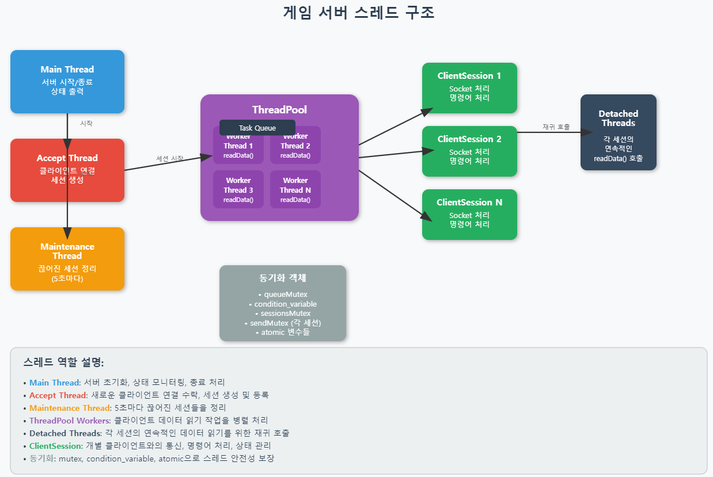   

```cpp
#include <iostream>
#include <thread>
#include <vector>
#include <map>
#include <queue>
#include <mutex>
#include <condition_variable>
#include <functional>
#include <string>
#include <sstream>
#include <chrono>
#include <atomic>
#include <memory>
#include <WinSock2.h>
#include <WS2tcpip.h>
#include <format>

#pragma comment(lib, "ws2_32.lib")

// 스레드 풀 클래스
class ThreadPool {
private:
    std::vector<std::thread> workers;
    std::queue<std::function<void()>> tasks;
    
    std::mutex queueMutex;
    std::condition_variable condition;
    std::atomic<bool> stop;
    std::atomic<int> activeThreads{0};

public:
    ThreadPool(size_t numThreads) : stop(false) {
        for (size_t i = 0; i < numThreads; ++i) {
            workers.emplace_back([this, i] {
                while (true) {
                    std::function<void()> task;
                    
                    {
                        std::unique_lock<std::mutex> lock(this->queueMutex);
                        
                        this->condition.wait(lock, [this] { 
                            return this->stop || !this->tasks.empty(); 
                        });
                        
                        if (this->stop && this->tasks.empty()) {
                            return;
                        }
                        
                        task = std::move(this->tasks.front());
                        this->tasks.pop();
                    }
                    
                    activeThreads++;
                    task();
                    activeThreads--;
                }
            });
        }
    }
    
    ~ThreadPool() {
        {
            std::unique_lock<std::mutex> lock(queueMutex);
            stop = true;
        }
        
        condition.notify_all();
        
        for (std::thread &worker : workers) {
            if (worker.joinable()) {
                worker.join();
            }
        }
    }
    
    template<class F>
    void enqueue(F&& f) {
        {
            std::unique_lock<std::mutex> lock(queueMutex);
            if (stop) {
                throw std::runtime_error("스레드 풀 중단 후 작업 추가 시도");
            }
            tasks.emplace(std::forward<F>(f));
        }
        condition.notify_one();
    }
    
    size_t getTaskCount() {
        std::unique_lock<std::mutex> lock(queueMutex);
        return tasks.size();
    }
    
    int getActiveThreadCount() {
        return activeThreads;
    }
    
    size_t getThreadCount() {
        return workers.size();
    }
};

// 클라이언트 세션 클래스
class ClientSession : public std::enable_shared_from_this<ClientSession> {
public:
    using Pointer = std::shared_ptr<ClientSession>;
    
private:
    SOCKET socket;
    std::string address;
    uint16_t port;
    std::atomic<bool> connected{false};
    
    std::vector<char> receiveBuffer;
    std::mutex sendMutex;
    
    // 세션에 붙은 플레이어 데이터 (실제 게임에서는 더 복잡할 것)
    struct PlayerData {
        std::string name;
        int x = 0;
        int y = 0;
        int hp = 100;
    } player;

public:
    ClientSession(SOCKET socket, const std::string& address, uint16_t port)
        : socket(socket), address(address), port(port), receiveBuffer(1024) {
        connected = true;
    }
    
    ~ClientSession() {
        close();
    }
    
    void start(ThreadPool& threadPool) {
        auto self = shared_from_this();
        threadPool.enqueue([self]() {
            self->readData();
        });
    }
    
    void close() {
        if (connected) {
            connected = false;
            closesocket(socket);
            socket = INVALID_SOCKET;
        }
    }
    
    bool isConnected() const {
        return connected;
    }
    
    std::string getAddress() const {
        return address;
    }
    
    uint16_t getPort() const {
        return port;
    }
    
    std::string getPlayerName() const {
        return player.name;
    }
    
    void sendData(const std::string& data) {
        if (!connected) return;
        
        std::lock_guard<std::mutex> lock(sendMutex);
        
        int totalSent = 0;
        int remaining = static_cast<int>(data.size());
        const char* buffer = data.c_str();
        
        while (totalSent < remaining) {
            int sent = send(socket, buffer + totalSent, remaining - totalSent, 0);
            if (sent == SOCKET_ERROR) {
                std::cerr << std::format("데이터 전송 실패: {}\n", WSAGetLastError());
                close();
                return;
            }
            totalSent += sent;
        }
    }

private:
    void readData() {
        if (!connected) return;
        
        int bytesReceived = recv(socket, receiveBuffer.data(), static_cast<int>(receiveBuffer.size()) - 1, 0);
        
        if (bytesReceived <= 0) {
            if (bytesReceived == 0) {
                std::cout << std::format("클라이언트 {}:{} 연결 종료\n", address, port);
            } else {
                std::cerr << std::format("데이터 수신 실패: {}\n", WSAGetLastError());
            }
            close();
            return;
        }
        
        receiveBuffer[bytesReceived] = '\0';
        std::string data(receiveBuffer.data(), bytesReceived);
        
        processCommand(data);
        
        if (connected) {
            auto self = shared_from_this();
            // 다시 읽기 작업 예약 (재귀적으로 호출하지 않고 예약)
            std::thread([self]() {
                self->readData();
            }).detach();
        }
    }
    
    void processCommand(const std::string& data) {
        std::istringstream iss(data);
        std::string command;
        iss >> command;
        
        if (command == "NAME") {
            std::string name;
            iss >> name;
            player.name = name;
            sendData(std::format("OK 이름이 {}(으)로 설정되었습니다.\n", name));
        }
        else if (command == "MOVE") {
            int x, y;
            iss >> x >> y;
            player.x = x;
            player.y = y;
            sendData(std::format("OK 위치가 ({}, {})로 이동했습니다.\n", x, y));
        }
        else if (command == "ATTACK") {
            std::string target;
            iss >> target;
            sendData(std::format("OK {}을(를) 공격했습니다.\n", target));
        }
        else if (command == "WHERE") {
            sendData(std::format("현재 위치: ({}, {})\n", player.x, player.y));
        }
        else if (command == "STATS") {
            sendData(std::format("플레이어: {}, 위치: ({}, {}), HP: {}\n", 
                             player.name, player.x, player.y, player.hp));
        }
        else if (command == "HELP") {
            sendData("사용 가능한 명령어:\n"
                     "NAME <이름> - 플레이어 이름 설정\n"
                     "MOVE <x> <y> - 지정된 좌표로 이동\n"
                     "ATTACK <대상> - 대상 공격\n"
                     "WHERE - 현재 위치 확인\n"
                     "STATS - 플레이어 상태 확인\n"
                     "HELP - 도움말 표시\n"
                     "QUIT - 접속 종료\n");
        }
        else if (command == "QUIT") {
            sendData("서버와의 연결을 종료합니다. 안녕히 가세요!\n");
            close();
        }
        else {
            sendData(std::format("알 수 없는 명령어: {}. 'HELP'를 입력하여 도움말을 확인하세요.\n", command));
        }
    }
};

// 게임 서버 클래스
class GameServer {
private:
    SOCKET listenSocket;
    ThreadPool threadPool;
    std::atomic<bool> running;
    
    std::map<SOCKET, ClientSession::Pointer> sessions;
    std::mutex sessionsMutex;
    
    std::thread maintenanceThread;

public:
    GameServer(size_t numThreads) 
        : threadPool(numThreads), running(false), listenSocket(INVALID_SOCKET) {}
    
    ~GameServer() {
        stop();
    }
    
    bool start(int port = 27015) {
        WSADATA wsaData;
        if (WSAStartup(MAKEWORD(2, 2), &wsaData) != 0) {
            std::cerr << "WSAStartup 실패\n";
            return false;
        }
        
        listenSocket = socket(AF_INET, SOCK_STREAM, IPPROTO_TCP);
        if (listenSocket == INVALID_SOCKET) {
            std::cerr << std::format("소켓 생성 실패: {}\n", WSAGetLastError());
            WSACleanup();
            return false;
        }
        
        sockaddr_in serverAddr;
        serverAddr.sin_family = AF_INET;
        serverAddr.sin_port = htons(port);
        serverAddr.sin_addr.s_addr = INADDR_ANY;
        
        if (bind(listenSocket, reinterpret_cast<sockaddr*>(&serverAddr), sizeof(serverAddr)) == SOCKET_ERROR) {
            std::cerr << std::format("바인딩 실패: {}\n", WSAGetLastError());
            closesocket(listenSocket);
            WSACleanup();
            return false;
        }
        
        if (listen(listenSocket, SOMAXCONN) == SOCKET_ERROR) {
            std::cerr << std::format("리슨 실패: {}\n", WSAGetLastError());
            closesocket(listenSocket);
            WSACleanup();
            return false;
        }
        
        running = true;
        
        std::cout << std::format("게임 서버가 포트 {}에서 시작됨\n", port);
        
        // Accept 스레드 시작
        std::thread acceptThread(&GameServer::acceptClients, this);
        acceptThread.detach();
        
        // 유지보수 스레드 시작
        maintenanceThread = std::thread(&GameServer::maintenanceTask, this);
        
        return true;
    }
    
    void stop() {
        running = false;
        
        if (listenSocket != INVALID_SOCKET) {
            closesocket(listenSocket);
            listenSocket = INVALID_SOCKET;
        }
        
        // 모든 세션 종료
        {
            std::lock_guard<std::mutex> lock(sessionsMutex);
            for (auto& [_, session] : sessions) {
                session->close();
            }
            sessions.clear();
        }
        
        if (maintenanceThread.joinable()) {
            maintenanceThread.join();
        }
        
        WSACleanup();
        
        std::cout << "서버가 중지됨\n";
    }
    
    // 서버 상태 보고
    void printStatus() {
        size_t sessionCount;
        {
            std::lock_guard<std::mutex> lock(sessionsMutex);
            sessionCount = sessions.size();
        }
        
        std::cout << std::format("=== 서버 상태 ===\n");
        std::cout << std::format("활성 연결: {}\n", sessionCount);
        std::cout << std::format("스레드 풀: {}/{} 스레드 활성화, {} 작업 대기 중\n", 
                             threadPool.getActiveThreadCount(), 
                             threadPool.getThreadCount(),
                             threadPool.getTaskCount());
        
        // 연결된 클라이언트 정보 출력
        {
            std::lock_guard<std::mutex> lock(sessionsMutex);
            if (!sessions.empty()) {
                std::cout << "연결된 클라이언트:\n";
                for (const auto& [_, session] : sessions) {
                    std::cout << std::format("  {}:{} - {}\n", 
                                         session->getAddress(), 
                                         session->getPort(),
                                         session->getPlayerName().empty() ? "(이름 없음)" : session->getPlayerName());
                }
            }
        }
        
        std::cout << std::format("==================\n");
    }
    
private:
    void acceptClients() {
        while (running) {
            sockaddr_in clientAddr;
            int clientAddrLen = sizeof(clientAddr);
            
            SOCKET clientSocket = accept(listenSocket, reinterpret_cast<sockaddr*>(&clientAddr), &clientAddrLen);
            if (clientSocket == INVALID_SOCKET) {
                if (running) {
                    std::cerr << std::format("클라이언트 연결 수락 실패: {}\n", WSAGetLastError());
                }
                continue;
            }
            
            char clientIP[INET_ADDRSTRLEN];
            inet_ntop(AF_INET, &clientAddr.sin_addr, clientIP, INET_ADDRSTRLEN);
            uint16_t clientPort = ntohs(clientAddr.sin_port);
            
            std::cout << std::format("새 클라이언트 연결: {}:{}\n", clientIP, clientPort);
            
            // 클라이언트 세션 생성 및 관리
            auto session = std::make_shared<ClientSession>(clientSocket, clientIP, clientPort);
            
            {
                std::lock_guard<std::mutex> lock(sessionsMutex);
                sessions[clientSocket] = session;
            }
            
            // 환영 메시지 전송
            session->sendData("게임 서버에 연결되었습니다. 'HELP'를 입력하여 사용 가능한 명령어를 확인하세요.\n");
            
            // 세션 처리 시작
            session->start(threadPool);
        }
    }
    
    void maintenanceTask() {
        while (running) {
            // 5초마다 끊어진 세션 정리
            std::this_thread::sleep_for(std::chrono::seconds(5));
            
            std::lock_guard<std::mutex> lock(sessionsMutex);
            for (auto it = sessions.begin(); it != sessions.end();) {
                if (!it->second->isConnected()) {
                    std::cout << std::format("세션 정리: {}:{}\n", 
                                         it->second->getAddress(), 
                                         it->second->getPort());
                    it = sessions.erase(it);
                } else {
                    ++it;
                }
            }
        }
    }
};

// 테스트용 클라이언트
class GameClient {
private:
    SOCKET socket;
    bool connected;
    std::thread receiveThread;
    std::atomic<bool> running;

public:
    GameClient() : socket(INVALID_SOCKET), connected(false), running(false) {}
    
    ~GameClient() {
        disconnect();
    }
    
    bool connect(const std::string& serverIP, int port = 27015) {
        WSADATA wsaData;
        if (WSAStartup(MAKEWORD(2, 2), &wsaData) != 0) {
            std::cerr << "WSAStartup 실패\n";
            return false;
        }
        
        socket = ::socket(AF_INET, SOCK_STREAM, IPPROTO_TCP);
        if (socket == INVALID_SOCKET) {
            std::cerr << std::format("소켓 생성 실패: {}\n", WSAGetLastError());
            WSACleanup();
            return false;
        }
        
        sockaddr_in serverAddr;
        serverAddr.sin_family = AF_INET;
        serverAddr.sin_port = htons(port);
        inet_pton(AF_INET, serverIP.c_str(), &serverAddr.sin_addr);
        
        if (::connect(socket, reinterpret_cast<sockaddr*>(&serverAddr), sizeof(serverAddr)) == SOCKET_ERROR) {
            std::cerr << std::format("서버 연결 실패: {}\n", WSAGetLastError());
            closesocket(socket);
            WSACleanup();
            return false;
        }
        
        connected = true;
        running = true;
        
        // 수신 스레드 시작
        receiveThread = std::thread(&GameClient::receiveData, this);
        
        std::cout << std::format("서버 {}:{}에 연결됨\n", serverIP, port);
        return true;
    }
    
    void disconnect() {
        running = false;
        
        if (connected) {
            closesocket(socket);
            socket = INVALID_SOCKET;
            connected = false;
        }
        
        if (receiveThread.joinable()) {
            receiveThread.join();
        }
        
        WSACleanup();
    }
    
    bool sendCommand(const std::string& command) {
        if (!connected) {
            std::cerr << "서버에 연결되어 있지 않음\n";
            return false;
        }
        
        int result = send(socket, command.c_str(), static_cast<int>(command.length()), 0);
        if (result == SOCKET_ERROR) {
            std::cerr << std::format("명령 전송 실패: {}\n", WSAGetLastError());
            disconnect();
            return false;
        }
        
        return true;
    }
    
private:
    void receiveData() {
        std::vector<char> buffer(1024);
        
        while (running) {
            if (!connected) break;
            
            int bytesReceived = recv(socket, buffer.data(), static_cast<int>(buffer.size()) - 1, 0);
            
            if (bytesReceived <= 0) {
                if (bytesReceived == 0) {
                    std::cout << "서버가 연결을 종료함\n";
                } else {
                    std::cerr << std::format("데이터 수신 실패: {}\n", WSAGetLastError());
                }
                break;
            }
            
            buffer[bytesReceived] = '\0';
            std::cout << buffer.data();
        }
        
        connected = false;
    }
};

int main() {
    // 한글 출력을 위한 설정
    SetConsoleOutputCP(CP_UTF8);
    
    std::cout << "1: 서버 모드, 2: 클라이언트 모드 - 선택: ";
    int mode;
    std::cin >> mode;
    std::cin.ignore(); // 버퍼 비우기
    
    if (mode == 1) {
        // 하드웨어 스레드 수에 기반한 스레드 풀 크기 계산
        size_t numThreads = std::thread::hardware_concurrency();
        if (numThreads == 0) numThreads = 4; // 감지 실패 시 기본값
        
        std::cout << std::format("스레드 풀 크기: {}\n", numThreads);
        
        GameServer server(numThreads);
        if (server.start()) {
            std::cout << "서버가 시작되었습니다.\n";
            std::cout << "명령어 입력 (status: 상태 확인, exit: 종료): ";
            
            std::string command;
            while (true) {
                std::getline(std::cin, command);
                
                if (command == "exit") {
                    break;
                } else if (command == "status") {
                    server.printStatus();
                } else {
                    std::cout << "알 수 없는 명령어. 사용 가능: status, exit\n";
                }
                
                std::cout << "> ";
            }
            
            server.stop();
        }
    } else if (mode == 2) {
        GameClient client;
        std::string serverIP;
        
        std::cout << "서버 IP를 입력하세요: ";
        std::getline(std::cin, serverIP);
        
        if (client.connect(serverIP)) {
            std::cout << "서버에 연결되었습니다. 명령어를 입력하세요 (종료: QUIT):\n";
            
            std::string command;
            while (true) {
                std::cout << "> ";
                std::getline(std::cin, command);
                
                if (command == "QUIT") {
                    client.sendCommand(command);
                    break;
                }
                
                if (!client.sendCommand(command)) {
                    std::cout << "서버 연결이 끊겼습니다.\n";
                    break;
                }
                
                // 잠시 대기하여 응답 출력이 명령 입력보다 먼저 표시되도록 함
                std::this_thread::sleep_for(std::chrono::milliseconds(100));
            }
            
            client.disconnect();
        }
    }
    
    return 0;
}
```

## 실습 임계 영역 연습

여러 스레드가 공유 데이터에 안전하게 접근하는 임계 영역(Critical Section) 처리 방법을 연습해 봅시다.

```cpp
#include <iostream>
#include <thread>
#include <mutex>
#include <shared_mutex>
#include <vector>
#include <chrono>
#include <atomic>
#include <format>

// 임계 영역이 없는 클래스 (스레드 안전하지 않음)
class UnsafeCounter {
private:
    int value = 0;
    
public:
    void increment() {
        ++value;  // 스레드 안전하지 않은 연산
    }
    
    int getValue() const {
        return value;
    }
};

// std::mutex를 사용하는 스레드 안전 클래스
class ThreadSafeCounter {
private:
    int value = 0;
    mutable std::mutex mutex;
    
public:
    void increment() {
        std::lock_guard<std::mutex> lock(mutex);
        ++value;
    }
    
    int getValue() const {
        std::lock_guard<std::mutex> lock(mutex);
        return value;
    }
};

// std::atomic을 사용하는 스레드 안전 클래스
class AtomicCounter {
private:
    std::atomic<int> value{0};
    
public:
    void increment() {
        ++value;  // 원자적 연산
    }
    
    int getValue() const {
        return value.load();
    }
};

// 읽기-쓰기 락을 사용하는 스레드 안전 클래스
class RWLockCounter {
private:
    int value = 0;
    mutable std::shared_mutex rwMutex;
    
public:
    void increment() {
        // 쓰기 락 (독점적)
        std::unique_lock<std::shared_mutex> lock(rwMutex);
        ++value;
    }
    
    int getValue() const {
        // 읽기 락 (공유 가능)
        std::shared_lock<std::shared_mutex> lock(rwMutex);
        return value;
    }
};

template<typename Counter>
void testCounter(const std::string& counterName) {
    const int NUM_THREADS = 10;
    const int NUM_INCREMENTS = 100000;
    
    Counter counter;
    std::vector<std::thread> threads;
    
    auto startTime = std::chrono::high_resolution_clock::now();
    
    // 여러 스레드에서 동시에 카운터 증가
    for (int i = 0; i < NUM_THREADS; ++i) {
        threads.emplace_back([&counter, NUM_INCREMENTS]{
            for (int j = 0; j < NUM_INCREMENTS; ++j) {
                counter.increment();
            }
        });
    }
    
    // 모든 스레드 종료 대기
    for (auto& t : threads) {
        t.join();
    }
    
    auto endTime = std::chrono::high_resolution_clock::now();
    auto duration = std::chrono::duration_cast<std::chrono::milliseconds>(endTime - startTime);
    
    // 결과 확인
    std::cout << std::format("{} 결과:\n", counterName);
    std::cout << std::format("  예상 값: {}\n", NUM_THREADS * NUM_INCREMENTS);
    std::cout << std::format("  실제 값: {}\n", counter.getValue());
    std::cout << std::format("  실행 시간: {} ms\n", duration.count());
    std::cout << std::endl;
}

// 데드락 시뮬레이션
void demonstrateDeadlock() {
    std::mutex mutex1, mutex2;
    
    auto thread1 = std::thread([&mutex1, &mutex2]{
        std::cout << "스레드 1: mutex1 잠금 시도\n";
        std::lock_guard<std::mutex> lock1(mutex1);
        std::cout << "스레드 1: mutex1 잠금 성공\n";
        
        // 약간의 지연 추가
        std::this_thread::sleep_for(std::chrono::milliseconds(100));
        
        std::cout << "스레드 1: mutex2 잠금 시도\n";
        std::lock_guard<std::mutex> lock2(mutex2);  // 데드락 가능성
        std::cout << "스레드 1: mutex2 잠금 성공\n";
        
        std::cout << "스레드 1: 작업 완료\n";
    });
    
    auto thread2 = std::thread([&mutex1, &mutex2]{
        std::cout << "스레드 2: mutex2 잠금 시도\n";
        std::lock_guard<std::mutex> lock2(mutex2);
        std::cout << "스레드 2: mutex2 잠금 성공\n";
        
        // 약간의 지연 추가
        std::this_thread::sleep_for(std::chrono::milliseconds(100));
        
        std::cout << "스레드 2: mutex1 잠금 시도\n";
        std::lock_guard<std::mutex> lock1(mutex1);  // 데드락 가능성
        std::cout << "스레드 2: mutex1 잠금 성공\n";
        
        std::cout << "스레드 2: 작업 완료\n";
    });
    
    // 스레드 분리하여 데드락 시뮬레이션 (실제로는 join 필요)
    thread1.detach();
    thread2.detach();
    
    // 데드락 시뮬레이션을 위한 대기
    std::this_thread::sleep_for(std::chrono::seconds(3));
    std::cout << "데드락이 발생했을 가능성이 있습니다.\n";
}

// 데드락 방지 시연
void demonstrateDeadlockPrevention() {
    std::mutex mutex1, mutex2;
    
    auto thread1 = std::thread([&mutex1, &mutex2]{
        std::cout << "스레드 1: 두 뮤텍스 잠금 시도 (안전하게)\n";
        
        // std::lock을 사용한 데드락 방지
        std::unique_lock<std::mutex> lock1(mutex1, std::defer_lock);
        std::unique_lock<std::mutex> lock2(mutex2, std::defer_lock);
        std::lock(lock1, lock2);  // 원자적으로 두 락 모두 획득
        
        std::cout << "스레드 1: 두 뮤텍스 잠금 성공\n";
        
        // 작업 시뮬레이션
        std::this_thread::sleep_for(std::chrono::milliseconds(100));
        
        std::cout << "스레드 1: 작업 완료\n";
        // 락은 스코프 종료 시 자동으로 해제됨
    });
    
    auto thread2 = std::thread([&mutex1, &mutex2]{
        std::cout << "스레드 2: 두 뮤텍스 잠금 시도 (안전하게)\n";
        
        // C++17의 scoped_lock 사용 (더 간단한 방법)
        std::scoped_lock lock(mutex1, mutex2);  // 원자적으로 모든 락 획득
        
        std::cout << "스레드 2: 두 뮤텍스 잠금 성공\n";
        
        // 작업 시뮬레이션
        std::this_thread::sleep_for(std::chrono::milliseconds(100));
        
        std::cout << "스레드 2: 작업 완료\n";
        // 락은 스코프 종료 시 자동으로 해제됨
    });
    
    thread1.join();
    thread2.join();
    
    std::cout << "두 스레드가 안전하게 완료되었습니다 (데드락 없음).\n";
}

int main() {
    // 한글 출력을 위한 설정
    SetConsoleOutputCP(CP_UTF8);
    
    std::cout << "===== 임계 영역 사용 연습 =====\n\n";
    
    // 각 카운터 클래스 테스트
    std::cout << "각 카운터 구현의 성능 및 정확성 비교:\n";
    testCounter<UnsafeCounter>("안전하지 않은 카운터");
    testCounter<ThreadSafeCounter>("mutex를 사용한 카운터");
    testCounter<AtomicCounter>("atomic을 사용한 카운터");
    testCounter<RWLockCounter>("읽기-쓰기 락을 사용한 카운터");
    
    std::cout << "데드락 시뮬레이션 (3초 후 중단됨):\n";
    demonstrateDeadlock();
    
    std::cout << "\n데드락 방지 시연:\n";
    demonstrateDeadlockPrevention();
    
    return 0;
}
```

## 실습: 이벤트 연습
스레드 간 이벤트 통지를 위한 `std::condition_variable`의 사용 방법을 연습해 봅시다. 생산자-소비자 패턴을 구현합니다.

```cpp
#include <iostream>
#include <thread>
#include <mutex>
#include <condition_variable>
#include <queue>
#include <chrono>
#include <random>
#include <atomic>
#include <format>

// 스레드 안전한 큐
template<typename T>
class ThreadSafeQueue {
private:
    std::queue<T> queue;
    mutable std::mutex mutex;
    std::condition_variable dataCondition;
    std::condition_variable spaceCondition;
    size_t capacity;
    
public:
    ThreadSafeQueue(size_t maxCapacity = SIZE_MAX) : capacity(maxCapacity) {}
    
    // 아이템 추가 (큐가 꽉 찬 경우 대기)
    void push(T item) {
        std::unique_lock<std::mutex> lock(mutex);
        
        // 큐가 꽉 찼으면 공간이 생길 때까지 대기
        spaceCondition.wait(lock, [this]{ return queue.size() < capacity; });
        
        queue.push(std::move(item));
        
        // 대기 중인 소비자에게 신호
        dataCondition.notify_one();
    }
    
    // 아이템 가져오기 (큐가 비어있는 경우 대기)
    T pop() {
        std::unique_lock<std::mutex> lock(mutex);
        
        // 큐가 비어있으면 데이터가 들어올 때까지 대기
        dataCondition.wait(lock, [this]{ return !queue.empty(); });
        
        T item = std::move(queue.front());
        queue.pop();
        
        // 대기 중인 생산자에게 신호
        spaceCondition.notify_one();
        
        return item;
    }
    
    // 타임아웃이 있는 팝 메서드
    bool tryPopFor(T& item, std::chrono::milliseconds timeout) {
        std::unique_lock<std::mutex> lock(mutex);
        
        // 큐가 비어있으면 타임아웃까지 데이터가 들어올 때까지 대기
        bool dataAvailable = dataCondition.wait_for(lock, timeout, [this]{ return !queue.empty(); });
        
        if (!dataAvailable) {
            return false;  // 타임아웃
        }
        
        item = std::move(queue.front());
        queue.pop();
        
        // 대기 중인 생산자에게 신호
        spaceCondition.notify_one();
        
        return true;
    }
    
    // 현재 큐 크기
    size_t size() const {
        std::lock_guard<std::mutex> lock(mutex);
        return queue.size();
    }
    
    // 비어있는지 확인
    bool empty() const {
        std::lock_guard<std::mutex> lock(mutex);
        return queue.empty();
    }
};

// 이벤트 관리자 클래스
class EventManager {
private:
    std::mutex mutex;
    std::condition_variable eventCondition;
    std::atomic<bool> eventTriggered{false};
    
public:
    // 이벤트 대기
    void waitForEvent() {
        std::unique_lock<std::mutex> lock(mutex);
        eventCondition.wait(lock, [this]{ return eventTriggered.load(); });
    }
    
    // 타임아웃이 있는 이벤트 대기
    bool waitForEventWithTimeout(std::chrono::milliseconds timeout) {
        std::unique_lock<std::mutex> lock(mutex);
        return eventCondition.wait_for(lock, timeout, [this]{ return eventTriggered.load(); });
    }
    
    // 이벤트 발생 (하나의 대기 스레드에 신호)
    void triggerEvent() {
        {
            std::lock_guard<std::mutex> lock(mutex);
            eventTriggered = true;
        }
        eventCondition.notify_one();
    }
    
    // 이벤트 발생 (모든 대기 스레드에 신호)
    void triggerEventForAll() {
        {
            std::lock_guard<std::mutex> lock(mutex);
            eventTriggered = true;
        }
        eventCondition.notify_all();
    }
    
    // 이벤트 재설정
    void reset() {
        std::lock_guard<std::mutex> lock(mutex);
        eventTriggered = false;
    }
};

// 생산자-소비자 패턴 데모
void producerConsumerDemo() {
    const int MAX_QUEUE_SIZE = 5;           // 최대 큐 크기
    const int NUM_ITEMS = 20;               // 생산할 총 아이템 수
    const int NUM_CONSUMERS = 3;            // 소비자 스레드 수
    
    ThreadSafeQueue<int> queue(MAX_QUEUE_SIZE);
    std::atomic<int> itemsConsumed{0};
    std::atomic<bool> done{false};
    
    // 생산자 스레드
    std::thread producer([&queue, &done, NUM_ITEMS]() {
        std::mt19937 rng(std::random_device{}());
        std::uniform_int_distribution<int> dist(100, 1000);
        
        for (int i = 0; i < NUM_ITEMS; ++i) {
            int sleepTime = dist(rng);
            std::this_thread::sleep_for(std::chrono::milliseconds(sleepTime / 5));
            
            int item = i + 1;
            std::cout << std::format("생산자: 아이템 {} 생산\n", item);
            queue.push(item);
        }
        
        std::cout << "생산자: 모든 아이템 생산 완료\n";
        done = true;
    });
    
    // 소비자 스레드들
    std::vector<std::thread> consumers;
    for (int i = 0; i < NUM_CONSUMERS; ++i) {
        consumers.emplace_back([&queue, &itemsConsumed, &done, i]() {
            std::mt19937 rng(std::random_device{}());
            std::uniform_int_distribution<int> dist(200, 2000);
            
            while (!done || !queue.empty()) {
                int item;
                if (queue.tryPopFor(item, std::chrono::milliseconds(100))) {
                    int sleepTime = dist(rng);
                    std::this_thread::sleep_for(std::chrono::milliseconds(sleepTime / 2));
                    
                    std::cout << std::format("소비자 {}: 아이템 {} 소비\n", i, item);
                    itemsConsumed++;
                }
            }
            
            std::cout << std::format("소비자 {}: 종료\n", i);
        });
    }
    
    producer.join();
    for (auto& consumer : consumers) {
        consumer.join();
    }
    
    std::cout << std::format("생산자-소비자 데모 완료. 총 {} 아이템 처리됨.\n", itemsConsumed.load());
}

// 이벤트 기반 동기화 데모
void eventBasedSyncDemo() {
    EventManager eventManager;
    
    // 이벤트를 기다릴 스레드들
    std::vector<std::thread> waiters;
    for (int i = 0; i < 5; ++i) {
        waiters.emplace_back([&eventManager, i]() {
            std::cout << std::format("대기자 {}: 이벤트 대기 시작\n", i);
            
            if (i % 2 == 0) {
                // 일반 대기
                eventManager.waitForEvent();
                std::cout << std::format("대기자 {}: 이벤트 수신\n", i);
            } else {
                // 타임아웃 있는 대기
                auto timeout = std::chrono::seconds(10);
                bool received = eventManager.waitForEventWithTimeout(timeout);
                if (received) {
                    std::cout << std::format("대기자 {}: 이벤트 수신 (타임아웃 전)\n", i);
                } else {
                    std::cout << std::format("대기자 {}: 타임아웃 발생\n", i);
                }
            }
        });
    }
    
    // 이벤트 발생 전 잠시 대기
    std::cout << "메인 스레드: 3초 후 이벤트 발생 예정\n";
    std::this_thread::sleep_for(std::chrono::seconds(3));
    
    // 모든 대기자에게 이벤트 발생
    std::cout << "메인 스레드: 이벤트 발생!\n";
    eventManager.triggerEventForAll();
    
    // 모든 스레드 종료 대기
    for (auto& waiter : waiters) {
        waiter.join();
    }
    
    std::cout << "이벤트 기반 동기화 데모 완료.\n";
}

int main() {
    // 한글 출력을 위한 설정
    SetConsoleOutputCP(CP_UTF8);
    
    std::cout << "===== 이벤트 및 조건 변수 연습 =====\n\n";
    
    std::cout << "1. 생산자-소비자 패턴 데모\n";
    producerConsumerDemo();
    
    std::cout << "\n2. 이벤트 기반 동기화 데모\n";
    eventBasedSyncDemo();
    
    return 0;
}
```

이 코드 예제들을 통해 Windows 환경에서의 멀티스레드 프로그래밍과 동기화 기법을 효과적으로 학습할 수 있습니다. 온라인 게임 서버 개발자가 되기 위해 이러한 멀티스레딩 개념은 매우 중요하며, 실제 게임 서버에서는 여기서 다룬 기법들이 더 복잡하게 조합되어 사용됩니다.  
  
    
<br>      
  


  
<br>      
   
