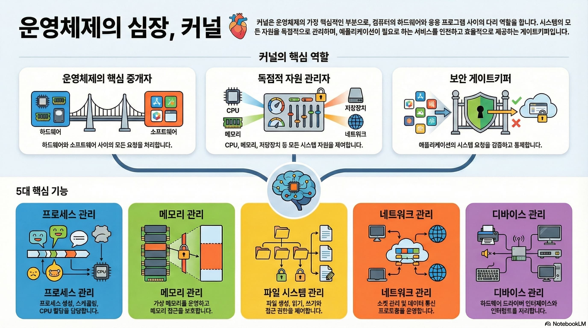
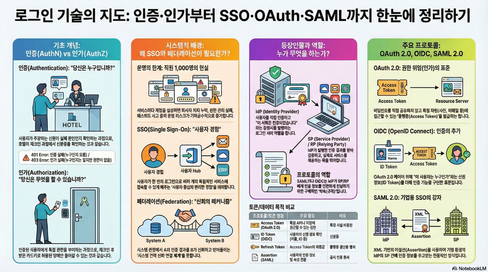
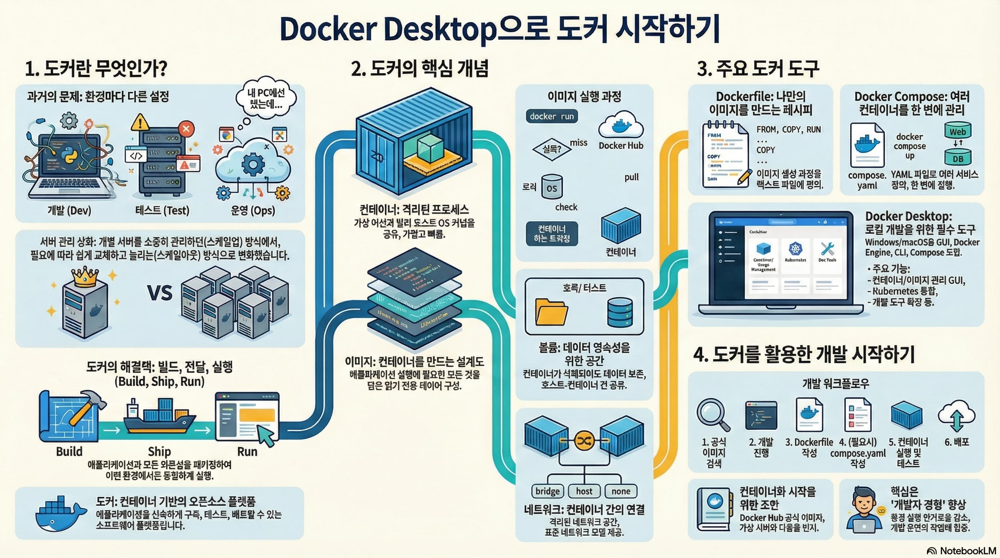
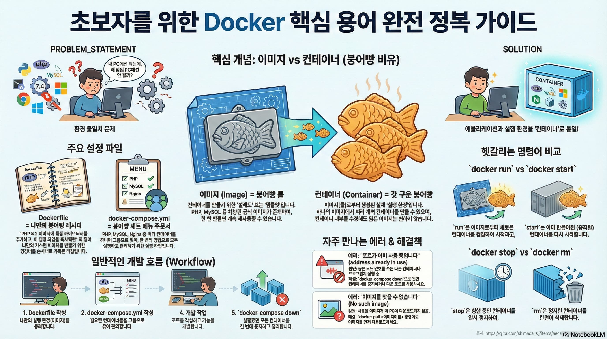
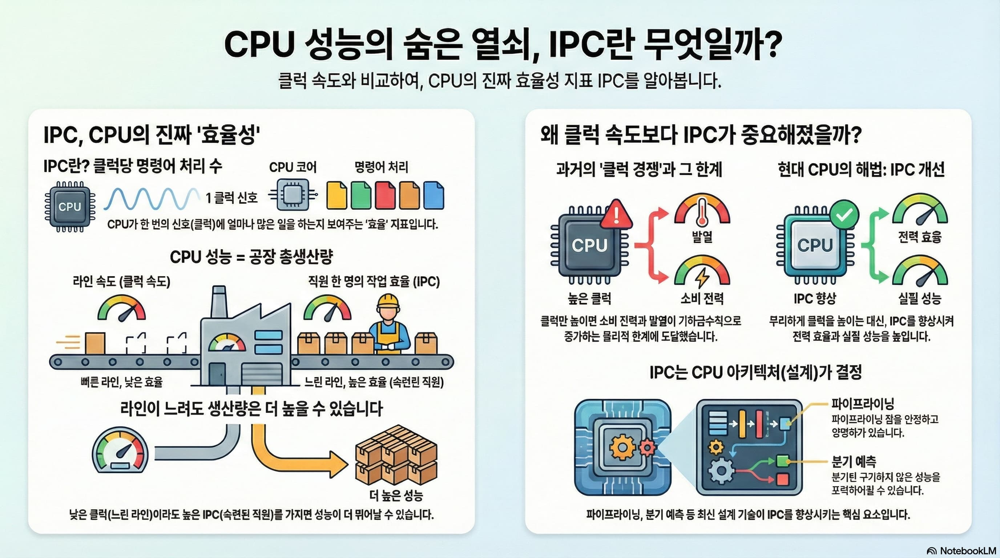
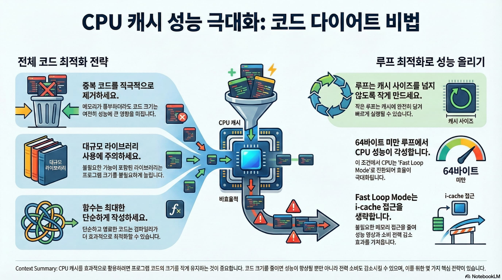
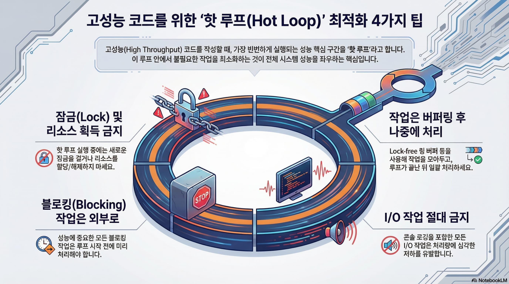
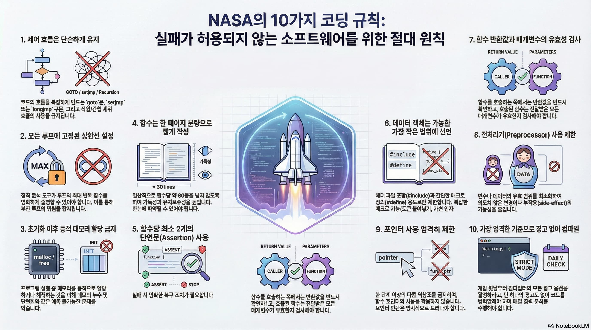

# 인포그래픽 - CS
  
## 운영체제의 심장, 커널
      
  
  
## 로그인 기술의 지도: 인증 인가부터 SSO OAuth SAML까지
   
  
  
## 도커 시작하기
      

## 초보자를 위한 도커 핵심 용어가이드
      
    
  
## CPU 성능의 숨은 열쇠 IPC란
     
  
## CPU 캐시 성능 극대화 전략
     
    
## 고성능 핫 루프 최적화 팁
     
  
## NASA의 실패 방지 10가지 코딩 규칙
     