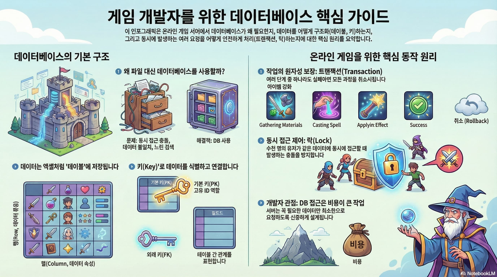
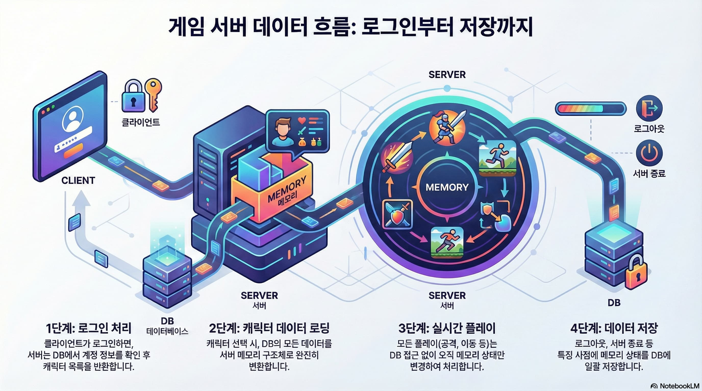
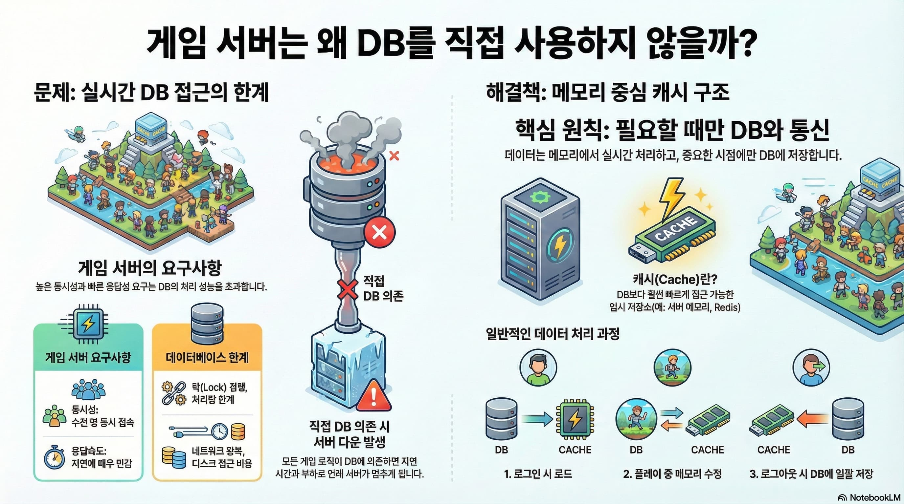
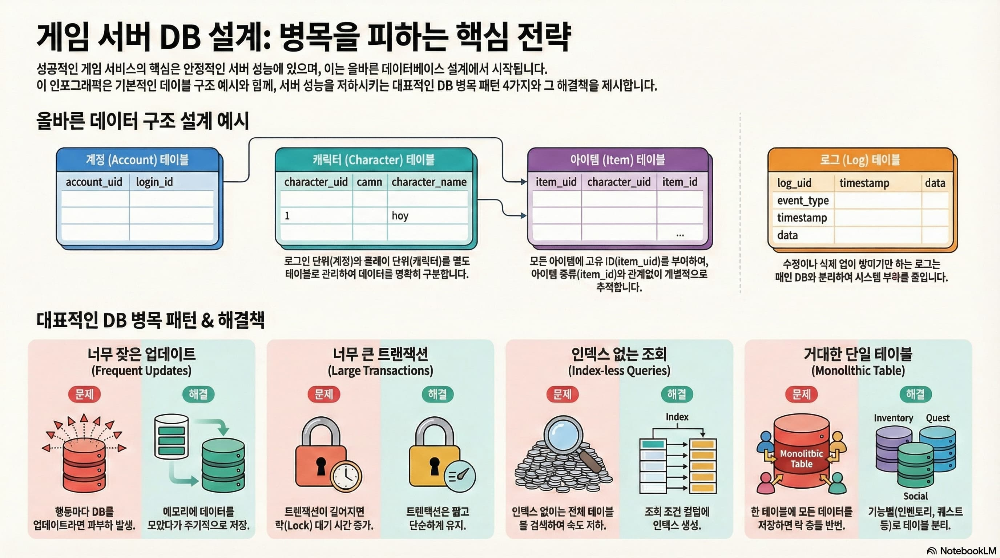
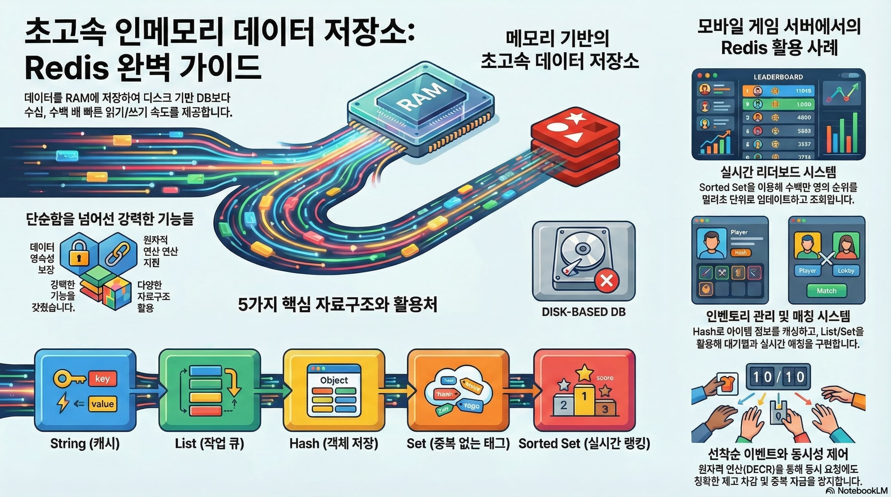
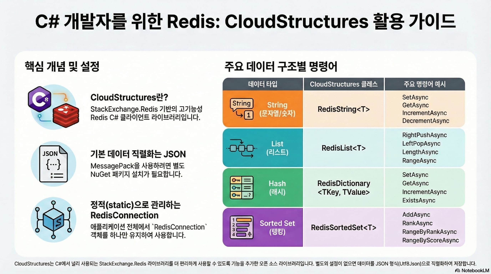
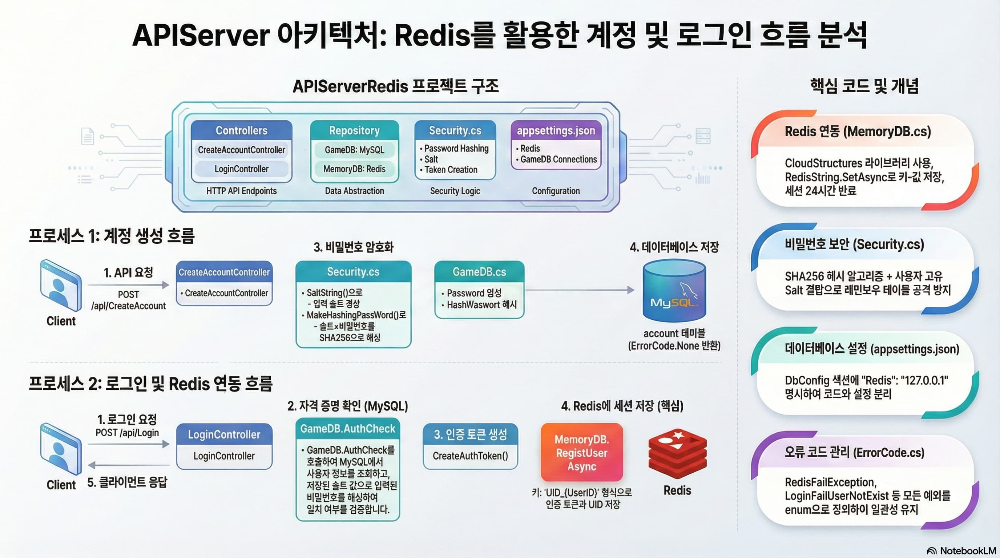

# 인포그래픽 - DB
   
## 게임 개발자를 위한 데이터베이스 핵심 가이드
   

## 게임 서버 데이터 흐름: 로그인부터 저장까지
   

## 게임 서버는 왜 DB를 직접 사용하지 않을까?
   

  
## 게임 서버 DB 설계: 병목을 피하는 핵심 전략
     
  

## 초고속 인메모리 데이터 저장소: Redis 완벽 가이드
 

## C# 개발자를 위한 Redis: CloudStructures 활용 가이드
   

## Redis 분산 락: 사용자 요청 순차 처리 완벽 가이드
   

## API Server 아키텍처: Redis를 활용한 계정 및 로그인 흐름 분석
   