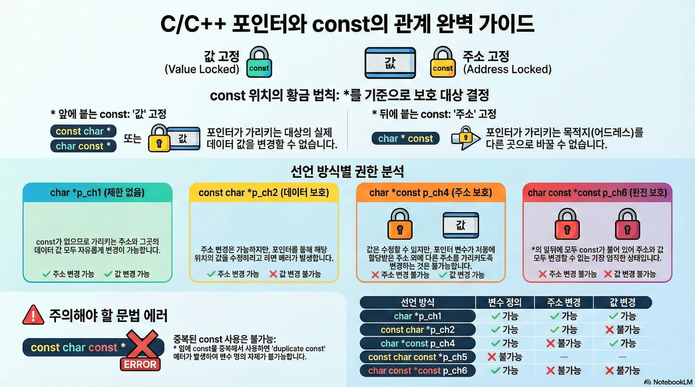
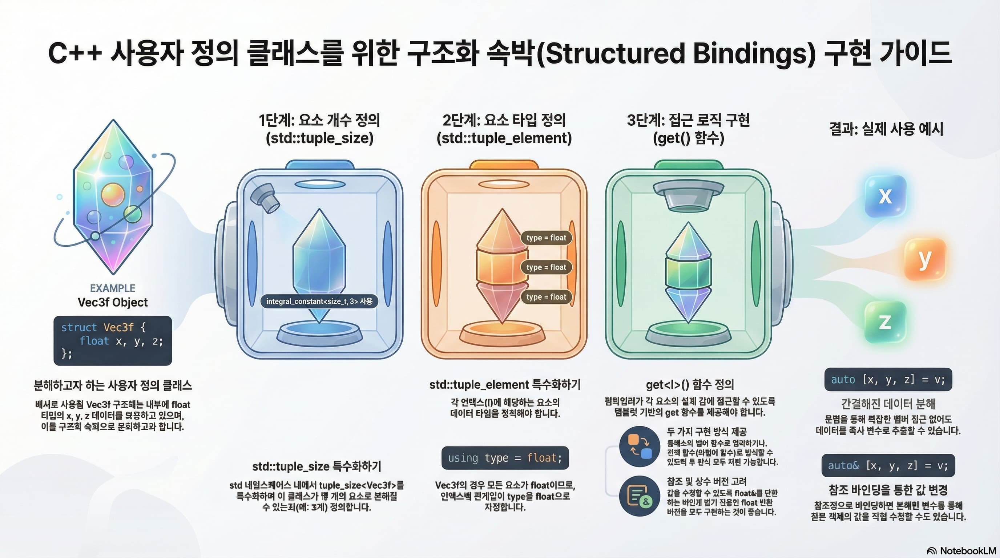
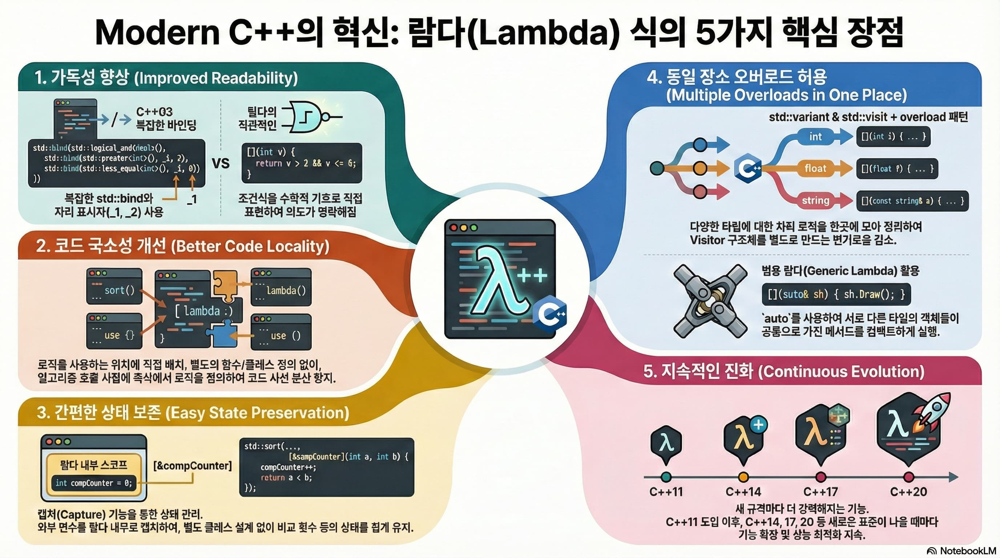
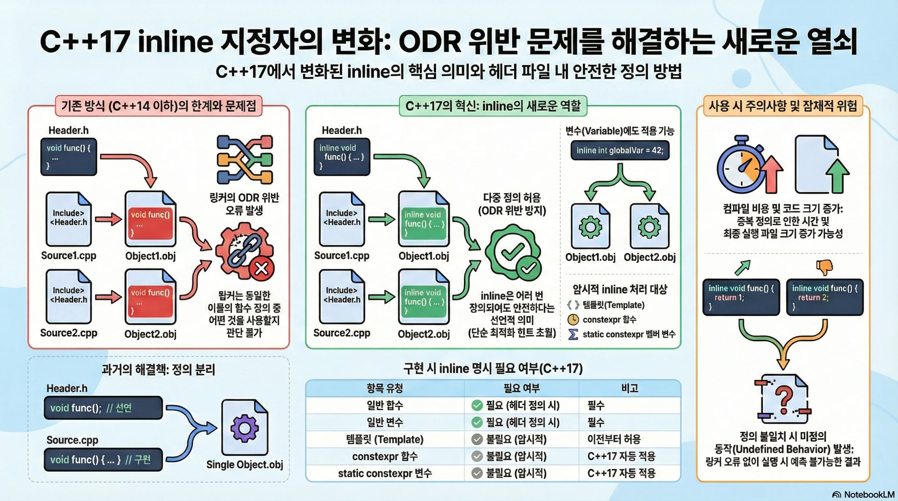
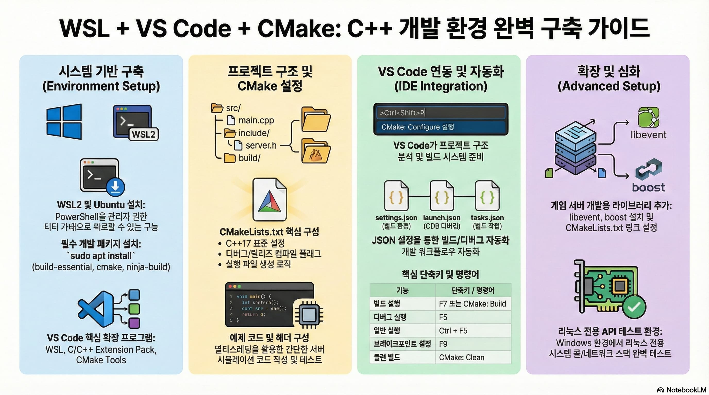

# 인포그래픽 - C++
   
## C/C++ 포인터와 const의 관계 완벽 가이드
  
  

## C++ 사용자 정의 클래스를 위한 구조화 속박 구현 가이드
 

## Modern C++의 혁신: 람다 식의 5가지 핵심 장점
 

## C++17 inlint 지정자의 변화: ODR 위반 문제를 해결하는 새로운 열쇠
 
  
  
  
## Visual Studio C++ 빌드 속도 향상을 위한 핵심 가이드
 
  

## WSL + VS Code + CMake: C++ 개발 환경 완벽 구축 가이드
 